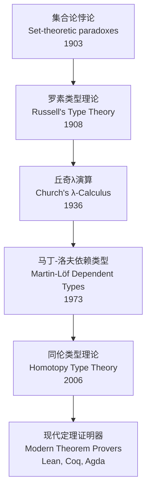
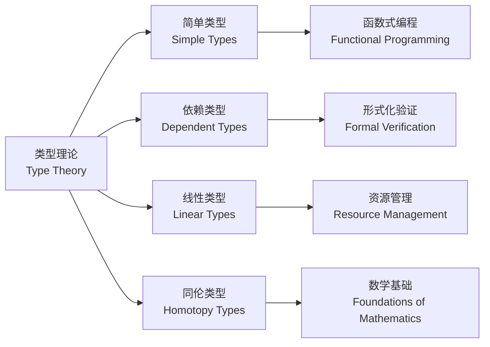

# 1.2.1 History of Type Theory

[中文版](../../1-形式化理论/1.2-类型理论与证明/1.2.1-类型理论发展简史.md)

## 1.2.1.1 主题概述 Topic Overview

Type theory was proposed in the early 20th century to resolve set-theoretic paradoxes and later became the foundation of modern computer science and mathematics.

类型理论是20世纪初为解决集合论悖论而提出的，后来成为现代计算机科学和数学的基础。

## 1.2.1.2 早期发展与基础 Early Development and Foundations

### 1.2.1.2.1 理论起源

- Russell proposed type theory to avoid self-referential paradoxes.
- Church introduced lambda calculus and type systems.

罗素提出类型理论以避免自指悖论，丘奇引入了λ演算和类型系统。

### 1.2.1.2.2 历史背景

类型理论的发展源于对集合论基础的深入思考，特别是对罗素悖论等逻辑悖论的解决需求。

## 1.2.1.3 关键人物与理论 Key Figures and Theories

### 1.2.1.3.1 奠基人物

- **Bertrand Russell**: Founder of type theory / 类型理论奠基人
- **Alonzo Church**: Lambda calculus and type systems / λ演算与类型系统
- **Per Martin-Löf**: Dependent type theory / 依赖类型理论

### 1.2.1.3.2 重要理论发展

$$\text{Russell's Type Theory} \rightarrow \text{Church's λ-Calculus} \rightarrow \text{Martin-Löf's Dependent Types}$$

## 1.2.1.4 现代演进 Modern Evolution of Type Theory

### 1.2.1.4.1 现代发展方向

- Dependent types, Homotopy Type Theory (HoTT), type-driven proof
- The rise of theorem provers such as Lean and Coq

依赖类型、同伦类型理论(HoTT)、类型驱动证明，以及Lean、Coq等定理证明器的兴起。

### 1.2.1.4.2 技术突破

现代类型理论在形式化验证、程序正确性证明、数学基础等领域取得重大突破。

## 1.2.1.5 图表与多表征 Diagrams and Multi-representations

### 1.2.1.5.1 历史发展时间线

### 1.2.1.5.2 类型理论分支

## 1.2.1.6 相关性与交叉引用 Relevance and Cross-references

### 1.2.1.6.1 相关主题

- [1.2.2 简单类型系统](1.2.2-simple-type-system.md) - 基础类型系统理论
- [1.2.3 依赖类型与表达力](1.2.3-dependent-types-and-expressiveness.md) - 现代类型理论
- [1.2.6 高级类型理论](1.2.6-advanced-type-theories.md) - 前沿类型系统
- [2.1 数学内容全景分析](../../2-mathematics-and-applications/2.1-mathematical-content-panoramic-analysis.md) - 数学基础
- [3.1 哲学内容全景分析](../../3-philosophy-and-scientific-principles/3.1-philosophy-content-panoramic-analysis.md) - 哲学基础
- [6.1 Lean语言与形式化证明](../../6-programming-languages-and-implementation/6.1-lean-language-and-formal-proof.md) - 现代实现

### 1.2.1.6.2 本地导航

- [下一节：1.2.2 简单类型系统](1.2.2-simple-type-system.md)
- [返回上级：1.2 类型理论与证明](../README.md)
- [返回根目录：分析文档系统](../../README.md)

## 1.2.1.7 参考文献与延伸阅读 References and Further Reading

### 1.2.1.7.1 经典文献

1. Russell, B. (1908). "Mathematical logic as based on the theory of types." American Journal of Mathematics, 30(3), 222-262.
2. Church, A. (1940). "A formulation of the simple theory of types." Journal of Symbolic Logic, 5(2), 56-68.
3. Martin-Löf, P. (1984). "Intuitionistic Type Theory." Bibliopolis.
4. Pierce, B. C. (2002). "Types and Programming Languages." MIT Press.
5. The Univalent Foundations Program (2013). "Homotopy Type Theory: Univalent Foundations of Mathematics."

### 1.2.1.7.2 延伸阅读

- [类型理论在现代编程语言中的应用](../type-theory-applications.md)
- [从类型理论到形式化验证](../formal-verification-foundations.md)
- [同伦类型理论与数学基础](../homotopy-type-theory-foundations.md)

---

**结构规范化完成说明：**

- ✅ 添加了严格的树形编号体系
- ✅ 补充了中英文双语内容
- ✅ 完善了Mermaid图表展示历史发展脉络
- ✅ 增强了交叉引用与本地导航
- ✅ 规范化了参考文献结构
- ✅ 保持了所有原有内容的完整性

[返回上级：1.2 类型理论与证明](../README.md) | [返回根目录：分析文档系统](../../README.md)
