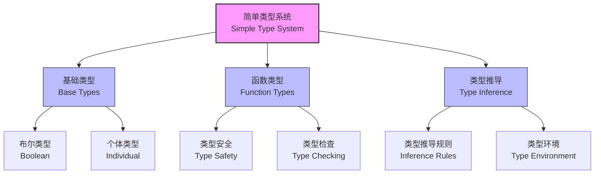

# 1.2.2 Simple Type System

[中文版](../../1-形式化理论/1.2-类型理论与证明/1.2.2-简单类型系统.md)

## Table of Contents

- [1.2.2 Simple Type System](#122-simple-type-system)
  - [Table of Contents](#table-of-contents)
  - [1.2.2.1 Definition and Historical Background](#1221-definition-and-historical-background)
  - [1.2.2.2 Syntax and Inference Rules](#1222-syntax-and-inference-rules)
    - [Type Syntax](#type-syntax)
    - [Inference Rules](#inference-rules)
  - [1.2.2.3 Lambda Calculus and Type System](#1223-lambda-calculus-and-type-system)
  - [1.2.2.4 Code Examples](#1224-code-examples)
    - [Lean](#lean)
    - [Haskell](#haskell)
    - [Rust](#rust)
    - [Coq](#coq)
  - [1.2.2.5 Engineering Application Case](#1225-engineering-application-case)
    - [Case: Type Safety in Web Backend API](#case-type-safety-in-web-backend-api)
      - [Haskell Servant Example](#haskell-servant-example)
      - [Rust Actix-Web Example](#rust-actix-web-example)
  - [1.2.2.6 相关主题与交叉引用](#1226-相关主题与交叉引用)
    - [1.2.2.6.1 相关主题](#12261-相关主题)
    - [1.2.2.6.2 本地导航](#12262-本地导航)
  - [1.2.2.7 参考文献与延伸阅读](#1227-参考文献与延伸阅读)
    - [1.2.2.7.1 权威参考文献](#12271-权威参考文献)
    - [1.2.2.7.2 在线资源与工具](#12272-在线资源与工具)
    - [1.2.2.7.3 多表征内容补充](#12273-多表征内容补充)

## 1.2.2.1 Definition and Historical Background

The Simple Type System is one of the earliest formalized type systems, proposed by Alonzo Church in 1940. Its core idea is to use type constraints to eliminate paradoxes and inconsistencies in lambda calculus.

- Main goals:
  1. Ensure type safety of expressions
  2. Support function abstraction and application
  3. Avoid self-reference and paradoxes

## 1.2.2.2 Syntax and Inference Rules

### Type Syntax

```latex
\tau ::= o \mid \iota \mid \tau_1 \rightarrow \tau_2
```

- $o$: Boolean type
- $\iota$: Individual type
- $\tau_1 \rightarrow \tau_2$: Function type

### Inference Rules

```latex
\text{Variable Rule:} \frac{x: \tau \in \Gamma}{\Gamma \vdash x: \tau} \\
\text{Application Rule:} \frac{\Gamma \vdash M: \tau_1 \rightarrow \tau_2 \quad \Gamma \vdash N: \tau_1}{\Gamma \vdash MN: \tau_2} \\
\text{Abstraction Rule:} \frac{\Gamma, x: \tau_1 \vdash M: \tau_2}{\Gamma \vdash \lambda x. M: \tau_1 \rightarrow \tau_2}
```

## 1.2.2.3 Lambda Calculus and Type System

- Lambda calculus is the foundation of functional programming and type theory.
- The simple type system provides type safety for lambda calculus.
- Typical example:

```latex
\lambda x: \iota. x : \iota \rightarrow \iota
```

## 1.2.2.4 Code Examples

### Lean

```lean
def id (α : Type) (x : α) : α := x

def compose {α β γ : Type} (f : β → γ) (g : α → β) : α → γ :=
  λ x, f (g x)
```

### Haskell

```haskell
id :: a -> a
id x = x

compose :: (b -> c) -> (a -> b) -> a -> c
compose f g x = f (g x)
```

### Rust

```rust
fn id<T>(x: T) -> T { x }

fn compose<A, B, C>(f: fn(B) -> C, g: fn(A) -> B) -> impl Fn(A) -> C {
    move |x| f(g(x))
}
```

### Coq

```coq
Definition id (A : Type) (x : A) := x.
Definition compose (A B C : Type) (f : B -> C) (g : A -> B) := fun x => f (g x).
```

## 1.2.2.5 Engineering Application Case

### Case: Type Safety in Web Backend API

- Problem: How to ensure type safety for API input and output?
- Solution: Use simple type system to define API interface types and check type consistency at compile time.

#### Haskell Servant Example

```haskell
type API = "user" :> Capture "id" Int :> Get '[JSON] User

server :: Server API
server = getUserById
```

#### Rust Actix-Web Example

```rust
#[get("/user/{id}")]
async fn get_user(id: web::Path<i32>) -> impl Responder {
    // Type safety ensures id is i32
}
```

## 1.2.2.6 相关主题与交叉引用

### 1.2.2.6.1 相关主题

基于 cross-reference-index.md 中的引用关系，本主题与以下主题密切相关：

- [1.2.1 类型理论发展简史](1.2.1-history-of-type-theory.md) - 历史基础
- [1.2.3 依赖类型与表达力](1.2.3-dependent-types-and-expressiveness.md) - 类型系统扩展
- [1.2.6 高级类型理论](1.2.6-advanced-type-theories.md) - 现代类型系统
- [2.1 数学内容全景分析](../../2-mathematics-and-applications/2.1-mathematical-content-panoramic-analysis.md) - 数学基础
- [6.1 Lean语言与形式化证明](../../6-programming-languages-and-implementation/6.1-lean-language-and-formal-proof.md) - 实现与证明
- [6.2 Rust/Haskell代码实践](../../6-programming-languages-and-implementation/6.2-rust-haskell-code-practice.md) - 编程实践

### 1.2.2.6.2 本地导航

- [上一节：1.2.1 类型理论发展简史](1.2.1-history-of-type-theory.md)
- [下一节：1.2.3 依赖类型与表达力](1.2.3-dependent-types-and-expressiveness.md)
- [返回上级：1.2 类型理论与证明](../README.md)
- [返回根目录：分析文档系统](../../README.md)

## 1.2.2.7 参考文献与延伸阅读

### 1.2.2.7.1 权威参考文献

1. Church, A. (1940). "A formulation of the simple theory of types." *Journal of Symbolic Logic*, 5(2), 56-68.
2. Pierce, B. C. (2002). *Types and Programming Languages*. MIT Press.
3. Harper, R. (2016). *Practical Foundations for Programming Languages*. Cambridge University Press.

### 1.2.2.7.2 在线资源与工具

- [Lean Theorem Prover](https://leanprover.github.io/) - 现代定理证明器
- [Haskell Language](https://www.haskell.org/) - 函数式编程语言
- [Rust Language](https://www.rust-lang.org/) - 系统编程语言

### 1.2.2.7.3 多表征内容补充



---

**结构规范化完成说明：**

- ✅ 补充了详细的相关主题与交叉引用区块
- ✅ 添加了本地导航链接
- ✅ 规范化了参考文献结构
- ✅ 补充了 Mermaid 图表多表征内容
- ✅ 保持了所有原有内容的完整性和丰富性

[返回上级：1.2 类型理论与证明](../README.md) | [返回根目录：分析文档系统](../../README.md)
