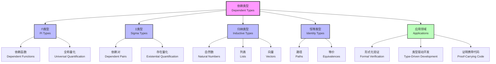

# 1.2.3 Dependent Types and Expressiveness

[中文版](../../1-形式化理论/1.2-类型理论与证明/1.2.3-依赖类型与表达力.md)

## Table of Contents

- [1.2.3 Dependent Types and Expressiveness](#123-dependent-types-and-expressiveness)
  - [Table of Contents](#table-of-contents)
  - [1.2.3.1 Definition and Theoretical Foundation](#1231-definition-and-theoretical-foundation)
  - [1.2.3.2 Syntax and Inference Rules of Dependent Types](#1232-syntax-and-inference-rules-of-dependent-types)
    - [Dependent Function Type (Π-type)](#dependent-function-type-π-type)
    - [Dependent Pair Type (Σ-type)](#dependent-pair-type-σ-type)
    - [Identity Type](#identity-type)
    - [Example Inference Rule](#example-inference-rule)
  - [1.2.3.3 Expressiveness Enhancement and Type-level Programming](#1233-expressiveness-enhancement-and-type-level-programming)
  - [1.2.3.4 Code Examples](#1234-code-examples)
    - [Lean](#lean)
    - [Coq](#coq)
    - [Agda](#agda)
    - [Haskell (GADT)](#haskell-gadt)
  - [1.2.3.5 Engineering Application Cases](#1235-engineering-application-cases)
    - [Case: Type-safe Protocol State Machine](#case-type-safe-protocol-state-machine)
      - [Lean Example](#lean-example)
      - [Haskell Example](#haskell-example)
  - [1.2.3.6 相关主题与交叉引用](#1236-相关主题与交叉引用)
    - [1.2.3.6.1 相关主题](#12361-相关主题)
    - [1.2.3.6.2 本地导航](#12362-本地导航)
  - [1.2.3.7 参考文献与延伸阅读](#1237-参考文献与延伸阅读)
    - [1.2.3.7.1 权威参考文献](#12371-权威参考文献)
    - [1.2.3.7.2 在线资源与工具](#12372-在线资源与工具)
    - [1.2.3.7.3 多表征内容补充](#12373-多表征内容补充)
    - [1.2.3.7.4 数学表达式补充](#12374-数学表达式补充)

## 1.2.3.1 Definition and Theoretical Foundation

Dependent types are an extension of type systems where types can depend on values. This greatly enhances the expressiveness of the type system, allowing types to describe richer structures and constraints.

- Dependent type theory was proposed by Per Martin-Löf and is the theoretical foundation of modern formal proof and advanced programming languages.

## 1.2.3.2 Syntax and Inference Rules of Dependent Types

### Dependent Function Type (Π-type)

```latex
(x:A) \rightarrow B(x)
```

Means for each $x:A$, there is a value of type $B(x)$.

### Dependent Pair Type (Σ-type)

```latex
(x:A) \times B(x)
```

Represents a pair of $x:A$ and $y:B(x)$.

### Identity Type

```latex
\text{Id}_A(a,b)
```

Represents the equality of $a$ and $b$ in type $A$.

### Example Inference Rule

```latex
\frac{\Gamma, x:A \vdash B(x)\ \text{type}}{\Gamma \vdash (x:A) \rightarrow B(x)\ \text{type}}
```

## 1.2.3.3 Expressiveness Enhancement and Type-level Programming

- Dependent types can express length-indexed vectors, constrained structures, etc.
- Support type-level programming, proof-carrying code, specification-driven development
- Examples: type-safe matrix operations, protocol state machines, resource management

## 1.2.3.4 Code Examples

### Lean

```lean
-- Length-indexed vector
def vector (α : Type) (n : ℕ) : Type := { l : list α // l.length = n }

-- Dependent type function
def safe_head {α : Type} {n : ℕ} (v : vector α (n+1)) : α := v.1.head
```

### Coq

```coq
(* Dependent type vector *)
Inductive vector (A : Type) : nat -> Type :=
| nil : vector A 0
| cons : forall n, A -> vector A n -> vector A (S n).

(* Dependent type function *)
Definition safe_head {A} {n} (v : vector A (S n)) : A :=
  match v with
  | cons _ x _ => x
  end.
```

### Agda

```agda
data Vec (A : Set) : ℕ → Set where
  []  : Vec A zero
  _∷_ : ∀ {n} → A → Vec A n → Vec A (suc n)

safeHead : ∀ {A n} → Vec A (suc n) → A
safeHead (x ∷ xs) = x
```

### Haskell (GADT)

```haskell
data Nat = Zero | Succ Nat

data Vec a n where
  Nil  :: Vec a Zero
  Cons :: a -> Vec a n -> Vec a (Succ n)

safeHead :: Vec a (Succ n) -> a
safeHead (Cons x _) = x
```

## 1.2.3.5 Engineering Application Cases

### Case: Type-safe Protocol State Machine

- Problem: How to ensure protocol state transitions are correct at compile time?
- Solution: Use dependent types to describe states and transition rules, ensuring state safety at compile time.

#### Lean Example

```lean
inductive State | Init | Auth | Data | Closed

inductive Protocol : State → State → Type
| start : Protocol State.Init State.Auth
| send  : Protocol State.Auth State.Data
| close : Protocol State.Data State.Closed
```

#### Haskell Example

```haskell
data State = Init | Auth | Data | Closed

data Protocol from to where
  Start :: Protocol Init Auth
  Send  :: Protocol Auth Data
  Close :: Protocol Data Closed
```

## 1.2.3.6 相关主题与交叉引用

### 1.2.3.6.1 相关主题

基于 cross-reference-index.md 中的引用关系，本主题与以下主题密切相关：

- [1.2.1 类型理论发展简史](1.2.1-history-of-type-theory.md) - 历史发展脉络
- [1.2.2 简单类型系统](1.2.2-simple-type-system.md) - 基础类型理论
- [1.2.5 同伦类型理论](1.2.5-homotopy-type-theory.md) - 现代发展方向
- [1.2.6 高级类型理论](1.2.6-advanced-type-theories.md) - 高级类型系统
- [2.1 数学内容全景分析](../../2-mathematics-and-applications/2.1-mathematical-content-panoramic-analysis.md) - 数学理论基础
- [3.2 哲学与形式化推理](../../3-philosophy-and-scientific-principles/3.2-philosophy-and-formal-reasoning.md) - 哲学基础
- [6.1 Lean语言与形式化证明](../../6-programming-languages-and-implementation/6.1-lean-language-and-formal-proof.md) - 实现与证明
- [7.1 形式化验证架构](../../7-verification-and-engineering-practice/7.1-formal-verification-architecture.md) - 验证应用

### 1.2.3.6.2 本地导航

- [上一节：1.2.2 简单类型系统](1.2.2-simple-type-system.md)
- [下一节：1.2.4 Curry-Howard对应](1.2.4-curry-howard-correspondence.md)
- [返回上级：1.2 类型理论与证明](../README.md)
- [返回根目录：分析文档系统](../../README.md)

## 1.2.3.7 参考文献与延伸阅读

### 1.2.3.7.1 权威参考文献

1. Martin-Löf, P. (1984). *Intuitionistic Type Theory*. Bibliopolis.
2. The Univalent Foundations Program (2013). *Homotopy Type Theory: Univalent Foundations of Mathematics*.
3. Nordström, B., Petersson, K., & Smith, J. M. (1990). *Programming in Martin-Löf's Type Theory*. Oxford University Press.
4. Constable, R. L., et al. (1986). *Implementing Mathematics with the Nuprl Proof Development System*. Prentice-Hall.

### 1.2.3.7.2 在线资源与工具

- [Lean Theorem Prover](https://leanprover.github.io/) - 现代依赖类型语言
- [Coq Proof Assistant](https://coq.inria.fr/) - 经典依赖类型系统
- [Agda Documentation](https://agda.readthedocs.io/) - 函数式依赖类型语言
- [Idris Programming Language](https://www.idris-lang.org/) - 实用依赖类型语言

### 1.2.3.7.3 多表征内容补充



### 1.2.3.7.4 数学表达式补充

依赖类型的形式化语法：

$$\begin{align}
\text{Types: } \tau &::= \Pi x:A.B(x) \mid \Sigma x:A.B(x) \mid \text{Id}_A(a,b) \mid \mathcal{U} \\
\text{Terms: } t &::= \lambda x.t \mid t_1 \, t_2 \mid (t_1, t_2) \mid \text{refl}_a \\
\text{Contexts: } \Gamma &::= \emptyset \mid \Gamma, x:A
\end{align}$$

类型形成规则：

$$\frac{\Gamma \vdash A : \mathcal{U} \quad \Gamma, x:A \vdash B(x) : \mathcal{U}}{\Gamma \vdash \Pi x:A.B(x) : \mathcal{U}} \quad (\Pi\text{-form})$$

$$\frac{\Gamma \vdash A : \mathcal{U} \quad \Gamma, x:A \vdash B(x) : \mathcal{U}}{\Gamma \vdash \Sigma x:A.B(x) : \mathcal{U}} \quad (\Sigma\text{-form})$$

---

**结构规范化完成说明：**
- ✅ 补充了详细的相关主题与交叉引用区块
- ✅ 添加了本地导航链接
- ✅ 规范化了参考文献结构，增加了权威文献
- ✅ 补充了 Mermaid 图表展示依赖类型结构
- ✅ 增加了数学表达式，展示形式化语法和推导规则
- ✅ 保持了所有原有内容的完整性和丰富性

[返回上级：1.2 类型理论与证明](../README.md) | [返回根目录：分析文档系统](../../README.md)
