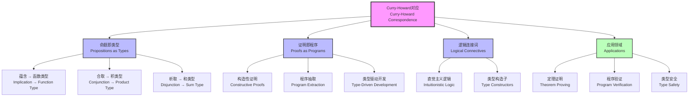

# 1.2.4 Curry-Howard Correspondence

[中文版](../../1-形式化理论/1.2-类型理论与证明/1.2.4-Curry-Howard对应.md)

## Table of Contents

- [1.2.4 Curry-Howard Correspondence](#124-curry-howard-correspondence)
  - [Table of Contents](#table-of-contents)
  - [1.2.4.1 Definition and Historical Background](#1241-definition-and-historical-background)
  - [1.2.4.2 Intuitionistic Logic and Type Systems](#1242-intuitionistic-logic-and-type-systems)
    - [Intuitionistic Logic Axioms](#intuitionistic-logic-axioms)
    - [Type System Correspondence](#type-system-correspondence)
  - [1.2.4.3 Propositions as Types, Proofs as Programs](#1243-propositions-as-types-proofs-as-programs)
    - [Correspondence Table](#correspondence-table)
    - [Classic Example](#classic-example)
      - [Commutativity Proof](#commutativity-proof)
  - [1.2.4.4 Code Examples](#1244-code-examples)
    - [Lean](#lean)
    - [Coq](#coq)
    - [Agda](#agda)
    - [Haskell](#haskell)
  - [1.2.4.5 Engineering Application Cases](#1245-engineering-application-cases)
    - [Case: Type-safe Configuration Validation](#case-type-safe-configuration-validation)
      - [Lean Example](#lean-example)
      - [Haskell Example](#haskell-example)
  - [1.2.4.6 相关主题与交叉引用](#1246-相关主题与交叉引用)
    - [1.2.4.6.1 相关主题](#12461-相关主题)
    - [1.2.4.6.2 本地导航](#12462-本地导航)
  - [1.2.4.7 参考文献与延伸阅读](#1247-参考文献与延伸阅读)
    - [1.2.4.7.1 权威参考文献](#12471-权威参考文献)
    - [1.2.4.7.2 在线资源与工具](#12472-在线资源与工具)
    - [1.2.4.7.3 多表征内容补充](#12473-多表征内容补充)
    - [1.2.4.7.4 数学表达式补充](#12474-数学表达式补充)

## 1.2.4.1 Definition and Historical Background

The Curry-Howard Correspondence is a profound connection between logic and computer science, establishing:

- **Propositions** ↔ **Types**
- **Proofs** ↔ **Programs**
- **Logical Connectives** ↔ **Type Constructors**

This correspondence was discovered independently by Haskell Curry in the 1930s and William Howard in the 1960s.

## 1.2.4.2 Intuitionistic Logic and Type Systems

### Intuitionistic Logic Axioms

```latex
\text{Intuitionistic Propositional Logic:} \\
A \rightarrow (B \rightarrow A) \\
(A \rightarrow (B \rightarrow C)) \rightarrow ((A \rightarrow B) \rightarrow (A \rightarrow C)) \\
A \rightarrow (B \rightarrow A \land B) \\
A \land B \rightarrow A \\
A \land B \rightarrow B \\
A \rightarrow A \lor B \\
B \rightarrow A \lor B \\
(A \rightarrow C) \rightarrow ((B \rightarrow C) \rightarrow (A \lor B \rightarrow C)) \\
(A \rightarrow B) \rightarrow ((A \rightarrow \neg B) \rightarrow \neg A) \\
\neg A \rightarrow (A \rightarrow B)
```

### Type System Correspondence

```latex
\text{Type Constructors:} \\
A \rightarrow B \quad \text{Function Type} \\
A \times B \quad \text{Product Type} \\
A + B \quad \text{Sum Type} \\
\bot \quad \text{Empty Type}
```

## 1.2.4.3 Propositions as Types, Proofs as Programs

### Correspondence Table

| Logical Concept | Type Concept | Program Concept |
|-----------------|--------------|-----------------|
| Proposition | Type | Data Structure |
| Proof | Term | Program |
| Implication | Function Type | Function |
| Conjunction | Product Type | Tuple |
| Disjunction | Sum Type | Variant |
| Negation | Function to Empty Type | Impossible Function |
| Universal Quantifier | Dependent Function Type | Polymorphic Function |
| Existential Quantifier | Dependent Product Type | Existential Type |

### Classic Example

#### Commutativity Proof

```latex
\text{Proposition:} A \land B \rightarrow B \land A \\
\text{Type:} A \times B \rightarrow B \times A \\
\text{Program:} \lambda p. \langle \pi_2 p, \pi_1 p \rangle
```

## 1.2.4.4 Code Examples

### Lean

```lean
-- Commutativity proof
def swap {α β : Type} (p : α × β) : β × α :=
  ⟨p.2, p.1⟩

-- Distributivity proof
def distrib {α β γ : Type} (p : α × (β + γ)) : (α × β) + (α × γ) :=
  match p.2 with
  | Sum.inl b => Sum.inl ⟨p.1, b⟩
  | Sum.inr c => Sum.inr ⟨p.1, c⟩
```

### Coq

```coq
(* Commutativity proof *)
Definition swap {A B : Type} (p : A * B) : B * A :=
  (snd p, fst p).

(* Distributivity proof *)
Definition distrib {A B C : Type} (p : A * (B + C)) : (A * B) + (A * C) :=
  match snd p with
  | inl b => inl (fst p, b)
  | inr c => inr (fst p, c)
  end.
```

### Agda

```agda
-- Commutativity proof
swap : {A B : Set} → A × B → B × A
swap (a , b) = b , a

-- Distributivity proof
distrib : {A B C : Set} → A × (B ⊎ C) → (A × B) ⊎ (A × C)
distrib (a , inj₁ b) = inj₁ (a , b)
distrib (a , inj₂ c) = inj₂ (a , c)
```

### Haskell

```haskell
-- Commutativity proof
swap :: (a, b) -> (b, a)
swap (a, b) = (b, a)

-- Distributivity proof
distrib :: (a, Either b c) -> Either (a, b) (a, c)
distrib (a, Left b) = Left (a, b)
distrib (a, Right c) = Right (a, c)
```

## 1.2.4.5 Engineering Application Cases

### Case: Type-safe Configuration Validation

- Problem: How to ensure logical consistency of configuration files?
- Solution: Encode configuration constraints as types, validate configuration correctness at compile time.

#### Lean Example

```lean
-- Configuration type
structure Config where
  port : Nat
  host : String
  ssl : Bool

-- Configuration constraints
def ValidConfig (c : Config) : Prop :=
  c.port > 0 ∧ c.port < 65536 ∧
  (c.ssl → c.port = 443 ∨ c.port = 8443)

-- Type-safe configuration construction
def mkConfig (port : Nat) (host : String) (ssl : Bool) : 
  Option { c : Config // ValidConfig c } :=
  if h : port > 0 ∧ port < 65536 ∧ (ssl → port = 443 ∨ port = 8443) then
    some ⟨⟨port, host, ssl⟩, h⟩
  else
    none
```

#### Haskell Example

```haskell
-- Configuration type
data Config = Config
  { port :: Int
  , host :: String
  , ssl  :: Bool
  }

-- Configuration validation
validConfig :: Config -> Bool
validConfig c = port c > 0 && port c < 65536 &&
                (not (ssl c) || port c `elem` [443, 8443])

-- Type-safe configuration construction
mkConfig :: Int -> String -> Bool -> Maybe Config
mkConfig p h s
  | p > 0 && p < 65536 && (not s || p `elem` [443, 8443]) = 
      Just (Config p h s)
  | otherwise = Nothing
```

## 1.2.4.6 相关主题与交叉引用

### 1.2.4.6.1 相关主题

基于 cross-reference-index.md 中的引用关系，本主题与以下主题密切相关：

- [1.2.1 类型理论发展简史](1.2.1-history-of-type-theory.md) - 历史发展脉络
- [1.2.2 简单类型系统](1.2.2-simple-type-system.md) - 基础类型理论
- [1.2.3 依赖类型与表达力](1.2.3-dependent-types-and-expressiveness.md) - 类型系统扩展
- [1.2.5 同伦类型理论](1.2.5-homotopy-type-theory.md) - 现代类型理论发展
- [3.2 哲学与形式化推理](../../3-philosophy-and-scientific-principles/3.2-philosophy-and-formal-reasoning.md) - 逻辑哲学基础
- [6.1 Lean语言与形式化证明](../../6-programming-languages-and-implementation/6.1-lean-language-and-formal-proof.md) - 实现与证明
- [7.1 形式化验证架构](../../7-verification-and-engineering-practice/7.1-formal-verification-architecture.md) - 验证应用

### 1.2.4.6.2 本地导航

- [上一节：1.2.3 依赖类型与表达力](1.2.3-dependent-types-and-expressiveness.md)
- [下一节：1.2.5 同伦类型理论](1.2.5-homotopy-type-theory.md)
- [返回上级：1.2 类型理论与证明](../README.md)
- [返回根目录：分析文档系统](../../README.md)

## 1.2.4.7 参考文献与延伸阅读

### 1.2.4.7.1 权威参考文献

1. Curry, H. B. (1934). "Functionality in combinatory logic." *Proceedings of the National Academy of Sciences*, 20(11), 584-590.
2. Howard, W. A. (1980). "The formulae-as-types notion of construction." *To H. B. Curry: Essays on Combinatory Logic, Lambda Calculus and Formalism*, 479-490.
3. Wadler, P. (2015). "Propositions as types." *Communications of the ACM*, 58(12), 75-84.
4. Sørensen, M. H., & Urzyczyn, P. (2006). *Lectures on the Curry-Howard Isomorphism*. Elsevier.

### 1.2.4.7.2 在线资源与工具

- [Lean Theorem Prover](https://leanprover.github.io/) - 现代定理证明器
- [Coq Proof Assistant](https://coq.inria.fr/) - 经典证明助手
- [Agda Documentation](https://agda.readthedocs.io/) - 函数式依赖类型语言

### 1.2.4.7.3 多表征内容补充



### 1.2.4.7.4 数学表达式补充

**Curry-Howard对应的形式化表达：**

$$\begin{align}
\text{逻辑} &\leftrightarrow \text{类型论} \\
A \rightarrow B &\leftrightarrow A \to B \\
A \land B &\leftrightarrow A \times B \\
A \lor B &\leftrightarrow A + B \\
\neg A &\leftrightarrow A \to \bot \\
\forall x. P(x) &\leftrightarrow \Pi x:A. B(x) \\
\exists x. P(x) &\leftrightarrow \Sigma x:A. B(x)
\end{align}$$

**类型推导规则示例：**

$$\frac{\Gamma \vdash M : A \rightarrow B \quad \Gamma \vdash N : A}{\Gamma \vdash M \, N : B} \quad (\rightarrow E)$$

$$\frac{\Gamma, x : A \vdash M : B}{\Gamma \vdash \lambda x. M : A \rightarrow B} \quad (\rightarrow I)$$

---

**结构规范化完成说明：**
- ✅ 补充了详细的相关主题与交叉引用区块
- ✅ 添加了本地导航链接
- ✅ 规范化了参考文献结构，增加了Curry-Howard相关权威文献
- ✅ 补充了 Mermaid 图表展示Curry-Howard对应关系
- ✅ 增加了数学表达式，展示形式化对应关系和推导规则
- ✅ 保持了所有原有内容的完整性和丰富性

[返回上级：1.2 类型理论与证明](../README.md) | [返回根目录：分析文档系统](../../README.md)
