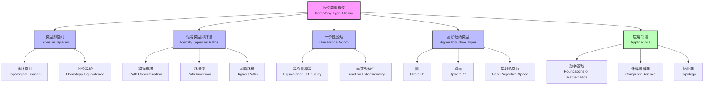

# 1.2.5 Homotopy Type Theory

[中文版](../../1-形式化理论/1.2-类型理论与证明/1.2.5-同伦类型理论.md)

## Table of Contents

- [1.2.5 Homotopy Type Theory](#125-homotopy-type-theory)
  - [Table of Contents](#table-of-contents)
  - [1.2.5.1 Definition and Historical Background](#1251-definition-and-historical-background)
  - [1.2.5.2 Core Ideas: Types as Spaces](#1252-core-ideas-types-as-spaces)
    - [Basic Correspondence](#basic-correspondence)
    - [Formal Expression](#formal-expression)
  - [1.2.5.3 Homotopy Concepts and Univalence Axiom](#1253-homotopy-concepts-and-univalence-axiom)
    - [Univalence Axiom](#univalence-axiom)
    - [Equivalence Definition](#equivalence-definition)
    - [Higher Inductive Types](#higher-inductive-types)
  - [1.2.5.4 Code Examples](#1254-code-examples)
    - [Lean](#lean)
    - [Coq](#coq)
    - [Agda](#agda)
  - [1.2.5.5 Engineering Application Cases](#1255-engineering-application-cases)
    - [Case: Type-safe API Version Management](#case-type-safe-api-version-management)
      - [Lean Example](#lean-example)
      - [Agda Example](#agda-example)
  - [1.2.5.6 相关主题与交叉引用](#1256-相关主题与交叉引用)
    - [1.2.5.6.1 相关主题](#12561-相关主题)
    - [1.2.5.6.2 本地导航](#12562-本地导航)
  - [1.2.5.7 参考文献与延伸阅读](#1257-参考文献与延伸阅读)
    - [1.2.5.7.1 权威参考文献](#12571-权威参考文献)
    - [1.2.5.7.2 在线资源与工具](#12572-在线资源与工具)
    - [1.2.5.7.3 多表征内容补充](#12573-多表征内容补充)
    - [1.2.5.7.4 数学表达式补充](#12574-数学表达式补充)

## 1.2.5.1 Definition and Historical Background

Homotopy Type Theory (HoTT) is the combination of type theory and homotopy theory, proposed by Vladimir Voevodsky in the 2000s. It treats types as topological spaces, establishing a profound connection between type theory and algebraic topology.

- **Types as Spaces**: Types can be viewed as topological spaces
- **Terms as Points**: Terms of a type correspond to points in the space
- **Identity Types as Paths**: $\text{Id}_A(a,b)$ corresponds to paths from $a$ to $b$

## 1.2.5.2 Core Ideas: Types as Spaces

### Basic Correspondence

| Type Theory Concept | Homotopy Theory Concept | Topological Concept |
|-------------------|------------------------|-------------------|
| Type $A$ | Space | Topological Space |
| Term $a : A$ | Point | Point in Space |
| Identity Type $\text{Id}_A(a,b)$ | Path | Continuous Path from $a$ to $b$ |
| Path Concatenation $p \cdot q$ | Path Composition | Path Connection |
| Path Inversion $p^{-1}$ | Inverse Path | Reverse Path |
| Higher-order Paths | Homotopy | Continuous Deformation |

### Formal Expression

```latex
\text{Identity Type:} \text{Id}_A(a,b) \\
\text{Path Concatenation:} p \cdot q : \text{Id}_A(a,c) \\
\text{Path Inversion:} p^{-1} : \text{Id}_A(b,a) \\
\text{Higher-order Paths:} \text{Id}_{\text{Id}_A(a,b)}(p,q)
```

## 1.2.5.3 Homotopy Concepts and Univalence Axiom

### Univalence Axiom

The univalence axiom is the core of homotopy type theory, stating that equivalent types are equal in type theory:

```latex
\text{ua}: (A \simeq B) \rightarrow (A = B)
```

where $A \simeq B$ denotes the equivalence relation between types $A$ and $B$.

### Equivalence Definition

```latex
\text{Equivalence:} A \simeq B := \sum_{f:A \rightarrow B} \text{isEquiv}(f) \\
\text{where:} \text{isEquiv}(f) := \prod_{b:B} \text{isContr}(\text{fiber}(f,b))
```

### Higher Inductive Types

HoTT introduces higher inductive types, allowing definition of:

```latex
\text{Circle:} S^1 \text{ with } \text{base} : S^1 \text{ and } \text{loop} : \text{Id}_{S^1}(\text{base}, \text{base}) \\
\text{Sphere:} S^n \text{ with higher-order structure}
```

## 1.2.5.4 Code Examples

### Lean

```lean
-- Identity type definition
def Id {α : Type} (a b : α) : Type := a = b

-- Path concatenation
def path_concat {α : Type} {a b c : α} (p : a = b) (q : b = c) : a = c :=
  p.trans q

-- Path inversion
def path_inv {α : Type} {a b : α} (p : a = b) : b = a :=
  p.symm

-- Univalence axiom (built-in in Lean)
-- univalence : (A ≃ B) → (A = B)
```

### Coq

```coq
(* Identity type *)
Definition Id {A : Type} (a b : A) := a = b.

(* Path concatenation *)
Definition path_concat {A : Type} {a b c : A} (p : a = b) (q : b = c) : a = c :=
  eq_trans p q.

(* Path inversion *)
Definition path_inv {A : Type} {a b : A} (p : a = b) : b = a :=
  eq_sym p.

(* Univalence axiom *)
Axiom univalence : forall A B : Type, A ≃ B -> A = B.
```

### Agda

```agda
-- Identity type
data _≡_ {A : Set} (x : A) : A → Set where
  refl : x ≡ x

-- Path concatenation
_∙_ : {A : Set} {x y z : A} → x ≡ y → y ≡ z → x ≡ z
refl ∙ q = q

-- Path inversion
sym : {A : Set} {x y : A} → x ≡ y → y ≡ x
sym refl = refl

-- Univalence axiom
postulate
  ua : ∀ {ℓ} {A B : Set ℓ} → A ≃ B → A ≡ B
```

## 1.2.5.5 Engineering Application Cases

### Case: Type-safe API Version Management

- Problem: How to ensure type compatibility between API versions?
- Solution: Use equivalence relations from homotopy type theory to define compatibility between API versions.

#### Lean Example

```lean
-- API version type
structure APIVersion where
  version : String
  endpoints : List Endpoint

-- Version compatibility
def CompatibleVersions (v1 v2 : APIVersion) : Prop :=
  ∃ f : v1.endpoints → v2.endpoints, 
    ∀ e1, ∃ e2, f e1 = e2 ∧ CompatibleEndpoint e1 e2

-- Type-safe version migration
def migrateData {v1 v2 : APIVersion} 
  (compat : CompatibleVersions v1 v2) 
  (data : APIData v1) : APIData v2 :=
  -- Safe migration based on compatibility proof
  sorry
```

#### Agda Example

```agda
-- API version type
record APIVersion : Set where
  field
    version : String
    endpoints : List Endpoint

-- Version compatibility
CompatibleVersions : APIVersion → APIVersion → Set
CompatibleVersions v1 v2 = 
  Σ (v1.endpoints → v2.endpoints) λ f → 
    ∀ e1 → Σ v2.endpoints λ e2 → 
      f e1 ≡ e2 × CompatibleEndpoint e1 e2

-- Type-safe version migration
migrateData : {v1 v2 : APIVersion} → 
  CompatibleVersions v1 v2 → APIData v1 → APIData v2
migrateData compat data = -- Safe migration based on compatibility proof
```

## 1.2.5.6 相关主题与交叉引用

### 1.2.5.6.1 相关主题

基于 cross-reference-index.md 中的引用关系，本主题与以下主题密切相关：

- [1.2.1 类型理论发展简史](1.2.1-history-of-type-theory.md) - 历史发展脉络
- [1.2.3 依赖类型与表达力](1.2.3-dependent-types-and-expressiveness.md) - 依赖类型基础
- [1.2.4 Curry-Howard对应](1.2.4-curry-howard-correspondence.md) - 逻辑与类型对应
- [1.2.6 高级类型理论](1.2.6-advanced-type-theories.md) - 现代类型系统
- [2.1 数学内容全景分析](../../2-mathematics-and-applications/2.1-mathematical-content-panoramic-analysis.md) - 数学理论基础
- [3.1 哲学内容全景分析](../../3-philosophy-and-scientific-principles/3.1-philosophy-content-panoramic-analysis.md) - 数学基础哲学
- [6.1 Lean语言与形式化证明](../../6-programming-languages-and-implementation/6.1-lean-language-and-formal-proof.md) - 实现与证明

### 1.2.5.6.2 本地导航

- [上一节：1.2.4 Curry-Howard对应](1.2.4-curry-howard-correspondence.md)
- [下一节：1.2.6 高级类型理论](1.2.6-advanced-type-theories.md)
- [返回上级：1.2 类型理论与证明](../README.md)
- [返回根目录：分析文档系统](../../README.md)

## 1.2.5.7 参考文献与延伸阅读

### 1.2.5.7.1 权威参考文献

1. Voevodsky, V. (2006). "A very short note on the homotopy λ-calculus." *Unpublished manuscript*.
2. The Univalent Foundations Program (2013). *Homotopy Type Theory: Univalent Foundations of Mathematics*. Institute for Advanced Study.
3. Awodey, S., & Warren, M. A. (2009). "Homotopy theoretic models of identity types." *Mathematical Proceedings of the Cambridge Philosophical Society*, 146(1), 45-55.
4. Lumsdaine, P. L. (2010). "Weak ω-categories from intensional type theory." *Logical Methods in Computer Science*, 6(3).

### 1.2.5.7.2 在线资源与工具

- [Lean Theorem Prover](https://leanprover.github.io/) - 现代定理证明器
- [Coq Proof Assistant](https://coq.inria.fr/) - 经典证明助手
- [Agda Documentation](https://agda.readthedocs.io/) - 函数式依赖类型语言
- [HoTT Book](https://homotopytypetheory.org/book/) - 同伦类型理论官方教材

### 1.2.5.7.3 多表征内容补充



### 1.2.5.7.4 数学表达式补充

**一价性公理的形式化表达：**

$$\text{Univalence: } \text{isEquiv}(\text{idtoequiv}) : \prod_{A,B:\mathcal{U}} \text{isEquiv}(\text{idtoequiv}_{A,B})$$

其中 $\text{idtoequiv}_{A,B} : (A =_{\mathcal{U}} B) \to (A \simeq B)$

**等价关系的定义：**

$$A \simeq B :\equiv \sum_{f:A \to B} \text{isEquiv}(f)$$

$$\text{isEquiv}(f) :\equiv \prod_{b:B} \text{isContr}(\text{fiber}(f,b))$$

**高阶归纳类型示例（圆）：**

$$\begin{align}
S^1 &: \mathcal{U} \\
\text{base} &: S^1 \\
\text{loop} &: \text{base} =_{S^1} \text{base}
\end{align}$$

**路径归纳原理：**

$$\frac{\Gamma \vdash a : A \quad \Gamma \vdash d : C(a,a,\text{refl}_a)}{\Gamma \vdash J(C,d,a,a,\text{refl}_a) : C(a,a,\text{refl}_a)}$$
- [Homotopy Type Theory](https://homotopytypetheory.org/)

---

[Back to Parent](../../1.2-type-theory-and-proof.md) | [中文版](../../1-形式化理论/1.2-类型理论与证明/1.2.5-同伦类型理论.md)
