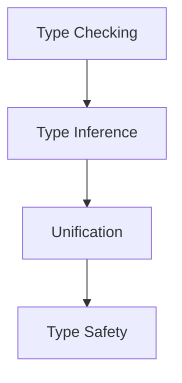

<!--
注意：本文件与1.2.5-type-theory-applications.md主题编号相近，建议后续人工复核编号与主题边界，保持编号唯一性。
-->
# 1.2.5 Type Checking and Inference

## 目录

1.2.5.1 Topic Overview  
1.2.5.2 Type Checking Algorithms  
1.2.5.3 Principles of Type Inference  
1.2.5.4 Formal Definition and Lean Implementation  
1.2.5.5 Typical Proofs and Reasoning  
1.2.5.6 Diagrams and Multi-representations  
1.2.5.7 Relevance and Cross-references  
1.2.5.8 References and Further Reading  

---

### 1.2.5.1 Topic Overview

Type checking and type inference are core to type theory and programming language implementation, ensuring type safety and correctness of programs.

### 1.2.5.2 Type Checking Algorithms

- Rule-driven type checking (e.g., recursive descent)
- Hindley-Milner type inference algorithm

### 1.2.5.3 Principles of Type Inference

- Type variables and constraint generation
- Unification process

### 1.2.5.4 Formal Definition and Lean Implementation

```lean
-- Simple type inference rules (pseudo-code)
inductive has_type : context → term → ty → Prop
| var : ...
| app : ...
| lam : ...
```

### 1.2.5.5 Typical Proofs and Reasoning

#### Correctness of type inference (LaTeX)

\[
\forall t,\ \exists T,\ \vdash t : T
\]

### 1.2.5.6 Diagrams and Multi-representations



### 1.2.5.7 Relevance and Cross-references

- [1.2.2-simple-type-system.md](./1.2.2-simple-type-system.md)
- [../../6-programming-languages-and-implementation/6.1-lean-and-formal-proof.md](../../6-programming-languages-and-implementation/6.1-lean-and-formal-proof.md)

### 1.2.5.8 References and Further Reading

- "Types and Programming Languages"
- Lean official documentation
