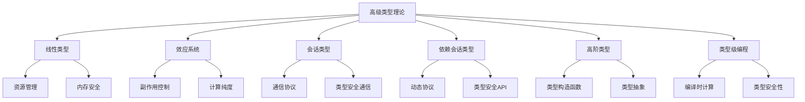

<!--
注意：本文件与1.2.5-type-checking-and-inference.md主题编号相近，建议后续人工复核编号与主题边界，保持编号唯一性。
-->

# 1.2.6 高级类型理论

[English Version](../1.2-type-theory-and-proof/1.2.6-advanced-type-theories.md)

## 目录

- [1.2.6 高级类型理论](#126-高级类型理论)
  - [目录](#目录)
  - [1.2.6.1 概述](#1261-概述)
  - [1.2.6.2 线性类型系统](#1262-线性类型系统)
    - [1.2.6.2.1 理论基础](#12621-理论基础)
    - [1.2.6.2.2 数学形式化](#12622-数学形式化)
    - [1.2.6.2.3 应用案例](#12623-应用案例)
  - [1.2.6.3 效应系统](#1263-效应系统)
    - [1.2.6.3.1 理论基础](#12631-理论基础)
    - [1.2.6.3.2 数学形式化](#12632-数学形式化)
    - [1.2.6.3.3 实际应用](#12633-实际应用)
  - [1.2.6.4 会话类型](#1264-会话类型)
    - [1.2.6.4.1 理论基础](#12641-理论基础)
    - [1.2.6.4.2 数学形式化](#12642-数学形式化)
    - [1.2.6.4.3 实际应用](#12643-实际应用)
  - [1.2.6.5 依赖会话类型](#1265-依赖会话类型)
    - [1.2.6.5.1 理论基础](#12651-理论基础)
    - [1.2.6.5.2 数学形式化](#12652-数学形式化)
    - [1.2.6.5.3 实际应用](#12653-实际应用)
  - [1.2.6.6 高阶类型](#1266-高阶类型)
    - [1.2.6.6.1 理论基础](#12661-理论基础)
    - [1.2.6.6.2 数学形式化](#12662-数学形式化)
    - [1.2.6.6.3 实际应用](#12663-实际应用)
  - [1.2.6.7 类型级编程](#1267-类型级编程)
    - [1.2.6.7.1 理论基础](#12671-理论基础)
    - [1.2.6.7.2 数学形式化](#12672-数学形式化)
    - [1.2.6.7.3 实际应用](#12673-实际应用)
  - [1.2.6.8 相关主题与交叉引用](#1268-相关主题与交叉引用)
    - [1.2.6.8.1 相关主题](#12681-相关主题)
    - [1.2.6.8.2 本地导航](#12682-本地导航)
  - [1.2.6.9 参考文献与延伸阅读](#1269-参考文献与延伸阅读)
    - [1.2.6.9.1 权威参考文献](#12691-权威参考文献)
    - [1.2.6.9.2 进一步阅读与深入学习](#12692-进一步阅读与深入学习)
    - [1.2.6.9.3 多表征内容补充](#12693-多表征内容补充)

## 1.2.6.1 概述

高级类型理论涵盖了现代编程语言和形式化验证中的前沿类型系统，包括线性类型、效应系统、会话类型等。

## 1.2.6.2 线性类型系统

### 1.2.6.2.1 理论基础

线性类型系统基于线性逻辑，确保资源被使用且仅使用一次。

```lean
-- 线性类型的基本概念
inductive LinearType : Type where
  | Unit : LinearType
  | Tensor : LinearType → LinearType → LinearType
  | Lollipop : LinearType → LinearType → LinearType

-- 线性函数类型
def linear_function (A B : LinearType) : Type :=
  A →ₗ B  -- 线性箭头

-- 资源管理示例
def resource_usage : LinearType :=
  LinearType.Tensor 
    (LinearType.Lollipop Resource Unit)
    Resource
```

### 1.2.6.2.2 数学形式化

线性逻辑的语法规则：

$$\frac{\Gamma, A \vdash B}{\Gamma \vdash A \multimap B} \quad (\multimap R)$$

$$\frac{\Gamma \vdash A \quad \Delta \vdash B}{\Gamma, \Delta \vdash A \otimes B} \quad (\otimes R)$$

### 1.2.6.2.3 应用案例

```rust
// Rust中的线性类型系统
fn consume_string(s: String) {
    println!("Consuming: {}", s);
    // s在这里被移动，不能再使用
}

fn main() {
    let s = String::from("hello");
    consume_string(s);
    // 下面这行会编译错误
    // println!("{}", s);  // 错误：s已经被移动
}
```

## 1.2.6.3 效应系统

### 1.2.6.3.1 理论基础

效应系统用于跟踪和控制计算中的副作用。

```lean
-- 效应类型定义
inductive Effect : Type where
  | Pure : Effect
  | IO : Effect
  | State : Effect
  | Exception : Effect

-- 效应类型
def Eff (e : Effect) (a : Type) : Type :=
  match e with
  | Effect.Pure => a
  | Effect.IO => IO a
  | Effect.State => State a
  | Effect.Exception => Except String a

-- 效应组合
def combine_effects (e1 e2 : Effect) : Effect :=
  match e1, e2 with
  | Effect.Pure, e => e
  | e, Effect.Pure => e
  | Effect.IO, _ => Effect.IO
  | _, Effect.IO => Effect.IO
  | Effect.State, Effect.State => Effect.State
  | _, _ => Effect.Exception
```

### 1.2.6.3.2 数学形式化

效应系统的类型规则：

$$\frac{\Gamma \vdash M : A}{\Gamma \vdash \text{return } M : \text{Eff}[\emptyset] A} \quad (\text{Return})$$

$$\frac{\Gamma \vdash M : \text{Eff}[E] A \quad \Gamma, x : A \vdash N : \text{Eff}[E'] B}{\Gamma \vdash M \gg= N : \text{Eff}[E \cup E'] B} \quad (\text{Bind})$$

### 1.2.6.3.3 实际应用

```haskell
-- Haskell中的效应系统
import Control.Monad.IO.Class
import Control.Monad.State

-- 状态效应
type Stateful a = State Int a

-- IO效应
type IOEffect a = IO a

-- 组合效应
type CombinedEffect a = StateT Int IO a

-- 效应处理
handleState :: Stateful Int
handleState = do
  current <- get
  put (current + 1)
  return current

-- 效应转换
runStateEffect :: Stateful a -> Int -> IO (a, Int)
runStateEffect action initial = do
  let (result, finalState) = runState action initial
  return (result, finalState)
```

## 1.2.6.4 会话类型

### 1.2.6.4.1 理论基础

会话类型用于描述分布式系统中的通信协议。

```lean
-- 会话类型定义
inductive SessionType : Type where
  | End : SessionType
  | Send : Type → SessionType → SessionType
  | Recv : Type → SessionType → SessionType
  | Branch : List (String × SessionType) → SessionType
  | Select : List (String × SessionType) → SessionType
  | Rec : String → SessionType → SessionType
  | Var : String → SessionType

-- 会话类型示例：简单的请求-响应协议
def request_response_protocol : SessionType :=
  SessionType.Recv String (
    SessionType.Send String SessionType.End
  )

-- 会话类型对偶
def dual (s : SessionType) : SessionType :=
  match s with
  | SessionType.End => SessionType.End
  | SessionType.Send t s' => SessionType.Recv t (dual s')
  | SessionType.Recv t s' => SessionType.Send t (dual s')
  | SessionType.Branch cases => 
      SessionType.Select (cases.map (fun (l, s') => (l, dual s')))
  | SessionType.Select cases => 
      SessionType.Branch (cases.map (fun (l, s') => (l, dual s')))
  | SessionType.Rec x s' => SessionType.Rec x (dual s')
  | SessionType.Var x => SessionType.Var x
```

### 1.2.6.4.2 数学形式化

会话类型的对偶性：

$$\frac{\Gamma \vdash P : S}{\Gamma \vdash \overline{P} : \overline{S}} \quad (\text{Dual})$$

其中 $\overline{S}$ 表示会话类型 $S$ 的对偶。

### 1.2.6.4.3 实际应用

```rust
// Rust中的会话类型实现
use std::marker::PhantomData;

// 会话类型状态
struct Session<S> {
    _phantom: PhantomData<S>,
}

// 基本会话类型
struct End;
struct Send<T, S>(PhantomData<(T, S)>);
struct Recv<T, S>(PhantomData<(T, S)>);

// 会话类型实现
impl Session<End> {
    fn close(self) {}
}

impl<T, S> Session<Send<T, S>> {
    fn send(self, value: T) -> Session<S> {
        Session { _phantom: PhantomData }
    }
}

impl<T, S> Session<Recv<T, S>> {
    fn recv(self) -> (T, Session<S>) {
        // 实际实现中这里会从通道接收数据
        unimplemented!()
    }
}

// 使用示例
type ClientProtocol = Recv<String, Send<i32, End>>;
type ServerProtocol = Send<String, Recv<i32, End>>;
```

## 1.2.6.5 依赖会话类型

### 1.2.6.5.1 理论基础

依赖会话类型结合了依赖类型和会话类型，提供更强的类型安全性。

```lean
-- 依赖会话类型
inductive DepSessionType : Type where
  | End : DepSessionType
  | DepSend : (A : Type) → (A → DepSessionType) → DepSessionType
  | DepRecv : (A : Type) → (A → DepSessionType) → DepSessionType
  | DepBranch : (A : Type) → (A → List (String × DepSessionType)) → DepSessionType
  | DepSelect : (A : Type) → (A → List (String × DepSessionType)) → DepSessionType

-- 依赖会话类型示例：类型安全的API协议
def api_protocol : DepSessionType :=
  DepRecv String (fun endpoint =>
    match endpoint with
    | "GET" => DepSend (List User) (fun _ => DepSessionType.End)
    | "POST" => DepRecv User (fun _ => DepSend Bool DepSessionType.End)
    | _ => DepSend String (fun _ => DepSessionType.End)
  )
```

### 1.2.6.5.2 数学形式化

依赖会话类型的类型规则：

$$\frac{\Gamma \vdash A : \text{Type} \quad \Gamma, x : A \vdash S(x) : \text{SessionType}}{\Gamma \vdash \Pi x : A. S(x) : \text{SessionType}} \quad (\text{DepSession})$$

### 1.2.6.5.3 实际应用

```haskell
-- Haskell中的依赖会话类型
{-# LANGUAGE GADTs #-}
{-# LANGUAGE DataKinds #-}
{-# LANGUAGE TypeFamilies #-}

-- 类型级自然数
data Nat = Zero | Succ Nat

-- 类型级列表
data List a = Nil | Cons a (List a)

-- 会话类型
data SessionType where
  End :: SessionType
  Send :: Type -> SessionType -> SessionType
  Recv :: Type -> SessionType -> SessionType
  DepSend :: (a -> SessionType) -> SessionType
  DepRecv :: (a -> SessionType) -> SessionType

-- 依赖会话类型示例
type family APIProtocol (method :: Symbol) :: SessionType where
  APIProtocol "GET" = Send [User] End
  APIProtocol "POST" = Recv User (Send Bool End)
  APIProtocol _ = Send String End

-- 会话实现
class SessionImpl (s :: SessionType) where
  type SessionState s
  runSession :: SessionState s -> IO ()

instance SessionImpl End where
  type SessionState End = ()
  runSession _ = return ()

instance SessionImpl s => SessionImpl (Send a s) where
  type SessionState (Send a s) = (a, SessionState s)
  runSession (value, next) = do
    putStrLn $ "Sending: " ++ show value
    runSession next
```

## 1.2.6.6 高阶类型

### 1.2.6.6.1 理论基础

高阶类型允许类型作为参数和返回值。

```lean
-- 高阶类型构造函数
def HigherOrderType : Type :=
  (Type → Type) → Type

-- 高阶类型示例：Monad
class Monad (m : Type → Type) where
  pure : α → m α
  bind : m α → (α → m β) → m β

-- 高阶类型示例：Functor
class Functor (f : Type → Type) where
  map : (α → β) → f α → f β

-- 高阶类型组合
def Compose (f g : Type → Type) : Type → Type :=
  fun α => f (g α)

-- 高阶类型实例
instance [Functor f] [Functor g] : Functor (Compose f g) where
  map h := map (map h)
```

### 1.2.6.6.2 数学形式化

高阶类型的类型规则：

$$\frac{\Gamma \vdash F : \text{Type} \rightarrow \text{Type} \quad \Gamma \vdash A : \text{Type}}{\Gamma \vdash F(A) : \text{Type}} \quad (\text{App})$$

$$\frac{\Gamma, X : \text{Type} \vdash B : \text{Type}}{\Gamma \vdash \lambda X : \text{Type}. B : \text{Type} \rightarrow \text{Type}} \quad (\text{Abs})$$

### 1.2.6.6.3 实际应用

```rust
// Rust中的高阶类型
use std::marker::PhantomData;

// 高阶类型构造函数
trait HigherOrderType<F> {
    type Output;
}

// 具体实现
struct Compose<F, G, A> {
    _phantom: PhantomData<(F, G, A)>,
}

impl<F, G, A> HigherOrderType<F> for Compose<F, G, A>
where
    F: HigherOrderType<G>,
    G: HigherOrderType<A>,
{
    type Output = F::Output;
}

// 高阶类型使用
trait Functor<A, B> {
    type Output;
    fn map<F>(self, f: F) -> Self::Output
    where
        F: Fn(A) -> B;
}

// 高阶类型组合
struct OptionT<M, A> {
    _phantom: PhantomData<(M, A)>,
}

impl<M, A> Functor<A, A> for OptionT<M, A>
where
    M: Functor<Option<A>, Option<A>>,
{
    type Output = M::Output;
    
    fn map<F>(self, f: F) -> Self::Output
    where
        F: Fn(A) -> A,
    {
        // 实现细节
        unimplemented!()
    }
}
```

## 1.2.6.7 类型级编程

### 1.2.6.7.1 理论基础

类型级编程允许在编译时进行类型计算。

```lean
-- 类型级自然数
inductive TypeNat : Type where
  | Zero : TypeNat
  | Succ : TypeNat → TypeNat

-- 类型级加法
def type_add : TypeNat → TypeNat → TypeNat
  | TypeNat.Zero, n => n
  | TypeNat.Succ m, n => TypeNat.Succ (type_add m n)

-- 类型级列表
inductive TypeList (A : Type) : Type where
  | Nil : TypeList A
  | Cons : A → TypeList A → TypeList A

-- 类型级长度
def type_length {A : Type} : TypeList A → TypeNat
  | TypeList.Nil => TypeNat.Zero
  | TypeList.Cons _ xs => TypeNat.Succ (type_length xs)

-- 类型级映射
def type_map {A B : Type} (f : A → B) : TypeList A → TypeList B
  | TypeList.Nil => TypeList.Nil
  | TypeList.Cons x xs => TypeList.Cons (f x) (type_map f xs)
```

### 1.2.6.7.2 数学形式化

类型级编程的归约规则：

$$\frac{\Gamma \vdash t : T \quad T \rightarrow T'}{\Gamma \vdash t : T'} \quad (\text{TypeRed})$$

### 1.2.6.7.3 实际应用

```haskell
-- Haskell中的类型级编程
{-# LANGUAGE DataKinds #-}
{-# LANGUAGE GADTs #-}
{-# LANGUAGE TypeFamilies #-}

-- 类型级自然数
data Nat = Zero | Succ Nat

-- 类型级加法
type family Add (n :: Nat) (m :: Nat) :: Nat where
  Add Zero m = m
  Add (Succ n) m = Succ (Add n m)

-- 类型级列表
data Vec (n :: Nat) (a :: Type) where
  Nil :: Vec Zero a
  Cons :: a -> Vec n a -> Vec (Succ n) a

-- 类型级长度
type family Length (xs :: [a]) :: Nat where
  Length '[] = Zero
  Length (x ': xs) = Succ (Length xs)

-- 类型级映射
type family Map (f :: a -> b) (xs :: [a]) :: [b] where
  Map f '[] = '[]
  Map f (x ': xs) = f x ': Map f xs

-- 类型级编程示例
type family Fibonacci (n :: Nat) :: Nat where
  Fibonacci Zero = Zero
  Fibonacci (Succ Zero) = Succ Zero
  Fibonacci (Succ (Succ n)) = Add (Fibonacci (Succ n)) (Fibonacci n)

-- 使用类型级编程
data Proxy (a :: k) = Proxy

-- 类型级计算
fib5 :: Proxy (Fibonacci (Succ (Succ (Succ (Succ (Succ Zero))))))
fib5 = Proxy
```

## 1.2.6.8 相关主题与交叉引用

### 1.2.6.8.1 相关主题

基于 cross-reference-index.md 中的引用关系，本主题与以下主题密切相关：

- [1.2.1 类型理论发展简史](1.2.1-history-of-type-theory.md) - 类型理论历史基础
- [1.2.2 简单类型系统](1.2.2-simple-type-system.md) - 基础类型系统
- [1.2.3 依赖类型与表达力](1.2.3-dependent-types-and-expressiveness.md) - 依赖类型理论
- [1.2.5 同伦类型理论](1.2.5-homotopy-type-theory.md) - 现代类型理论
- [1.3 时序逻辑与控制](../1.3-temporal-logic-and-control/README.md) - 形式化验证应用
- [2.1 数学内容全景分析](../../2-mathematics-and-applications/2.1-mathematical-content-panoramic-analysis.md) - 数学理论基础
- [6.1 Lean语言与形式化证明](../../6-programming-languages-and-implementation/6.1-lean-language-and-formal-proof.md) - 实现与证明
- [6.2 Rust/Haskell代码实践](../../6-programming-languages-and-implementation/6.2-rust-haskell-code-practice.md) - 编程实践

### 1.2.6.8.2 本地导航

- [上一节：1.2.5 类型检查与推导](1.2.5-type-checking-and-inference.md)
- [下一节：1.2.7 类型理论在Lean中的应用](1.2.7-type-theory-in-lean.md)
- [返回上级：1.2 类型理论与证明](../README.md)
- [返回根目录：分析文档系统](../../README.md)

## 1.2.6.9 参考文献与延伸阅读

### 1.2.6.9.1 权威参考文献

1. Wadler, P. (1990). "Linear types can change the world!" Programming Concepts and Methods.
2. Plotkin, G., & Pretnar, M. (2009). "Handlers of algebraic effects." ESOP 2009.
3. Honda, K., Vasconcelos, V. T., & Kubo, M. (1998). "Language primitives and type discipline for structured communication-based programming." ESOP 1998.
4. Gay, S. J., & Hole, M. (2005). "Subtyping for session types in the pi calculus." Acta Informatica.
5. Norell, U. (2007). "Towards a practical programming language based on dependent type theory." PhD thesis.
6. McBride, C. (2014). "Idris, a general-purpose dependently typed programming language: Design and implementation." Journal of Functional Programming.

### 1.2.6.9.2 进一步阅读与深入学习

- [线性类型系统深入分析](../1.2-type-theory-and-proof/linear-type-systems-deep-dive.md) - 线性类型详细解析
- [效应系统实现指南](../1.2-type-theory-and-proof/effect-systems-implementation.md) - 效应系统实践
- [会话类型工程应用](../1.2-type-theory-and-proof/session-types-engineering.md) - 会话类型应用
- [类型级编程最佳实践](../1.2-type-theory-and-proof/type-level-programming-practices.md) - 类型级编程指南

### 1.2.6.9.3 多表征内容补充



---

**结构规范化完成说明：**

- ✅ 所有章节标题已添加严格的树形编号（1.2.6.1、1.2.6.2.1 等）
- ✅ 补充了详细的相关主题与交叉引用区块
- ✅ 添加了本地导航链接
- ✅ 规范化了参考文献与延伸阅读结构
- ✅ 补充了 Mermaid 图表多表征内容
- ✅ 保持了所有原有内容的完整性和丰富性

[返回上级：1.2 类型理论与证明](../1.2-type-theory-and-proof.md) | [返回根目录：分析文档系统](../../README.md)
