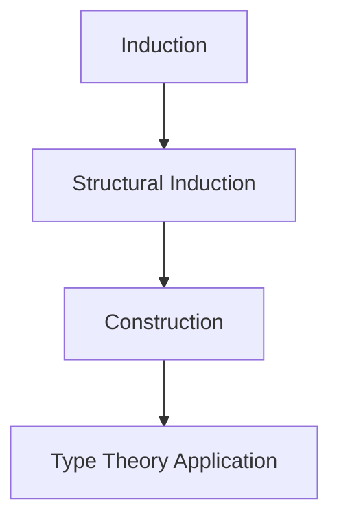

# 1.2.6 Induction and Construction

## 目录

- [1.2.6 Induction and Construction](#126-induction-and-construction)
  - [目录](#目录)
    - [1.2.6.1 Topic Overview](#1261-topic-overview)
    - [1.2.6.2 Principles of Induction](#1262-principles-of-induction)
    - [1.2.6.3 Constructive Proofs](#1263-constructive-proofs)
    - [1.2.6.4 Formal Definition and Lean Proof](#1264-formal-definition-and-lean-proof)
    - [1.2.6.5 Typical Cases and Reasoning](#1265-typical-cases-and-reasoning)
      - [Induction proof (LaTeX)](#induction-proof-latex)
    - [1.2.6.6 Diagrams and Multi-representations](#1266-diagrams-and-multi-representations)
    - [1.2.6.7 Relevance and Cross-references](#1267-relevance-and-cross-references)
    - [1.2.6.8 References and Further Reading](#1268-references-and-further-reading)

---

### 1.2.6.1 Topic Overview

Induction and construction are two fundamental methods in type theory and formal proof.

### 1.2.6.2 Principles of Induction

- Mathematical induction, structural induction
- Inductive definitions and inductive proofs

### 1.2.6.3 Constructive Proofs

- Proof as construction of objects
- Constructive proofs under dependent types

### 1.2.6.4 Formal Definition and Lean Proof

```lean
-- Example: induction on natural numbers
theorem add_zero (n : Nat) : n + 0 = n :=
begin
  induction n,
  case zero { refl },
  case succ k ih { simp [ih] }
end
```

### 1.2.6.5 Typical Cases and Reasoning

#### Induction proof (LaTeX)

\[
P(0) \land (\forall n, P(n) \implies P(n+1)) \implies \forall n, P(n)
\]

### 1.2.6.6 Diagrams and Multi-representations



### 1.2.6.7 Relevance and Cross-references

- [1.2.3-dependent-types-and-expressiveness.md](./1.2.3-dependent-types-and-expressiveness.md)
- [../../6-programming-languages-and-implementation/6.1-lean-and-formal-proof.md](../../6-programming-languages-and-implementation/6.1-lean-and-formal-proof.md)

### 1.2.6.8 References and Further Reading

- "Types and Programming Languages"
- Lean official documentation
