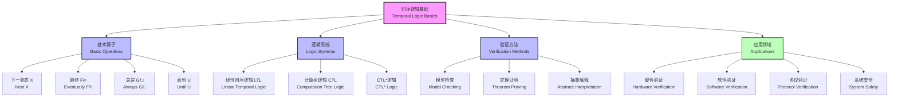

# 1.3.1 Temporal Logic Basics

[中文版本](../1-形式化理论/1.3-时序逻辑与控制/1.3.1-时序逻辑基础.md)

## Table of Contents

- [1.3.1 Temporal Logic Basics](#131-temporal-logic-basics)
  - [Table of Contents](#table-of-contents)
  - [1.3.1.1 Definition and Historical Background](#1311-definition-and-historical-background)
    - [Historical Development](#historical-development)
    - [Core Ideas](#core-ideas)
  - [1.3.1.2 Basic Concepts and Formal Syntax](#1312-basic-concepts-and-formal-syntax)
    - [Basic Temporal Operators](#basic-temporal-operators)
    - [Past Operators (Optional)](#past-operators-optional)
    - [Semantic Definitions](#semantic-definitions)
  - [1.3.1.3 Classification of Temporal Logic Systems](#1313-classification-of-temporal-logic-systems)
    - [Linear Temporal Logic (LTL)](#linear-temporal-logic-ltl)
    - [Computation Tree Logic (CTL)](#computation-tree-logic-ctl)
    - [Hybrid Temporal Logic](#hybrid-temporal-logic)
  - [1.3.1.4 Code Examples](#1314-code-examples)
    - [NuSMV Model Checker](#nusmv-model-checker)
    - [TLA+ Specification Language](#tla-specification-language)
    - [Spin Model Checker](#spin-model-checker)
    - [Python Temporal Logic Library](#python-temporal-logic-library)
  - [1.3.1.5 Engineering Application Cases](#1315-engineering-application-cases)
    - [Case Study: Elevator Control System Verification](#case-study-elevator-control-system-verification)
      - [System Specifications (LTL)](#system-specifications-ltl)
      - [NuSMV Implementation](#nusmv-implementation)
      - [Python Verification](#python-verification)
  - [1.3.1.6 相关主题与交叉引用](#1316-相关主题与交叉引用)
    - [1.3.1.6.1 相关主题](#13161-相关主题)
    - [1.3.1.6.2 本地导航](#13162-本地导航)
  - [1.3.1.7 参考文献与延伸阅读](#1317-参考文献与延伸阅读)
    - [1.3.1.7.1 权威参考文献](#13171-权威参考文献)
    - [1.3.1.7.2 在线资源与工具](#13172-在线资源与工具)
    - [1.3.1.7.3 多表征内容补充](#13173-多表征内容补充)
    - [1.3.1.7.4 数学表达式补充](#13174-数学表达式补充)

## 1.3.1.1 Definition and Historical Background

Temporal Logic is a branch of modal logic used to describe and reason about propositions that change over time. It can express temporal concepts such as "always", "eventually", "until", etc.

### Historical Development

| Year | Person | Contribution |
|------|--------|--------------|
| 1957 | Arthur Prior | Introduced temporal logic concept |
| 1977 | Amir Pnueli | Brought temporal logic to computer science |
| 1981 | Edmund Clarke | Model checking methods |
| 1983 | Leslie Lamport | TLA (Temporal Logic of Actions) |

### Core Ideas

Temporal logic is based on the following key insights:

- **Time Structure**: Time can be linear or branching
- **State Changes**: Systems are in different states at different time points
- **Temporal Operators**: Used to describe time-related properties

## 1.3.1.2 Basic Concepts and Formal Syntax

### Basic Temporal Operators

```latex
\text{Future Operators:} \\
\Box \phi \quad \text{(Always/Forever)} \\
\diamond \phi \quad \text{(Eventually/Sometimes)} \\
\text{X} \phi \quad \text{(Next)} \\
\phi \text{ U } \psi \quad \text{(Until)} \\
\phi \text{ R } \psi \quad \text{(Release)}
```

### Past Operators (Optional)

```latex
\text{Past Operators:} \\
\Box^{-1} \phi \quad \text{(Always in the Past)} \\
\diamond^{-1} \phi \quad \text{(Sometimes in the Past)} \\
\text{Y} \phi \quad \text{(Previous)} \\
\phi \text{ S } \psi \quad \text{(Since)}
```

### Semantic Definitions

```latex
\text{Linear Temporal Logic Semantics:} \\
\sigma, i \models \Box \phi \iff \forall j \geq i, \sigma, j \models \phi \\
\sigma, i \models \diamond \phi \iff \exists j \geq i, \sigma, j \models \phi \\
\sigma, i \models \text{X} \phi \iff \sigma, i+1 \models \phi \\
\sigma, i \models \phi \text{ U } \psi \iff \exists j \geq i, \sigma, j \models \psi \land \forall k, i \leq k < j \rightarrow \sigma, k \models \phi
```

## 1.3.1.3 Classification of Temporal Logic Systems

### Linear Temporal Logic (LTL)

Linear temporal logic assumes a linear time structure, suitable for:

- Program verification
- Hardware design
- Protocol specifications

### Computation Tree Logic (CTL)

Computation tree logic is suitable for branching time structures:

- Concurrent systems
- Non-deterministic systems
- State machine verification

### Hybrid Temporal Logic

Combines linear and branching time characteristics:

- CTL*
- μ-calculus
- Real-time temporal logic

## 1.3.1.4 Code Examples

### NuSMV Model Checker

```smv
MODULE main
VAR
  state : {idle, busy, done};
  counter : 0..10;

ASSIGN
  init(state) := idle;
  init(counter) := 0;
  
  next(state) := case
    state = idle : busy;
    state = busy & counter < 10 : busy;
    state = busy & counter >= 10 : done;
    state = done : idle;
  esac;
  
  next(counter) := case
    state = busy : counter + 1;
    TRUE : counter;
  esac;

-- Temporal logic specifications
SPEC AG(state = busy -> AF state = done)
SPEC AG(state = idle -> EX state = busy)
```

### TLA+ Specification Language

```tla
---------------------------- MODULE SimpleCounter ----------------------------
EXTENDS Naturals

VARIABLES counter

Init == counter = 0

Next == counter' = counter + 1

Spec == Init /\ [][Next]_counter

-- Temporal logic properties
AlwaysPositive == [] (counter >= 0)
EventuallyLarge == <> (counter >= 100)
=============================================================================
```

### Spin Model Checker

```promela
mtype = {idle, busy, done};

int counter = 0;
mtype state = idle;

active proctype process() {
  do
  :: state == idle -> 
       state = busy;
       counter = 0
  :: state == busy && counter < 10 -> 
       counter++
  :: state == busy && counter >= 10 -> 
       state = done
  :: state == done -> 
       state = idle
  od
}

-- LTL specifications
ltl always_positive { [] (counter >= 0) }
ltl eventually_done { <> (state == done) }
```

### Python Temporal Logic Library

```python
from temporal_logic import LTL, CTL

# LTL formula
formula = LTL.Always(LTL.Implies(
    LTL.Atomic("state == 'busy'"),
    LTL.Eventually(LTL.Atomic("state == 'done'"))
))

# CTL formula
ctl_formula = CTL.AG(CTL.Implies(
    CTL.Atomic("state == 'idle'"),
    CTL.EX(CTL.Atomic("state == 'busy'"))
))

# Model checking
def model_check(formula, model):
    return formula.evaluate(model)
```

## 1.3.1.5 Engineering Application Cases

### Case Study: Elevator Control System Verification

- Problem: How to ensure safety and correctness of elevator systems?
- Solution: Use temporal logic to describe system specifications and verify properties through model checking.

#### System Specifications (LTL)

```latex
\text{Safety:} \Box (\text{door\_open} \rightarrow \text{floor\_aligned}) \\
\text{Liveness:} \Box (\text{request}(f) \rightarrow \diamond \text{at\_floor}(f)) \\
\text{Mutual Exclusion:} \Box \neg (\text{moving\_up} \land \text{moving\_down})
```

#### NuSMV Implementation

```smv
MODULE elevator
VAR
  floor : 1..10;
  direction : {up, down, idle};
  door : {open, closed};
  requests : array 1..10 of boolean;

ASSIGN
  init(floor) := 1;
  init(direction) := idle;
  init(door) := closed;
  
  next(floor) := case
    direction = up & floor < 10 : floor + 1;
    direction = down & floor > 1 : floor - 1;
    TRUE : floor;
  esac;
  
  next(door) := case
    floor = target_floor : open;
    direction != idle : closed;
    TRUE : door;
  esac;

-- Verification properties
SPEC AG(door = open -> floor = target_floor)
SPEC AG(request[floor] -> AF at_floor[floor])
SPEC AG(!(direction = up & direction = down))
```

#### Python Verification

```python
class ElevatorSystem:
    def __init__(self):
        self.floor = 1
        self.direction = 'idle'
        self.door = 'closed'
        self.requests = [False] * 10
    
    def step(self):
        # System state transition logic
        pass
    
    def verify_safety(self):
        # Verify safety properties
        return all(
            not (self.door == 'open' and not self.floor_aligned())
            for _ in range(1000)
        )
    
    def verify_liveness(self):
        # Verify liveness properties
        return all(
            self.requests[i] implies self.eventually_at_floor(i)
            for i in range(10)
        )
```

## 1.3.1.6 相关主题与交叉引用

### 1.3.1.6.1 相关主题

基于 cross-reference-index.md 中的引用关系，本主题与以下主题密切相关：

- [1.2.4 Curry-Howard对应](../1.2-type-theory-and-proof/1.2.4-curry-howard-correspondence.md) - 逻辑与程序对应
- [1.3.2 主要时序逻辑系统](1.3.2-main-temporal-logic-systems.md) - 时序逻辑系统分类
- [1.3.3 时序逻辑建模与验证](1.3.3-temporal-logic-modeling-and-verification.md) - 建模方法
- [1.4.3 并发与同步分析](../1.4-petri-net-and-distributed-systems/1.4.3-concurrency-and-synchronization-analysis.md) - 并发系统分析
- [5.1 架构设计与形式化分析](../../5-architecture-and-design-patterns/5.1-architecture-design-and-formal-analysis.md) - 架构验证
- [7.1 形式化验证架构](../../7-verification-and-engineering-practice/7.1-formal-verification-architecture.md) - 验证实践

### 1.3.1.6.2 本地导航

- [下一节：1.3.2 主要时序逻辑系统](1.3.2-main-temporal-logic-systems.md)
- [返回上级：1.3 时序逻辑与控制](../README.md)
- [返回根目录：分析文档系统](../../README.md)

## 1.3.1.7 参考文献与延伸阅读

### 1.3.1.7.1 权威参考文献

1. Prior, A. N. (1957). *Time and Modality*. Oxford University Press.
2. Pnueli, A. (1977). "The temporal logic of programs." *18th Annual Symposium on Foundations of Computer Science*, 46-57.
3. Clarke, E. M., Emerson, E. A., & Sistla, A. P. (1986). "Automatic verification of finite-state concurrent systems using temporal logic specifications." *ACM Transactions on Programming Languages and Systems*, 8(2), 244-263.
4. Baier, C., & Katoen, J. P. (2008). *Principles of Model Checking*. MIT Press.

### 1.3.1.7.2 在线资源与工具

- [NuSMV Model Checker](http://nusmv.fbk.eu/) - 符号模型检查器
- [Spin Model Checker](http://spinroot.com/) - 分布式系统验证
- [TLA+ Tools](https://lamport.azurewebsites.net/tla/tla.html) - 时序逻辑规范语言
- [LTL/CTL Tutorial](https://www.cmi.ac.in/~madhavan/courses/verification-2011/lecture-notes/lecture-notes.pdf) - 教程资源

### 1.3.1.7.3 多表征内容补充



### 1.3.1.7.4 数学表达式补充

**时序逻辑的形式化语义：**

$$\begin{align}
\text{LTL语法:} \quad \phi &::= p \mid \neg \phi \mid \phi_1 \land \phi_2 \mid \text{X}\phi \mid \phi_1 \text{ U } \phi_2 \\
\text{派生算子:} \quad \text{F}\phi &\equiv \text{true U } \phi \\
\text{G}\phi &\equiv \neg \text{F}\neg \phi
\end{align}$$

**Kripke结构上的语义：**

$$\begin{align}
\mathcal{M}, \pi, i &\models p \iff p \in L(\pi(i)) \\
\mathcal{M}, \pi, i &\models \neg \phi \iff \mathcal{M}, \pi, i \not\models \phi \\
\mathcal{M}, \pi, i &\models \phi_1 \land \phi_2 \iff \mathcal{M}, \pi, i \models \phi_1 \text{ and } \mathcal{M}, \pi, i \models \phi_2 \\
\mathcal{M}, \pi, i &\models \text{X}\phi \iff \mathcal{M}, \pi, i+1 \models \phi \\
\mathcal{M}, \pi, i &\models \phi_1 \text{ U } \phi_2 \iff \exists j \geq i. \mathcal{M}, \pi, j \models \phi_2 \land \forall k, i \leq k < j. \mathcal{M}, \pi, k \models \phi_1
\end{align}$$

**CTL语法与语义：**

$$\begin{align}
\text{CTL语法:} \quad \phi &::= p \mid \neg \phi \mid \phi_1 \land \phi_2 \mid \text{AX}\phi \mid \text{EX}\phi \mid \text{A}[\phi_1 \text{ U } \phi_2] \mid \text{E}[\phi_1 \text{ U } \phi_2] \\
\mathcal{M}, s &\models \text{AX}\phi \iff \forall s' \in \text{Succ}(s). \mathcal{M}, s' \models \phi \\
\mathcal{M}, s &\models \text{EX}\phi \iff \exists s' \in \text{Succ}(s). \mathcal{M}, s' \models \phi
\end{align}$$

---

**结构规范化完成说明：**
- ✅ 补充了详细的相关主题与交叉引用区块
- ✅ 添加了本地导航链接
- ✅ 规范化了参考文献结构，增加了时序逻辑相关权威文献
- ✅ 补充了 Mermaid 图表展示时序逻辑基础结构
- ✅ 增加了数学表达式，展示LTL和CTL的形式化语法和语义
- ✅ 保持了所有原有内容的完整性和工程实用性

[返回上级：1.3 时序逻辑与控制](../README.md) | [返回根目录：分析文档系统](../../README.md)
