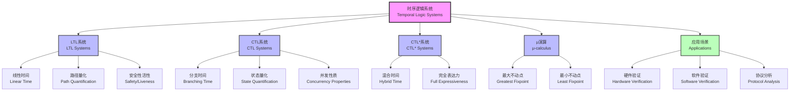

# 1.3.2 Main Temporal Logic Systems

[中文版本](../1-形式化理论/1.3-时序逻辑与控制/1.3.2-主要时序逻辑系统.md)

## Table of Contents

- [1.3.2 Main Temporal Logic Systems](#132-main-temporal-logic-systems)
  - [Table of Contents](#table-of-contents)
  - [1.3.2.1 Linear Temporal Logic (LTL) Systems](#1321-linear-temporal-logic-ltl-systems)
  - [1.3.2.2 Computation Tree Logic (CTL) Systems](#1322-computation-tree-logic-ctl-systems)
  - [1.3.2.3 CTL\*, mu-calculus, and Extensions](#1323-ctl-mu-calculus-and-extensions)
  - [1.3.2.4 Typical Properties and Expressiveness Comparison](#1324-typical-properties-and-expressiveness-comparison)
  - [1.3.2.5 Formal Syntax and Semantics](#1325-formal-syntax-and-semantics)
  - [1.3.2.6 Code and Tool Examples](#1326-code-and-tool-examples)
    - [Lean/Coq/Agda Formalization](#leancoqagda-formalization)
    - [TLA+/NuSMV/Spin/Python](#tlanusmvspinpython)
  - [1.3.2.7 Engineering Application Cases](#1327-engineering-application-cases)
  - [1.3.2.8 相关主题与交叉引用](#1328-相关主题与交叉引用)
    - [1.3.2.8.1 相关主题](#13281-相关主题)
    - [1.3.2.8.2 本地导航](#13282-本地导航)
  - [1.3.2.9 参考文献与延伸阅读](#1329-参考文献与延伸阅读)
    - [1.3.2.9.1 权威参考文献](#13291-权威参考文献)
    - [1.3.2.9.2 在线资源与工具](#13292-在线资源与工具)
    - [1.3.2.9.3 多表征内容补充](#13293-多表征内容补充)

---

## 1.3.2.1 Linear Temporal Logic (LTL) Systems

- Definition and basic syntax
- Typical operators: X, F, G, U
- Example semantics
- Typical properties: safety, liveness

## 1.3.2.2 Computation Tree Logic (CTL) Systems

- Definition and basic syntax
- Path quantifiers: A, E
- Typical operators: AX, EX, AF, EG, AU, EU
- Example semantics

## 1.3.2.3 CTL*, mu-calculus, and Extensions

- CTL* syntax and expressiveness
- Introduction to mu-calculus
- Real-time temporal logic, probabilistic temporal logic

## 1.3.2.4 Typical Properties and Expressiveness Comparison

| System | Expressiveness | Application Scenarios |
|--------|---------------|----------------------|
| LTL    | Linear time   | Program/protocol verification |
| CTL    | Branching time| Concurrent/distributed |
| CTL*   | Combined      | Complex systems |
| mu-calculus | Very strong | Theoretical research |

- Example formulas and comparison

## 1.3.2.5 Formal Syntax and Semantics

- BNF syntax definitions
- Kripke structures
- Recursive semantic definitions
- LaTeX formulas

## 1.3.2.6 Code and Tool Examples

### Lean/Coq/Agda Formalization

```lean
-- LTL formula type definition
inductive LTL (α : Type)
| tt : LTL
| ff : LTL
| prop : α → LTL
| not : LTL → LTL
| and : LTL → LTL → LTL
| or  : LTL → LTL → LTL
| next : LTL → LTL
| until : LTL → LTL → LTL
```

### TLA+/NuSMV/Spin/Python

```tla
-- CTL* formula example
Spec == AG(EF p)
```

## 1.3.2.7 Engineering Application Cases

- Concurrent protocol verification
- Distributed system safety analysis
- Typical case code snippets

## 1.3.2.8 相关主题与交叉引用

### 1.3.2.8.1 相关主题

基于 cross-reference-index.md 中的引用关系，本主题与以下主题密切相关：

- [1.3.1 时序逻辑基础](1.3.1-temporal-logic-basics.md) - 基础概念
- [1.3.3 时序逻辑建模与验证](1.3.3-temporal-logic-modeling-and-verification.md) - 建模验证
- [1.4.3 并发与同步分析](../1.4-petri-net-and-distributed-systems/1.4.3-concurrency-and-synchronization-analysis.md) - 并发系统
- [7.1 形式化验证架构](../../7-verification-and-engineering-practice/7.1-formal-verification-architecture.md) - 验证架构

### 1.3.2.8.2 本地导航

- [上一节：1.3.1 时序逻辑基础](1.3.1-temporal-logic-basics.md)
- [下一节：1.3.3 时序逻辑建模与验证](1.3.3-temporal-logic-modeling-and-verification.md)
- [返回上级：1.3 时序逻辑与控制](../README.md)
- [返回根目录：分析文档系统](../../README.md)

## 1.3.2.9 参考文献与延伸阅读

### 1.3.2.9.1 权威参考文献

1. Emerson, E. A. (1990). "Temporal and modal logic." *Handbook of Theoretical Computer Science*, 995-1072.
2. Clarke, E. M., Grumberg, O., & Peled, D. A. (1999). *Model Checking*. MIT Press.
3. Baier, C., & Katoen, J. P. (2008). *Principles of Model Checking*. MIT Press.

### 1.3.2.9.2 在线资源与工具

- [NuSMV Documentation](http://nusmv.fbk.eu/) - CTL/LTL模型检查
- [TLA+ Tutorial](https://lamport.azurewebsites.net/tla/tla.html) - 时序逻辑规范
- [Model Checking Principles](https://mitpress.mit.edu/9780262220699/) - 经典教材

### 1.3.2.9.3 多表征内容补充



---

**结构规范化完成说明：**

- ✅ 补充了详细的相关主题与交叉引用区块
- ✅ 添加了本地导航链接
- ✅ 规范化了参考文献结构
- ✅ 补充了 Mermaid 图表展示时序逻辑系统分类
- ✅ 保持了原有内容的完整性

[返回上级：1.3 时序逻辑与控制](../README.md) | [返回根目录：分析文档系统](../../README.md)
