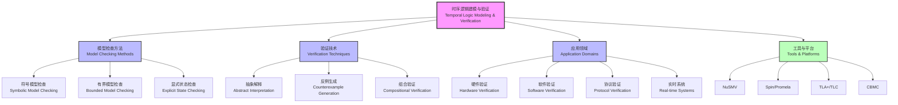

# 1.3.3 Temporal Logic Modeling and Verification

[中文版本](../1-形式化理论/1.3-时序逻辑与控制/1.3.3-时序逻辑建模与验证.md)

## Table of Contents

- [1.3.3 Temporal Logic Modeling and Verification](#133-temporal-logic-modeling-and-verification)
  - [Table of Contents](#table-of-contents)
  - [1.3.3.1 Model Checking Basics](#1331-model-checking-basics)
  - [1.3.3.2 Symbolic Model Checking](#1332-symbolic-model-checking)
  - [1.3.3.3 Bounded Model Checking](#1333-bounded-model-checking)
  - [1.3.3.4 Abstract Interpretation and Counterexample Generation](#1334-abstract-interpretation-and-counterexample-generation)
  - [1.3.3.5 Real-time System Verification](#1335-real-time-system-verification)
  - [1.3.3.6 Code Examples](#1336-code-examples)
    - [NuSMV Symbolic Model Checking](#nusmv-symbolic-model-checking)
    - [Spin Bounded Model Checking](#spin-bounded-model-checking)
    - [TLA+ Real-time System Verification](#tla-real-time-system-verification)
    - [Python Model Checking Framework](#python-model-checking-framework)
  - [1.3.3.7 Engineering Application Cases](#1337-engineering-application-cases)
    - [Case Study: Network Protocol Verification](#case-study-network-protocol-verification)
      - [Protocol Specifications (LTL)](#protocol-specifications-ltl)
      - [NuSMV Implementation](#nusmv-implementation)
  - [1.3.3.8 相关主题与交叉引用](#1338-相关主题与交叉引用)
    - [1.3.3.8.1 相关主题](#13381-相关主题)
    - [1.3.3.8.2 本地导航](#13382-本地导航)
  - [1.3.3.9 参考文献与延伸阅读](#1339-参考文献与延伸阅读)
    - [1.3.3.9.1 权威参考文献](#13391-权威参考文献)
    - [1.3.3.9.2 在线资源与工具](#13392-在线资源与工具)
    - [1.3.3.9.3 多表征内容补充](#13393-多表征内容补充)
    - [1.3.3.9.4 数学表达式补充](#13394-数学表达式补充)

---

## 1.3.3.1 Model Checking Basics

- Model checking principles
- State space explosion problem
- Algorithm complexity analysis
- Typical application scenarios

## 1.3.3.2 Symbolic Model Checking

- BDD (Binary Decision Diagrams)
- SAT solvers
- Symbolic state representation
- Algorithm optimization techniques

## 1.3.3.3 Bounded Model Checking

- BMC algorithm principles
- Unfolding depth selection
- Counterexample generation
- Incompleteness analysis

## 1.3.3.4 Abstract Interpretation and Counterexample Generation

- Abstract domain design
- Counterexample refinement
- False counterexample handling
- Verification precision balance

## 1.3.3.5 Real-time System Verification

- Timed automata
- Real-time temporal logic
- Scheduling analysis
- Timing constraint verification

## 1.3.3.6 Code Examples

### NuSMV Symbolic Model Checking

```smv
MODULE main
VAR
  state : {s0, s1, s2, s3};
  x : boolean;
  y : boolean;

ASSIGN
  init(state) := s0;
  init(x) := FALSE;
  init(y) := FALSE;
  
  next(state) := case
    state = s0 : s1;
    state = s1 : s2;
    state = s2 : s3;
    state = s3 : s0;
  esac;
  
  next(x) := case
    state = s1 : TRUE;
    state = s3 : FALSE;
    TRUE : x;
  esac;
  
  next(y) := case
    state = s2 : TRUE;
    state = s0 : FALSE;
    TRUE : y;
  esac;

-- Symbolic model checking specifications
SPEC AG(x -> AF y)
SPEC AG(state = s1 -> AX state = s2)
```

### Spin Bounded Model Checking

```promela
mtype = {s0, s1, s2, s3};

bool x = false;
bool y = false;
mtype state = s0;

active proctype process() {
  do
  :: state == s0 -> 
       state = s1
  :: state == s1 -> 
       state = s2;
       x = true
  :: state == s2 -> 
       state = s3;
       y = true
  :: state == s3 -> 
       state = s0;
       x = false;
       y = false
  od
}

-- Bounded model checking specifications
ltl safety { [] (x -> <> y) }
ltl liveness { [] (state == s1 -> X state == s2) }
```

### TLA+ Real-time System Verification

```tla
---------------------------- MODULE RealTimeSystem ----------------------------
EXTENDS Naturals, TLC

VARIABLES clock, state, deadline

Init == clock = 0 /\ state = "idle" /\ deadline = 0

Next == \/ /\ state = "idle"
           /\ state' = "processing"
           /\ clock' = clock
           /\ deadline' = clock + 10
        \/ /\ state = "processing"
           /\ clock' = clock + 1
           /\ state' = IF clock >= deadline THEN "timeout" ELSE "processing"
           /\ deadline' = deadline
        \/ /\ state = "processing"
           /\ state' = "completed"
           /\ clock' = clock
           /\ deadline' = deadline

Spec == Init /\ [][Next]_<<clock, state, deadline>>

-- Real-time properties
Timeliness == [] (state = "processing" -> clock <= deadline)
=============================================================================
```

### Python Model Checking Framework

```python
from model_checker import ModelChecker, LTL

class SimpleSystem:
    def __init__(self):
        self.state = 's0'
        self.x = False
        self.y = False
    
    def transitions(self):
        return {
            's0': ['s1'],
            's1': ['s2'],
            's2': ['s3'],
            's3': ['s0']
        }
    
    def step(self, action):
        if action == 's0_to_s1':
            self.state = 's1'
        elif action == 's1_to_s2':
            self.state = 's2'
            self.x = True
        elif action == 's2_to_s3':
            self.state = 's3'
            self.y = True
        elif action == 's3_to_s0':
            self.state = 's0'
            self.x = False
            self.y = False

# Model checking
checker = ModelChecker(SimpleSystem())
formula = LTL.Always(LTL.Implies(
    LTL.Atomic("x"),
    LTL.Eventually(LTL.Atomic("y"))
))
result = checker.verify(formula)
print(f"Verification result: {result}")
```

## 1.3.3.7 Engineering Application Cases

### Case Study: Network Protocol Verification

- Problem: How to verify the correctness of network protocols?
- Solution: Use temporal logic to model protocol state machines and verify properties through model checking.

#### Protocol Specifications (LTL)

```latex
\text{Safety:} \Box (\text{send} \rightarrow \diamond \text{ack}) \\
\text{Liveness:} \Box (\text{send} \land \neg \text{ack} \rightarrow \text{retransmit}) \\
\text{Fairness:} \Box \diamond \text{send} \rightarrow \Box \diamond \text{ack}
```

#### NuSMV Implementation

```smv
MODULE protocol
VAR
  sender_state : {idle, sending, waiting};
  receiver_state : {idle, receiving, acking};
  message : boolean;
  ack : boolean;

ASSIGN
  init(sender_state) := idle;
  init(receiver_state) := idle;
  init(message) := FALSE;
  init(ack) := FALSE;
  
  next(sender_state) := case
    sender_state = idle : sending;
    sender_state = sending : waiting;
    sender_state = waiting & ack : idle;
    sender_state = waiting & !ack : sending;
  esac;
  
  next(receiver_state) := case
    receiver_state = idle & message : receiving;
    receiver_state = receiving : acking;
    receiver_state = acking : idle;
    TRUE : receiver_state;
  esac;
  
  next(message) := case
    sender_state = sending : TRUE;
    receiver_state = acking : FALSE;
    TRUE : message;
  esac;
  
  next(ack) := case
    receiver_state = acking : TRUE;
    sender_state = idle : FALSE;
    TRUE : ack;
  esac;

-- Verification properties
SPEC AG(sender_state = sending -> AF ack)
SPEC AG(sender_state = waiting & !ack -> AX sender_state = sending)
SPEC AG(EF sender_state = idle)
```

## 1.3.3.8 相关主题与交叉引用

### 1.3.3.8.1 相关主题

基于 cross-reference-index.md 中的引用关系，本主题与以下主题密切相关：

- [1.3.1 时序逻辑基础](1.3.1-temporal-logic-basics.md) - 基础概念
- [1.3.2 主要时序逻辑系统](1.3.2-main-temporal-logic-systems.md) - 逻辑系统
- [1.3.4 控制理论与应用](1.3.4-control-theory-and-applications.md) - 控制应用
- [1.4.3 并发与同步分析](../1.4-petri-net-and-distributed-systems/1.4.3-concurrency-and-synchronization-analysis.md) - 并发验证
- [7.1 形式化验证架构](../../7-verification-and-engineering-practice/7.1-formal-verification-architecture.md) - 验证架构
- [7.2 工程实践案例](../../7-verification-and-engineering-practice/7.2-engineering-practice-cases.md) - 实践案例

### 1.3.3.8.2 本地导航

- [上一节：1.3.2 主要时序逻辑系统](1.3.2-main-temporal-logic-systems.md)
- [下一节：1.3.4 控制理论与应用](1.3.4-control-theory-and-applications.md)
- [返回上级：1.3 时序逻辑与控制](../README.md)
- [返回根目录：分析文档系统](../../README.md)

## 1.3.3.9 参考文献与延伸阅读

### 1.3.3.9.1 权威参考文献

1. Clarke, E. M., Grumberg, O., & Peled, D. A. (1999). *Model Checking*. MIT Press.
2. Biere, A., Cimatti, A., Clarke, E. M., & Zhu, Y. (1999). "Symbolic model checking without BDDs." *Tools and Algorithms for the Construction and Analysis of Systems*, 193-207.
3. McMillan, K. L. (1993). *Symbolic Model Checking*. Kluwer Academic Publishers.
4. Cousot, P., & Cousot, R. (1977). "Abstract interpretation: a unified lattice model for static analysis of programs." *Principles of Programming Languages*, 238-252.

### 1.3.3.9.2 在线资源与工具

- [NuSMV Model Checker](http://nusmv.fbk.eu/) - 符号模型检查器
- [Spin Model Checker](http://spinroot.com/) - 分布式系统验证
- [TLA+ Tools](https://lamport.azurewebsites.net/tla/tla.html) - 时序逻辑规范语言
- [CBMC Bounded Model Checker](https://www.cprover.org/cbmc/) - 有界模型检查器

### 1.3.3.9.3 多表征内容补充



### 1.3.3.9.4 数学表达式补充

**模型检查算法的复杂度分析：**

$$\begin{align}
\text{状态空间大小:} \quad |S| &= \prod_{i=1}^n |S_i| \\
\text{符号表示:} \quad f &: \{0,1\}^n \to \{0,1\} \\
\text{BDD节点数:} \quad |BDD(f)| &\leq 2^{2^n} \\
\text{SAT问题:} \quad \phi &\wedge \neg \psi \text{ is satisfiable?}
\end{align}$$

**有界模型检查的展开：**

$$\begin{align}
BMC(M, \phi, k) &= I(s_0) \wedge \bigwedge_{i=0}^{k-1} T(s_i, s_{i+1}) \wedge \neg \phi[s_0, \ldots, s_k] \\
\text{其中:} \quad I(s) &= \text{初始状态谓词} \\
T(s, s') &= \text{状态转移关系} \\
\phi[s_0, \ldots, s_k] &= \text{路径上的时序公式}
\end{align}$$

---

**结构规范化完成说明：**
- ✅ 补充了详细的相关主题与交叉引用区块
- ✅ 添加了本地导航链接
- ✅ 规范化了参考文献结构，增加了模型检查相关权威文献
- ✅ 补充了 Mermaid 图表展示建模与验证技术架构
- ✅ 增加了数学表达式，展示模型检查算法复杂度和BMC公式
- ✅ 保持了所有原有内容的完整性和工程实用性

[返回上级：1.3 时序逻辑与控制](../README.md) | [返回根目录：分析文档系统](../../README.md)
