# 1.3.4 Control Theory and Applications

[中文版本](../1-形式化理论/1.3-时序逻辑与控制/1.3.4-控制理论与应用.md)

## Table of Contents

- [1.3.4 Control Theory and Applications](#134-control-theory-and-applications)
  - [Table of Contents](#table-of-contents)
  - [1.3.4.1 Control Theory Fundamentals](#1341-control-theory-fundamentals)
  - [1.3.4.2 Discrete Event System Control](#1342-discrete-event-system-control)
  - [1.3.4.3 Hybrid System Control](#1343-hybrid-system-control)
  - [1.3.4.4 Formal Control Specifications](#1344-formal-control-specifications)
  - [1.3.4.5 Control Algorithm Implementation](#1345-control-algorithm-implementation)
  - [1.3.4.6 Code Examples](#1346-code-examples)
    - [Lean Formal Control Theory](#lean-formal-control-theory)
    - [Rust Control System Implementation](#rust-control-system-implementation)
    - [Python Control System Simulation](#python-control-system-simulation)
  - [1.3.4.7 Engineering Application Cases](#1347-engineering-application-cases)
    - [Case Study: Robot Path Planning Control](#case-study-robot-path-planning-control)
      - [Control Specifications (LTL)](#control-specifications-ltl)
  - [1.3.4.8 相关主题与交叉引用](#1348-相关主题与交叉引用)
    - [1.3.4.8.1 相关主题](#13481-相关主题)
    - [1.3.4.8.2 本地导航](#13482-本地导航)
  - [1.3.4.9 参考文献与延伸阅读](#1349-参考文献与延伸阅读)
    - [1.3.4.9.1 权威参考文献](#13491-权威参考文献)
    - [1.3.4.9.2 在线资源与工具](#13492-在线资源与工具)
    - [1.3.4.9.3 多表征内容补充](#13493-多表征内容补充)
    - [1.3.4.9.4 数学表达式补充](#13494-数学表达式补充)

---

## 1.3.4.1 Control Theory Fundamentals

- Mathematical foundations of control systems
- State space representation
- Controllability and observability
- Stability theory
- Optimal control theory

## 1.3.4.2 Discrete Event System Control

- Discrete event system modeling
- Supervisory control theory
- Language controllability
- Control synthesis algorithms
- Real-time control implementation

## 1.3.4.3 Hybrid System Control

- Hybrid automata
- Switched system control
- Hybrid control strategies
- Safety guarantees
- Performance optimization

## 1.3.4.4 Formal Control Specifications

- Formal expression of control requirements
- Temporal logic control specifications
- Safety and liveness requirements
- Control constraints
- Specification verification methods

## 1.3.4.5 Control Algorithm Implementation

- Control algorithm design
- Real-time control implementation
- Control parameter tuning
- Robustness design
- Adaptive control

## 1.3.4.6 Code Examples

### Lean Formal Control Theory

```lean
-- Control system state space definition
structure ControlSystem (α β γ : Type) :=
  (state : α)
  (input : β)
  (output : γ)
  (dynamics : α → β → α)
  (output_map : α → γ)

-- Controllability definition
def controllable {α β : Type} (sys : ControlSystem α β γ) : Prop :=
  ∀ s₁ s₂ : α, ∃ u : β, sys.dynamics s₁ u = s₂
```

### Rust Control System Implementation

```rust
use std::collections::HashMap;

// Control system state
#[derive(Debug, Clone)]
struct ControlState {
    position: f64,
    velocity: f64,
    time: f64,
}

// Control input
#[derive(Debug, Clone)]
struct ControlInput {
    force: f64,
    timestamp: f64,
}

// Control system
struct ControlSystem {
    state: ControlState,
    dynamics: Box<dyn Fn(&ControlState, &ControlInput) -> ControlState>,
    controller: Box<dyn Fn(&ControlState) -> ControlInput>,
}
```

### Python Control System Simulation

```python
import numpy as np
import matplotlib.pyplot as plt

class ControlSystem:
    def __init__(self, initial_state, dynamics, controller):
        self.state = initial_state
        self.dynamics = dynamics
        self.controller = controller
        self.history = []
    
    def step(self, dt):
        control_input = self.controller(self.state)
        self.state = self.dynamics(self.state, control_input, dt)
        self.history.append(self.state.copy())
```

## 1.3.4.7 Engineering Application Cases

### Case Study: Robot Path Planning Control

- Problem: How to design safe robot motion control systems?
- Solution: Use formal control theory to design controllers and verify safety through temporal logic.

#### Control Specifications (LTL)

```latex
\text{Safety:} \Box (\text{robot\_position} \in \text{safe\_zone}) \\
\text{Goal Reachability:} \Box (\text{target\_set} \rightarrow \diamond \text{robot\_at\_target}) \\
\text{Collision Avoidance:} \Box \neg (\text{robot\_collision})
```

## 1.3.4.8 相关主题与交叉引用

### 1.3.4.8.1 相关主题

基于 cross-reference-index.md 中的引用关系，本主题与以下主题密切相关：

- [1.3.1 时序逻辑基础](1.3.1-temporal-logic-basics.md) - 基础概念
- [1.3.2 主要时序逻辑系统](1.3.2-main-temporal-logic-systems.md) - 逻辑系统
- [1.3.3 时序逻辑建模与验证](1.3.3-temporal-logic-modeling-and-verification.md) - 建模验证
- [1.4.2 分布式系统的Petri网表达](../1.4-petri-net-and-distributed-systems/1.4.2-distributed-systems-petri-net.md) - 分布式控制
- [5.1 架构设计与形式化分析](../../5-architecture-and-design-patterns/5.1-architecture-design-and-formal-analysis.md) - 控制架构
- [7.1 形式化验证架构](../../7-verification-and-engineering-practice/7.1-formal-verification-architecture.md) - 验证实践

### 1.3.4.8.2 本地导航

- [上一节：1.3.3 时序逻辑建模与验证](1.3.3-temporal-logic-modeling-and-verification.md)
- [下一节：1.3.5 典型工程案例](1.3.5-typical-engineering-cases.md)
- [返回上级：1.3 时序逻辑与控制](../README.md)
- [返回根目录：分析文档系统](../../README.md)

## 1.3.4.9 参考文献与延伸阅读

### 1.3.4.9.1 权威参考文献

1. Wonham, W. M., & Ramadge, P. J. (1987). "On the supremal controllable sublanguage of a given language." *SIAM Journal on Control and Optimization*, 25(3), 637-659.
2. Alur, R., & Dill, D. L. (1994). "A theory of timed automata." *Theoretical Computer Science*, 126(2), 183-235.
3. Cassandras, C. G., & Lafortune, S. (2021). *Introduction to Discrete Event Systems*. Springer.
4. Lygeros, J., Johansson, K. H., Simic, S. N., Zhang, J., & Sastry, S. S. (2003). "Dynamical properties of hybrid automata." *IEEE Transactions on Automatic Control*, 48(1), 2-17.

### 1.3.4.9.2 在线资源与工具

- [UPPAAL Model Checker](https://uppaal.org/) - 实时系统建模与验证
- [MATLAB Control Toolbox](https://www.mathworks.com/products/control.html) - 控制系统设计
- [ROS Control Framework](http://wiki.ros.org/ros_control) - 机器人控制框架
- [Hybrid Systems Tools](https://www.cds.caltech.edu/~murray/wiki/index.php/Hybrid_Systems) - 混成系统工具

### 1.3.4.9.3 多表征内容补充

```mermaid
graph TB
    A[控制理论与应用<br/>Control Theory & Applications] --> B[控制系统类型<br/>Control System Types]
    A --> C[形式化方法<br/>Formal Methods]
    A --> D[应用领域<br/>Application Domains]
    
    B --> B1[离散事件系统<br/>Discrete Event Systems]
    B --> B2[混成系统<br/>Hybrid Systems]
    B --> B3[分布式控制<br/>Distributed Control]
    B --> B4[实时控制<br/>Real-time Control]
    
    C --> C1[监督控制<br/>Supervisory Control]
    C --> C2[时间自动机<br/>Timed Automata]
    C --> C3[模型预测控制<br/>Model Predictive Control]
    C --> C4[鲁棒控制<br/>Robust Control]
    
    D --> D1[机器人系统<br/>Robotic Systems]
    D --> D2[制造系统<br/>Manufacturing Systems]
    D --> D3[交通控制<br/>Traffic Control]
    D --> D4[电力系统<br/>Power Systems]
    
    E[验证技术<br/>Verification Techniques] --> E1[可达性分析<br/>Reachability Analysis]
    E --> E2[稳定性验证<br/>Stability Verification]
    E --> E3[安全性保证<br/>Safety Guarantees]
    
    A --> E
    
    style A fill:#f9f,stroke:#333,stroke-width:3px
    style B fill:#bbf,stroke:#333,stroke-width:2px
    style C fill:#bbf,stroke:#333,stroke-width:2px
    style D fill:#bbf,stroke:#333,stroke-width:2px
    style E fill:#bfb,stroke:#333,stroke-width:2px
```



### 1.3.4.9.4 数学表达式补充

**离散事件系统的监督控制：**

$$\begin{align}
\text{控制目标:} \quad L(G/S) &\subseteq K \subseteq L(G) \\
\text{可控制性:} \quad \overline{K} \Sigma_{uc} \cap L(G) &\subseteq \overline{K} \\
\text{可观测性:} \quad P^{-1}(P(K)) \cap L(G) &= K
\end{align}$$

**混成系统的状态空间表示：**

$$\begin{align}
\text{连续动态:} \quad \dot{x} &= f(q, x, u) \\
\text{离散转移:} \quad (q, x) &\xrightarrow{e} (q', x') \\
\text{不变条件:} \quad x &\in \text{Inv}(q) \\
\text{保护条件:} \quad (x, x') &\in \text{Guard}(e)
\end{align}$$

**李雅普诺夫稳定性：**

$$\begin{align}
V(x) > 0, \quad &\forall x \neq 0 \\
\dot{V}(x) \leq 0, \quad &\forall x \in \mathbb{R}^n \\
V(0) &= 0
\end{align}$$

---

**结构规范化完成说明：**
- ✅ 补充了详细的相关主题与交叉引用区块
- ✅ 添加了本地导航链接
- ✅ 规范化了参考文献结构，增加了控制理论相关权威文献
- ✅ 补充了 Mermaid 图表展示控制理论与应用架构
- ✅ 增加了数学表达式，展示监督控制、混成系统和稳定性理论
- ✅ 保持了所有原有内容的完整性和工程实用性

[返回上级：1.3 时序逻辑与控制](../README.md) | [返回根目录：分析文档系统](../../README.md)
