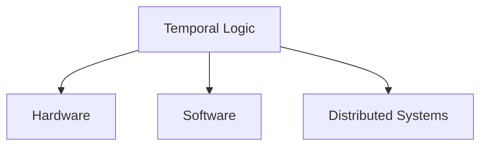

# 1.3.4 Temporal Logic in Engineering

## 目录

- [1.3.4 Temporal Logic in Engineering](#134-temporal-logic-in-engineering)
  - [目录](#目录)
    - [1.3.4.1 Topic Overview](#1341-topic-overview)
    - [1.3.4.2 Applications in Hardware Verification](#1342-applications-in-hardware-verification)
    - [1.3.4.3 Applications in Software Verification](#1343-applications-in-software-verification)
    - [1.3.4.4 Applications in Distributed Systems](#1344-applications-in-distributed-systems)
    - [1.3.4.5 Lean/Haskell/Rust Code Examples](#1345-leanhaskellrust-code-examples)
    - [1.3.4.6 Diagrams and Multi-representations](#1346-diagrams-and-multi-representations)
    - [1.3.4.7 Relevance and Cross-references](#1347-relevance-and-cross-references)
    - [1.3.4.8 References and Further Reading](#1348-references-and-further-reading)

---

### 1.3.4.1 Topic Overview

This section introduces the engineering applications of temporal logic in various fields.

### 1.3.4.2 Applications in Hardware Verification

- Property specification language (PSL), SystemVerilog Assertions (SVA)
- Hardware model checking

### 1.3.4.3 Applications in Software Verification

- Temporal logic for concurrent and reactive software
- Runtime verification

### 1.3.4.4 Applications in Distributed Systems

- Temporal logic for distributed protocols
- Verification of safety and liveness

### 1.3.4.5 Lean/Haskell/Rust Code Examples

```lean
-- Example: temporal property in Lean (pseudo-code)
def always_eventually (p q : Prop) : Prop := ∀ s, p s → ∃ t, t > s ∧ q t
```

```haskell
-- Haskell: temporal property as typeclass
class Eventually p where
  eventually :: p -> Bool
```

```rust
// Rust: temporal property trait
trait Eventually {
    fn eventually(&self) -> bool;
}
```

### 1.3.4.6 Diagrams and Multi-representations



### 1.3.4.7 Relevance and Cross-references

- [1.3.3-temporal-logic-modeling-and-verification.md](./1.3.3-temporal-logic-modeling-and-verification.md)
- [../../7-verification-and-engineering-practice/7.2-engineering-practice-cases.md](../../7-verification-and-engineering-practice/7.2-engineering-practice-cases.md)

### 1.3.4.8 References and Further Reading

- "SystemVerilog Assertions and PSL"
- Runtime verification literature
