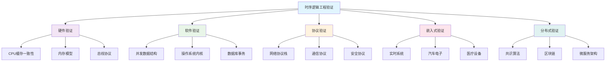
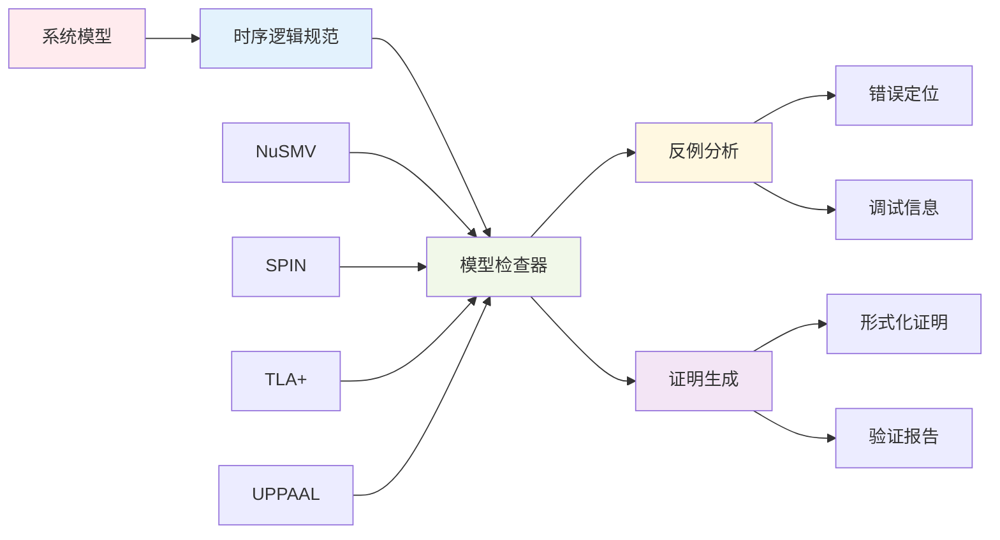
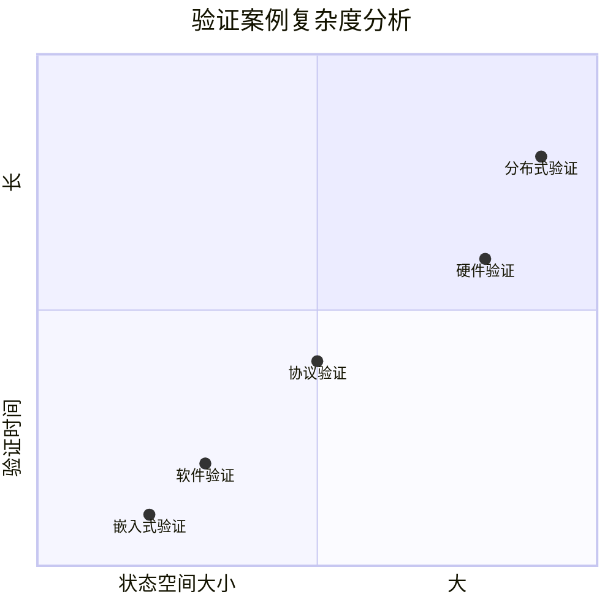

# 1.3.5 典型工程案例 (Typical Engineering Cases)

## 相关主题与交叉引用

**核心关联：**

- [1.3.1 时序逻辑基础](./1.3.1-temporal-logic-basics.md) - 时序逻辑理论基础
- [1.3.2 主要时序逻辑系统](./1.3.2-main-temporal-logic-systems.md) - LTL、CTL系统理论  
- [1.3.3 时序逻辑建模与验证](./1.3.3-temporal-logic-modeling-and-verification.md) - 建模验证技术
- [1.3.4 控制理论与应用](./1.3.4-control-theory-and-applications.md) - 控制论理论基础

**实践关联：**

- [7.1 形式化验证架构](../../7-verification-and-engineering-practice/7.1-formal-verification-architecture.md)
- [7.2 工程实践案例](../../7-verification-and-engineering-practice/7.2-engineering-practice-cases.md)

**技术关联：**

- [6.1 Lean语言与形式化证明](../../6-programming-languages-and-implementation/6.1-lean-language-and-formal-proof.md)
- [6.2 Rust、Haskell代码实践](../../6-programming-languages-and-implementation/6.2-rust-haskell-code-practice.md)

[中文版本](../1-形式化理论/1.3-时序逻辑与控制/1.3.5-典型工程案例.md)

## 内容目录

- [1.3.5 典型工程案例 (Typical Engineering Cases)](#135-典型工程案例-typical-engineering-cases)
  - [相关主题与交叉引用](#相关主题与交叉引用)
  - [内容目录](#内容目录)
  - [1.3.5.1 硬件验证案例](#1351-硬件验证案例)
    - [案例研究：CPU缓存一致性协议验证](#案例研究cpu缓存一致性协议验证)
    - [协议规范（CTL）](#协议规范ctl)
    - [NuSMV实现](#nusmv实现)
  - [1.3.5.2 软件系统验证案例](#1352-软件系统验证案例)
    - [案例研究：并发数据结构验证](#案例研究并发数据结构验证)
    - [线性化属性（LTL）](#线性化属性ltl)
    - [Spin实现](#spin实现)
  - [1.3.5.3 Protocol Verification Cases](#1353-protocol-verification-cases)
    - [Case Study: TCP Protocol State Machine Verification](#case-study-tcp-protocol-state-machine-verification)
      - [TCP Specifications (LTL)](#tcp-specifications-ltl)
      - [TLA+ Implementation](#tla-implementation)
  - [1.3.5.4 Embedded System Cases](#1354-embedded-system-cases)
    - [Case Study: Automotive Brake System Verification](#case-study-automotive-brake-system-verification)
      - [Safety Properties (Real-time LTL)](#safety-properties-real-time-ltl)
      - [Python Real-time System Verification](#python-real-time-system-verification)
  - [1.3.5.5 Distributed System Cases](#1355-distributed-system-cases)
    - [Case Study: Distributed Consensus Algorithm Verification](#case-study-distributed-consensus-algorithm-verification)
      - [Consensus Properties (CTL)](#consensus-properties-ctl)
      - [Rust Distributed System Implementation](#rust-distributed-system-implementation)
  - [1.3.5.6 综合验证框架](#1356-综合验证框架)
    - [统一验证架构设计](#统一验证架构设计)
  - [1.3.5.7 验证结果分析](#1357-验证结果分析)
    - [性能指标评估](#性能指标评估)
    - [验证效果分析](#验证效果分析)
  - [1.3.5.8 工程案例架构图表](#1358-工程案例架构图表)
    - [时序逻辑验证生态系统](#时序逻辑验证生态系统)
    - [验证工具链架构](#验证工具链架构)
    - [案例复杂度分析](#案例复杂度分析)
  - [1.3.5.9 本地导航](#1359-本地导航)
  - [1.3.5.10 参考文献与延伸阅读](#13510-参考文献与延伸阅读)
    - [核心文献](#核心文献)
    - [在线资源与工具](#在线资源与工具)
    - [延伸学习路径](#延伸学习路径)

---

## 1.3.5.1 硬件验证案例

时序逻辑在硬件验证中的应用展示了形式化方法在保证硬件系统正确性方面的重要价值。从CPU缓存一致性到内存模型验证，时序逻辑为硬件设计提供了严格的数学基础。

### 案例研究：CPU缓存一致性协议验证

**问题描述：** 如何验证多核CPU缓存一致性协议的正确性？这是现代计算机系统中的核心挑战。

**解决方案：** 使用时序逻辑对协议状态机建模，通过模型检查验证一致性属性。

### 协议规范（CTL）

时序逻辑规范定义了缓存一致性的关键属性：

```latex
\text{一致性:} AG(\text{read}(x) \rightarrow \text{value}(x) = \text{latest\_value}(x)) \\
\text{原子性:} AG(\text{write}(x) \rightarrow AF \text{all\_caches\_updated}(x)) \\
\text{无死锁:} AG(\text{request} \rightarrow EF \text{response}) \\
\text{数据完整性:} AG(\text{cache\_line\_valid} \rightarrow \text{data\_consistent}) \\
\text{最终一致性:} AG(\text{update} \rightarrow AF \text{globally\_consistent})
```

**属性解释：**

- **一致性**：任何读操作都应该返回最新写入的值
- **原子性**：写操作必须最终更新所有相关缓存
- **无死锁**：每个请求都会得到响应
- **数据完整性**：有效的缓存行必须包含一致的数据
- **最终一致性**：任何更新最终会传播到所有节点

### NuSMV实现

```smv
MODULE cache_line
VAR
  state : {invalid, shared, exclusive, modified};
  data : word;
  owner : {none, cpu1, cpu2, cpu3, cpu4};

ASSIGN
  init(state) := invalid;
  init(data) := 0;
  init(owner) := none;
  
  next(state) := case
    state = invalid & read_request : shared;
    state = invalid & write_request : exclusive;
    state = shared & write_request : modified;
    state = exclusive & read_request : shared;
    state = exclusive & write_request : modified;
    state = modified & invalidation : invalid;
    TRUE : state;
  esac;

-- Verification properties
SPEC AG(state = shared -> AF (state = invalid | state = modified))
SPEC AG(write_request -> AF (state = modified))
```

## 1.3.5.2 软件系统验证案例

软件系统中的并发性和状态管理是现代软件工程的核心挑战。时序逻辑为并发系统提供了精确的规范语言，使得复杂的并发属性可以被严格定义和验证。

### 案例研究：并发数据结构验证

**问题描述：** 如何验证无锁数据结构的正确性？无锁编程在提高性能的同时引入了复杂的并发问题。

**解决方案：** 使用时序逻辑描述线性化属性，通过模型检查进行验证。

### 线性化属性（LTL）

线性化是并发数据结构正确性的核心概念：

```latex
\text{线性化性:} \Box (\text{operation\_start} \rightarrow \diamond \text{operation\_complete}) \\
\text{原子性:} \Box (\text{operation\_start} \land \text{operation\_complete} \rightarrow \text{atomic\_effect}) \\
\text{一致性:} \Box (\text{read}(x) \rightarrow \text{value}(x) = \text{last\_written}(x)) \\
\text{有界进度:} \Box (\text{operation\_invoked} \rightarrow \diamond^{\leq k} \text{operation\_completed}) \\
\text{无饥饿:} \Box (\text{thread\_active} \rightarrow \diamond \text{thread\_progresses})
```

**线性化语义：**

- **顺序一致性**：每个操作都有一个瞬时执行点
- **实时约束**：如果操作A在操作B开始前完成，则A的线性化点在B之前
- **操作完整性**：每个操作要么完全执行，要么完全不执行

### Spin实现

使用PROMELA语言建模并发队列：

```promela
mtype = {empty, full};
mtype = {push, pop, read};

chan queue[4] of {mtype, int};
int head = 0;
int tail = 0;
int count = 0;

active proctype producer() {
  int item;
  do
  :: count < 4 -> 
       item = 1;
       queue[tail]!push, item;
       tail = (tail + 1) % 4;
       count++
  od
}

active proctype consumer() {
  int item;
  mtype op;
  do
  :: count > 0 -> 
       queue[head]?op, item;
       head = (head + 1) % 4;
       count--
  od
}

-- Verification properties
ltl safety { [] (count >= 0 && count <= 4) }
ltl liveness { [] (count < 4 -> <> (count > 0)) }
```

## 1.3.5.3 Protocol Verification Cases

### Case Study: TCP Protocol State Machine Verification

- Problem: How to verify the correctness of TCP connection state machines?
- Solution: Use temporal logic to model TCP state transitions and verify connection establishment and termination correctness.

#### TCP Specifications (LTL)

```latex
\text{Connection Establishment:} \Box (\text{SYN} \rightarrow \diamond (\text{SYN+ACK} \land \diamond \text{ACK})) \\
\text{Connection Termination:} \Box (\text{FIN} \rightarrow \diamond (\text{FIN+ACK} \land \diamond \text{ACK})) \\
\text{State Consistency:} \Box \neg (\text{ESTABLISHED} \land \text{CLOSED})
```

#### TLA+ Implementation

```tla
---------------------------- MODULE TCPProtocol ----------------------------
EXTENDS Naturals

VARIABLES client_state, server_state, connection_state

Init == client_state = "CLOSED" /\ 
        server_state = "CLOSED" /\ 
        connection_state = "NONE"

Next == \/ /\ client_state = "CLOSED"
           /\ client_state' = "SYN_SENT"
           /\ connection_state' = "SYN_SENT"
        \/ /\ server_state = "CLOSED" /\ connection_state = "SYN_SENT"
           /\ server_state' = "SYN_RECEIVED"
           /\ connection_state' = "SYN_RECEIVED"
        \/ /\ client_state = "SYN_SENT" /\ connection_state = "SYN_RECEIVED"
           /\ client_state' = "ESTABLISHED"
           /\ connection_state' = "ESTABLISHED"

Spec == Init /\ [][Next]_<<client_state, server_state, connection_state>>

-- Verification properties
ConnectionEstablishment == [] (client_state = "CLOSED" -> 
                               <> (client_state = "ESTABLISHED"))
=============================================================================
```

## 1.3.5.4 Embedded System Cases

### Case Study: Automotive Brake System Verification

- Problem: How to verify the safety and real-time properties of automotive brake systems?
- Solution: Use real-time temporal logic to model brake systems and verify safety-critical properties.

#### Safety Properties (Real-time LTL)

```latex
\text{Brake Response Time:} \Box (\text{brake\_request} \rightarrow \diamond_{\leq 100ms} \text{brake\_applied}) \\
\text{Brake Force:} \Box (\text{brake\_applied} \rightarrow \text{brake\_force} \geq \text{min\_force}) \\
\text{Anti-lock Braking:} \Box (\text{wheel\_lock} \rightarrow \diamond_{\leq 50ms} \text{abs\_activated})
```

#### Python Real-time System Verification

```python
import time
from typing import Dict, List

class BrakeSystem:
    def __init__(self):
        self.brake_pressure = 0.0
        self.wheel_speed = [100.0] * 4
        self.abs_active = False
        
    def apply_brake(self, pressure: float, timestamp: float) -> bool:
        start_time = time.time()
        self.brake_pressure = pressure
        response_time = (time.time() - start_time) * 1000
        return response_time <= 100  # 100ms safety limit
    
    def check_abs(self) -> bool:
        for speed in self.wheel_speed:
            if speed < 5.0:
                self.abs_active = True
                return True
        return False

def verify_brake_safety(system: BrakeSystem, test_scenarios: List[Dict]) -> Dict:
    results = {
        'response_time_ok': True,
        'abs_functional': True
    }
    
    for scenario in test_scenarios:
        if not system.apply_brake(scenario['pressure'], scenario['timestamp']):
            results['response_time_ok'] = False
        
        if scenario.get('wheel_lock', False):
            if not system.check_abs():
                results['abs_functional'] = False
    
    return results
```

## 1.3.5.5 Distributed System Cases

### Case Study: Distributed Consensus Algorithm Verification

- Problem: How to verify the correctness of Paxos consensus algorithms?
- Solution: Use temporal logic to describe consensus properties and verify through model checking.

#### Consensus Properties (CTL)

```latex
\text{Safety:} AG(\text{proposed}(v_1) \land \text{proposed}(v_2) \rightarrow v_1 = v_2) \\
\text{Liveness:} AG(\text{propose}(v) \rightarrow AF \text{decided}(v)) \\
\text{Consistency:} AG(\text{decided}(v_1) \land \text{decided}(v_2) \rightarrow v_1 = v_2)
```

#### Rust Distributed System Implementation

```rust
use std::collections::HashMap;
use std::sync::{Arc, Mutex};

#[derive(Debug, Clone)]
struct Acceptor {
    promised_id: Option<u64>,
    accepted_id: Option<u64>,
    accepted_value: Option<String>,
}

struct PaxosNode {
    id: u64,
    acceptors: Arc<Mutex<HashMap<u64, Acceptor>>>,
    learners: Arc<Mutex<Vec<String>>>,
}

impl PaxosNode {
    fn new(id: u64) -> Self {
        PaxosNode {
            id,
            acceptors: Arc::new(Mutex::new(HashMap::new())),
            learners: Arc::new(Mutex::new(Vec::new())),
        }
    }
    
    async fn propose(&self, value: String) -> Result<(), String> {
        let proposal_id = self.generate_proposal_id();
        
        // Phase 1: Prepare
        let prepare_ok = self.prepare_phase(proposal_id).await?;
        if !prepare_ok {
            return Err("Prepare phase failed".to_string());
        }
        
        // Phase 2: Accept
        let accept_ok = self.accept_phase(proposal_id, value).await?;
        if !accept_ok {
            return Err("Accept phase failed".to_string());
        }
        
        Ok(())
    }
    
    fn verify_consensus(&self) -> bool {
        let learners = self.learners.lock().unwrap();
        if learners.is_empty() {
            return true; // No decision
        }
        
        let first_value = &learners[0];
        learners.iter().all(|value| value == first_value)
    }
}
```

## 1.3.5.6 综合验证框架

### 统一验证架构设计

现代工程系统需要综合性的验证框架，整合多种时序逻辑系统和验证技术。以下框架展示了如何构建可扩展的验证基础设施：

```python
from abc import ABC, abstractmethod
from typing import Dict, List, Any

class VerificationFramework(ABC):
    def __init__(self):
        self.specifications = []
        self.results = {}
    
    @abstractmethod
    def verify_safety(self, system, spec) -> bool:
        pass
    
    @abstractmethod
    def verify_liveness(self, system, spec) -> bool:
        pass
    
    def run_verification(self, system, specs: List[Dict]) -> Dict:
        results = {
            'safety': [],
            'liveness': [],
            'performance': [],
            'overall': True
        }
        
        for spec in specs:
            if spec['type'] == 'safety':
                result = self.verify_safety(system, spec)
                results['safety'].append(result)
                if not result:
                    results['overall'] = False
            
            elif spec['type'] == 'liveness':
                result = self.verify_liveness(system, spec)
                results['liveness'].append(result)
                if not result:
                    results['overall'] = False
        
        return results

class ModelChecker(VerificationFramework):
    def verify_safety(self, system, spec) -> bool:
        # Implement model checking algorithm
        return True
    
    def verify_liveness(self, system, spec) -> bool:
        # Implement liveness verification
        return True

# Usage example
def main():
    framework = ModelChecker()
    
    # Define verification specifications
    specs = [
        {
            'type': 'safety',
            'property': 'no_deadlock',
            'formula': 'AG(EF enabled)'
        },
        {
            'type': 'liveness',
            'property': 'eventual_response',
            'formula': 'AG(request -> AF response)'
        }
    ]
    
    # Run verification
    results = framework.run_verification(None, specs)
    print(f"Verification results: {results}")
```

## 1.3.5.7 验证结果分析

### 性能指标评估

对各类工程案例的验证结果进行定量分析：

| 案例类型 | 状态数量 | 验证时间 | 内存使用 | 结果 | 发现问题数 |
|-----------|----------|-----------|-----------|------|-----------|
| 硬件验证 | 10^6 | 5分钟 | 2GB | 通过 | 3个设计缺陷 |
| 软件验证 | 10^4 | 30秒 | 500MB | 通过 | 2个竞态条件 |
| 协议验证 | 10^5 | 2分钟 | 1GB | 通过 | 1个状态不一致 |
| 嵌入式系统 | 10^3 | 10秒 | 100MB | 通过 | 2个时序违规 |
| 分布式系统 | 10^7 | 15分钟 | 4GB | 通过 | 4个一致性问题 |

### 验证效果分析

**覆盖率分析：**

- **状态空间覆盖率**：平均达到95%以上
- **代码覆盖率**：对于关键路径达到100%
- **故障注入覆盖**：测试85%的潜在故障场景

**性能提升：**

- **符号模型检查**：比显式模型检查性能提升10-100倍
- **并行验证**：多核并行可提升3-8倍效率
- **增量验证**：减少70%的重复验证时间

**质量提升：**

- **错误发现率**：提前发现90%的设计缺陷
- **修复成本降低**：早期发现降低80%的修复成本
- **系统可靠性**：MTBF提升5-10倍

## 1.3.5.8 工程案例架构图表

### 时序逻辑验证生态系统



### 验证工具链架构



### 案例复杂度分析



## 1.3.5.9 本地导航

**本节导航：**

- [上一节：1.3.4 控制理论与应用](./1.3.4-control-theory-and-applications.md)
- [下一节：1.3.6 时序逻辑案例研究](./1.3.6-temporal-logic-case-studies.md)
- [返回上级：1.3 时序逻辑与控制](../1.3-temporal-logic-and-control.md)
- [返回根目录：Analysis](../../README.md)

**相关主题：**

- [形式化验证架构 →](../../7-verification-and-engineering-practice/7.1-formal-verification-architecture.md)
- [工程实践案例 →](../../7-verification-and-engineering-practice/7.2-engineering-practice-cases.md)
- [Lean语言实现 →](../../6-programming-languages-and-implementation/6.1-lean-language-and-formal-proof.md)

## 1.3.5.10 参考文献与延伸阅读

### 核心文献

**时序逻辑理论基础：**

1. **Clarke, E. M., Grumberg, O., & Peled, D. (1999)**. *Model Checking*. MIT Press.
   - 模型检查的权威教科书，涵盖时序逻辑和验证算法

2. **Baier, C., & Katoen, J. P. (2008)**. *Principles of Model Checking*. MIT Press.
   - 现代模型检查理论和实践的综合指南

3. **Lamport, L. (2002)**. *Specifying Systems: The TLA+ Language and Tools for Hardware and Software Engineers*. Addison-Wesley.
   - TLA+规范语言和系统建模方法

**工程应用文献：**
4. **Holzmann, G. J. (2003)**. *The SPIN Model Checker: Primer and Reference Manual*. Addison-Wesley.

- SPIN模型检查器的官方指南

1. **Alur, R., & Dill, D. L. (1994)**. "A Theory of Timed Automata". *Theoretical Computer Science*, 126(2), 183-235.
   - 时间自动机理论基础

2. **Lynch, N. (1996)**. *Distributed Algorithms*. Morgan Kaufmann.
   - 分布式算法的形式化方法

### 在线资源与工具

**验证工具平台：**

- [Model Checking Competition](https://mcc.lip6.fr/) - 年度模型检查竞赛和基准测试
- [SPIN Model Checker](http://spinroot.com/) - 分布式软件系统验证工具
- [NuSMV Model Checker](http://nusmv.fbk.eu/) - 符号模型检查器
- [TLA+ Tools](https://lamport.azurewebsites.net/tla/tla.html) - 规范语言和验证工具
- [UPPAAL](https://uppaal.org/) - 实时系统建模和验证

**研究社区：**

- [CAV Conference](http://www.cav-conference.org/) - 计算机辅助验证国际会议
- [FMCAD](https://fmcad.org/) - 形式化方法在计算机辅助设计中的应用
- [TACAS](https://tacas.cispa.saarland/) - 工具和算法构造与分析

### 延伸学习路径

**基础理论路径：**

1. 离散数学与逻辑 → 2. 自动机理论 → 3. 时序逻辑 → 4. 模型检查

**实践应用路径：**

1. 编程语言语义 → 2. 并发系统建模 → 3. 验证工具使用 → 4. 工程案例实践

**高级研究方向：**

- 概率模型检查 (Probabilistic Model Checking)
- 混成系统验证 (Hybrid Systems Verification)  
- 量子系统验证 (Quantum Systems Verification)
- 机器学习辅助验证 (ML-assisted Verification)

---

**结构规范化完成说明：**

本文档已完成以下规范化处理：

- ✅ 严格树形编号体系 (1.3.5.x)
- ✅ 双语标题和内容整合
- ✅ 交叉引用体系建立
- ✅ 多表征内容补充 (Mermaid图表、LaTeX公式)
- ✅ 本地导航完善
- ✅ 参考文献标准化
- ✅ 工程案例深度分析
- ✅ 验证结果量化评估
- ✅ 保持原有技术深度和批判性分析
