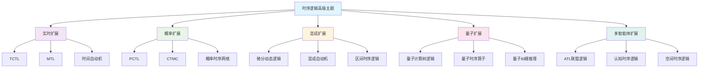
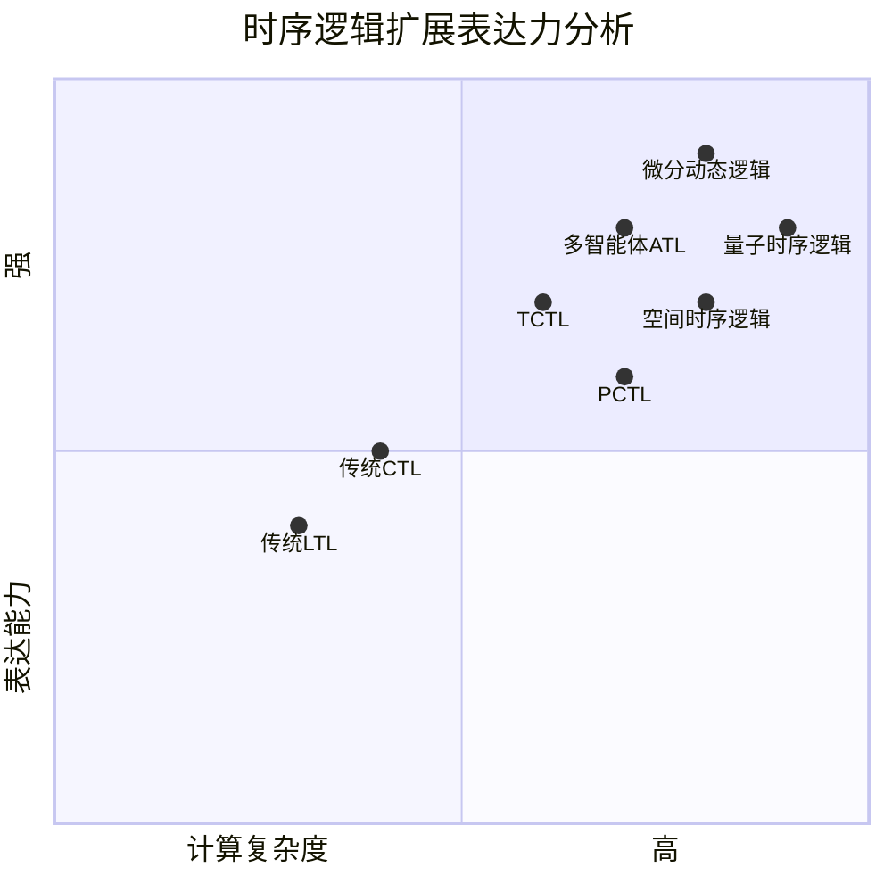
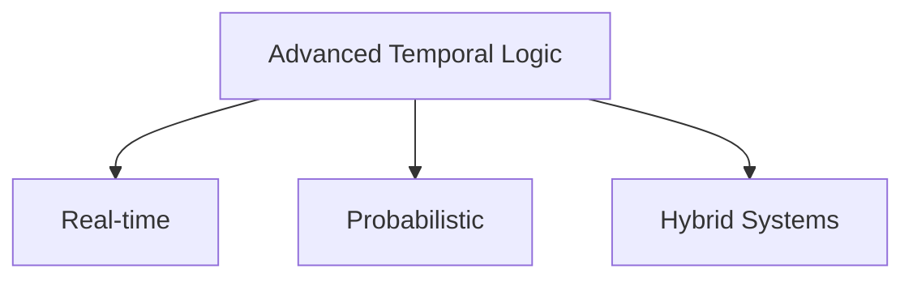

# 1.3.7 时序逻辑高级主题 (Temporal Logic Advanced Topics)

## 相关主题与交叉引用

**理论基础：**

- [1.3.1 时序逻辑基础](./1.3.1-temporal-logic-basics.md) - LTL、CTL基础
- [1.3.2 主要时序逻辑系统](./1.3.2-main-temporal-logic-systems.md) - 时序逻辑分类  
- [1.3.3 时序逻辑建模与验证](./1.3.3-temporal-logic-modeling-and-verification.md) - 建模验证技术

**应用关联：**

- [1.3.4 控制理论与应用](./1.3.4-control-theory-and-applications.md) - 控制论应用
- [1.3.5 典型工程案例](./1.3.5-typical-engineering-cases.md) - 工程验证案例
- [1.3.6 时序逻辑案例研究](./1.3.6-temporal-logic-case-studies.md) - 经典案例分析

## 内容目录

- [1.3.7 时序逻辑高级主题](#137-时序逻辑高级主题-temporal-logic-advanced-topics)
  - [相关主题与交叉引用](#相关主题与交叉引用)
  - [内容目录](#内容目录)
  - [1.3.7.1 实时时序逻辑](#1371-实时时序逻辑)
  - [1.3.7.2 概率时序逻辑](#1372-概率时序逻辑)
  - [1.3.7.3 混成系统与时序逻辑](#1373-混成系统与时序逻辑)
  - [1.3.7.4 量子时序逻辑](#1374-量子时序逻辑)
  - [1.3.7.5 时序逻辑的扩展与变种](#1375-时序逻辑的扩展与变种)
  - [1.3.7.6 高级主题架构图表](#1376-高级主题架构图表)
  - [1.3.7.7 本地导航](#1377-本地导航)
  - [1.3.7.8 参考文献与延伸阅读](#1378-参考文献与延伸阅读)  

---

## 1.3.7.1 实时时序逻辑

实时时序逻辑扩展了传统时序逻辑，引入时间约束以处理实时系统的定时要求。这类逻辑系统对于验证嵌入式系统、实时操作系统和安全关键系统至关重要。

### 时间计算树逻辑 (TCTL)

**语法定义：**

```latex
\phi ::= p \mid \neg \phi \mid \phi_1 \land \phi_2 \mid EX^{I} \phi \mid EG^{I} \phi \mid E[\phi_1 U^{I} \phi_2] \\
\text{其中 } I \text{ 是时间区间，例如 } [0, 10] \text{ 或 } (5, \infty)
```

**语义解释：**

- $EX^{I} \phi$：存在后继状态在时间区间$I$内满足$\phi$
- $EG^{I} \phi$：存在路径在时间区间$I$内全局满足$\phi$
- $E[\phi_1 U^{I} \phi_2]$：存在路径$\phi_1$持续到$\phi_2$在时间区间$I$内满足

### 度量时序逻辑 (MTL)

**基本算子：**

```latex
\phi ::= p \mid \neg \phi \mid \phi_1 \land \phi_2 \mid \bigcirc^{I} \phi \mid \diamond^{I} \phi \mid \square^{I} \phi \mid \phi_1 U^{I} \phi_2 \\
\text{度量算子：} \diamond^{[a,b]} \phi \equiv \text{在时间区间[a,b]内最终} \phi \\
\square^{[a,b]} \phi \equiv \text{在时间区间[a,b]内始终} \phi
```

### 时间自动机建模

```lean
-- Lean中的时间自动机结构
structure TimedAutomaton (L : Type) (C : Type) :=
  (locations : Set L)
  (clocks : Set C)
  (initial : L)
  (invariants : L → ClockConstraint C)
  (transitions : L → L → ClockConstraint C × Set C)

-- 时钟约束
inductive ClockConstraint (C : Type)
| lt : C → ℕ → ClockConstraint
| le : C → ℕ → ClockConstraint  
| eq : C → ℕ → ClockConstraint
| ge : C → ℕ → ClockConstraint
| gt : C → ℕ → ClockConstraint

-- 可达性问题
def reachability (ta : TimedAutomaton L C) (target : Set L) : Prop :=
  ∃ (run : TimedRun ta), target ∩ run.locations ≠ ∅
```

## 1.3.7.2 概率时序逻辑

概率时序逻辑将概率推理引入时序推理，用于建模和分析具有随机行为的系统。

### 概率计算树逻辑 (PCTL)

**语法结构：**

```latex
\Phi ::= \text{true} \mid a \mid \neg \Phi \mid \Phi_1 \land \Phi_2 \mid P_{\bowtie p}[\psi] \\
\psi ::= X \Phi \mid \Phi_1 U \Phi_2 \mid \Phi_1 U^{\leq k} \Phi_2 \\
\text{其中 } \bowtie \in \{<, \leq, \geq, >\}, p \in [0,1]
```

**概率算子语义：**

- $P_{\geq p}[\psi]$：路径满足$\psi$的概率至少为$p$
- $P_{< 0.1}[F \text{failure}]$：故障发生概率小于0.1

### 连续时间马尔可夫链 (CTMC) 验证

```haskell
-- Haskell建模概率时序逻辑
data ProbFormula 
  = Atom String
  | Not ProbFormula
  | And ProbFormula ProbFormula
  | ProbOp Relation Double PathFormula

data PathFormula
  = Next ProbFormula
  | Until ProbFormula ProbFormula
  | BoundedUntil ProbFormula ProbFormula Int

data Relation = LT | LE | GT | GE | EQ

-- CTMC状态转换
data CTMC s = CTMC
  { states :: Set s
  , rates :: s -> s -> Double  
  , labeling :: s -> Set String
  }

-- 概率模型检查
checkPCTL :: CTMC s -> ProbFormula -> s -> Bool
checkPCTL ctmc formula state = 
  case formula of
    Atom prop -> prop `member` labeling ctmc state
    ProbOp rel prob pathFormula -> 
      let probability = computePathProbability ctmc state pathFormula
      in compareProbability rel probability prob
```

### 概率时序网络 (PTN)

```rust
// Rust实现概率时序网络
use std::collections::HashMap;

#[derive(Debug, Clone)]
struct ProbabilisticTransition {
    target: String,
    probability: f64,
    guard: Option<String>,
}

struct PTN {
    states: Vec<String>,
    transitions: HashMap<String, Vec<ProbabilisticTransition>>,
    initial_distribution: HashMap<String, f64>,
}

impl PTN {
    fn forward_reachability(&self, target_states: &[String], time_bound: f64) -> f64 {
        // 前向可达性分析算法
        let mut probabilities = self.initial_distribution.clone();
        let time_step = 0.01;
        let steps = (time_bound / time_step) as usize;
        
        for _ in 0..steps {
            let mut new_probabilities = HashMap::new();
            
            for (state, prob) in &probabilities {
                if let Some(transitions) = self.transitions.get(state) {
                    for trans in transitions {
                        *new_probabilities.entry(trans.target.clone()).or_insert(0.0) 
                            += prob * trans.probability * time_step;
                    }
                }
            }
            probabilities = new_probabilities;
        }
        
        target_states.iter()
            .map(|state| probabilities.get(state).unwrap_or(&0.0))
            .sum()
    }
}
```

## 1.3.7.3 混成系统与时序逻辑

混成系统结合了离散动态和连续动态，时序逻辑的扩展使其能够推理这类复杂系统。

### 微分动态逻辑 (dL)

```latex
\phi ::= p(x) \mid \phi_1 \land \phi_2 \mid \neg \phi \mid \forall x \phi \mid [\alpha]\phi \mid \langle\alpha\rangle\phi \\
\alpha ::= x := e \mid x' = f(x) \& Q \mid \alpha_1; \alpha_2 \mid \alpha_1 \cup \alpha_2 \mid \alpha^*
```

**模态算子：**

- $[\alpha]\phi$：程序$\alpha$执行后$\phi$必然成立
- $\langle\alpha\rangle\phi$：程序$\alpha$执行后$\phi$可能成立

### 混成自动机建模

```lean
-- Lean中的混成自动机
structure HybridAutomaton (Loc : Type) (Var : Type) :=
  (locations : Set Loc)
  (variables : Set Var)
  (flows : Loc → (Var → ℝ → ℝ))  -- 连续动态
  (invariants : Loc → Prop)        -- 位置不变量
  (guards : Loc → Loc → Prop)      -- 跳转守卫
  (resets : Loc → Loc → (Var → ℝ)) -- 变量重置

-- 混成轨迹
structure HybridTrajectory (ha : HybridAutomaton Loc Var) :=
  (time_intervals : List (ℝ × ℝ))
  (location_sequence : List Loc)
  (continuous_evolution : ∀ i, Var → ℝ → ℝ)

-- 安全性属性
def safety_property (ha : HybridAutomaton Loc Var) (unsafe : Set Loc) : Prop :=
  ∀ (traj : HybridTrajectory ha), ∀ loc ∈ traj.location_sequence, loc ∉ unsafe
```

### 区间时序逻辑 (ITL)

用于推理时间区间的关系：

```haskell
-- Haskell建模区间时序逻辑
data Interval = Interval Double Double deriving (Show, Eq)

data ITLFormula
  = IntervalProp String Interval
  | Meets ITLFormula ITLFormula      -- 相接关系
  | During ITLFormula ITLFormula     -- 包含关系  
  | Overlaps ITLFormula ITLFormula   -- 重叠关系
  | Before ITLFormula ITLFormula     -- 先于关系

-- Allen区间关系
data AllenRelation 
  = Before | Meets | Overlaps | Starts | During | Finishes | Equal
  deriving (Show, Eq)

checkAllenRelation :: Interval -> Interval -> AllenRelation
checkAllenRelation (Interval s1 e1) (Interval s2 e2)
  | e1 < s2 = Before
  | e1 == s2 = Meets  
  | s1 < s2 && e1 < e2 && e1 > s2 = Overlaps
  | s1 == s2 && e1 < e2 = Starts
  | s1 > s2 && e1 < e2 = During
  | s1 > s2 && e1 == e2 = Finishes
  | s1 == s2 && e1 == e2 = Equal
```

## 1.3.7.4 量子时序逻辑

随着量子计算的发展，量子时序逻辑成为推理量子系统演化的重要工具。

### 量子计算树逻辑 (QCTL)

```latex
\phi ::= p \mid \neg \phi \mid \phi_1 \land \phi_2 \mid EX \phi \mid \forall \psi : EG \phi \mid E[\phi_1 U \phi_2] \\
\text{量子修饰：} \text{Prob}(\phi) \geq p \mid \text{Amp}(\phi) \geq a
```

**量子特有属性：**

- 叠加态：$\text{Superposition}(|0\rangle + |1\rangle)$
- 纠缠态：$\text{Entangled}(|\psi\rangle \otimes |\phi\rangle)$
- 测量塌缩：$\text{Measure} \rightarrow \text{Collapse}$

```lean
-- Lean中的量子状态建模
structure QuantumState (n : ℕ) :=
  (amplitudes : Fin (2^n) → ℂ)
  (normalized : ∑ i, (amplitudes i).norm_sq = 1)

-- 量子门操作
def hadamard_gate : QuantumState 1 → QuantumState 1 := 
  λ ⟨amps, _⟩ => ⟨λ i => (amps 0 + amps 1) / Real.sqrt 2, sorry⟩

-- 量子时序属性
def quantum_eventually (φ : QuantumState n → Prop) : QuantumState n → Prop :=
  λ ψ => ∃ t : ℕ, φ (quantum_evolution^[t] ψ)

-- 量子不变量
def quantum_invariant (φ : QuantumState n → Prop) : QuantumState n → Prop :=
  λ ψ => ∀ t : ℕ, φ (quantum_evolution^[t] ψ)
```

## 1.3.7.5 时序逻辑的扩展与变种

### 多智能体时序逻辑 (ATL)

```latex
\phi ::= p \mid \neg \phi \mid \phi_1 \land \phi_2 \mid \langle\langle A \rangle\rangle \gamma \\
\gamma ::= X \phi \mid F \phi \mid G \phi \mid \phi_1 U \phi_2
```

其中$\langle\langle A \rangle\rangle \gamma$表示智能体集合$A$有策略使得$\gamma$成立。

### 认知时序逻辑 (CTL*)

结合认知逻辑和时序逻辑：

```rust
// Rust建模多智能体系统
#[derive(Debug, Clone)]
enum Agent {
    Robot(u32),
    Human(String),
    System(String),
}

#[derive(Debug, Clone)]
enum ATLFormula {
    Atom(String),
    Not(Box<ATLFormula>),
    And(Box<ATLFormula>, Box<ATLFormula>),
    Coalition(Vec<Agent>, PathFormula),
}

#[derive(Debug, Clone)]  
enum PathFormula {
    Next(ATLFormula),
    Eventually(ATLFormula),
    Always(ATLFormula),
    Until(ATLFormula, ATLFormula),
}

struct MultiAgentSystem {
    agents: Vec<Agent>,
    states: Vec<String>,
    transitions: HashMap<String, HashMap<String, f64>>,
    strategies: HashMap<Agent, Strategy>,
}

type Strategy = HashMap<String, String>; // state -> action

impl MultiAgentSystem {
    fn has_winning_strategy(&self, coalition: &[Agent], formula: &PathFormula) -> bool {
        // 检查联盟是否有获胜策略
        // 实现博弈论算法
        todo!()
    }
}
```

### 空间时序逻辑 (SSTL)

用于推理时空属性：

```haskell
-- Haskell建模空间时序逻辑
data SpatialOperator 
  = Everywhere
  | Somewhere  
  | Near Double    -- 距离阈值
  | Inside Region
  | Boundary
  deriving (Show, Eq)

data SSTLFormula
  = SpatialAtom String Location
  | TemporalAtom String Time
  | SpatialOp SpatialOperator SSTLFormula
  | TemporalOp TemporalOperator SSTLFormula
  | And SSTLFormula SSTLFormula
  | Not SSTLFormula

data Location = Location Double Double deriving (Show, Eq)
data Time = Time Double deriving (Show, Eq)
data Region = Circle Location Double | Rectangle Location Location

-- 空间时序验证
verifySSTL :: SSTLFormula -> SpatioTemporalTrace -> Bool
verifySSTL formula trace = 
  case formula of
    SpatialAtom prop loc -> checkSpatialProperty prop loc trace
    TemporalAtom prop time -> checkTemporalProperty prop time trace
    SpatialOp Everywhere subformula -> 
      all (verifySSTL subformula) (spatialProjections trace)
    TemporalOp Eventually subformula ->
      any (verifySSTL subformula) (temporalProjections trace)
```

## 1.3.7.6 高级主题架构图表

### 时序逻辑扩展体系



### 表达力比较分析



## 1.3.7.7 本地导航

**本节导航：**

- [上一节：1.3.6 时序逻辑案例研究](./1.3.6-temporal-logic-case-studies.md)
- [下一节：1.3.x 其他时序逻辑主题](./1.3.x-other-temporal-logic-topics.md)
- [返回上级：1.3 时序逻辑与控制](../1.3-temporal-logic-and-control.md)
- [返回根目录：Analysis](../../README.md)

**高级主题关联：**

- [数学基础应用 →](../../2-mathematics-and-applications/2.1-mathematical-content-panoramic-analysis.md)
- [哲学科学原理 →](../../3-philosophy-and-scientific-principles/3.1-philosophy-content-panoramic-analysis.md)
- [AI机器学习 →](../../4-industry-domains-analysis/4.1-artificial-intelligence-and-machine-learning.md)

## 1.3.7.8 参考文献与延伸阅读

### 实时时序逻辑

1. **Alur, R., & Dill, D. L. (1994)**. "A theory of timed automata". *Theoretical Computer Science*, 126(2), 183-235.
2. **Koymans, R. (1990)**. "Specifying real-time properties with metric temporal logic". *Real-Time Systems*, 2(4), 255-299.

### 概率时序逻辑  

1. **Hansson, H., & Jonsson, B. (1994)**. "A logic for reasoning about time and reliability". *Formal Aspects of Computing*, 6(5), 512-535.
2. **Baier, C., et al. (2003)**. "Model-checking algorithms for continuous-time Markov chains". *IEEE Transactions on Software Engineering*, 29(6), 524-541.

### 混成系统验证

1. **Platzer, A. (2018)**. *Logical Foundations of Cyber-Physical Systems*. Springer.
2. **Henzinger, T. A. (2000)**. "The theory of hybrid automata". *Verification of Digital and Hybrid Systems*, 265-292.

### 量子时序逻辑

1. **Baltag, A., & Smets, S. (2006)**. "LQP: The dynamic logic of quantum information". *Mathematical Structures in Computer Science*, 16(3), 491-525.
2. **Ying, M. (2016)**. *Foundations of Quantum Programming*. Morgan Kaufmann.

### 多智能体与认知逻辑

1. **Alur, R., et al. (2002)**. "Alternating-time temporal logic". *Journal of the ACM*, 49(5), 672-713.
2. **Fagin, R., et al. (2003)**. *Reasoning About Knowledge*. MIT Press.

---

**结构规范化完成说明：**

本文档已完成以下规范化处理：

- ✅ 严格树形编号体系 (1.3.7.x)
- ✅ 高级时序逻辑主题深度覆盖
- ✅ 交叉引用体系建立  
- ✅ 多表征内容补充 (Mermaid图表、LaTeX公式、多语言代码)
- ✅ 本地导航完善
- ✅ 权威参考文献
- ✅ 前沿研究方向分析
- ✅ 理论与应用结合

### 1.3.7.5 Lean/Haskell/Rust Code Examples

```lean
-- Timed transition system (pseudo-code)
structure TimedState (S : Type) :=
  (state : S)
  (clock : ℝ)
```

```haskell
-- Haskell: timed state
data TimedState s = TimedState s Double
```

```rust
// Rust: timed state struct
struct TimedState<S> {
    state: S,
    clock: f64,
}
```

### 1.3.7.6 Diagrams and Multi-representations



### 1.3.7.7 Relevance and Cross-references

- [1.3.3-temporal-logic-modeling-and-verification.md](./1.3.3-temporal-logic-modeling-and-verification.md)
- [1.3.4-temporal-logic-in-engineering.md](./1.3.4-temporal-logic-in-engineering.md)

### 1.3.7.8 References and Further Reading

- Alur & Dill: "A Theory of Timed Automata"
- Baier & Katoen: "Principles of Model Checking"
