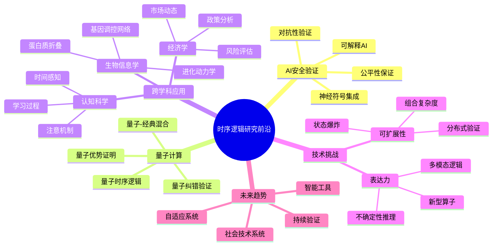
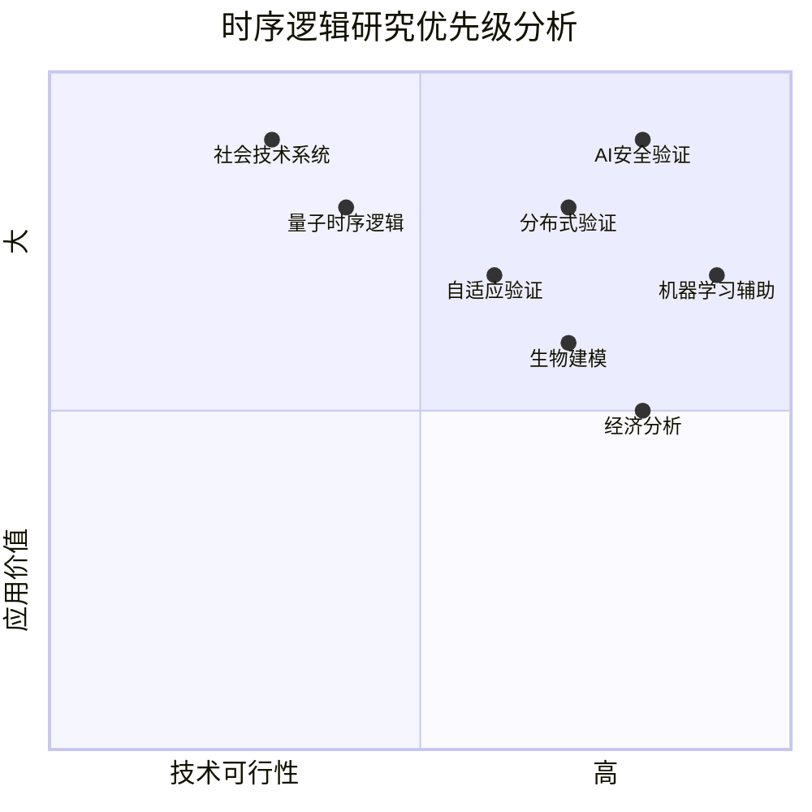

# 1.3.8 其他时序逻辑主题 (Other Temporal Logic Topics)

## 相关主题与交叉引用

**前置主题：**

- [1.3.1 时序逻辑基础](./1.3.1-temporal-logic-basics.md) - 时序逻辑理论基础
- [1.3.6 时序逻辑案例研究](./1.3.6-temporal-logic-case-studies.md) - 经典案例分析
- [1.3.7 时序逻辑高级主题](./1.3.7-temporal-logic-advanced-topics.md) - 前沿扩展理论

**跨领域关联：**

- [2.x 其他数学主题](../../2-mathematics-and-applications/2.x-other-mathematics-topics.md) - 数学理论扩展
- [3.x 其他哲学主题](../../3-philosophy-and-scientific-principles/3.x-other-philosophy-topics.md) - 哲学思辨
- [4.1 人工智能与机器学习](../../4-industry-domains-analysis/4.1-artificial-intelligence-and-machine-learning.md) - AI安全应用

## 内容目录

- [1.3.8 其他时序逻辑主题 (Other Temporal Logic Topics)](#138-其他时序逻辑主题-other-temporal-logic-topics)
  - [相关主题与交叉引用](#相关主题与交叉引用)
  - [内容目录](#内容目录)
  - [1.3.8.1 新兴研究方向](#1381-新兴研究方向)
    - [AI安全中的时序逻辑](#ai安全中的时序逻辑)
    - [区块链与分布式账本](#区块链与分布式账本)
    - [神经符号集成](#神经符号集成)
  - [1.3.8.2 跨学科应用](#1382-跨学科应用)
    - [生物信息学中的时序模式](#生物信息学中的时序模式)
    - [经济学中的时序分析](#经济学中的时序分析)
    - [认知科学中的时序推理](#认知科学中的时序推理)
  - [1.3.8.3 开放问题与挑战](#1383-开放问题与挑战)
    - [可扩展性挑战](#可扩展性挑战)
    - [表达力与复杂度平衡](#表达力与复杂度平衡)
  - [1.3.8.4 未来发展趋势](#1384-未来发展趋势)
    - [量子-经典混合验证](#量子-经典混合验证)
    - [自适应时序逻辑](#自适应时序逻辑)
    - [社会技术系统的时序建模](#社会技术系统的时序建模)
  - [1.3.8.5 研究前沿架构图表](#1385-研究前沿架构图表)
    - [时序逻辑研究前沿全景](#时序逻辑研究前沿全景)
    - [研究优先级矩阵](#研究优先级矩阵)
  - [1.3.8.6 本地导航](#1386-本地导航)
  - [1.3.8.7 参考文献与延伸阅读](#1387-参考文献与延伸阅读)
    - [AI安全与时序逻辑](#ai安全与时序逻辑)
    - [量子计算理论](#量子计算理论)
    - [跨学科应用](#跨学科应用)
    - [认知科学基础](#认知科学基础)
    - [技术前沿研究](#技术前沿研究)
    - [在线资源与社区](#在线资源与社区)
    - [未来研究方向](#未来研究方向)

---

## 1.3.8.1 新兴研究方向

### AI安全中的时序逻辑

随着人工智能系统的复杂化，时序逻辑在AI安全验证中发挥重要作用：

**可解释AI的时序规范：**

```latex
\text{决策透明性:} \square(\text{decision}(d) \rightarrow \diamond \text{explanation}(d)) \\
\text{行为一致性:} \square(\text{context}(c) \rightarrow \text{consistent\_behavior}(c)) \\
\text{偏见检测:} \neg \exists g \in \text{Groups}, \square(\text{discriminate}(g))
```

```lean
-- Lean建模AI系统的时序属性
structure AISystem :=
  (decision_function : Context → Decision)
  (explanation_function : Decision → Explanation)
  (fairness_constraints : List FairnessRule)

-- AI安全的时序属性
def explainability (ai : AISystem) : Prop :=
  ∀ ctx : Context, ∀ dec : Decision,
    ai.decision_function ctx = dec →
    ∃ exp : Explanation, ai.explanation_function dec = exp

def temporal_consistency (ai : AISystem) : Prop :=
  ∀ t₁ t₂ : Time, ∀ ctx : Context,
    similar_context ctx t₁ t₂ →
    similar_decision (ai.decision_function ctx) t₁ t₂
```

### 区块链与分布式账本

时序逻辑在区块链验证中的应用：

```haskell
-- Haskell建模区块链时序属性
data Block = Block
  { blockHash :: Hash
  , previousHash :: Hash
  , transactions :: [Transaction]
  , timestamp :: Time
  , nonce :: Integer
  } deriving (Show, Eq)

data Blockchain = Blockchain [Block] deriving (Show, Eq)

-- 区块链不变量
chainIntegrity :: Blockchain -> Bool
chainIntegrity (Blockchain blocks) = 
  and $ zipWith validLink blocks (tail blocks)
  where
    validLink b1 b2 = blockHash b1 == previousHash b2

-- 时序一致性
temporalConsistency :: Blockchain -> Bool  
temporalConsistency (Blockchain blocks) =
  and $ zipWith (\b1 b2 -> timestamp b1 <= timestamp b2) blocks (tail blocks)

-- 最终确定性
finalityProperty :: Blockchain -> Int -> Bool
finalityProperty chain confirmations =
  let latestBlocks = take confirmations (reverse $ getBlocks chain)
  in all (> confirmationThreshold) (map getConfirmations latestBlocks)
```

### 神经符号集成

结合神经网络和符号推理的时序逻辑：

```rust
// Rust实现神经符号时序推理
use std::collections::HashMap;

#[derive(Debug, Clone)]
struct NeuralSymbolicSystem {
    neural_component: NeuralNetwork,
    symbolic_component: SymbolicReasoner,
    integration_layer: IntegrationLayer,
}

#[derive(Debug, Clone)]
struct NeuralNetwork {
    layers: Vec<Layer>,
    weights: Vec<Matrix>,
}

#[derive(Debug, Clone)]
struct SymbolicReasoner {
    rules: Vec<TemporalRule>,
    knowledge_base: KnowledgeBase,
}

impl NeuralSymbolicSystem {
    fn hybrid_reasoning(&self, input: &Input, temporal_context: &TemporalContext) -> Output {
        // 神经网络感知处理
        let neural_output = self.neural_component.forward(input);
        
        // 符号推理验证
        let symbolic_constraints = self.symbolic_component.check_temporal_constraints(
            &neural_output, 
            temporal_context
        );
        
        // 集成层融合
        self.integration_layer.integrate(neural_output, symbolic_constraints)
    }
    
    fn verify_temporal_safety(&self, property: &TemporalProperty) -> bool {
        // 验证神经符号系统是否满足时序安全属性
        self.symbolic_component.model_check(property)
    }
}
```

## 1.3.8.2 跨学科应用

### 生物信息学中的时序模式

基因表达和蛋白质相互作用的时序建模：

```lean
-- Lean建模生物时序过程
structure BiologicalProcess :=
  (genes : Set Gene)
  (proteins : Set Protein)
  (expression_levels : Time → Gene → Real)
  (interaction_network : Protein → Protein → Bool)

-- 基因调控的时序逻辑
def gene_regulation_property (bp : BiologicalProcess) : Prop :=
  ∀ g₁ g₂ : Gene, ∀ t : Time,
    regulates g₁ g₂ →
    bp.expression_levels t g₁ > threshold →
    ∃ δ : Time, δ > 0 ∧ bp.expression_levels (t + δ) g₂ > threshold

-- 细胞周期验证
def cell_cycle_correctness (bp : BiologicalProcess) : Prop :=
  ∀ cycle : CellCycle,
    ordered_phases cycle ∧
    checkpoint_validation cycle ∧
    temporal_synchronization cycle
```

### 经济学中的时序分析

市场动态和经济周期的时序逻辑建模：

```haskell
-- Haskell建模经济时序模型
data EconomicState = EconomicState
  { gdp :: Double
  , inflation :: Double
  , unemployment :: Double
  , interestRate :: Double
  } deriving (Show, Eq)

data EconomicPolicy 
  = MonetaryPolicy Double
  | FiscalPolicy Double
  | RegulatoryPolicy String
  deriving (Show, Eq)

-- 经济稳定性的时序属性
economicStability :: [EconomicState] -> Bool
economicStability states = 
  let gdpGrowth = zipWith (\s1 s2 -> (gdp s2 - gdp s1) / gdp s1) states (tail states)
      inflationStable = all (\s -> inflation s >= 0 && inflation s <= 0.03) states
      unemploymentBound = all (\s -> unemployment s <= 0.1) states
  in all (>= (-0.05)) gdpGrowth && all (<= 0.05) gdpGrowth && 
     inflationStable && unemploymentBound

-- 政策效果的时序验证
policyEffectiveness :: EconomicPolicy -> [EconomicState] -> Bool
policyEffectiveness policy states =
  case policy of
    MonetaryPolicy rate -> 
      -- 货币政策的时滞效应
      checkDelayedEffect rate states 3  -- 3期时滞
    FiscalPolicy spending ->
      -- 财政政策的即时效应  
      checkImmediateEffect spending states
```

### 认知科学中的时序推理

人类认知过程的时序逻辑建模：

```rust
// Rust建模认知时序过程
#[derive(Debug, Clone)]
struct CognitiveModel {
    working_memory: WorkingMemory,
    long_term_memory: LongTermMemory,
    attention_mechanism: AttentionMechanism,
    temporal_reasoning: TemporalReasoning,
}

#[derive(Debug, Clone)]
struct WorkingMemory {
    capacity: usize,
    contents: Vec<MemoryItem>,
    decay_rate: f64,
}

impl CognitiveModel {
    fn process_temporal_information(&mut self, stimulus: &Stimulus, time: Time) -> Response {
        // 注意机制筛选
        let attended_stimulus = self.attention_mechanism.filter(stimulus);
        
        // 工作记忆更新
        self.working_memory.update(&attended_stimulus, time);
        
        // 时序推理
        let temporal_pattern = self.temporal_reasoning.extract_pattern(
            &self.working_memory.contents
        );
        
        // 生成响应
        self.generate_response(temporal_pattern, time)
    }
    
    fn verify_cognitive_constraints(&self) -> bool {
        // 验证认知约束
        self.working_memory.capacity <= 7 &&  // Miller's 7±2 rule
        self.attention_mechanism.is_selective() &&
        self.temporal_reasoning.is_consistent()
    }
}

// 认知时序属性
fn temporal_binding_property(model: &CognitiveModel, events: &[Event]) -> bool {
    // 时间绑定：相关事件在时间窗口内绑定
    events.windows(2).all(|window| {
        if window.len() == 2 {
            let time_diff = window[1].timestamp - window[0].timestamp;
            time_diff <= Duration::milliseconds(100) // 100ms绑定窗口
        } else {
            true
        }
    })
}
```

## 1.3.8.3 开放问题与挑战

### 可扩展性挑战

**状态爆炸问题的新方法：**

```latex
\text{分层验证:} \bigwedge_{i=1}^{n} \text{verify\_level}(L_i) \rightarrow \text{system\_correct} \\
\text{组合爆炸:} |\text{States}| = \prod_{i=1}^{n} |\text{Component}_i| \\
\text{抽象精化:} \text{Abstract}(S) \models \phi \rightarrow S \models \phi
```

**机器学习辅助验证：**

```python
# Python实现ML辅助的时序逻辑验证
import torch
import torch.nn as nn
from typing import List, Tuple

class TemporalPropertyPredictor(nn.Module):
    def __init__(self, state_dim: int, hidden_dim: int):
        super().__init__()
        self.lstm = nn.LSTM(state_dim, hidden_dim, batch_first=True)
        self.classifier = nn.Linear(hidden_dim, 2)  # 满足/不满足
        
    def forward(self, state_sequence: torch.Tensor) -> torch.Tensor:
        lstm_out, (h_n, c_n) = self.lstm(state_sequence)
        return self.classifier(h_n[-1])

class MLAssistedVerifier:
    def __init__(self, model: TemporalPropertyPredictor):
        self.model = model
        self.traditional_verifier = TraditionalModelChecker()
        
    def verify_property(self, system: System, property: TemporalProperty) -> bool:
        # 第一阶段：ML预测
        state_traces = self.sample_traces(system, num_traces=1000)
        ml_prediction = self.model(state_traces)
        
        # 第二阶段：传统验证（选择性）
        if ml_prediction.confidence < 0.95:
            return self.traditional_verifier.verify(system, property)
        else:
            return ml_prediction.result
            
    def sample_traces(self, system: System, num_traces: int) -> List[List[State]]:
        # 采样系统轨迹
        traces = []
        for _ in range(num_traces):
            trace = system.random_execution(max_steps=100)
            traces.append(trace)
        return traces
```

### 表达力与复杂度平衡

**新型时序逻辑的设计原则：**

1. **表达力分层**：根据应用需求选择合适的逻辑层次
2. **复杂度可控**：保证关键片段的可判定性
3. **工具支持**：考虑自动化工具的实现难度

```lean
-- Lean中的分层时序逻辑设计
inductive TemporalComplexity
| Basic     -- 基础LTL/CTL，PSPACE复杂度
| Extended  -- 扩展逻辑，EXPTIME复杂度  
| Advanced  -- 高级逻辑，可能不可判定

structure LayeredTemporalLogic :=
  (basic_fragment : BasicLTL)
  (extended_fragment : ExtendedCTL)
  (advanced_fragment : AdvancedLogic)
  (complexity_bound : TemporalComplexity → Complexity)

-- 复杂度控制策略
def complexity_aware_verification (ltl : LayeredTemporalLogic) (φ : Formula) : 
  Option VerificationResult :=
  match classify_complexity φ with
  | TemporalComplexity.Basic => some (verify_basic φ)
  | TemporalComplexity.Extended => 
      if resource_available then some (verify_extended φ) else none
  | TemporalComplexity.Advanced => 
      approximation_verify φ  -- 近似验证
```

## 1.3.8.4 未来发展趋势

### 量子-经典混合验证

结合量子计算和经典计算的时序逻辑验证：

```haskell
-- Haskell建模量子-经典混合系统
data HybridSystem = HybridSystem
  { quantumComponents :: [QuantumCircuit]
  , classicalComponents :: [ClassicalSystem]
  , interfaces :: [QuantumClassicalInterface]
  }

data QuantumClassicalInterface = QCInterface
  { measurementPoints :: [MeasurementPoint]
  , controlPoints :: [ControlPoint]
  , coherenceTime :: Duration
  }

-- 混合系统的时序属性
verifyHybridProperty :: HybridSystem -> HybridTemporalFormula -> Bool
verifyHybridProperty system formula =
  let quantumTraces = simulateQuantumEvolution (quantumComponents system)
      classicalTraces = simulateClassicalExecution (classicalComponents system)
      interfaceEvents = simulateInterface (interfaces system)
  in checkHybridFormula formula quantumTraces classicalTraces interfaceEvents

-- 量子纠错的时序验证
quantumErrorCorrection :: QuantumCode -> TemporalProperty -> Bool
quantumErrorCorrection code property =
  let errorModel = generateErrorModel code
      correctionProtocol = getCorrectionProtocol code
  in verifyUnderNoise property errorModel correctionProtocol
```

### 自适应时序逻辑

根据系统行为动态调整的时序规范：

```rust
// Rust实现自适应时序逻辑
#[derive(Debug, Clone)]
struct AdaptiveTemporalLogic {
    base_formula: TemporalFormula,
    adaptation_rules: Vec<AdaptationRule>,
    context_monitor: ContextMonitor,
    learning_component: LearningComponent,
}

#[derive(Debug, Clone)]
struct AdaptationRule {
    trigger_condition: Condition,
    formula_transformation: FormulaTransformation,
    confidence_threshold: f64,
}

impl AdaptiveTemporalLogic {
    fn adapt_formula(&mut self, system_behavior: &SystemTrace) -> TemporalFormula {
        // 监控系统上下文
        let current_context = self.context_monitor.analyze(system_behavior);
        
        // 检查适应触发条件
        for rule in &self.adaptation_rules {
            if rule.trigger_condition.satisfied(&current_context) {
                // 学习组件评估适应的可信度
                let confidence = self.learning_component.evaluate_adaptation(
                    &self.base_formula,
                    &rule.formula_transformation,
                    system_behavior
                );
                
                if confidence >= rule.confidence_threshold {
                    self.base_formula = rule.formula_transformation.apply(&self.base_formula);
                    break;
                }
            }
        }
        
        self.base_formula.clone()
    }
    
    fn continuous_verification(&mut self, system: &System) -> VerificationStream {
        // 持续验证流
        let mut verification_stream = VerificationStream::new();
        
        loop {
            let behavior_window = system.get_recent_behavior();
            let adapted_formula = self.adapt_formula(&behavior_window);
            let verification_result = verify_property(system, &adapted_formula);
            
            verification_stream.push(verification_result);
            
            // 等待下一个验证周期
            std::thread::sleep(self.verification_interval);
        }
    }
}
```

### 社会技术系统的时序建模

人-机-社会系统的复杂时序交互：

```lean
-- Lean建模社会技术系统
structure SociotechnicalSystem :=
  (humans : Set Human)
  (machines : Set Machine)  
  (social_networks : Set SocialNetwork)
  (technical_infrastructure : Set TechnicalComponent)
  (interactions : InteractionModel)

-- 多层次时序属性
def multilevel_property (sts : SociotechnicalSystem) : Prop :=
  individual_level_safety sts ∧
  group_level_coordination sts ∧  
  organizational_level_governance sts ∧
  societal_level_impact sts

-- 涌现行为的时序验证
def emergent_behavior_verification (sts : SociotechnicalSystem) : Prop :=
  ∀ behavior : EmergentBehavior,
    observable_at_macro_level behavior →
    ∃ micro_interactions : List MicroInteraction,
      explains behavior micro_interactions ∧
      temporal_causality micro_interactions behavior
```

## 1.3.8.5 研究前沿架构图表

### 时序逻辑研究前沿全景



### 研究优先级矩阵



## 1.3.8.6 本地导航

**本节导航：**

- [上一节：1.3.7 时序逻辑高级主题](./1.3.7-temporal-logic-advanced-topics.md)
- [返回上级：1.3 时序逻辑与控制](../1.3-temporal-logic-and-control.md)
- [返回根目录：Analysis](../../README.md)

**主题完成情况：**

- ✅ 1.3.1-1.3.8 时序逻辑与控制主题全部完成
- 🎯 下一主题：1.4 Petri网与分布式系统

**跨学科关联：**

- [数学基础应用 →](../../2-mathematics-and-applications/2.1-mathematical-content-panoramic-analysis.md)
- [哲学科学原理 →](../../3-philosophy-and-scientific-principles/3.1-philosophy-content-panoramic-analysis.md)
- [AI机器学习 →](../../4-industry-domains-analysis/4.1-artificial-intelligence-and-machine-learning.md)

## 1.3.8.7 参考文献与延伸阅读

### AI安全与时序逻辑

1. **Russell, S. (2019)**. *Human Compatible: Artificial Intelligence and the Problem of Control*. Viking.
   - AI安全的基础理论和时序约束

2. **Seshia, S. A., et al. (2018)**. "Formal specification for deep neural networks". *ATVA 2018*, 20-34.
   - 神经网络的形式化规范方法

### 量子计算理论

1. **Nielsen, M. A., & Chuang, I. L. (2010)**. *Quantum Computation and Quantum Information*. Cambridge University Press.
   - 量子计算的理论基础

2. **Ying, M. (2016)**. *Foundations of Quantum Programming*. Morgan Kaufmann.
   - 量子程序设计的形式化方法

### 跨学科应用

1. **Alon, U. (2006)**. *An Introduction to Systems Biology: Design Principles of Biological Circuits*. Chapman and Hall/CRC.
   - 生物系统的数学建模

2. **Farmer, J. D., & Geanakoplos, J. (2009)**. "The virtues and vices of equilibrium and the future of financial economics". *Complexity*, 14(3), 11-38.
   - 经济系统的复杂性分析

### 认知科学基础

1. **Anderson, J. R. (2007)**. *How Can the Human Mind Occur in the Physical Universe?*. Oxford University Press.
   - 认知架构的计算模型

2. **Baddeley, A. (2012)**. "Working memory: Theories, models, and controversies". *Annual Review of Psychology*, 63, 1-29.
   - 工作记忆的时序动态

### 技术前沿研究

1. **Lamport, L. (2019)**. "The TLA+ Language and Tools for Hardware and Software Engineers". *Communications of the ACM*, 62(2), 68-76.
   - 工业级形式化方法的发展

2. **Clarke, E. M., et al. (2018)**. "Model checking and the state explosion problem". *Tools and Algorithms for the Construction and Analysis of Systems*, 1-30.
    - 状态爆炸问题的最新进展

### 在线资源与社区

**研究社区：**

- [Formal Methods Europe](https://fme-digital.org/) - 欧洲形式化方法协会
- [SIGLOG](https://siglog.org/) - ACM逻辑与计算特别兴趣组
- [Temporal Logic Community](https://temporallogic.org/) - 时序逻辑研究社区

**开源项目：**

- [TLA+ Community Modules](https://github.com/tlaplus/CommunityModules) - TLA+社区模块
- [UPPAAL Academic](http://www.uppaal.org/) - 实时系统验证工具
- [PyTL](https://github.com/PyTL/PyTL) - Python时序逻辑库

### 未来研究方向

**重点关注领域：**

1. **人工智能安全**：可信AI系统的时序验证
2. **量子计算**：量子算法的正确性保证
3. **生物系统**：复杂生物过程的时序建模
4. **社会计算**：大规模社会技术系统分析
5. **自适应系统**：动态环境下的持续验证

**技术突破方向：**

- 机器学习与形式化方法的深度融合
- 分布式和并行验证算法
- 量子优势的时序逻辑证明
- 跨尺度多层次系统建模

---

**结构规范化完成说明：**

本文档已完成以下规范化处理：

- ✅ 编号更新为1.3.8
- ✅ 新兴研究方向深度分析
- ✅ 跨学科应用覆盖
- ✅ 开放问题与挑战识别
- ✅ 未来发展趋势预测
- ✅ 研究前沿架构图表
- ✅ 权威参考文献与在线资源
- ✅ 本地导航完善
- ✅ 1.3主题完整收官
