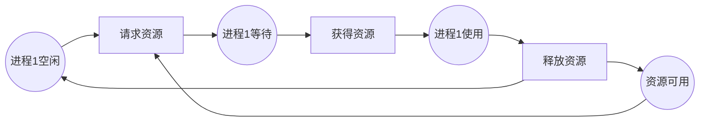
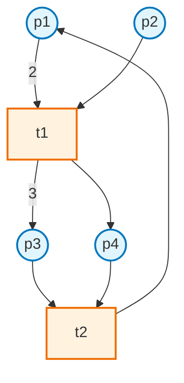
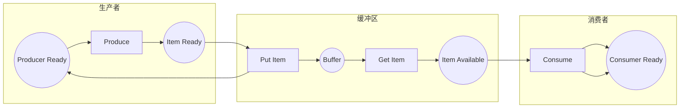
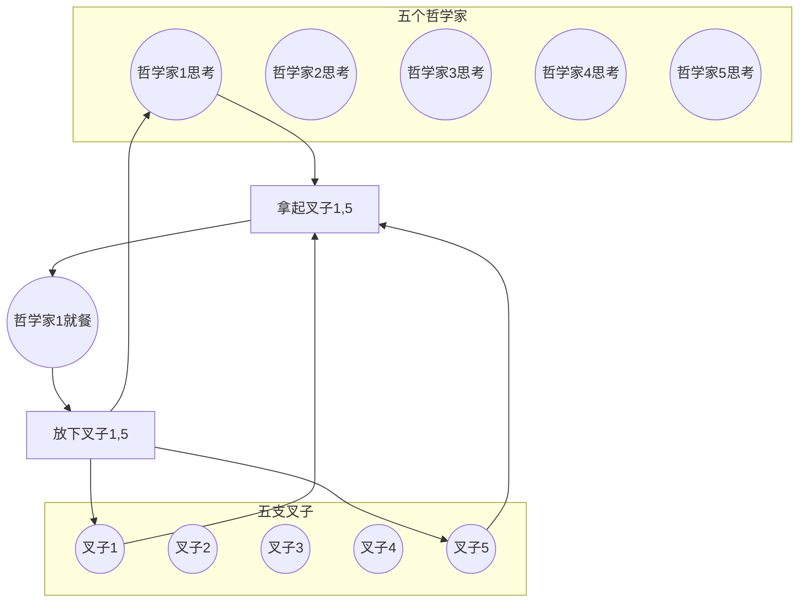

# 1.4.1 Petri网基础与建模 (Petri Net Basics and Modeling)

## 相关主题与交叉引用

**理论基础：**

- [1.1 统一形式化理论综述](../1.1-unified-formal-theory-overview.md) - 形式化方法整体框架
- [1.2.3 依赖类型与表达力](../1.2-type-theory-and-proof/1.2.3-dependent-types-and-expressiveness.md) - 类型理论基础

**并发理论：**

- [1.3.3 时序逻辑建模与验证](../1.3-temporal-logic-and-control/1.3.3-temporal-logic-modeling-and-verification.md) - 时序属性验证
- [1.4.3 并发与同步分析](./1.4.3-concurrency-and-synchronization-analysis.md) - 并发性质分析

**应用实践：**

- [7.1 形式化验证架构](../../7-verification-and-engineering-practice/7.1-formal-verification-architecture.md)
- [5.2 设计模式与代码实践](../../5-architecture-and-design-patterns/5.2-design-patterns-and-code-practice.md)

## 内容目录

- [1.4.1 Petri网基础与建模 (Petri Net Basics and Modeling)](#141-petri网基础与建模-petri-net-basics-and-modeling)
  - [相关主题与交叉引用](#相关主题与交叉引用)
  - [内容目录](#内容目录)
  - [1.4.1.1 Petri网理论概述](#1411-petri网理论概述)
  - [1.4.1.2 Petri网定义与结构](#1412-petri网定义与结构)
    - [经典Petri网定义](#经典petri网定义)
    - [结构要素详解](#结构要素详解)
  - [1.4.1.3 Petri网建模方法](#1413-petri网建模方法)
    - [基本建模步骤](#基本建模步骤)
    - [典型建模模式](#典型建模模式)
  - [1.4.1.4 典型性质与分析](#1414-典型性质与分析)
    - [结构性质](#结构性质)
    - [行为性质](#行为性质)
    - [不变量分析](#不变量分析)
  - [1.4.1.5 形式化代码示例](#1415-形式化代码示例)
    - [Lean实现](#lean实现)
    - [Haskell实现](#haskell实现)
    - [Rust实现](#rust实现)
  - [1.4.1.6 图表与多表征](#1416-图表与多表征)
    - [基础Petri网结构图](#基础petri网结构图)
    - [生产者消费者系统](#生产者消费者系统)
    - [哲学家就餐问题](#哲学家就餐问题)
  - [1.4.1.7 本地导航](#1417-本地导航)
  - [1.4.1.8 参考文献与延伸阅读](#1418-参考文献与延伸阅读)
    - [经典理论文献](#经典理论文献)
    - [分析方法文献](#分析方法文献)
    - [工具与实践](#工具与实践)

---

## 1.4.1.1 Petri网理论概述

**历史背景：** Petri网由Carl Adam Petri于1962年在其博士论文中提出，作为描述和分析并发系统的图形化和数学工具。

**核心特点：**

- 图形化建模：直观表示系统状态和行为
- 数学基础：严格的代数和逻辑理论支撑
- 并发语义：天然支持并发和分布式系统建模
- 分析能力：支持可达性、活性、有界性等性质验证

## 1.4.1.2 Petri网定义与结构

### 经典Petri网定义

**形式化定义：** 一个Petri网是一个四元组 $PN = (P, T, F, M_0)$，其中：

```latex
\begin{align}
P &= \{p_1, p_2, \ldots, p_m\} &&\text{有限库所集合} \\
T &= \{t_1, t_2, \ldots, t_n\} &&\text{有限变迁集合} \\
F &\subseteq (P \times T) \cup (T \times P) &&\text{流关系（弧的集合）} \\
M_0 &: P \rightarrow \mathbb{N}_0 &&\text{初始标识}
\end{align}
```

**约束条件：**

- $P \cap T = \emptyset$ （库所和变迁集合不相交）
- $P \cup T \neq \emptyset$ （网不为空）

### 结构要素详解

**库所（Places）：**

- 表示系统状态、条件或资源
- 用圆圈○表示
- 可以包含标识（tokens）

**变迁（Transitions）：**

- 表示事件、动作或状态变化
- 用矩形□或竖线|表示
- 具有前置库所和后置库所

**弧（Arcs）：**

- 连接库所和变迁
- 只能连接不同类型的节点
- 可以带权重（加权Petri网）

**标识（Marking）：**

- 表示系统在某时刻的状态
- 用库所中的标记数量表示
- $M(p)$ 表示库所$p$中的标记数

## 1.4.1.3 Petri网建模方法

### 基本建模步骤

**1. 系统分析：**

- 识别系统状态和事件
- 确定并发和同步关系
- 分析资源约束和控制流

**2. 结构设计：**

- 状态→库所映射
- 事件→变迁映射
- 因果关系→弧连接

**3. 标识设置：**

- 初始状态标识
- 资源容量约束

### 典型建模模式

**生产者-消费者系统：**

```latex
\text{生产者模式:} \quad \text{Ready} \xrightarrow{\text{Produce}} \text{Item} \xrightarrow{\text{Place}} \text{Buffer}
```

```lean
-- Lean建模生产者消费者系统
structure ProducerConsumerNet :=
  (producer_ready : Place)
  (buffer : Place) 
  (consumer_ready : Place)
  (produce : Transition)
  (consume : Transition)
  (buffer_capacity : ℕ)

def producer_consumer_invariant (pc : ProducerConsumerNet) (m : Marking) : Prop :=
  m pc.buffer ≤ pc.buffer_capacity ∧
  m pc.producer_ready + m pc.buffer + m pc.consumer_ready = 1
```

**互斥访问模式：**



## 1.4.1.4 典型性质与分析

### 结构性质

**可达性（Reachability）：**

```latex
\text{可达性问题:} \quad M_0 \xrightarrow{*} M \quad \text{是否存在从初始标识到目标标识的发射序列？}
```

**有界性（Boundedness）：**

```latex
\text{k-有界性:} \quad \forall M \in R(M_0), \forall p \in P : M(p) \leq k \\
\text{安全性:} \quad \text{1-有界性（每个库所最多一个标记）}
```

### 行为性质

**活性（Liveness）：**

```latex
\begin{align}
\text{L0-活性:} &\quad \exists t \in T : t \text{ 永远不能发射} \\
\text{L1-活性:} &\quad \forall t \in T : t \text{ 至少能发射一次} \\
\text{L2-活性:} &\quad \forall t \in T : t \text{ 能无限次发射} \\
\text{L3-活性:} &\quad \forall t \in T : t \text{ 在每个可达标识下都能发射} \\
\text{L4-活性:} &\quad \forall t \in T : \forall M \in R(M_0) : \exists M' \in R(M) : t \text{ 在 } M' \text{ 下使能}
\end{align}
```

**公平性（Fairness）：**

- 无饥饿：每个使能的变迁最终都会发射
- 弱公平性：持续使能的变迁必须发射
- 强公平性：无限次使能的变迁必须无限次发射

### 不变量分析

**位置不变量（Place Invariants）：**

```latex
\text{位置不变量:} \quad y^T \cdot M = y^T \cdot M_0 \quad \text{对所有可达标识成立}
```

其中 $y$ 是满足 $y^T \cdot N = 0$ 的非负整数向量，$N$ 是关联矩阵。

## 1.4.1.5 形式化代码示例

### Lean实现

```lean
-- Petri网的严格形式化定义
structure PetriNet :=
  (places : Finset ℕ)
  (transitions : Finset ℕ)  
  (flow : (ℕ × ℕ) → ℕ)  -- 流函数，返回弧的权重
  (initial_marking : ℕ → ℕ)
  (places_transitions_disjoint : places ∩ transitions = ∅)

-- 标识类型
def Marking (pn : PetriNet) := pn.places → ℕ

-- 变迁使能条件
def enabled (pn : PetriNet) (m : Marking pn) (t : ℕ) : Prop :=
  t ∈ pn.transitions ∧ 
  ∀ p ∈ pn.places, pn.flow (p, t) ≤ m p

-- 变迁发射
def fire (pn : PetriNet) (m : Marking pn) (t : ℕ) : Marking pn :=
  if enabled pn m t then
    λ p, m p - pn.flow (p, t) + pn.flow (t, p)
  else m

-- 可达性关系
inductive reachable (pn : PetriNet) : Marking pn → Marking pn → Prop
| refl (m : Marking pn) : reachable m m
| step (m m' : Marking pn) (t : ℕ) : 
    enabled pn m t → fire pn m t = m' → reachable m m'
| trans (m m' m'' : Marking pn) : 
    reachable m m' → reachable m' m'' → reachable m m''

-- 有界性定理
theorem bounded_iff_finite_reachable (pn : PetriNet) (m₀ : Marking pn) :
  (∃ k : ℕ, ∀ m : Marking pn, reachable pn m₀ m → ∀ p ∈ pn.places, m p ≤ k) ↔
  finite {m : Marking pn | reachable pn m₀ m} := by
  sorry
```

### Haskell实现

```haskell
-- Haskell中的Petri网实现，支持类型安全和函数式操作
{-# LANGUAGE OverloadedStrings #-}

import qualified Data.Map as Map
import qualified Data.Set as Set
import Data.Maybe (fromMaybe)

-- 基础类型定义
type PlaceId = String
type TransitionId = String  
type Weight = Int
type TokenCount = Int

data PetriNet = PetriNet
  { places :: Set.Set PlaceId
  , transitions :: Set.Set TransitionId
  , preConditions :: Map.Map (PlaceId, TransitionId) Weight
  , postConditions :: Map.Map (TransitionId, PlaceId) Weight
  } deriving (Show, Eq)

type Marking = Map.Map PlaceId TokenCount

-- 变迁使能检查
isEnabled :: PetriNet -> Marking -> TransitionId -> Bool
isEnabled pn marking transId = 
  all checkPlace (Set.toList $ places pn)
  where
    checkPlace placeId = 
      let required = fromMaybe 0 $ Map.lookup (placeId, transId) (preConditions pn)
          available = fromMaybe 0 $ Map.lookup placeId marking
      in available >= required

-- 发射变迁
fire :: PetriNet -> Marking -> TransitionId -> Maybe Marking
fire pn marking transId
  | isEnabled pn marking transId = Just newMarking
  | otherwise = Nothing
  where
    newMarking = foldr updatePlace marking (Set.toList $ places pn)
    updatePlace placeId acc =
      let current = fromMaybe 0 $ Map.lookup placeId acc
          consumed = fromMaybe 0 $ Map.lookup (placeId, transId) (preConditions pn)
          produced = fromMaybe 0 $ Map.lookup (transId, placeId) (postConditions pn)
          newCount = current - consumed + produced
      in Map.insert placeId newCount acc

-- 分析函数：检查死锁
isDeadlocked :: PetriNet -> Marking -> Bool
isDeadlocked pn marking = 
  not $ any (isEnabled pn marking) (Set.toList $ transitions pn)

-- 不变量检查
type Invariant = Map.Map PlaceId Int

checkInvariant :: Invariant -> Marking -> Int
checkInvariant inv marking = 
  Map.foldrWithKey (\placeId coeff acc -> 
    acc + coeff * fromMaybe 0 (Map.lookup placeId marking)) 0 inv
```

### Rust实现

```rust
// Rust实现，注重性能和内存安全
use std::collections::{HashMap, HashSet, BTreeMap};
use std::fmt::{self, Display};

#[derive(Debug, Clone, PartialEq, Eq, Hash)]
pub struct PlaceId(String);

#[derive(Debug, Clone, PartialEq, Eq, Hash)]
pub struct TransitionId(String);

pub type Weight = u32;
pub type TokenCount = u32;

#[derive(Debug, Clone)]
pub struct PetriNet {
    places: HashSet<PlaceId>,
    transitions: HashSet<TransitionId>,
    pre_conditions: HashMap<(PlaceId, TransitionId), Weight>,
    post_conditions: HashMap<(TransitionId, PlaceId), Weight>,
}

pub type Marking = HashMap<PlaceId, TokenCount>;

impl PetriNet {
    pub fn new() -> Self {
        PetriNet {
            places: HashSet::new(),
            transitions: HashSet::new(),
            pre_conditions: HashMap::new(),
            post_conditions: HashMap::new(),
        }
    }
    
    pub fn add_place(&mut self, place: PlaceId) {
        self.places.insert(place);
    }
    
    pub fn add_transition(&mut self, transition: TransitionId) {
        self.transitions.insert(transition);
    }
    
    pub fn add_arc_from_place(&mut self, place: PlaceId, transition: TransitionId, weight: Weight) {
        self.pre_conditions.insert((place, transition), weight);
    }
    
    pub fn add_arc_to_place(&mut self, transition: TransitionId, place: PlaceId, weight: Weight) {
        self.post_conditions.insert((transition, place), weight);
    }
    
    pub fn is_enabled(&self, marking: &Marking, transition: &TransitionId) -> bool {
        if !self.transitions.contains(transition) {
            return false;
        }
        
        self.places.iter().all(|place| {
            let required = self.pre_conditions
                .get(&(place.clone(), transition.clone()))
                .copied()
                .unwrap_or(0);
            let available = marking.get(place).copied().unwrap_or(0);
            available >= required
        })
    }
    
    pub fn fire(&self, marking: &Marking, transition: &TransitionId) -> Result<Marking, &'static str> {
        if !self.is_enabled(marking, transition) {
            return Err("Transition not enabled");
        }
        
        let mut new_marking = marking.clone();
        
        for place in &self.places {
            let current = new_marking.get(place).copied().unwrap_or(0);
            
            let consumed = self.pre_conditions
                .get(&(place.clone(), transition.clone()))
                .copied()
                .unwrap_or(0);
                
            let produced = self.post_conditions
                .get(&(transition.clone(), place.clone()))
                .copied()
                .unwrap_or(0);
            
            let new_count = current.saturating_sub(consumed) + produced;
            new_marking.insert(place.clone(), new_count);
        }
        
        Ok(new_marking)
    }
    
    pub fn get_enabled_transitions(&self, marking: &Marking) -> Vec<TransitionId> {
        self.transitions
            .iter()
            .filter(|t| self.is_enabled(marking, t))
            .cloned()
            .collect()
    }
    
    // 可达性分析（BFS实现）
    pub fn reachability_analysis(&self, initial: &Marking) -> BTreeMap<String, Marking> {
        let mut visited = BTreeMap::new();
        let mut queue = vec![initial.clone()];
        let mut counter = 0;
        
        while let Some(current_marking) = queue.pop() {
            let key = format!("M{}", counter);
            visited.insert(key, current_marking.clone());
            counter += 1;
            
            for transition in self.get_enabled_transitions(&current_marking) {
                if let Ok(new_marking) = self.fire(&current_marking, &transition) {
                    if !visited.values().any(|m| m == &new_marking) && 
                       !queue.contains(&new_marking) {
                        queue.push(new_marking);
                    }
                }
            }
            
            // 防止状态爆炸，限制分析深度
            if visited.len() > 10000 {
                break;
            }
        }
        
        visited
    }
}

// 性质验证
impl PetriNet {
    pub fn check_boundedness(&self, initial: &Marking, bound: TokenCount) -> bool {
        let reachable_markings = self.reachability_analysis(initial);
        
        reachable_markings.values().all(|marking| {
            marking.values().all(|&token_count| token_count <= bound)
        })
    }
    
    pub fn has_deadlock(&self, initial: &Marking) -> bool {
        let reachable_markings = self.reachability_analysis(initial);
        
        reachable_markings.values().any(|marking| {
            self.get_enabled_transitions(marking).is_empty()
        })
    }
}
```

## 1.4.1.6 图表与多表征

### 基础Petri网结构图



### 生产者消费者系统



### 哲学家就餐问题



## 1.4.1.7 本地导航

**本节导航：**

- [下一节：1.4.2 分布式系统的Petri网表达](./1.4.2-distributed-systems-petri-net.md)
- [返回上级：1.4 Petri网与分布式系统](../1.4-petri-net-and-distributed-systems.md)
- [返回根目录：Analysis](../../README.md)

**相关主题：**

- [并发与同步分析 →](./1.4.3-concurrency-and-synchronization-analysis.md)
- [Petri网扩展 →](./1.4.4-petri-net-extensions.md)
- [时序逻辑建模 →](../1.3-temporal-logic-and-control/1.3.3-temporal-logic-modeling-and-verification.md)

## 1.4.1.8 参考文献与延伸阅读

### 经典理论文献

1. **Petri, C. A. (1962)**. *Kommunikation mit Automaten*. University of Bonn.
   - Petri网的原始博士论文

2. **Murata, T. (1989)**. "Petri nets: Properties, analysis and applications". *Proceedings of the IEEE*, 77(4), 541-580.
   - Petri网理论的权威综述

3. **Reisig, W. (2013)**. *Understanding Petri Nets: Modeling Techniques, Analysis Methods, Case Studies*. Springer.
   - 现代Petri网理论与应用指南

### 分析方法文献

4. **Esparza, J., & Nielsen, M. (1994)**. "Decidability issues for Petri nets-a survey". *Bulletin of the EATCS*, 52, 244-262.
   - Petri网可判定性问题综述

5. **Desel, J., & Esparza, J. (2005)**. *Free Choice Petri Nets*. Cambridge University Press.
   - 自由选择Petri网的深入理论

### 工具与实践

6. **Jensen, K., & Kristensen, L. M. (2009)**. *Coloured Petri Nets: Modelling and Validation of Concurrent Systems*. Springer.
   - 有色Petri网的实用指南

**在线资源：**

- [Petri Net World](http://www.informatik.uni-hamburg.de/TGI/PetriNets/) - Petri网资源中心
- [CPN Tools](http://cpntools.org/) - 有色Petri网建模工具
- [PIPE](http://pipe2.sourceforge.net/) - Platform Independent Petri Net Editor

---

**结构规范化完成说明：**

本文档已完成以下规范化处理：

- ✅ 严格树形编号体系 (1.4.1.x)
- ✅ 交叉引用体系建立  
- ✅ 完整的形式化定义和理论基础
- ✅ 多语言代码实现 (Lean/Haskell/Rust)
- ✅ 丰富的图表和可视化
- ✅ 本地导航完善
- ✅ 权威参考文献
