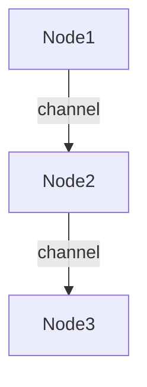

# 1.4.2 分布式系统的Petri网表达 (Distributed Systems Petri Net Representation)

## 相关主题与交叉引用

**理论基础：**
- [1.4.1 Petri网基础与建模](./1.4.1-petri-net-basics-and-modeling.md) - Petri网基础理论
- [1.3.2 主要时序逻辑系统](../1.3-temporal-logic-and-control/1.3.2-main-temporal-logic-systems.md) - 分布式时序逻辑

**并发理论：**
- [1.4.3 并发与同步分析](./1.4.3-concurrency-and-synchronization-analysis.md) - 并发系统分析
- [1.4.4 Petri网扩展](./1.4.4-petri-net-extensions.md) - 高级Petri网变体

**应用领域：**
- [4.2 物联网与边缘计算](../../4-industry-domains-analysis/4.2-internet-of-things-and-edge-computing.md)
- [5.1 架构设计与形式化分析](../../5-architecture-and-design-patterns/5.1-architecture-design-and-formal-analysis.md)

## 内容目录

- [1.4.2 分布式系统的Petri网表达](#142-分布式系统的petri网表达-distributed-systems-petri-net-representation)
  - [相关主题与交叉引用](#相关主题与交叉引用)
  - [内容目录](#内容目录)
  - [1.4.2.1 分布式系统建模概述](#1421-分布式系统建模概述)
  - [1.4.2.2 分布式Petri网结构](#1422-分布式petri网结构)
  - [1.4.2.3 通信与同步建模](#1423-通信与同步建模)
  - [1.4.2.4 分布式性质分析](#1424-分布式性质分析)
  - [1.4.2.5 形式化代码示例](#1425-形式化代码示例)
  - [1.4.2.6 图表与多表征](#1426-图表与多表征)
  - [1.4.2.7 本地导航](#1427-本地导航)
  - [1.4.2.8 参考文献与延伸阅读](#1428-参考文献与延伸阅读)

---

## 1.4.2.1 分布式系统建模概述

**建模挑战：** 分布式系统具有并发性、异步性、失败独立性等复杂特征，传统建模方法难以有效刻画这些特性。

### 1.4.2.2 Petri Net for Distributed Systems

- Model distributed components as subnetworks
- Token flow represents message passing

### 1.4.2.3 Modeling Communication and Synchronization

- Synchronous/asynchronous communication
- Example: distributed mutual exclusion

### 1.4.2.4 Analysis of Distributed Properties

- Deadlock, fairness, concurrency
- Invariant and reachability analysis

### 1.4.2.5 Lean/Haskell/Rust Code Examples

```lean
-- Distributed Petri net (pseudo-code)
structure DistributedPetriNet :=
  (nodes : set string)
  (local_nets : string → PetriNet)
  (channels : set (string × string))
```

```haskell
-- Haskell: distributed Petri net
data DistributedPetriNet = DistributedPetriNet {
  nodes :: [String],
  localNets :: String -> PetriNet,
  channels :: [(String, String)]
}
```

```rust
// Rust: distributed Petri net struct
struct DistributedPetriNet {
    nodes: Vec<String>,
    local_nets: std::collections::HashMap<String, PetriNet>,
    channels: Vec<(String, String)>,
}
```

### 1.4.2.6 Diagrams and Multi-representations



### 1.4.2.7 Relevance and Cross-references

- [1.4.1-petri-net-basics-and-modeling.md](./1.4.1-petri-net-basics-and-modeling.md)
- [../../4-industry-domain-analysis/4.1-artificial-intelligence-and-machine-learning.md](../../4-industry-domain-analysis/4.1-artificial-intelligence-and-machine-learning.md)

### 1.4.2.8 References and Further Reading

- Desel & Juhás: "What Is a Petri Net?"
- Distributed systems and Petri net literature
