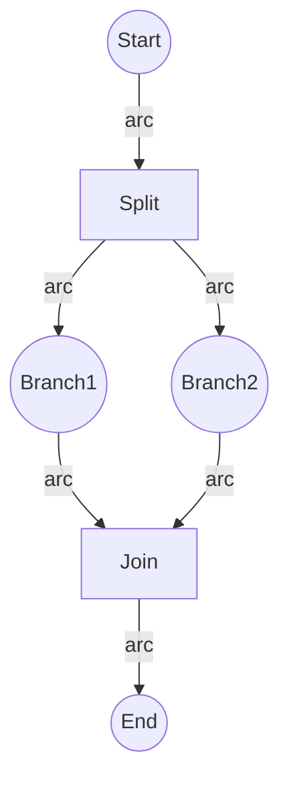

# 1.4.3 Concurrency and Synchronization Analysis

## 目录

1.4.3.1 Topic Overview  
1.4.3.2 Concurrency Modeling with Petri Nets  
1.4.3.3 Synchronization Mechanisms  
1.4.3.4 Analysis of Concurrency Properties  
1.4.3.5 Lean/Haskell/Rust Code Examples  
1.4.3.6 Diagrams and Multi-representations  
1.4.3.7 Relevance and Cross-references  
1.4.3.8 References and Further Reading  

---

### 1.4.3.1 Topic Overview

This section introduces how Petri nets are used to model and analyze concurrency and synchronization in systems.

### 1.4.3.2 Concurrency Modeling with Petri Nets

- Parallel transitions, independent token flow
- Example: fork-join structure

### 1.4.3.3 Synchronization Mechanisms

- Mutual exclusion, rendezvous, barrier synchronization
- Petri net patterns for synchronization

### 1.4.3.4 Analysis of Concurrency Properties

- Deadlock detection, liveness, fairness
- Invariant and reachability analysis

### 1.4.3.5 Lean/Haskell/Rust Code Examples

```lean
-- Fork-join Petri net (pseudo-code)
structure ForkJoinNet :=
  (places : set string)
  (transitions : set string)
  (arcs : set (string × string))
  (marking : string → ℕ)
```

```haskell
-- Haskell: fork-join Petri net
data ForkJoinNet = ForkJoinNet {
  places :: [String],
  transitions :: [String],
  arcs :: [(String, String)],
  marking :: String -> Int
}
```

```rust
// Rust: fork-join Petri net struct
struct ForkJoinNet {
    places: Vec<String>,
    transitions: Vec<String>,
    arcs: Vec<(String, String)>,
    marking: std::collections::HashMap<String, usize>,
}
```

### 1.4.3.6 Diagrams and Multi-representations



### 1.4.3.7 Relevance and Cross-references

- [1.4.1-petri-net-basics-and-modeling.md](./1.4.1-petri-net-basics-and-modeling.md)
- [1.4.2-distributed-systems-petri-net.md](./1.4.2-distributed-systems-petri-net.md)
- [../../5-architecture-and-design-patterns/5.2-design-patterns-and-code-practice.md](../../5-architecture-and-design-patterns/5.2-design-patterns-and-code-practice.md)

### 1.4.3.8 References and Further Reading

- Peterson: "Petri Net Theory and the Modeling of Systems"
- Workflow and concurrency literature
