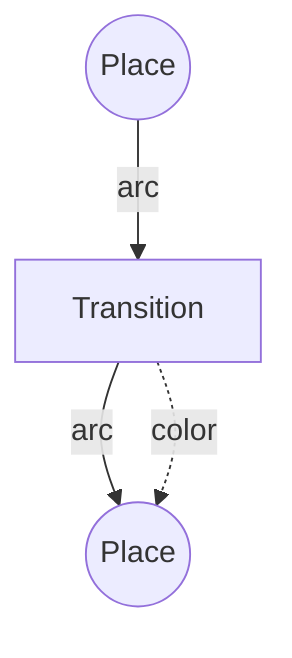

# 1.4.4 Petri Net Extensions

## 目录

- [1.4.4 Petri Net Extensions](#144-petri-net-extensions)
  - [目录](#目录)
    - [1.4.4.1 Topic Overview](#1441-topic-overview)
    - [1.4.4.2 Colored Petri Nets](#1442-colored-petri-nets)
    - [1.4.4.3 Timed Petri Nets](#1443-timed-petri-nets)
    - [1.4.4.4 Stochastic Petri Nets](#1444-stochastic-petri-nets)
    - [1.4.4.5 Lean/Haskell/Rust Code Examples](#1445-leanhaskellrust-code-examples)
    - [1.4.4.6 Diagrams and Multi-representations](#1446-diagrams-and-multi-representations)
    - [1.4.4.7 Relevance and Cross-references](#1447-relevance-and-cross-references)
    - [1.4.4.8 References and Further Reading](#1448-references-and-further-reading)

---

### 1.4.4.1 Topic Overview

This section introduces major extensions of Petri nets for advanced modeling.

### 1.4.4.2 Colored Petri Nets

- Tokens carry data values (colors)
- Example: parameterized process modeling

### 1.4.4.3 Timed Petri Nets

- Tokens/transitions with time stamps
- Modeling real-time systems

### 1.4.4.4 Stochastic Petri Nets

- Probabilistic firing of transitions
- Performance and reliability analysis

### 1.4.4.5 Lean/Haskell/Rust Code Examples

```lean
-- Colored Petri net (pseudo-code)
structure ColoredPetriNet :=
  (places : set string)
  (transitions : set string)
  (arcs : set (string × string))
  (colors : set string)
  (marking : string → multiset string)
```

```haskell
-- Haskell: colored Petri net
data ColoredPetriNet = ColoredPetriNet {
  places :: [String],
  transitions :: [String],
  arcs :: [(String, String)],
  colors :: [String],
  marking :: String -> [String]
}
```

```rust
// Rust: colored Petri net struct
struct ColoredPetriNet {
    places: Vec<String>,
    transitions: Vec<String>,
    arcs: Vec<(String, String)>,
    colors: Vec<String>,
    marking: std::collections::HashMap<String, Vec<String>>,
}
```

### 1.4.4.6 Diagrams and Multi-representations



### 1.4.4.7 Relevance and Cross-references

- [1.4.1-petri-net-basics-and-modeling.md](./1.4.1-petri-net-basics-and-modeling.md)
- [1.4.3-concurrency-and-synchronization-analysis.md](./1.4.3-concurrency-and-synchronization-analysis.md)

### 1.4.4.8 References and Further Reading

- Jensen: "Coloured Petri Nets"
- Timed and stochastic Petri net literature
