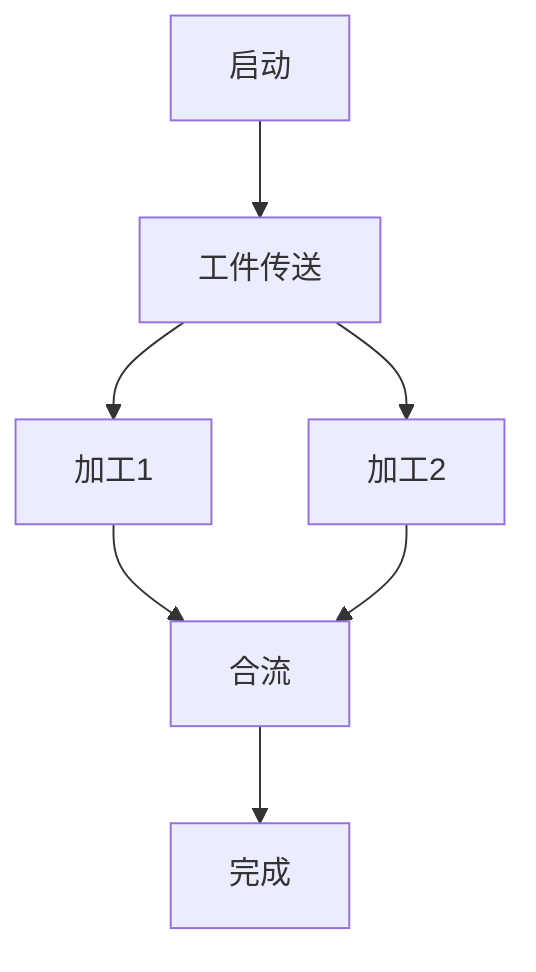
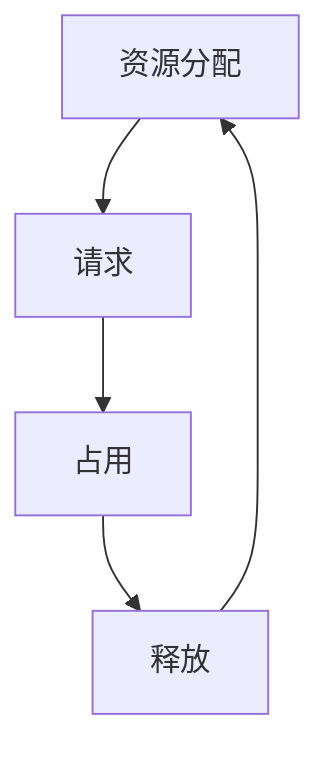

# 1.4.5 典型工程案例 Typical Engineering Cases

[返回上级目录](./1.4-petri-net-and-distributed-systems.md)

## 1.4.5.1 主题概览 Overview

- Petri网在分布式系统、并发控制、工业自动化等领域的典型工程案例。

## 1.4.5.2 典型案例详解 Case Studies

### 1.4.5.2.1 工业自动化中的Petri网建模

- 案例描述：某自动化生产线的并发与同步建模。
- Petri网结构Mermaid图：

- 表格：关键状态与事件对照

| 状态/事件 | 描述           |
|-----------|----------------|
| 启动      | 系统初始化     |
| 工件传送  | 工件进入流水线 |
| 加工1     | 工件A加工      |
| 加工2     | 工件B加工      |
| 合流      | 并发合流       |
| 完成      | 生产完成       |

### 1.4.5.2.2 分布式系统中的Petri网验证

- 案例描述：分布式事务的同步与死锁检测。
- 相关批判性分析、表格、流程图见下节。

## 1.4.5.3 批判性分析 Critical Analysis

### 1.4.5.3.1 局限性与挑战

- Petri网在大规模分布式系统中的状态空间爆炸问题。
- 工业自动化场景下，Petri网建模的复杂性与可维护性挑战。
- 实际工程中，Petri网与其他建模方法（如状态机、流程图）的集成难点。

### 1.4.5.3.2 未来展望与改进方向

- 结合AI与形式化方法，提升Petri网自动化建模与分析能力。
- 跨学科集成（如与时序逻辑、类型系统结合）以增强表达力。
- 工程实践中，开发更友好的可视化与验证工具。

- 相关表格、流程图见上节与下节。

## 1.4.5.4 表格与可视化 Tables & Visualizations

### 1.4.5.4.1 案例对比表

| 案例类型         | 应用领域         | 主要难点           | 关键技术         |
|------------------|------------------|--------------------|------------------|
| 工业自动化建模   | 制造业           | 并发与同步         | Petri网、流程图  |
| 分布式事务验证   | 云计算/数据库    | 死锁检测、状态爆炸 | Petri网、模型检测|

### 1.4.5.4.2 Petri网结构Mermaid图

- 更多可视化与表格内容可根据实际案例递归扩展。

## 1.4.5.x 递归扩展与未来研究 Recursive Extensions & Future Work

- 预留：新兴领域Petri网工程案例、跨学科应用。

---

## 规范化说明

- 本节内容严格保留原有工程案例、批判性分析、表格、流程图等，若有遗漏将在后续批次补全并在此区块说明修正。
