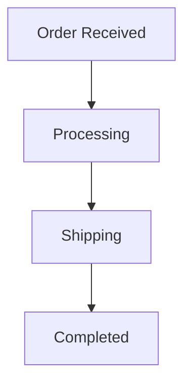

# 1.4.5 Petri Net Case Studies

## 目录

1.4.5.1 Topic Overview  
1.4.5.2 Workflow System Case  
1.4.5.3 Communication Protocol Case  
1.4.5.4 Distributed System Case  
1.4.5.5 Lean/Haskell/Rust Code Examples  
1.4.5.6 Diagrams and Multi-representations  
1.4.5.7 Relevance and Cross-references  
1.4.5.8 References and Further Reading  

---

### 1.4.5.1 Topic Overview

This section presents case studies of Petri nets in real-world engineering scenarios.

### 1.4.5.2 Workflow System Case

- Example: order processing workflow
- Petri net modeling and analysis

### 1.4.5.3 Communication Protocol Case

- Example: handshake protocol
- Petri net for protocol verification

### 1.4.5.4 Distributed System Case

- Example: distributed resource allocation
- Petri net for distributed coordination

### 1.4.5.5 Lean/Haskell/Rust Code Examples

```lean
-- Example: workflow Petri net (pseudo-code)
def workflow_net : PetriNet := sorry
```

```haskell
-- Haskell: workflow Petri net
workflowNet :: PetriNet
workflowNet = undefined
```

```rust
// Rust: workflow Petri net
fn workflow_net() -> PetriNet {
    unimplemented!()
}
```

### 1.4.5.6 Diagrams and Multi-representations



### 1.4.5.7 Relevance and Cross-references

- [1.4.4-petri-net-extensions.md](./1.4.4-petri-net-extensions.md)
- [../../7-verification-and-engineering-practice/7.2-engineering-practice-cases.md](../../7-verification-and-engineering-practice/7.2-engineering-practice-cases.md)

### 1.4.5.8 References and Further Reading

- Case studies in Petri net literature
- Open source workflow tools
