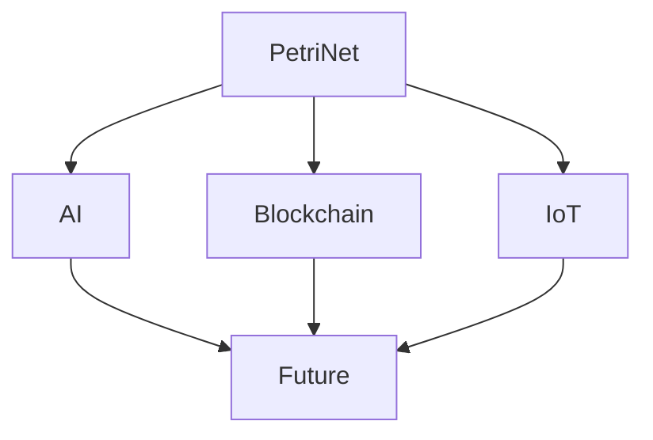

# 1.4.6 Petri网与分布式系统的未来展望

[返回上级](../1.4-Petri网与分布式系统.md) | [English Version](../../1.4-petri-net-and-distributed-systems/1.4.6-Future-of-Petri-Net-and-Distributed-Systems.md)

## 目录

- [1.4.6 Petri网与分布式系统的未来展望](#146-petri网与分布式系统的未来展望)
  - [目录](#目录)
  - [1.4.6.1 未来研究方向](#1461-未来研究方向)
  - [1.4.6.2 典型应用前景](#1462-典型应用前景)
  - [1.4.6.3 交叉领域融合](#1463-交叉领域融合)
  - [1.4.6.4 Mermaid 图示例](#1464-mermaid-图示例)
  - [1.4.6.5 代码示例](#1465-代码示例)
  - [1.4.6.6 参考文献](#1466-参考文献)

---

## 1.4.6.1 未来研究方向

TODO: 结合AI、区块链、IoT等新兴领域的Petri网研究。

## 1.4.6.2 典型应用前景

TODO: 未来工业、智能制造、分布式系统中的应用。

## 1.4.6.3 交叉领域融合

TODO: 与形式化验证、自动推理、网络安全等领域的融合。

## 1.4.6.4 Mermaid 图示例



## 1.4.6.5 代码示例

```lean
-- Lean 伪代码示例
structure PetriNet :=
  (places : Type)
  (transitions : Type)
  (pre : transitions → places → ℕ)
  (post : transitions → places → ℕ)
```

```rust
// Rust 伪代码示例
struct PetriNet {
    places: Vec<String>,
    transitions: Vec<String>,
}
```

## 1.4.6.6 参考文献

- [Petri Nets: Properties, Analysis and Applications](https://en.wikipedia.org/wiki/Petri_net)
- TODO: 更多权威文献

---

[返回目录](../../0-总览与导航/0.1-全局主题树形目录.md)
