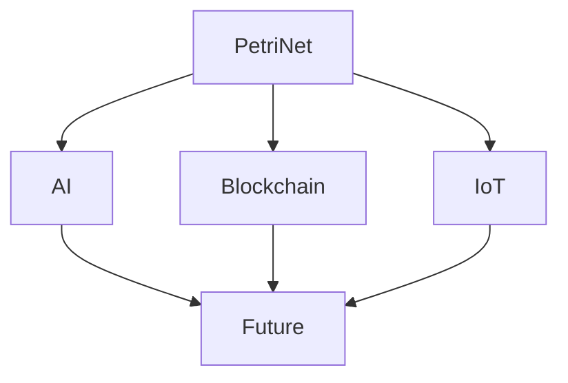

# 1.4.6 Petri网与分布式系统的未来展望

[返回上级](../1.4-Petri网与分布式系统.md) | [English Version](../../1.4-petri-net-and-distributed-systems/1.4.6-Future-of-Petri-Net-and-Distributed-Systems.md)

## 目录

- [1.4.6 Petri网与分布式系统的未来展望](#146-petri网与分布式系统的未来展望)
  - [目录](#目录)
  - [1.4.6.1 未来研究方向](#1461-未来研究方向)
  - [1.4.6.2 典型应用前景](#1462-典型应用前景)
  - [1.4.6.3 交叉领域融合](#1463-交叉领域融合)
  - [1.4.6.4 Mermaid 图示例](#1464-mermaid-图示例)
  - [1.4.6.5 代码示例](#1465-代码示例)
  - [1.4.6.6 参考文献](#1466-参考文献)

---

## 1.4.6.1 未来研究方向

- 面向AI工作流与可解释性：用着色/层次Petri网刻画数据流、特征流、模型版本流，支持训练/推理流水线的死锁与资源竞争分析。
- 区块链与智能合约形式化：以Petri网建模共识协议、交易并发与跨链流程，配合不变式/可达性验证提升安全性。
- IoT与边缘协同：建模设备-边缘-云的事件流与缓冲策略，评估丢包、抖动对时序性质的影响（LTL/CTL约束下的仿真与验证）。
- 自适应与再配置系统：加入变迁守卫与时延，分析在线升级、弹性伸缩下的安全与活性性质。

## 1.4.6.2 典型应用前景

- 智能制造与柔性产线：用时间Petri网验证配料/装配/质检节拍与缓冲容量。
- 金融与支付编排：以高层Petri网建模SAGA/补偿事务，验证幂等与最终一致性。
- 车联网与机器人群体：群体协同任务分配、避碰与调度的安全性与可达性分析。
- 云原生服务网格：服务依赖、熔断/限流策略的形式化评估与故障注入仿真。

## 1.4.6.3 交叉领域融合

- 与模型检测结合：基于Petri网状态图导出Kripke结构，进行CTL/LTL验证。
- 与抽象解释/不变式合成：针对有界性/活性生成自动不变式，提高验证可扩展性。
- 与网络安全：攻击图/入侵场景建模，验证关键资产的可达性与最短攻击路径。

## 1.4.6.4 Mermaid 图示例



## 1.4.6.5 代码示例

```lean
-- Lean 伪代码示例
structure PetriNet :=
  (places : Type)
  (transitions : Type)
  (pre : transitions → places → ℕ)
  (post : transitions → places → ℕ)
```

```rust
// Rust 伪代码示例
struct PetriNet {
    places: Vec<String>,
    transitions: Vec<String>,
}
```

## 1.4.6.6 参考文献

- [Petri Nets: Properties, Analysis and Applications](https://en.wikipedia.org/wiki/Petri_net)
- T. Murata, "Petri Nets: Properties, Analysis and Applications", Proceedings of the IEEE, 1989
- W. Reisig, "Understanding Petri Nets", 2013
- K. Jensen, L. M. Kristensen, "Colored Petri Nets: Modelling and Validation of Concurrent Systems", 2009
- M. Kwiatkowska et al., "PRISM 4.0: Verification of Probabilistic Real-Time Systems", 2011

---

[返回目录](../../0-总览与导航/0.1-全局主题树形目录.md)
