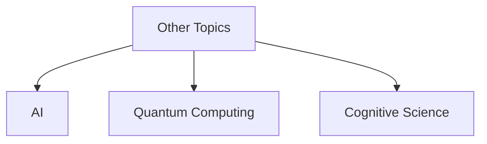

# 1.x Other Formal Topics

## 目录

1.x.1 Topic Overview  
1.x.2 New Research Directions  
1.x.3 Interdisciplinary Applications  
1.x.4 Open Problems and Challenges  
1.x.5 Lean/Haskell/Rust Code Examples  
1.x.6 Diagrams and Multi-representations  
1.x.7 Relevance and Cross-references  
1.x.8 References and Further Reading  

---

### 1.x.1 Topic Overview

This section collects other advanced or emerging topics in formal theory for future expansion.

### 1.x.2 New Research Directions

- e.g., formal methods for AI, quantum computing, cyber-physical systems

### 1.x.3 Interdisciplinary Applications

- e.g., formal theory in biology, economics, cognitive science

### 1.x.4 Open Problems and Challenges

- e.g., scalability, expressiveness, tool support

### 1.x.5 Lean/Haskell/Rust Code Examples

```lean
-- Placeholder for new formal theory constructs
```

```haskell
-- Placeholder for new formal theory constructs
```

```rust
// Placeholder for new formal theory constructs
```

### 1.x.6 Diagrams and Multi-representations



### 1.x.7 Relevance and Cross-references

- [1.3-temporal-logic-and-control/README.md](./1.3-temporal-logic-and-control/README.md)
- [1.4-petri-net-and-distributed-systems/README.md](./1.4-petri-net-and-distributed-systems/README.md)
- [../2-mathematics-and-applications/2.x-other-mathematics-topics.md](../2-mathematics-and-applications/2.x-other-mathematics-topics.md)

### 1.x.8 References and Further Reading

- Recent papers, workshops, and open problems
