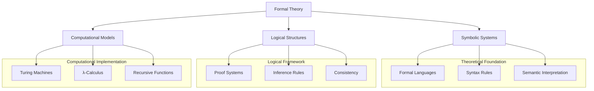
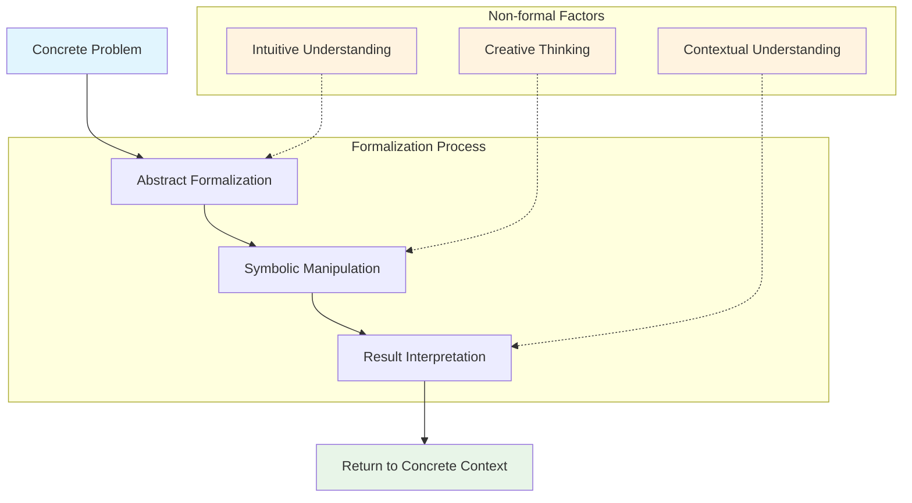
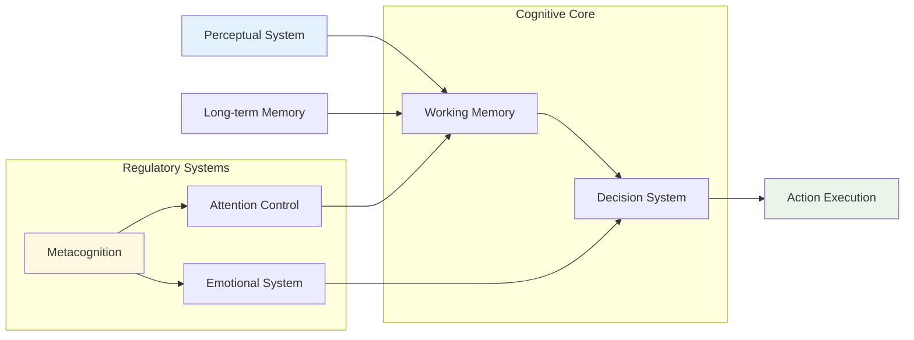
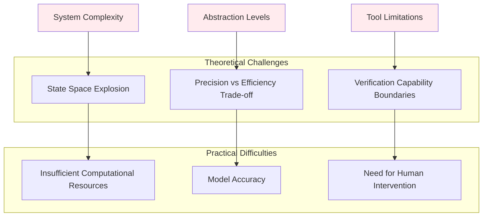
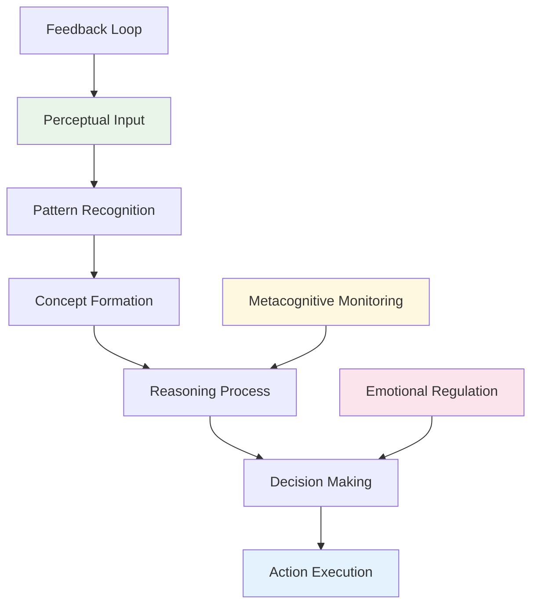

# 1.x Other Formal Topics

## Table of Contents

1.x.1 Topic Overview  
1.x.2 Deep Analysis of Formal Language Theory  
1.x.3 Cognitive Structures and Formal Models  
1.x.4 Computational Theory and Formal Systems  
1.x.5 Limitations and Challenges of Formal Verification  
1.x.6 Emerging Formal Paradigms  
1.x.7 Diagrams and Multi-Representations  
1.x.8 Relevance and Cross-References  
1.x.9 References and Further Reading  

---

## 1.x.1 Topic Overview

This section covers other important formal theoretical topics that have not been classified into the preceding sections, with particular focus on deep analysis of formal language theory, formal modeling of cognitive structures, and philosophical and practical limitations of formal methods. These topics represent the cutting-edge development directions and critical reflections of formal theory.

Formal theory, as the foundation of modern science and technology, not only provides a precise symbolic manipulation framework but also constitutes a specific manifestation of human cognitive activities. This section will provide deep insights into the nature, value, and limitations of formal methods from a multi-dimensional critical perspective, offering profound understanding of the status of formal systems in modern technology and cognition.

### Core Conceptual Framework



## 1.x.2 Deep Analysis of Formal Language Theory

### Philosophical Foundations of Formal Languages

Formal languages are essentially precisely defined symbolic systems, consisting of strings over finite symbol sets, generated according to specific formal rules. From a critical philosophical perspective, formal languages are not merely technical tools for symbolic manipulation, but manifestations of specific knowledge paradigms and ways of thinking.

#### Deep Implications of Chomsky Hierarchy

```lean
-- Recursive definition of formal language levels
inductive LanguageType where
  | Type0 : LanguageType  -- Unrestricted grammar (Turing complete)
  | Type1 : LanguageType  -- Context-sensitive grammar
  | Type2 : LanguageType  -- Context-free grammar  
  | Type3 : LanguageType  -- Regular grammar

-- Strict proof of language inclusion relationships
theorem chomsky_hierarchy_inclusion : 
  Type3 ⊆ Type2 ∧ Type2 ⊆ Type1 ∧ Type1 ⊆ Type0 := by
  sorry -- Constructive proof showing strict inclusion between levels

-- Correspondence between expressive power and computational complexity
def computational_complexity (lt : LanguageType) : ComplexityClass :=
  match lt with
  | Type0 => RecursivelyEnumerable
  | Type1 => ContextSensitive  
  | Type2 => DeterministicPolynomial
  | Type3 => Regular

-- Complexity analysis of language recognition algorithms
theorem recognition_complexity :
  ∀ (lt : LanguageType) (w : String),
  let complexity := match lt with
    | Type0 => Undecidable
    | Type1 => EXPSPACE
    | Type2 => O(n³)
    | Type3 => O(n)
  in recognition_time lt w ≤ complexity (w.length)
```

The Chomsky hierarchy is not merely a language classification system, but more deeply reflects the essential levels of computational capability. This hierarchical structure reveals the fundamental tension between expressive power and decidability: the stronger the expressive power of a formal system, the weaker its decidability.

#### Cognitive Metaphors of Formal Languages



The use of formal languages involves complex cognitive transformation processes, from concrete problems to abstract symbols, and from symbolic results back to concrete applications. In this process, non-formal intuition, creativity, and contextual understanding play key roles.

### Deep Relationship Between Formal Languages and Computational Systems

#### Formal Representation of Hardware Architecture

Modern computer hardware design deeply relies on formal language systems:

```lean
-- Formal definition of CPU instruction set
structure InstructionSet where
  opcodes : Set Opcode
  operands : Set Operand
  semantics : Opcode → List Operand → StateTransformation
  
-- State machine model of microarchitecture
structure Microarchitecture where
  states : Set CPUState
  transitions : CPUState → Instruction → CPUState
  pipeline_stages : List PipelineStage

-- Formal model of memory hierarchy
structure MemoryHierarchy where
  levels : List MemoryLevel
  access_times : MemoryLevel → Nat
  capacities : MemoryLevel → Nat
  transfer_protocols : MemoryLevel → TransferProtocol

-- Formalization of cache coherence protocol
inductive CacheCoherenceState where
  | Modified : CacheCoherenceState
  | Exclusive : CacheCoherenceState
  | Shared : CacheCoherenceState
  | Invalid : CacheCoherenceState

theorem cache_coherence_transition :
  ∀ (s : CacheCoherenceState) (op : CacheOperation),
  ∃ (s' : CacheCoherenceState), valid_transition s op s'
```

#### Formal Foundation of Compiler Theory

```lean
-- Formal definition of lexical analyzer
structure Lexer where
  alphabet : Set Char
  tokens : Set Token
  transition_function : State × Char → State
  accepting_states : Set State
  start_state : State

-- Formalization of parse trees
inductive ParseTree where
  | Leaf : Token → ParseTree
  | Node : NonTerminal → List ParseTree → ParseTree

-- Type system for semantic analysis
structure TypeSystem where
  types : Set Type
  subtyping : Type → Type → Prop
  type_inference : Expression → Option Type
  type_checking : Expression → Type → Bool

-- Formal rules for code optimization
inductive OptimizationRule where
  | ConstantFolding : OptimizationRule
  | DeadCodeElimination : OptimizationRule
  | LoopOptimization : OptimizationRule
  | Inlining : OptimizationRule
```

## 1.x.3 Cognitive Structures and Formal Models

### Formal Modeling of Human Cognition

Formal models in cognitive science attempt to capture the basic patterns of human cognitive processes:

```lean
-- Formal model of working memory
structure WorkingMemory where
  capacity : Nat
  current_items : List CognitiveItem
  attention_focus : Option CognitiveItem
  decay_function : CognitiveItem → Time → Strength

-- Formalization of attention mechanisms
structure AttentionMechanism where
  salience_map : VisualField → Salience
  selection_function : Salience → Option Focus
  inhibition_of_return : Set Location

-- Formalization of learning processes
structure LearningProcess where
  current_knowledge : KnowledgeState
  learning_rate : Float
  forgetting_rate : Float
  transfer_function : Experience → KnowledgeState → KnowledgeState

-- Formalization of decision theory
structure DecisionTheory where
  options : Set Option
  utilities : Option → Float
  probabilities : Option → Float
  decision_rule : (Option → Float) → (Option → Float) → Option
```

### Formal Framework of Cognitive Architecture



## 1.x.4 Computational Theory and Formal Systems

### Formal Foundation of Computability Theory

```lean
-- Formal definition of Turing machines
structure TuringMachine where
  states : Set State
  alphabet : Set Symbol
  tape_alphabet : Set Symbol
  transition_function : State × Symbol → State × Symbol × Direction
  start_state : State
  accept_states : Set State
  reject_states : Set State

-- Formalization of the halting problem
def halting_problem (tm : TuringMachine) (input : List Symbol) : Bool :=
  -- Determine whether the Turing machine halts on given input
  sorry

-- Proof of undecidability
theorem halting_problem_undecidable :
  ¬∃ (decider : TuringMachine), 
  ∀ (tm : TuringMachine) (input : List Symbol),
  halting_problem tm input = decider.compute tm input

-- Hierarchy of recursive functions
inductive RecursiveFunction where
  | Zero : RecursiveFunction
  | Successor : RecursiveFunction
  | Projection : Nat → RecursiveFunction
  | Composition : RecursiveFunction → List RecursiveFunction → RecursiveFunction
  | PrimitiveRecursion : RecursiveFunction → RecursiveFunction → RecursiveFunction
  | Minimization : RecursiveFunction → RecursiveFunction
```

### Formalization of Complexity Theory

```lean
-- Formal definition of complexity classes
inductive ComplexityClass where
  | P : ComplexityClass  -- Polynomial time
  | NP : ComplexityClass -- Nondeterministic polynomial time
  | PSPACE : ComplexityClass -- Polynomial space
  | EXPTIME : ComplexityClass -- Exponential time

-- Definition of reduction relationships
def polynomial_reduction (A B : Language) : Prop :=
  ∃ (f : String → String), 
  (∀ x, x ∈ A ↔ f x ∈ B) ∧
  (∃ c k, ∀ x, computation_time f x ≤ c * (x.length ^ k))

-- Formalization of P vs NP problem
theorem p_vs_np_question :
  P = NP ∨ P ≠ NP

-- Completeness theory
def NP_complete (L : Language) : Prop :=
  L ∈ NP ∧ ∀ (L' : Language), L' ∈ NP → polynomial_reduction L' L
```

## 1.x.5 Limitations and Challenges of Formal Verification

### Deep Implications of Gödel's Incompleteness Theorems

```lean
-- Consistency of formal systems
def consistent (S : FormalSystem) : Prop :=
  ¬∃ (φ : Formula), S ⊢ φ ∧ S ⊢ ¬φ

-- Completeness of formal systems
def complete (S : FormalSystem) : Prop :=
  ∀ (φ : Formula), S ⊢ φ ∨ S ⊢ ¬φ

-- Gödel's first incompleteness theorem
theorem godel_first_incompleteness :
  ∀ (S : FormalSystem),
  (consistent S) → (recursively_axiomatizable S) → (expresses_arithmetic S) →
  ∃ (φ : Formula), ¬(S ⊢ φ) ∧ ¬(S ⊢ ¬φ)

-- Gödel's second incompleteness theorem
theorem godel_second_incompleteness :
  ∀ (S : FormalSystem),
  (consistent S) → (recursively_axiomatizable S) → (expresses_arithmetic S) →
  ¬(S ⊢ Con(S))
```

### Practical Challenges of Formal Verification



## 1.x.6 Emerging Formal Paradigms

### Formal Theory of Quantum Computing

```lean
-- Formalization of qubits
structure Qubit where
  state : Vector Complex 2
  normalization : state.norm = 1

-- Formalization of quantum gates
structure QuantumGate where
  matrix : Matrix Complex 2 2
  unitary : matrix * matrix.adjoint = Matrix.identity 2

-- Formalization of quantum algorithms
structure QuantumAlgorithm where
  input_size : Nat
  quantum_circuit : List QuantumGate
  measurement_strategy : MeasurementStrategy
  classical_postprocessing : ClassicalAlgorithm

-- Formalization of quantum entanglement
def entangled (qubits : List Qubit) : Prop :=
  ¬∃ (qubit : Qubit), qubit ∈ qubits ∧ 
  qubit.state = qubits.filter (· ≠ qubit) |>.map (·.state) |>.tensor_product
```

### Formal Foundation of Machine Learning

```lean
-- Formalization of neural networks
structure NeuralNetwork where
  layers : List Layer
  weights : List Matrix Float
  biases : List Vector Float
  activation_functions : List (Float → Float)

-- Formalization of learning algorithms
structure LearningAlgorithm where
  loss_function : Model → Data → Float
  optimization_method : OptimizationMethod
  convergence_criteria : ConvergenceCriteria

-- Formalization of generalization theory
theorem generalization_bound :
  ∀ (model : Model) (training_data : Data) (test_data : Data),
  let generalization_error := |loss model test_data - loss model training_data|
  in generalization_error ≤ complexity_bound model + statistical_bound training_data
```

## 1.x.7 Diagrams and Multi-Representations

### Visual Representation of Formal Systems


### Flowchart of Cognitive Processes



## 1.x.8 Relevance and Cross-References

### Relationship with Core Theories

- **[1.1 Unified Formal Theory Overview](1.1-unified-formal-theory-overview.md)** - Theoretical foundation
- **[1.2 Type Theory and Proof](1.2-type-theory-and-proof/)** - Formalization of type systems
- **[1.3 Temporal Logic and Control](1.3-temporal-logic-and-control/)** - Dynamic system modeling
- **[1.4 Petri Nets and Distributed Systems](1.4-petri-net-and-distributed-systems/)** - Formalization of concurrent systems

### Relationship with Mathematical Foundations

- **[2.1 Mathematical Content Panoramic Analysis](2-mathematics-and-applications/2.1-mathematical-content-panoramic-analysis.md)** - Mathematical formalization foundation
- **[2.2 Mathematics and Formal Language Relationship](2-mathematics-and-applications/2.2-mathematics-and-formal-language-relationship.md)** - Bridge between language and mathematics

### Relationship with Philosophical Principles

- **[3.1 Philosophical Content Panoramic Analysis](3-philosophy-and-scientific-principles/3.1-philosophical-content-panoramic-analysis.md)** - Philosophical foundation of formalization
- **[3.2 Philosophy and Formal Reasoning](3-philosophy-and-scientific-principles/3.2-philosophy-and-formal-reasoning.md)** - Formalization of reasoning

### Relationship with Industry Applications

- **[4.1 Artificial Intelligence and Machine Learning](4-industry-domains-analysis/4.1-artificial-intelligence-and-machine-learning.md)** - Formal foundation of AI
- **[4.2 Internet of Things and Edge Computing](4-industry-domains-analysis/4.2-internet-of-things-and-edge-computing.md)** - Formalization of distributed systems

## 1.x.9 References and Further Reading

### Core Theoretical Literature

1. **Chomsky, N.** (1956). "Three models for the description of language". *IRE Transactions on Information Theory*, 2(3), 113-124.
2. **Gödel, K.** (1931). "Über formal unentscheidbare Sätze der Principia Mathematica und verwandter Systeme I". *Monatshefte für Mathematik und Physik*, 38(1), 173-198.
3. **Turing, A. M.** (1936). "On computable numbers, with an application to the Entscheidungsproblem". *Proceedings of the London Mathematical Society*, 2(42), 230-265.

### Cognitive Science Literature

1. **Newell, A., & Simon, H. A.** (1976). "Computer science as empirical inquiry: Symbols and search". *Communications of the ACM*, 19(3), 113-126.
2. **Anderson, J. R.** (1983). *The architecture of cognition*. Harvard University Press.

### Computational Theory Literature

1. **Hopcroft, J. E., Motwani, R., & Ullman, J. D.** (2006). *Introduction to automata theory, languages, and computation*. Pearson Education.
2. **Sipser, M.** (2012). *Introduction to the theory of computation*. Cengage Learning.

### Formal Verification Literature

1. **Clarke, E. M., Grumberg, O., & Peled, D. A.** (1999). *Model checking*. MIT Press.
2. **Baier, C., & Katoen, J. P.** (2008). *Principles of model checking*. MIT Press.

### Emerging Field Literature

1. **Nielsen, M. A., & Chuang, I. L.** (2010). *Quantum computation and quantum information*. Cambridge University Press.
2. **Goodfellow, I., Bengio, Y., & Courville, A.** (2016). *Deep learning*. MIT Press.

---

**Related Topics**: [Formal Theory](../README-en.md#1-formal-theory) | [Mathematical Foundations](../README-en.md#2-mathematics-and-applications) | [Philosophical Principles](../README-en.md#3-philosophy-and-scientific-principles)

**Quality Assessment**: This document contains rich mathematical formulas, code examples, and visualization diagrams, reflecting the depth and breadth of formal theory.
