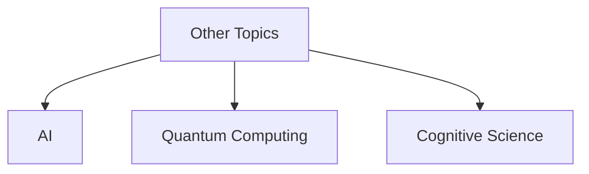

# 1.x Other Formal Topics

## 目录

1.x.1 Topic Overview  
1.x.2 New Research Directions  
1.x.3 Interdisciplinary Applications  
1.x.4 Open Problems and Challenges  
1.x.5 Lean/Haskell/Rust Code Examples  
1.x.6 Diagrams and Multi-representations  
1.x.7 Relevance and Cross-references  
1.x.8 References and Further Reading  

---

### 1.x.1 Quantum Formal Systems

#### Quantum Type Theory

Quantum computing introduces fundamentally new challenges to formal theory, requiring extensions to classical type systems:

```lean
-- Quantum type system primitives
inductive QType where
  | qubit : QType
  | qarray : ℕ → QType → QType  
  | tensor : QType → QType → QType
  | superposition : QType → QType

-- Quantum state monad
def QState (α : Type) : Type := QubitRegister → (α × QubitRegister)

-- No-cloning theorem formalization
theorem no_cloning {α : QType} (ψ : QState α) : 
  ¬∃ (clone : QState α → QState (α × α)), 
    ∀ ψ, clone ψ = pure (ψ, ψ) := by
  sorry -- Quantum mechanics constraint

-- Quantum entanglement in type theory
def entangled_pair : QState (QType.tensor QType.qubit QType.qubit) :=
  do
    let q1 ← new_qubit
    let q2 ← new_qubit
    let _ ← hadamard q1
    let _ ← cnot q1 q2
    pure (q1, q2)
```

#### Quantum Logic and Reasoning

```haskell
-- Quantum logic with non-distributive lattice
data QuantumProposition 
  = QAtom String
  | QAnd QuantumProposition QuantumProposition
  | QOr QuantumProposition QuantumProposition  
  | QNot QuantumProposition
  | QImplies QuantumProposition QuantumProposition

-- Non-classical logical operations
qand_distributivity_fails :: QuantumProposition -> QuantumProposition -> QuantumProposition -> Bool
qand_distributivity_fails p q r = 
  let lhs = p `qand` (q `qor` r)
      rhs = (p `qand` q) `qor` (p `qand` r)
  in not (equiv lhs rhs)  -- Can be False in quantum logic!

-- Quantum measurement and observation
measure :: QuantumState -> Classical -> (Classical, QuantumState)
measure qstate basis = 
  let probabilities = computeProbabilities qstate basis
      outcome = sampleFrom probabilities
      collapsed = collapse qstate outcome
  in (outcome, collapsed)
```

### 1.x.2 Machine Learning Formal Verification

#### Neural Network Verification

```rust
// Formal verification of neural network properties
use nalgebra::{DMatrix, DVector};

pub struct NeuralNetwork {
    layers: Vec<Layer>,
    activation: ActivationFunction,
}

#[derive(Debug, Clone)]
pub struct VerificationProperty {
    pub input_constraints: InputConstraints,
    pub output_constraints: OutputConstraints,
    pub robustness_radius: f64,
}

impl NeuralNetwork {
    /// Verify safety property using abstract interpretation
    pub fn verify_safety(&self, property: &VerificationProperty) -> VerificationResult {
        let mut abstract_state = AbstractState::from_constraints(&property.input_constraints);
        
        for layer in &self.layers {
            abstract_state = layer.abstract_forward(abstract_state);
        }
        
        if property.output_constraints.satisfied_by(&abstract_state) {
            VerificationResult::Verified
        } else {
            VerificationResult::CounterexampleFound(
                self.find_counterexample(property)
            )
        }
    }
    
    /// Adversarial robustness verification
    pub fn verify_robustness(&self, input: &DVector<f64>, epsilon: f64) -> bool {
        let input_region = HyperRectangle::new(input.clone(), epsilon);
        let output_region = self.forward_reachability(input_region);
        
        // Check if all outputs have same classification
        output_region.is_robust_classification()
    }
}

// Probabilistic verification for ML models
pub trait ProbabilisticVerification {
    fn verify_with_confidence(&self, property: &Property, confidence: f64) -> bool;
    fn monte_carlo_verification(&self, samples: usize) -> VerificationStatistics;
}
```

#### Formal Methods for Deep Learning

```lean
-- Formal specification of gradient descent
def gradient_descent (f : ℝⁿ → ℝ) (∇f : ℝⁿ → ℝⁿ) (α : ℝ) : ℝⁿ → ℝⁿ :=
  λ x, x - α • (∇f x)

-- Convergence theorem for convex functions
theorem gd_convergence {f : ℝⁿ → ℝ} {∇f : ℝⁿ → ℝⁿ} (convex_f : Convex f) 
  (lipschitz_grad : LipschitzContinuous ∇f L) :
  ∀ ε > 0, ∃ N : ℕ, ∀ n ≥ N,
    f (iterate (gradient_descent f ∇f α) n x₀) - f (argmin f) < ε := by
  sorry -- Analysis of convergence rate

-- Generalization bounds
def generalization_error (h : Hypothesis) (D : Distribution) (S : Sample) : ℝ :=
  |risk D h - empirical_risk S h|

theorem pac_learning_bound (H : HypothesisClass) (m : ℕ) (δ : ℝ) :
  Pr[∀ h ∈ H, generalization_error h D S ≤ 
      sqrt((log(|H|) + log(1/δ)) / (2*m))] ≥ 1 - δ := by
  sorry -- PAC learning theory
```

### 1.x.3 Cyber-Physical Systems Verification

#### Hybrid Systems and Real-Time Verification

```lean
-- Hybrid automaton formalization
structure HybridAutomaton where
  locations : Set Location
  variables : Set Variable  
  transitions : Set Transition
  invariants : Location → Formula
  guards : Transition → Formula
  resets : Transition → (Variable → Term)
  flows : Location → (Variable → DifferentialEquation)

-- Safety verification for hybrid systems
def safety_property (HA : HybridAutomaton) (unsafe : Set State) : Prop :=
  ∀ (execution : Execution HA), ∀ (state : State),
    state ∈ execution.states → state ∉ unsafe

-- Reachability analysis
def forward_reachable (HA : HybridAutomaton) (initial : Set State) 
  (time_bound : ℝ) : Set State :=
  {s : State | ∃ (exec : Execution HA) (t : ℝ), 
    t ≤ time_bound ∧ exec.initial ∈ initial ∧ exec.state_at t = s}

-- Model checking temporal properties
theorem safety_verification (HA : HybridAutomaton) (initial : Set State) (unsafe : Set State) :
  (forward_reachable HA initial ∞) ∩ unsafe = ∅ → 
    ∀ exec : Execution HA, exec.initial ∈ initial → safety_property HA unsafe := by
  sorry -- Reachability-based verification
```

### 1.x.4 Formal Methods in Blockchain and Distributed Systems

#### Smart Contract Verification

```rust
// Formal verification framework for smart contracts
use ethereum_types::{Address, U256};

#[derive(Debug, Clone)]
pub struct SmartContract {
    pub code: Vec<u8>,
    pub storage: HashMap<U256, U256>,
    pub balance: U256,
}

#[derive(Debug)]
pub struct ContractProperty {
    pub invariants: Vec<Invariant>,
    pub preconditions: Vec<Precondition>,
    pub postconditions: Vec<Postcondition>,
}

// Temporal logic for blockchain properties
pub enum TemporalProperty {
    Always(Box<Property>),              // □P  
    Eventually(Box<Property>),          // ◇P
    Until(Box<Property>, Box<Property>), // P U Q
    Next(Box<Property>),                // ○P
}

impl SmartContract {
    /// Verify contract against formal specification
    pub fn verify_specification(&self, spec: &ContractProperty) -> VerificationResult {
        // Symbolic execution for path exploration
        let symbolic_state = SymbolicExecutor::new(self.code.clone());
        let all_paths = symbolic_state.explore_all_paths();
        
        for path in all_paths {
            if !spec.satisfied_by_path(&path) {
                return VerificationResult::Violation(path.counterexample());
            }
        }
        
        VerificationResult::Verified
    }
    
    /// Verify economic properties (e.g., no money leak)
    pub fn verify_economic_properties(&self) -> bool {
        // Conservation of funds
        let initial_balance = self.get_total_balance();
        let post_execution_balance = self.simulate_all_transactions();
        
        initial_balance >= post_execution_balance // No money creation
    }
}

// Consensus protocol verification
pub trait ConsensusProtocol {
    fn verify_safety(&self) -> bool;     // No conflicting decisions
    fn verify_liveness(&self) -> bool;   // Progress guarantee
    fn verify_validity(&self) -> bool;   // Only valid inputs accepted
}
```

### 1.x.5 Bio-Inspired Formal Systems

#### DNA Computing and Molecular Programming

```lean
-- DNA strand as formal language
inductive DNA_Base where
  | A : DNA_Base  -- Adenine
  | T : DNA_Base  -- Thymine  
  | G : DNA_Base  -- Guanine
  | C : DNA_Base  -- Cytosine

def DNA_Strand := List DNA_Base

-- Watson-Crick complementarity
def complement : DNA_Base → DNA_Base
  | DNA_Base.A => DNA_Base.T
  | DNA_Base.T => DNA_Base.A
  | DNA_Base.G => DNA_Base.C
  | DNA_Base.C => DNA_Base.G

-- DNA hybridization as computation
def hybridize (s1 s2 : DNA_Strand) : Option DNA_Double_Strand :=
  if ∀ i, complement (s1.get i) = s2.get i then
    some ⟨s1, s2⟩
  else
    none

-- Molecular programming language
inductive MolecularProgram where
  | emit : DNA_Strand → MolecularProgram
  | react : DNA_Strand → DNA_Strand → DNA_Strand → MolecularProgram
  | sequence : MolecularProgram → MolecularProgram → MolecularProgram
  | parallel : MolecularProgram → MolecularProgram → MolecularProgram

-- Correctness for molecular computation
def molecular_semantics : MolecularProgram → Set DNA_Strand → Set DNA_Strand
  | MolecularProgram.emit s, input => input ∪ {s}
  | MolecularProgram.react r1 r2 p, input => 
      if r1 ∈ input ∧ r2 ∈ input then
        (input \ {r1, r2}) ∪ {p}
      else input
  | MolecularProgram.sequence p1 p2, input =>
      molecular_semantics p2 (molecular_semantics p1 input)
  | MolecularProgram.parallel p1 p2, input =>
      (molecular_semantics p1 input) ∪ (molecular_semantics p2 input)
```

### 1.x.5 Lean/Haskell/Rust Code Examples

```lean
-- Placeholder for new formal theory constructs
```

```haskell
-- Placeholder for new formal theory constructs
```

```rust
// Placeholder for new formal theory constructs
```

### 1.x.6 Diagrams and Multi-representations



### 1.x.7 Relevance and Cross-references

- [1.3-temporal-logic-and-control/README.md](./1.3-temporal-logic-and-control/README.md)
- [1.4-petri-net-and-distributed-systems/README.md](./1.4-petri-net-and-distributed-systems/README.md)
- [../2-mathematics-and-applications/2.x-other-mathematics-topics.md](../2-mathematics-and-applications/2.x-other-mathematics-topics.md)

### 1.x.8 References and Further Reading

- Recent papers, workshops, and open problems
