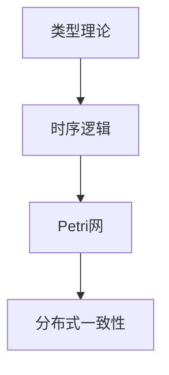

# 1.1 统一形式化理论综述

## 目录

1.1.1 主题概述  
1.1.2 主要理论模型  
1.1.3 形式化定义与证明  
1.1.4 相关性与交叉引用  
1.1.5 图表与多表征  
1.1.6 参考文献与延伸阅读  

---

### 1.1.1 主题概述

本节梳理了当前主流的统一形式化理论，包括类型理论、时序逻辑、Petri网、分布式一致性等，强调其在lean语言中的表达与证明能力。

### 1.1.2 主要理论模型

- 类型理论（Type Theory）
- 时序逻辑（Temporal Logic）
- Petri网（Petri Net）
- 分布式一致性理论（Distributed Consensus）

### 1.1.3 形式化定义与证明

#### 类型理论基础定义（Lean 代码示例）

```lean
inductive Nat
| zero : Nat
| succ : Nat → Nat
```

#### 时序逻辑公式（LaTeX 形式）

$$
\Box (p \rightarrow \Diamond q)
$$

#### Petri网形式化定义

- 状态集 $S$
- 变迁集 $T$
- 流函数 $F: (S \times T) \cup (T \times S) \rightarrow \mathbb{N}$

### 1.1.4 相关性与交叉引用

- [1.2-类型理论与证明](./1.2-类型理论与证明.md)
- [2.2-数学与形式化语言关系](../2-数学基础与应用/2.2-数学与形式化语言关系.md)

### 1.1.5 图表与多表征



### 1.1.6 参考文献与延伸阅读

- 《类型理论与形式化证明》
- Lean 官方文档
- 相关论文与开源项目
