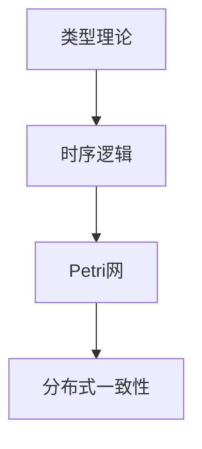
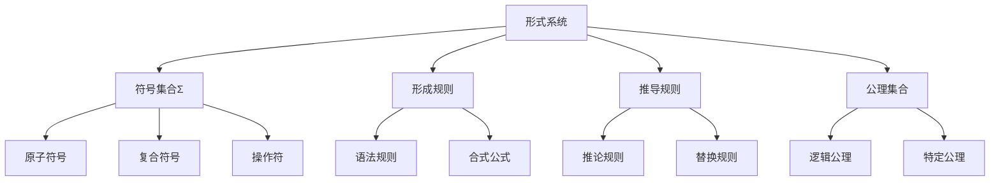
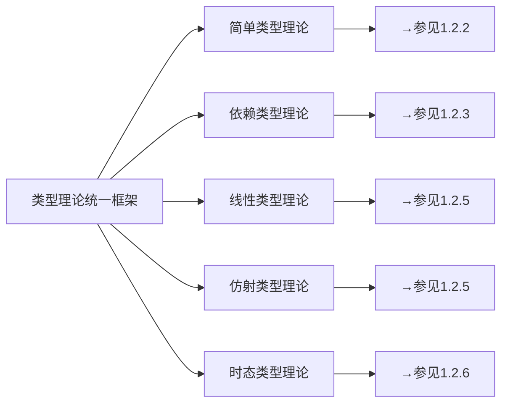
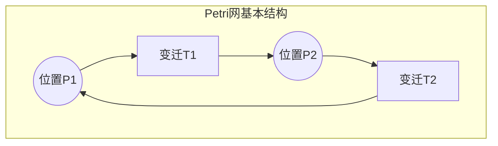
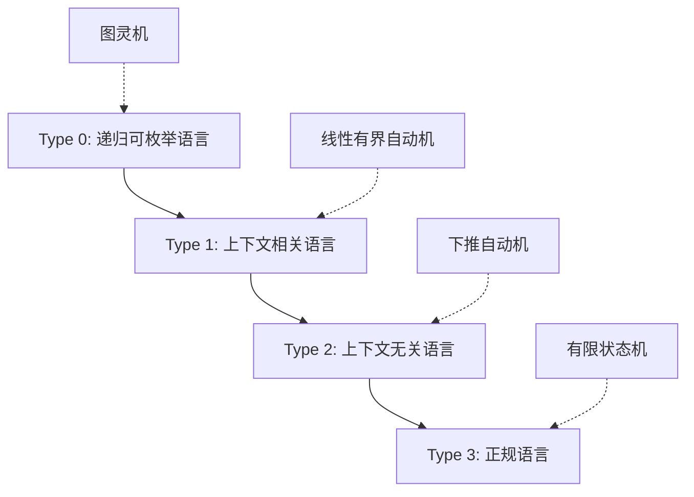
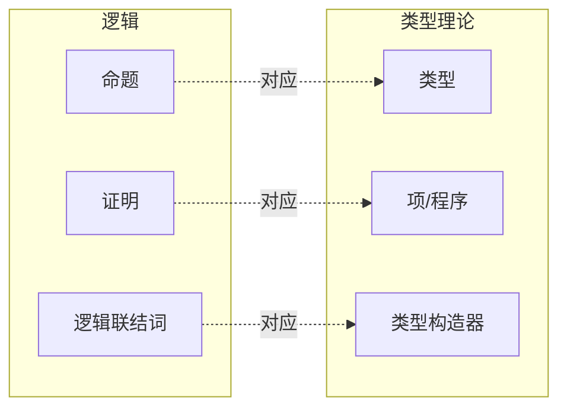
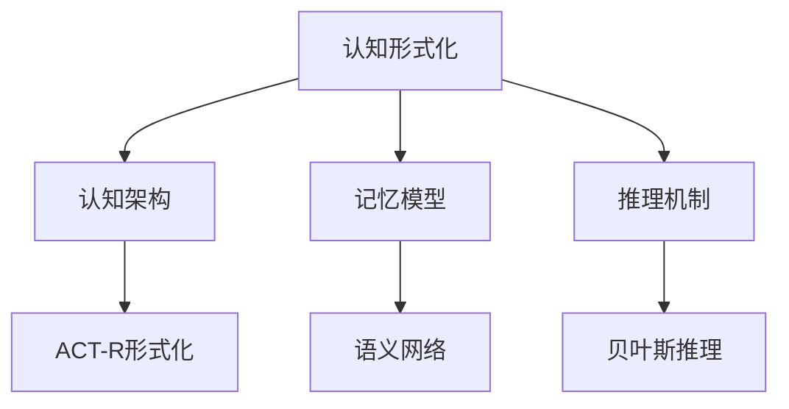

# 1.1 统一形式化理论综述

## 目录

1.1.1 主题概述  
1.1.2 主要理论模型  
1.1.3 形式化定义与证明  
1.1.4 相关性与交叉引用  
1.1.5 图表与多表征  
1.1.6 参考文献与延伸阅读  

---

### 1.1.1 主题概述

本节梳理了当前主流的统一形式化理论，包括类型理论、时序逻辑、Petri网、分布式一致性等，强调其在lean语言中的表达与证明能力。

### 1.1.2 主要理论模型

- 类型理论（Type Theory）
- 时序逻辑（Temporal Logic）
- Petri网（Petri Net）
- 分布式一致性理论（Distributed Consensus）

### 1.1.3 形式化定义与证明

#### 类型理论基础定义（Lean 代码示例）

```lean
inductive Nat
| zero : Nat
| succ : Nat → Nat
```

#### 时序逻辑公式（LaTeX 形式）

$$
\Box (p \rightarrow \Diamond q)
$$

#### Petri网形式化定义

- 状态集 $S$
- 变迁集 $T$
- 流函数 $F: (S \times T) \cup (T \times S) \rightarrow \mathbb{N}$

### 1.1.4 相关性与交叉引用

- [1.2-类型理论与证明](./1.2-类型理论与证明.md)
- [2.2-数学与形式化语言关系](../2-数学基础与应用/2.2-数学与形式化语言关系.md)

### 1.1.5 图表与多表征



### 1.1.6 参考文献与延伸阅读

- 《类型理论与形式化证明》
- Lean 官方文档
- 相关论文与开源项目

## 1.1.1 形式化理论的哲学基础

### 1.1.1.1 形式系统的本质特征

形式化理论构成了现代计算机科学、数学逻辑和系统设计的基础架构。一个形式系统由以下核心要素组成：



### 1.1.1.2 形式化的认识论意义

形式化理论的认识论价值体现在：

1. **精确性保证**：消除自然语言的歧义性
2. **可判定性支持**：提供算法化的推理过程
3. **一致性验证**：确保理论内部无矛盾
4. **完备性追求**：力图涵盖所有可证明的真理

然而，哥德尔不完备性定理揭示了形式系统的内在限制：
$$\text{对于任何包含算术的一致形式系统S，存在S中不可证明也不可反驳的语句}$$

## 1.1.2 核心形式化理论体系

### 1.1.2.1 类型理论统一框架

类型理论作为形式化的基础，提供了统一的类型系统架构：



**核心类型判断规则**：
$$\frac{\Gamma \vdash M : A \quad \Gamma \vdash N : B}{\Gamma \vdash (M,N) : A \times B} \text{（积类型引入）}$$

$$\frac{\Gamma, x:A \vdash M : B}{\Gamma \vdash \lambda x.M : A \to B} \text{（函数类型引入）}$$

### 1.1.2.2 时序逻辑与控制理论

时序逻辑为系统行为的时间性质提供形式化描述：

**线性时序逻辑（LTL）基本算子**：

- $\square \phi$：总是成立（Always）
- $\diamond \phi$：最终成立（Eventually）
- $\phi \mathcal{U} \psi$：$\phi$直到$\psi$成立

**计算树逻辑（CTL）路径量词**：

- $A\phi$：所有路径上$\phi$成立
- $E\phi$：存在路径上$\phi$成立

详细内容参见：

- [1.3.1 时序逻辑基础](1.3-时序逻辑与控制/1.3.1-时序逻辑基础.md)
- [1.3.2 主要时序逻辑系统](1.3-时序逻辑与控制/1.3.2-主要时序逻辑系统.md)

### 1.1.2.3 Petri网与分布式系统

Petri网提供了并发系统的形式化建模框架：



**Petri网的形式化定义**：
$$PN = (P, T, F, W, M_0)$$
其中：

- $P$：位置集合
- $T$：变迁集合
- $F \subseteq (P \times T) \cup (T \times P)$：流关系
- $W: F \to \mathbb{N}^+$：权重函数
- $M_0: P \to \mathbb{N}$：初始标识

详细分析参见：

- [1.4.1 Petri网基础与建模](1.4-Petri网与分布式系统/1.4.1-Petri网基础与建模.md)
- [1.4.2 分布式系统的Petri网表达](1.4-Petri网与分布式系统/1.4.2-分布式系统的Petri网表达.md)

### 1.1.2.4 形式语言理论

形式语言理论为编译器设计和语言处理提供理论基础：

**乔姆斯基层次结构**：



## 1.1.3 理论间的统一关系

### 1.1.3.1 Curry-Howard对应关系

类型与命题、程序与证明之间的深刻对应：



**基本对应关系**：

- $A \land B \leftrightarrow A \times B$（合取↔积类型）
- $A \lor B \leftrightarrow A + B$（析取↔和类型）
- $A \to B \leftrightarrow A \to B$（蕴含↔函数类型）

详细讨论参见：[1.2.4 Curry-Howard对应关系](1.2-类型理论与证明/1.2.4-curry-howard-correspondence.md)

### 1.1.3.2 代数与余代数的对偶性

数据类型与余数据类型形成对偶结构：

**归纳类型（代数）**：

```lean
inductive Nat : Type
| zero : Nat
| succ : Nat → Nat
```

**余归纳类型（余代数）**：

```lean
coinductive Stream (α : Type) : Type
| mk : α → Stream α → Stream α
```

### 1.1.3.3 时序逻辑与类型理论的融合

时态类型理论将时间维度引入类型系统：

$$\Gamma \vdash_{t} M : A \quad \text{（在时刻t，上下文Γ下，项M具有类型A）}$$

这种融合在实时系统验证中具有重要应用。

## 1.1.4 形式化理论的应用领域

### 1.1.4.1 编程语言设计与实现

形式化理论直接指导现代编程语言设计：

**类型安全语言示例**：

```rust
// Rust的所有权类型系统（基于仿射类型理论）
fn move_ownership(data: Vec<i32>) -> Vec<i32> {
    // data的所有权被移动，原绑定失效
    data
}

// 生命周期注解（基于时序逻辑）
fn longest<'a>(x: &'a str, y: &'a str) -> &'a str {
    if x.len() > y.len() { x } else { y }
}
```

```haskell
-- Haskell的高阶类型系统（基于Hindley-Milner推导）
map :: (a -> b) -> [a] -> [b]
map f []     = []
map f (x:xs) = f x : map f xs

-- 依赖类型的模拟（使用类型族）
type family Length (xs :: [k]) :: Nat where
    Length '[]       = 0
    Length (x ': xs) = 1 + Length xs
```

### 1.1.4.2 系统验证与可靠性工程

**形式化验证工具链**：

```lean
-- Lean中的程序验证示例
def factorial : Nat → Nat
| 0 => 1
| n + 1 => (n + 1) * factorial n

theorem factorial_pos (n : Nat) : factorial n > 0 := by
  induction n with
  | zero => simp [factorial]
  | succ n ih => 
    simp [factorial]
    exact Nat.mul_pos (Nat.succ_pos n) ih
```

### 1.1.4.3 分布式系统与区块链

**共识算法的形式化规范**：

```tla+
(* TLA+中的Raft共识算法规范片段 *)
VARIABLES currentTerm, votedFor, log, commitIndex

RequestVote(i, j) ==
    /\ currentTerm[j] < currentTerm[i]
    /\ \/ votedFor[j] = Nil
       \/ votedFor[j] = i
    /\ LastLogTerm(log[j]) <= LastLogTerm(log[i])
    /\ LastLogIndex(log[j]) <= LastLogIndex(log[i])
```

## 1.1.5 形式化理论的局限性与挑战

### 1.1.5.1 哥德尔限制与不完备性

任何足够强大的形式系统都面临不完备性：

1. **第一不完备性定理**：系统内存在不可证明也不可反驳的真语句
2. **第二不完备性定理**：系统无法证明自身的一致性

### 1.1.5.2 形式化验证的可扩展性问题

**状态空间爆炸**：
$$|S| = \prod_{i=1}^{n} |S_i|$$

其中$|S_i|$是第$i$个组件的状态数，复合系统的状态空间呈指数增长。

### 1.1.5.3 理论与实践的语义鸿沟

形式化模型与现实系统实现之间存在不可避免的抽象差距：

1. **模型简化**：现实系统复杂性超出形式化描述能力
2. **环境假设**：形式化模型依赖于环境假设的准确性
3. **实现正确性**：从形式化规范到代码实现的正确性保证

## 1.1.6 新兴发展方向

### 1.1.6.1 量子形式化理论

量子计算引入了新的形式化需求：

**量子类型系统**：
$$|\psi\rangle : \text{Qubit} \otimes \text{Qubit}$$

**量子逻辑运算**：
$$H|0\rangle = \frac{1}{\sqrt{2}}(|0\rangle + |1\rangle)$$

### 1.1.6.2 概率形式化方法

随机系统的形式化建模：

**概率计算树逻辑（PCTL）**：
$$P_{\geq p}[\phi]$$ 表示$\phi$成立的概率至少为$p$

### 1.1.6.3 机器学习的形式化理论

神经网络和深度学习的形式化分析：

```python
# 神经网络的形式化规范示例
def neural_network_spec(x: Input) -> Output:
    """
    前置条件: ||x|| ≤ 1
    后置条件: output ∈ [0,1]^k
    不变式: ∀layer. weights满足Lipschitz连续性
    """
    pass
```

## 1.1.7 跨学科整合前景

### 1.1.7.1 认知科学与形式化

形式化理论与认知建模的结合：



### 1.1.7.2 生物系统的形式化建模

**系统生物学中的Petri网应用**：
生物过程可建模为生化Petri网，其中：

- 位置表示生物分子
- 变迁表示生化反应
- 标记表示分子浓度

### 1.1.7.3 社会系统的形式化分析

**博弈论与形式验证的结合**：

```lean
-- 纳什均衡的形式化定义
def nash_equilibrium (G : Game) (s : Strategy_profile) : Prop :=
  ∀ i : Player, ∀ s_i' : Strategy i,
    utility i s ≥ utility i (update_strategy s i s_i')
```

## 1.1.8 总结与展望

形式化理论作为现代科学技术的基础架构，在以下方面发挥着关键作用：

1. **理论统一**：提供跨领域的统一语言和分析框架
2. **质量保证**：确保系统的正确性、安全性和可靠性
3. **创新驱动**：为新技术和应用领域提供理论支撑

未来发展趋势包括：

- **理论融合**：不同形式化理论的深度整合
- **工具进化**：更加智能化和自动化的形式化工具
- **应用扩展**：向更多领域的渗透和应用

---

## 交叉引用

### 相关主题

- [1.2 类型理论与证明](1.2-类型理论与证明.md) - 类型系统的详细分析
- [1.3 时序逻辑与控制](1.3-时序逻辑与控制.md) - 时序系统的形式化方法
- [1.4 Petri网与分布式系统](1.4-Petri网与分布式系统.md) - 并发系统建模
- [2.2 数学与形式化语言关系](../2-数学基础与应用/2.2-数学与形式化语言关系.md) - 数学基础
- [6.1 Lean语言与形式化证明](../6-编程语言与实现/6.1-lean语言与形式化证明.md) - 实现工具

### 本地导航

- **上一节**: [1.0 形式化理论总览](../README.md)
- **下一节**: [1.2 类型理论与证明](1.2-类型理论与证明.md)
- **返回上级**: [1 形式化理论](../README.md)
- **返回根目录**: [分析主目录](../../README.md)

### 参考文献

#### 权威文献

1. Girard, J.Y., Taylor, P., Lafont, Y. "Proofs and Types" - 类型理论基础
2. Clarke, E., Grumberg, O., Peled, D. "Model Checking" - 模型检查理论
3. Reisig, W. "Petri Nets: An Introduction" - Petri网理论
4. Pierce, B.C. "Types and Programming Languages" - 编程语言理论

#### 在线资源

1. [软件基础(Software Foundations)](https://softwarefoundations.cis.upenn.edu/) - Coq交互式教程
2. [Lean数学库文档](https://leanprover-community.github.io/mathlib_docs/) - 形式化数学
3. [TLA+规范语言](https://lamport.azurewebsites.net/tla/tla.html) - 并发系统规范

#### 延伸阅读

1. Hoare, C.A.R. "Communicating Sequential Processes" - 进程代数理论
2. Abrial, J.R. "The B-Book" - 形式化方法实践
3. Nipkow, T., Paulson, L., Wenzel, M. "Isabelle/HOL" - 定理证明器
