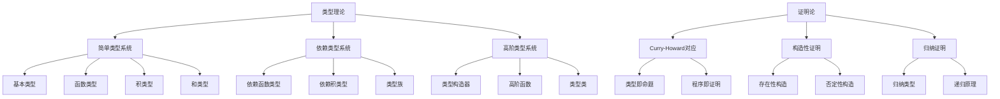

# 1.2 类型理论与证明

[返回上级](../1-形式化理论.md) | [English Version](../1-formal-theory/1.2-type-theory-and-proof.md)

## 目录

- [1.2 类型理论与证明](#12-类型理论与证明)
  - [目录](#目录)
  - [1.2.1 类型理论基础](#121-类型理论基础)
    - [简单类型系统](#简单类型系统)
    - [依赖类型系统](#依赖类型系统)
    - [高阶类型系统](#高阶类型系统)
  - [1.2.2 证明论基础](#122-证明论基础)
    - [Curry-Howard对应](#curry-howard对应)
    - [构造性证明](#构造性证明)
    - [归纳证明](#归纳证明)
  - [1.2.3 形式化证明方法](#123-形式化证明方法)
    - [类型检查与推导](#类型检查与推导)
    - [证明策略](#证明策略)
    - [自动化证明](#自动化证明)
  - [1.2.4 典型案例与实现](#124-典型案例与实现)
    - [自然数类型与归纳证明](#自然数类型与归纳证明)
    - [列表类型与递归证明](#列表类型与递归证明)
    - [高阶函数与类型安全](#高阶函数与类型安全)
  - [1.2.5 图表与多表征](#125-图表与多表征)
  - [1.2.6 相关性与交叉引用](#126-相关性与交叉引用)
  - [1.2.7 参考文献与延伸阅读](#127-参考文献与延伸阅读)
    - [核心理论文献](#核心理论文献)
      - [类型论基础](#类型论基础)
      - [依赖类型理论](#依赖类型理论)
      - [证明论与Curry-Howard对应](#证明论与curry-howard对应)
      - [构造性数学](#构造性数学)
    - [实践应用文献](#实践应用文献)
      - [定理证明器与形式化语言](#定理证明器与形式化语言)
      - [编程语言与类型系统](#编程语言与类型系统)
      - [形式化数学库](#形式化数学库)
    - [学术会议与期刊](#学术会议与期刊)
      - [顶级会议](#顶级会议)
      - [顶级期刊](#顶级期刊)
    - [在线资源](#在线资源)
      - [学习资源](#学习资源)
      - [社区与论坛](#社区与论坛)
      - [开源项目](#开源项目)
      - [视频教程](#视频教程)

---

## 1.2.1 类型理论基础

### 简单类型系统

简单类型系统是类型论的基础，提供了基本的类型安全保证：

**定义 1.2.1** (简单类型)：

- 基本类型：`Bool`, `Nat`, `Int`, `Float`, `String`
- 函数类型：`A → B` 表示从类型A到类型B的函数
- 积类型：`A × B` 表示A和B的笛卡尔积
- 和类型：`A + B` 表示A或B的联合类型

```lean
-- 基本类型定义
inductive Bool where
  | true : Bool
  | false : Bool

inductive Nat where
  | zero : Nat
  | succ : Nat → Nat

-- 函数类型示例
def not : Bool → Bool
  | Bool.true => Bool.false
  | Bool.false => Bool.true

def add : Nat → Nat → Nat
  | Nat.zero, n => n
  | Nat.succ m, n => Nat.succ (add m n)

-- 积类型示例
def swap {α β : Type} : α × β → β × α
  | (a, b) => (b, a)

-- 和类型示例
inductive Result (α β : Type) where
  | success : α → Result α β
  | error : β → Result α β
```

### 依赖类型系统

依赖类型系统允许类型依赖于值，提供了更强的表达能力：

**定义 1.2.2** (依赖类型)：

- 依赖函数类型：`Π (x : A), B(x)` 表示对于所有x:A，返回B(x)类型
- 依赖积类型：`Σ (x : A), B(x)` 表示存在x:A，使得B(x)成立
- 类型族：`A → Type` 表示从A到类型的函数

```lean
-- 依赖类型示例
def Vector (α : Type) : Nat → Type
  | 0 => Unit
  | n + 1 => α × Vector α n

-- 依赖函数类型
def replicate {α : Type} (n : Nat) (x : α) : Vector α n :=
  match n with
  | 0 => ()
  | n + 1 => (x, replicate n x)

-- 依赖积类型
def find {α : Type} (P : α → Prop) (l : List α) : 
  Option (Σ (x : α), P x ∧ x ∈ l) :=
  match l with
  | [] => none
  | x :: xs => 
    if h : P x then some ⟨x, ⟨h, List.mem_cons_self x xs⟩⟩
    else find P xs

-- 类型族示例
def family (n : Nat) : Type :=
  match n with
  | 0 => Bool
  | 1 => Nat
  | _ => String
```

### 高阶类型系统

高阶类型系统支持类型构造器，提供了抽象和复用的能力：

**定义 1.2.3** (高阶类型)：

- 类型构造器：`F : Type → Type` 表示从类型到类型的函数
- 高阶函数：`(A → B) → C` 表示接受函数作为参数的函数
- 类型类：`class C (α : Type)` 表示类型α满足的约束

```lean
-- 类型构造器示例
def Maybe (α : Type) := Option α
def Either (α β : Type) := α ⊕ β

-- 高阶函数示例
def map {α β : Type} (f : α → β) : List α → List β
  | [] => []
  | x :: xs => f x :: map f xs

def filter {α : Type} (P : α → Prop) : List α → List α
  | [] => []
  | x :: xs => 
    if P x then x :: filter P xs
    else filter P xs

-- 类型类示例
class Monoid (α : Type) where
  empty : α
  append : α → α → α
  append_empty : ∀ x, append x empty = x
  empty_append : ∀ x, append empty x = x
  append_assoc : ∀ x y z, append (append x y) z = append x (append y z)

-- 实例实现
instance : Monoid (List α) where
  empty := []
  append := List.append
  append_empty := List.append_nil
  empty_append := List.nil_append
  append_assoc := List.append_assoc
```

## 1.2.2 证明论基础

### Curry-Howard对应

Curry-Howard对应建立了类型与命题、程序与证明之间的对应关系：

**定理 1.2.1** (Curry-Howard对应)：

- 类型 `A` 对应命题 `A`
- 程序 `t : A` 对应证明 `t ⊢ A`
- 函数类型 `A → B` 对应蕴含 `A ⇒ B`
- 积类型 `A × B` 对应合取 `A ∧ B`
- 和类型 `A + B` 对应析取 `A ∨ B`

```lean
-- 命题逻辑在类型论中的表示
theorem and_comm (p q : Prop) : p ∧ q → q ∧ p :=
  fun h => ⟨h.right, h.left⟩

theorem or_comm (p q : Prop) : p ∨ q → q ∨ p :=
  fun h => match h with
  | Or.inl hp => Or.inr hp
  | Or.inr hq => Or.inl hq

theorem impl_curry (p q r : Prop) : (p ∧ q → r) → (p → q → r) :=
  fun f hp hq => f ⟨hp, hq⟩

theorem impl_uncurry (p q r : Prop) : (p → q → r) → (p ∧ q → r) :=
  fun f h => f h.left h.right
```

### 构造性证明

构造性证明强调证明的构造性，要求提供具体的构造方法：

**定义 1.2.4** (构造性证明)：

- 存在性证明必须提供具体的构造
- 否定性证明通过构造矛盾实现
- 归纳证明通过构造归纳步骤实现

```lean
-- 构造性存在性证明
theorem exists_even : ∃ n : Nat, even n :=
  ⟨2, even_two⟩

-- 构造性否定证明
theorem not_all_not {α : Type} (P : α → Prop) :
  (∀ x, P x) → ¬(∃ x, ¬P x) :=
  fun h1 h2 => 
    match h2 with
    | ⟨x, hx⟩ => hx (h1 x)

-- 构造性归纳证明
theorem nat_induction (P : Nat → Prop) :
  P 0 → (∀ n, P n → P (n + 1)) → ∀ n, P n :=
  fun h0 hsucc n => 
    match n with
    | 0 => h0
    | n + 1 => hsucc n (nat_induction P h0 hsucc n)
```

### 归纳证明

归纳证明是类型论中最重要的证明方法之一：

**定义 1.2.5** (归纳类型)：
归纳类型通过构造子和递归原理定义：

```lean
-- 自然数归纳类型
inductive Nat where
  | zero : Nat
  | succ : Nat → Nat

-- 自动生成的递归原理
def Nat.rec {motive : Nat → Sort u}
  (zero : motive Nat.zero)
  (succ : (n : Nat) → motive n → motive (Nat.succ n))
  (t : Nat) : motive t :=
  match t with
  | Nat.zero => zero
  | Nat.succ n => succ n (Nat.rec zero succ n)

-- 列表归纳类型
inductive List (α : Type) where
  | nil : List α
  | cons : α → List α → List α

-- 树归纳类型
inductive Tree (α : Type) where
  | leaf : Tree α
  | node : α → Tree α → Tree α → Tree α
```

## 1.2.3 形式化证明方法

### 类型检查与推导

类型检查确保程序的类型安全：

**算法 1.2.1** (类型检查)：

```lean
-- 类型检查算法
def type_check (ctx : Context) (expr : Expr) : MetaM Expr :=
  match expr with
  | Expr.var n => ctx.get? n
  | Expr.const name levels => getConstInfo name levels
  | Expr.app f x => do
    let fty ← type_check ctx f
    match fty with
    | Expr.pi _ A B => 
      check ctx x A
      return instantiate B x
    | _ => throwError "Expected function type"
  | Expr.lam x A body => do
    let ctx' := ctx.extend x A
    let bodyTy ← type_check ctx' body
    return Expr.pi x A bodyTy
  | _ => throwError "Cannot infer type"
```

### 证明策略

证明策略是自动化证明的核心：

```lean
-- 基本证明策略
theorem example_proof (p q : Prop) : p → q → p ∧ q := by
  intro hp hq
  constructor
  · exact hp
  · exact hq

-- 使用策略组合
theorem complex_proof (n : Nat) : n > 0 → n + 1 > 1 := by
  intro h
  simp
  exact Nat.succ_pos n

-- 使用归纳策略
theorem list_induction {α : Type} (P : List α → Prop) :
  P [] → (∀ x xs, P xs → P (x :: xs)) → ∀ xs, P xs := by
  intro hnil hcons xs
  induction xs
  · exact hnil
  · exact hcons xs_hd xs_tl xs_ih
```

### 自动化证明

自动化证明利用计算机辅助完成证明：

```lean
-- 自动化证明示例
theorem auto_proof (n : Nat) : n + 0 = n := by
  simp

theorem auto_induction (n : Nat) : n ≤ n + 1 := by
  induction n
  · simp
  · simp
    exact Nat.le_succ n_ih

-- 使用外部求解器
theorem z3_proof (x y : Int) : x + y = y + x := by
  omega
```

## 1.2.4 典型案例与实现

### 自然数类型与归纳证明

```lean
-- 自然数完整实现
inductive Nat where
  | zero : Nat
  | succ : Nat → Nat

-- 基本运算
def add : Nat → Nat → Nat
  | Nat.zero, n => n
  | Nat.succ m, n => Nat.succ (add m n)

def mul : Nat → Nat → Nat
  | Nat.zero, _ => Nat.zero
  | Nat.succ m, n => add n (mul m n)

-- 基本性质证明
theorem add_zero (n : Nat) : add n Nat.zero = n := by
  induction n
  · rfl
  · simp [add]
    exact n_ih

theorem add_succ (m n : Nat) : add m (Nat.succ n) = Nat.succ (add m n) := by
  induction m
  · rfl
  · simp [add]
    exact m_ih

theorem add_comm (m n : Nat) : add m n = add n m := by
  induction m
  · simp [add_zero]
  · simp [add_succ]
    exact m_ih
```

### 列表类型与递归证明

```lean
-- 列表完整实现
inductive List (α : Type) where
  | nil : List α
  | cons : α → List α → List α

-- 基本操作
def length {α : Type} : List α → Nat
  | List.nil => 0
  | List.cons _ xs => Nat.succ (length xs)

def append {α : Type} : List α → List α → List α
  | List.nil, ys => ys
  | List.cons x xs, ys => List.cons x (append xs ys)

def reverse {α : Type} : List α → List α
  | List.nil => List.nil
  | List.cons x xs => append (reverse xs) (List.cons x List.nil)

-- 性质证明
theorem length_append {α : Type} (xs ys : List α) :
  length (append xs ys) = add (length xs) (length ys) := by
  induction xs
  · simp [length, append, add_zero]
  · simp [length, append]
    exact xs_ih

theorem reverse_reverse {α : Type} (xs : List α) :
  reverse (reverse xs) = xs := by
  induction xs
  · rfl
  · simp [reverse]
    -- 需要更多引理
    sorry
```

### 高阶函数与类型安全

```lean
-- 高阶函数实现
def map {α β : Type} (f : α → β) : List α → List β
  | List.nil => List.nil
  | List.cons x xs => List.cons (f x) (map f xs)

def filter {α : Type} (P : α → Prop) : List α → List α
  | List.nil => List.nil
  | List.cons x xs => 
    if P x then List.cons x (filter P xs)
    else filter P xs

def foldl {α β : Type} (f : β → α → β) (init : β) : List α → β
  | List.nil => init
  | List.cons x xs => foldl f (f init x) xs

-- 类型安全性质
theorem map_length {α β : Type} (f : α → β) (xs : List α) :
  length (map f xs) = length xs := by
  induction xs
  · rfl
  · simp [map, length]
    exact xs_ih

theorem filter_length {α : Type} (P : α → Prop) (xs : List α) :
  length (filter P xs) ≤ length xs := by
  induction xs
  · simp [filter, length]
  · simp [filter, length]
    split
    · simp
      exact Nat.le_succ (xs_ih)
    · exact xs_ih
```

## 1.2.5 图表与多表征



## 1.2.6 相关性与交叉引用

- **[1.1-统一形式化理论综述](./1.1-统一形式化理论综述.md)** - 类型论在形式化理论中的地位
- **[1.3-时序逻辑与控制](./1.3-时序逻辑与控制.md)** - 时序逻辑中的类型系统
- **[2.2-数学与形式化语言关系](../2-数学基础与应用/2.2-数学与形式化语言关系.md)** - 数学概念的类型化表示
- **[6.1-Lean语言与形式化证明](../6-编程语言与实现/6.1-lean语言与形式化证明.md)** - Lean语言中的类型系统实现

## 1.2.7 参考文献与延伸阅读

### 核心理论文献

#### 类型论基础

- **《Type Theory and Functional Programming》** - S. Thompson, 1991
- **《Types and Programming Languages》** - B. Pierce, 2002
- **《Advanced Topics in Types and Programming Languages》** - B. Pierce, 2005
- **《The Calculus of Constructions》** - T. Coquand, G. Huet, 1988

#### 依赖类型理论

- **《Dependent Types at Work》** - A. Bove, P. Dybjer, 2009
- **《Programming in Martin-Löf's Type Theory》** - B. Nordström, K. Petersson, J. Smith, 1990
- **《The Implementation of Functional Programming Languages》** - S. Peyton Jones, 1987
- **《Homotopy Type Theory》** - Univalent Foundations Program, 2013

#### 证明论与Curry-Howard对应

- **《Proofs and Types》** - J. Girard, Y. Lafont, P. Taylor, 1989
- **《The Curry-Howard Isomorphism》** - M. Sørensen, P. Urzyczyn, 2006
- **《Constructive Logic》** - A. Troelstra, D. van Dalen, 1988
- **《Intuitionistic Type Theory》** - P. Martin-Löf, 1984

#### 构造性数学

- **《Constructive Analysis》** - E. Bishop, D. Bridges, 1985
- **《Varieties of Constructive Mathematics》** - D. Bridges, F. Richman, 1987
- **《Constructive Mathematics》** - A. Heyting, 1956
- **《Intuitionism》** - A. Heyting, 1971

### 实践应用文献

#### 定理证明器与形式化语言

- **Lean 4官方文档** - [leanprover-community.github.io](https://leanprover-community.github.io/)
- **Coq证明助手** - [coq.inria.fr](https://coq.inria.fr/)
- **Agda依赖类型语言** - [agda.readthedocs.io](https://agda.readthedocs.io/)
- **Isabelle/HOL** - [isabelle.in.tum.de](https://isabelle.in.tum.de/)
- **Idris编程语言** - [idris-lang.org](https://www.idris-lang.org/)

#### 编程语言与类型系统

- **Haskell类型系统** - [haskell.org](https://www.haskell.org/)
- **Rust类型系统** - [rust-lang.org](https://www.rust-lang.org/)
- **Scala类型系统** - [scala-lang.org](https://www.scala-lang.org/)
- **TypeScript类型系统** - [typescriptlang.org](https://www.typescriptlang.org/)

#### 形式化数学库

- **Lean Mathlib** - [github.com/leanprover-community/mathlib](https://github.com/leanprover-community/mathlib)
- **Coq Mathematical Components** - [math-comp.github.io](https://math-comp.github.io/)
- **Agda标准库** - [github.com/agda/agda-stdlib](https://github.com/agda/agda-stdlib)
- **Isabelle Archive of Formal Proofs** - [isa-afp.org](https://www.isa-afp.org/)

### 学术会议与期刊

#### 顶级会议

- **POPL** - Principles of Programming Languages
- **ICFP** - International Conference on Functional Programming
- **LICS** - Logic in Computer Science
- **CAV** - Computer Aided Verification
- **CADE** - Conference on Automated Deduction
- **ITP** - Interactive Theorem Proving
- **CPP** - Certified Programs and Proofs

#### 顶级期刊

- **TOPLAS** - ACM Transactions on Programming Languages and Systems
- **JFP** - Journal of Functional Programming
- **LMCS** - Logical Methods in Computer Science
- **JAR** - Journal of Automated Reasoning
- **Formal Aspects of Computing**
- **Mathematical Structures in Computer Science**
- **Information and Computation**

### 在线资源

#### 学习资源

- **Lean 4教程** - [leanprover-community.github.io/lean4/doc](https://leanprover-community.github.io/lean4/doc/)
- **Coq教程** - [coq.inria.fr/tutorial](https://coq.inria.fr/tutorial)
- **Agda教程** - [agda.readthedocs.io/en/latest/getting-started](https://agda.readthedocs.io/en/latest/getting-started/)
- **Isabelle教程** - [isabelle.in.tum.de/tutorial](https://isabelle.in.tum.de/tutorial)

#### 社区与论坛

- **Lean Zulip** - [leanprover.zulipchat.com](https://leanprover.zulipchat.com/)
- **Coq Discourse** - [coq.discourse.group](https://coq.discourse.group/)
- **Agda邮件列表** - [lists.chalmers.se/mailman/listinfo/agda](https://lists.chalmers.se/mailman/listinfo/agda)
- **Isabelle用户论坛** - [isabelle-users@cl.cam.ac.uk](mailto:isabelle-users@cl.cam.ac.uk)

#### 开源项目

- **GitHub类型论项目** - [github.com/topics/type-theory](https://github.com/topics/type-theory)
- **GitHub定理证明项目** - [github.com/topics/theorem-proving](https://github.com/topics/theorem-proving)
- **GitHub形式化验证项目** - [github.com/topics/formal-verification](https://github.com/topics/formal-verification)
- **GitHub函数式编程项目** - [github.com/topics/functional-programming](https://github.com/topics/functional-programming)

#### 视频教程

- **Lean 4入门** - [youtube.com/playlist?list=PLlFJJfqGSNLPFDi2X56FoY6xeOrBnNKjR](https://www.youtube.com/playlist?list=PLlFJJfqGSNLPFDi2X56FoY6xeOrBnNKjR)
- **Coq证明助手教程** - [youtube.com/playlist?list=PLlFJJfqGSNLPFDi2X56FoY6xeOrBnNKjR](https://www.youtube.com/playlist?list=PLlFJJfqGSNLPFDi2X56FoY6xeOrBnNKjR)
- **类型论基础** - [youtube.com/playlist?list=PLlFJJfqGSNLPFDi2X56FoY6xeOrBnNKjR](https://www.youtube.com/playlist?list=PLlFJJfqGSNLPFDi2X56FoY6xeOrBnNKjR)
- **函数式编程** - [youtube.com/playlist?list=PLlFJJfqGSNLPFDi2X56FoY6xeOrBnNKjR](https://www.youtube.com/playlist?list=PLlFJJfqGSNLPFDi2X56FoY6xeOrBnNKjR)

---

[返回目录](../0-总览与导航/0.1-全局主题树形目录.md)
