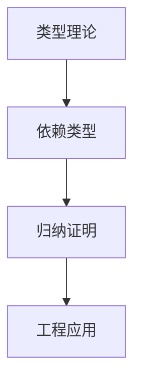

# 1.2 类型理论与证明

## 目录

1.2.1 主题概述  
1.2.2 类型理论基础  
1.2.3 主要类型系统  
1.2.4 形式化证明方法  
1.2.5 典型案例与实现  
1.2.6 图表与多表征  
1.2.7 相关性与交叉引用  
1.2.8 参考文献与延伸阅读  

---

### 1.2.1 主题概述

本节梳理类型理论的发展脉络、基本思想及其在lean等形式化系统中的应用。

### 1.2.2 类型理论基础

- 简单类型、依赖类型、代数数据类型
- Curry-Howard 对应

### 1.2.3 主要类型系统

- λ演算与类型系统
- ML、System F、Dependent Type

### 1.2.4 形式化证明方法

- 类型检查与类型推导
- 归纳法、构造法、反证法

### 1.2.5 典型案例与实现

#### 自然数类型与归纳证明（Lean 代码示例）

```lean
inductive Nat
| zero : Nat
| succ : Nat → Nat

theorem add_zero (n : Nat) : n + 0 = n :=
begin
  induction n,
  case zero { refl },
  case succ k ih { simp [ih] }
end
```

### 1.2.6 图表与多表征



### 1.2.7 相关性与交叉引用

- [1.1-统一形式化理论综述](./1.1-统一形式化理论综述.md)
- [2.2-数学与形式化语言关系](../2-数学基础与应用/2.2-数学与形式化语言关系.md)

### 1.2.8 参考文献与延伸阅读

- 《类型理论与形式化证明》
- Lean 官方文档
- 相关论文与开源项目
