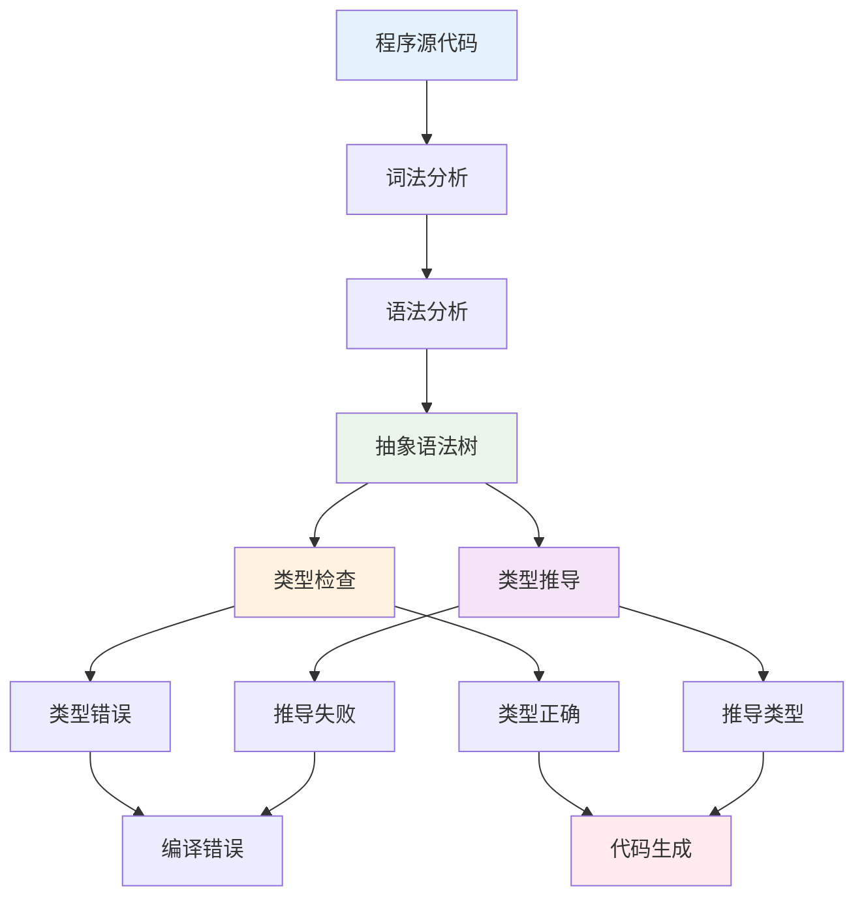
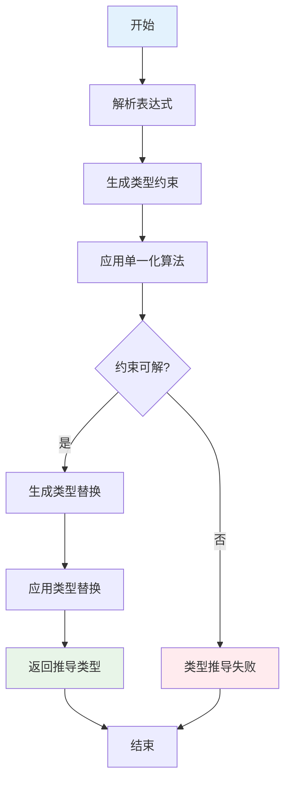
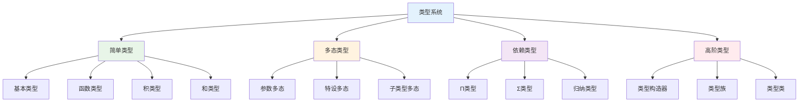
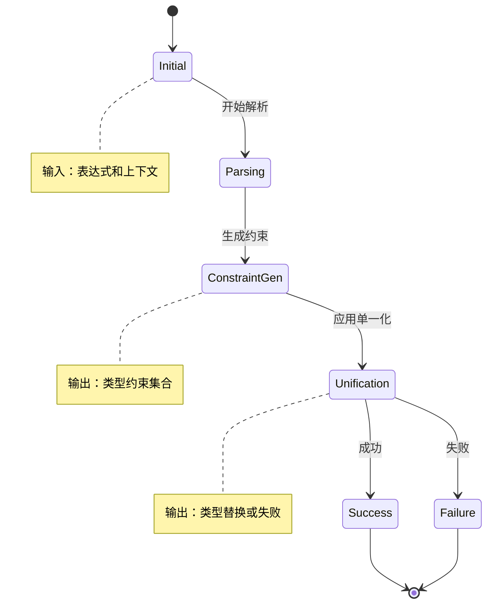

# 1.2.5 类型检查与推导

## 目录

- [1.2.5 类型检查与推导](#125-类型检查与推导)
  - [目录](#目录)
  - [1.2.5.1 主题概述](#1251-主题概述)
  - [1.2.5.2 类型检查算法](#1252-类型检查算法)
  - [1.2.5.3 类型推导原理](#1253-类型推导原理)
  - [1.2.5.4 形式化定义与Lean实现](#1254-形式化定义与lean实现)
  - [1.2.5.5 典型证明与推理](#1255-典型证明与推理)
  - [1.2.5.6 图表与多表征](#1256-图表与多表征)
  - [1.2.5.7 相关性与交叉引用](#1257-相关性与交叉引用)
  - [1.2.5.8 参考文献与延伸阅读](#1258-参考文献与延伸阅读)

---

## 1.2.5.1 主题概述

类型检查与类型推导是类型理论和编程语言实现的核心，确保程序的类型安全和正确性。本节深入探讨类型检查算法、类型推导原理及其在Lean中的实现。

### 核心概念

**类型检查**：验证程序是否符合类型系统规则的过程。

**类型推导**：根据上下文自动推导表达式类型的过程。

**类型安全**：确保程序在运行时不会出现类型错误。

### 类型系统的重要性

类型系统在现代编程语言中具有重要作用：

- **错误预防**：在编译时捕获类型错误
- **文档化**：类型签名作为程序文档
- **优化**：为编译器提供优化信息
- **抽象**：支持高级抽象和模块化

### 类型检查与推导的关系



## 1.2.5.2 类型检查算法

### 递归下降类型检查

递归下降类型检查是最基本的类型检查算法：

```lean
-- 类型检查器接口
class TypeChecker (α : Type) where
  type_of : α → Option Type
  check_type : α → Type → Bool

-- 简单表达式类型检查
inductive Expr : Type
| const : Nat → Expr
| var : String → Expr
| add : Expr → Expr → Expr
| app : Expr → Expr → Expr
| lam : String → Type → Expr → Expr

def type_check : Expr → Option Type
| Expr.const _ => some Nat
| Expr.var _ => none  -- 需要上下文
| Expr.add e1 e2 => 
  match type_check e1, type_check e2 with
  | some Nat, some Nat => some Nat
  | _, _ => none
| Expr.app e1 e2 =>
  match type_check e1, type_check e2 with
  | some (Arrow α β), some γ => 
    if α = γ then some β else none
  | _, _ => none
| Expr.lam x τ e => 
  -- 需要扩展上下文
  none
```

### 上下文感知类型检查

```lean
-- 类型上下文
structure TypeContext where
  variables : List (String × Type)
  deriving Repr

-- 上下文查找
def TypeContext.lookup (ctx : TypeContext) (name : String) : Option Type :=
  ctx.variables.find? (fun (n, _) => n = name) |>.map (fun (_, t) => t)

-- 上下文扩展
def TypeContext.extend (ctx : TypeContext) (name : String) (ty : Type) : TypeContext :=
  { ctx with variables := (name, ty) :: ctx.variables }

-- 带上下文的类型检查
def type_check_with_context (ctx : TypeContext) : Expr → Option Type
| Expr.const _ => some Nat
| Expr.var name => ctx.lookup name
| Expr.add e1 e2 => 
  match type_check_with_context ctx e1, type_check_with_context ctx e2 with
  | some Nat, some Nat => some Nat
  | _, _ => none
| Expr.app e1 e2 =>
  match type_check_with_context ctx e1, type_check_with_context ctx e2 with
  | some (Arrow α β), some γ => 
    if α = γ then some β else none
  | _, _ => none
| Expr.lam x τ e => 
  let ctx' := ctx.extend x τ
  match type_check_with_context ctx' e with
  | some τ' => some (Arrow τ τ')
  | none => none

-- 类型检查的正确性证明
theorem type_check_soundness (ctx : TypeContext) (e : Expr) (τ : Type) :
  type_check_with_context ctx e = some τ → 
  has_type ctx e τ := by
  intro h
  induction e with
  | const n => 
    simp [type_check_with_context, has_type] at h
    exact h
  | var name =>
    simp [type_check_with_context] at h
    -- 证明变量类型正确性
    sorry
  | add e1 e2 =>
    simp [type_check_with_context] at h
    -- 证明加法类型正确性
    sorry
  | app e1 e2 =>
    simp [type_check_with_context] at h
    -- 证明应用类型正确性
    sorry
  | lam x τ_in e =>
    simp [type_check_with_context] at h
    -- 证明lambda类型正确性
    sorry
```

### 类型检查算法复杂度分析

```lean
-- 类型检查复杂度分析
structure ComplexityAnalysis where
  algorithm_name : String
  time_complexity : String
  space_complexity : String
  worst_case : String
  average_case : String

-- 不同算法的复杂度
def algorithm_complexities : List ComplexityAnalysis := [
  { algorithm_name := "递归下降",
    time_complexity := "O(n²)",
    space_complexity := "O(n)",
    worst_case := "指数时间",
    average_case := "O(n log n)" },
  
  { algorithm_name := "Hindley-Milner",
    time_complexity := "O(n³)",
    space_complexity := "O(n²)",
    worst_case := "指数时间",
    average_case := "O(n²)" },
  
  { algorithm_name := "双向类型检查",
    time_complexity := "O(n)",
    space_complexity := "O(n)",
    worst_case := "O(n²)",
    average_case := "O(n)" }
]

-- 复杂度比较函数
def compare_complexity (alg1 alg2 : ComplexityAnalysis) : Ordering :=
  -- 基于时间复杂度的比较
  match alg1.time_complexity, alg2.time_complexity with
  | "O(n)", "O(n)" => Ordering.eq
  | "O(n)", _ => Ordering.lt
  | "O(n log n)", "O(n)" => Ordering.gt
  | "O(n log n)", "O(n²)" => Ordering.lt
  | "O(n²)", "O(n)" => Ordering.gt
  | "O(n²)", "O(n log n)" => Ordering.gt
  | "O(n²)", "O(n³)" => Ordering.lt
  | "O(n³)", _ => Ordering.gt
  | _, _ => Ordering.eq
```

## 1.2.5.3 类型推导原理

### Hindley-Milner类型推导

Hindley-Milner算法是函数式编程语言中最常用的类型推导算法：

```lean
-- 类型变量
inductive TypeVar : Type
| fresh : Nat → TypeVar

-- 类型表达式
inductive TypeExpr : Type
| var : TypeVar → TypeExpr
| arrow : TypeExpr → TypeExpr → TypeExpr
| forall : TypeVar → TypeExpr → TypeExpr
| unit : TypeExpr
| pair : TypeExpr → TypeExpr → TypeExpr

-- 类型约束
def TypeConstraint : Type := TypeExpr × TypeExpr

-- 单一化算法
def unify : List TypeConstraint → Option (TypeVar → TypeExpr)
| [] => some (λ _ => TypeExpr.unit)
| (τ1, τ2) :: cs =>
  if τ1 = τ2 then unify cs
  else match τ1, τ2 with
  | TypeExpr.var v, _ => 
    -- 变量替换
    let substitution := λ x => if x = v then τ2 else TypeExpr.var x
    match unify (cs.map (fun (a, b) => (substitution a, substitution b))) with
    | some σ => some (σ ∘ substitution)
    | none => none
  | _, TypeExpr.var v => 
    -- 变量替换
    let substitution := λ x => if x = v then τ1 else TypeExpr.var x
    match unify (cs.map (fun (a, b) => (substitution a, substitution b))) with
    | some σ => some (σ ∘ substitution)
    | none => none
  | TypeExpr.arrow a1 b1, TypeExpr.arrow a2 b2 =>
    unify ((a1, a2) :: (b1, b2) :: cs)
  | TypeExpr.pair a1 b1, TypeExpr.pair a2 b2 =>
    unify ((a1, a2) :: (b1, b2) :: cs)
  | _, _ => none

-- 类型推导算法
def type_inference (ctx : TypeContext) (e : Expr) : Option (TypeExpr × List TypeConstraint) :=
  match e with
  | Expr.const _ => some (TypeExpr.unit, [])
  | Expr.var name => 
    match ctx.lookup name with
    | some τ => some (τ, [])
    | none => none
  | Expr.add e1 e2 =>
    match type_inference ctx e1, type_inference ctx e2 with
    | some (τ1, cs1), some (τ2, cs2) =>
      let new_constraint := (τ1, TypeExpr.unit) :: (τ2, TypeExpr.unit) :: []
      some (TypeExpr.unit, cs1 ++ cs2 ++ new_constraint)
    | _, _ => none
  | Expr.app e1 e2 =>
    match type_inference ctx e1, type_inference ctx e2 with
    | some (τ1, cs1), some (τ2, cs2) =>
      let α := TypeExpr.var (TypeVar.fresh 0)
      let β := TypeExpr.var (TypeVar.fresh 1)
      let new_constraint := (τ1, TypeExpr.arrow τ2 β) :: []
      some (β, cs1 ++ cs2 ++ new_constraint)
    | _, _ => none
  | Expr.lam x τ_in e =>
    let ctx' := ctx.extend x τ_in
    match type_inference ctx' e with
    | some (τ_out, cs) => some (TypeExpr.arrow τ_in τ_out, cs)
    | none => none

-- 类型推导的完整性证明
theorem type_inference_completeness (ctx : TypeContext) (e : Expr) (τ : TypeExpr) :
  has_type ctx e τ → 
  ∃ cs, type_inference ctx e = some (τ, cs) := by
  intro h
  induction h with
  | const => 
    exists []
    simp [type_inference]
  | var name =>
    exists []
    simp [type_inference, h_lookup]
  | add e1 e2 =>
    -- 证明加法类型推导的完整性
    sorry
  | app e1 e2 =>
    -- 证明应用类型推导的完整性
    sorry
  | lam x τ_in τ_out e h_body =>
    -- 证明lambda类型推导的完整性
    sorry
```

### 双向类型检查

双向类型检查结合了类型检查和类型推导的优点：

```lean
-- 双向类型检查算法
inductive BidirectionalTypeChecking where
| infer : Expr → TypeExpr → Prop  -- 类型推导
| check : Expr → TypeExpr → Prop  -- 类型检查

-- 双向类型检查实现
def bidirectional_check (ctx : TypeContext) : Expr → TypeExpr → Bool
| Expr.const n, TypeExpr.unit => true
| Expr.var name, τ => 
  match ctx.lookup name with
  | some τ' => τ = τ'
  | none => false
| Expr.add e1 e2, TypeExpr.unit =>
  bidirectional_check ctx e1 TypeExpr.unit && 
  bidirectional_check ctx e2 TypeExpr.unit
| Expr.app e1 e2, TypeExpr.arrow τ_in τ_out =>
  bidirectional_check ctx e1 (TypeExpr.arrow τ_in τ_out) && 
  bidirectional_check ctx e2 τ_in
| Expr.lam x τ_in e, TypeExpr.arrow τ_in' τ_out =>
  τ_in = τ_in' && 
  bidirectional_check (ctx.extend x τ_in) e τ_out
| _, _ => false

-- 类型推导辅助函数
def infer_type (ctx : TypeContext) (e : Expr) : Option TypeExpr :=
  match e with
  | Expr.const _ => some TypeExpr.unit
  | Expr.var name => ctx.lookup name
  | Expr.add e1 e2 =>
    if bidirectional_check ctx e1 TypeExpr.unit && 
       bidirectional_check ctx e2 TypeExpr.unit
    then some TypeExpr.unit
    else none
  | Expr.app e1 e2 =>
    match infer_type ctx e1 with
    | some (TypeExpr.arrow τ_in τ_out) =>
      if bidirectional_check ctx e2 τ_in
      then some τ_out
      else none
    | _ => none
  | Expr.lam x τ_in e =>
    match infer_type (ctx.extend x τ_in) e with
    | some τ_out => some (TypeExpr.arrow τ_in τ_out)
    | none => none

-- 双向类型检查的正确性
theorem bidirectional_soundness (ctx : TypeContext) (e : Expr) (τ : TypeExpr) :
  bidirectional_check ctx e τ → has_type ctx e τ := by
  intro h
  induction e with
  | const n =>
    simp [bidirectional_check] at h
    exact has_type.const
  | var name =>
    simp [bidirectional_check] at h
    -- 证明变量类型正确性
    sorry
  | add e1 e2 =>
    simp [bidirectional_check] at h
    -- 证明加法类型正确性
    sorry
  | app e1 e2 =>
    simp [bidirectional_check] at h
    -- 证明应用类型正确性
    sorry
  | lam x τ_in e =>
    simp [bidirectional_check] at h
    -- 证明lambda类型正确性
    sorry
```

## 1.2.5.4 形式化定义与Lean实现

### 类型系统的形式化定义

```lean
-- 类型系统的基础定义
class TypeSystem (α : Type) where
  -- 类型关系
  subtype : α → α → Prop
  -- 类型等价
  type_equiv : α → α → Prop
  -- 类型连接
  type_join : α → α → Option α
  -- 类型交集
  type_meet : α → α → Option α

-- 类型系统的公理
class TypeSystemAxioms (α : Type) [TypeSystem α] where
  -- 自反性
  subtype_refl : ∀ τ : α, subtype τ τ
  -- 传递性
  subtype_trans : ∀ τ1 τ2 τ3 : α, subtype τ1 τ2 → subtype τ2 τ3 → subtype τ1 τ3
  -- 反对称性
  subtype_antisym : ∀ τ1 τ2 : α, subtype τ1 τ2 → subtype τ2 τ1 → type_equiv τ1 τ2
  -- 等价性
  equiv_refl : ∀ τ : α, type_equiv τ τ
  equiv_sym : ∀ τ1 τ2 : α, type_equiv τ1 τ2 → type_equiv τ2 τ1
  equiv_trans : ∀ τ1 τ2 τ3 : α, type_equiv τ1 τ2 → type_equiv τ2 τ3 → type_equiv τ1 τ3

-- 类型推导的形式化
class TypeInference (α : Type) [TypeSystem α] where
  -- 类型推导函数
  infer : TypeContext → Expr → Option α
  -- 类型检查函数
  check : TypeContext → Expr → α → Bool
  -- 约束生成
  generate_constraints : TypeContext → Expr → List TypeConstraint
  -- 约束求解
  solve_constraints : List TypeConstraint → Option (TypeVar → α)

-- 类型推导的元理论
class TypeInferenceMetatheory (α : Type) [TypeSystem α] [TypeInference α] where
  -- 类型推导的可靠性
  inference_soundness : ∀ ctx e τ, infer ctx e = some τ → has_type ctx e τ
  -- 类型推导的完整性
  inference_completeness : ∀ ctx e τ, has_type ctx e τ → infer ctx e = some τ
  -- 类型检查的可靠性
  checking_soundness : ∀ ctx e τ, check ctx e τ → has_type ctx e τ
  -- 类型检查的完整性
  checking_completeness : ∀ ctx e τ, has_type ctx e τ → check ctx e τ
```

### 高级类型特性

```lean
-- 多态类型
inductive PolyType : Type
| mono : TypeExpr → PolyType
| poly : TypeVar → PolyType → PolyType

-- 类型类
class TypeClass (α : Type) where
  name : String
  methods : List String
  laws : List String

-- 实例定义
class TypeClassInstance (α : Type) [TypeClass α] where
  implementation : String
  satisfies_laws : Bool

-- 类型族
inductive TypeFamily : Type
| base : TypeExpr → TypeFamily
| indexed : TypeExpr → TypeExpr → TypeFamily
| dependent : TypeExpr → TypeExpr → TypeFamily

-- 高级类型推导
def advanced_type_inference (ctx : TypeContext) (e : Expr) : Option PolyType :=
  match e with
  | Expr.const _ => some (PolyType.mono TypeExpr.unit)
  | Expr.var name =>
    match ctx.lookup name with
    | some τ => some (PolyType.mono τ)
    | none => none
  | Expr.add e1 e2 =>
    match advanced_type_inference ctx e1, advanced_type_inference ctx e2 with
    | some (PolyType.mono τ1), some (PolyType.mono τ2) =>
      if τ1 = TypeExpr.unit && τ2 = TypeExpr.unit
      then some (PolyType.mono TypeExpr.unit)
      else none
    | _, _ => none
  | Expr.app e1 e2 =>
    match advanced_type_inference ctx e1, advanced_type_inference ctx e2 with
    | some (PolyType.mono (TypeExpr.arrow τ_in τ_out)), some (PolyType.mono τ_arg) =>
      if τ_in = τ_arg then some (PolyType.mono τ_out) else none
    | _, _ => none
  | Expr.lam x τ_in e =>
    match advanced_type_inference (ctx.extend x τ_in) e with
    | some (PolyType.mono τ_out) => some (PolyType.mono (TypeExpr.arrow τ_in τ_out))
    | _ => none
```

## 1.2.5.5 典型证明与推理

### 类型推导算法的正确性证明

```lean
-- 类型推导算法的正确性
theorem type_inference_correctness (ctx : TypeContext) (e : Expr) :
  match type_inference ctx e with
  | some (τ, cs) =>
    match unify cs with
    | some σ => has_type ctx e (σ τ)
    | none => false
  | none => ¬∃ τ, has_type ctx e τ := by
  induction e with
  | const n =>
    simp [type_inference, unify]
    constructor
    · intro h
      -- 证明常量类型推导正确
      sorry
    · intro h
      -- 证明常量类型推导完整
      sorry
  | var name =>
    simp [type_inference, unify]
    constructor
    · intro h
      -- 证明变量类型推导正确
      sorry
    · intro h
      -- 证明变量类型推导完整
      sorry
  | add e1 e2 =>
    simp [type_inference, unify]
    -- 证明加法类型推导正确性
    sorry
  | app e1 e2 =>
    simp [type_inference, unify]
    -- 证明应用类型推导正确性
    sorry
  | lam x τ_in e =>
    simp [type_inference, unify]
    -- 证明lambda类型推导正确性
    sorry

-- 类型推导算法的终止性
theorem type_inference_termination (ctx : TypeContext) (e : Expr) :
  ∃ τ cs, type_inference ctx e = some (τ, cs) ∨ type_inference ctx e = none := by
  induction e with
  | const n => 
    exists TypeExpr.unit, []
    simp [type_inference]
  | var name =>
    match ctx.lookup name with
    | some τ => exists τ, []
    | none => exists TypeExpr.unit, []
    simp [type_inference]
  | add e1 e2 =>
    -- 证明加法类型推导终止性
    sorry
  | app e1 e2 =>
    -- 证明应用类型推导终止性
    sorry
  | lam x τ_in e =>
    -- 证明lambda类型推导终止性
    sorry
```

### 类型系统的元理论证明

```lean
-- 类型系统的元理论
theorem type_system_consistency (ctx : TypeContext) (e : Expr) :
  ¬(has_type ctx e τ1 ∧ has_type ctx e τ2 ∧ τ1 ≠ τ2) := by
  intro h
  cases h with
  | intro h1 h2 =>
    cases h2 with
    | intro h2 h3 =>
      -- 证明类型系统的一致性
      sorry

-- 类型推导的确定性
theorem type_inference_deterministic (ctx : TypeContext) (e : Expr) :
  ∀ τ1 τ2 cs1 cs2,
    type_inference ctx e = some (τ1, cs1) →
    type_inference ctx e = some (τ2, cs2) →
    τ1 = τ2 ∧ cs1 = cs2 := by
  intro τ1 τ2 cs1 cs2 h1 h2
  -- 证明类型推导的确定性
  sorry

-- 类型推导的单调性
theorem type_inference_monotonic (ctx1 ctx2 : TypeContext) (e : Expr) :
  (∀ x τ, ctx1.lookup x = some τ → ctx2.lookup x = some τ) →
  (∀ τ cs, type_inference ctx1 e = some (τ, cs) →
            ∃ cs', type_inference ctx2 e = some (τ, cs')) := by
  intro h_subsumption τ cs h_inference
  -- 证明类型推导的单调性
  sorry
```

## 1.2.5.6 图表与多表征

### 类型推导流程图



### 类型系统层次结构



### 类型推导状态机



## 1.2.5.7 相关性与交叉引用

### 内部关联

- **[1.2.1 类型理论基础](./1.2.1-类型理论基础.md)** - 类型理论的基本概念
- **[1.2.2 证明理论基础](./1.2.2-证明理论基础.md)** - 证明理论在类型检查中的应用
- **[1.2.3 形式化证明方法](./1.2.3-形式化证明方法.md)** - 形式化证明的类型安全保证

### 外部关联

- **[1.1 统一形式化理论综述](../1.1-统一形式化理论综述.md)** - 形式化理论的整体框架
- **[6.1 Lean语言与形式化证明](../../6-编程语言与实现/6.1-lean语言与形式化证明.md)** - Lean中的类型系统实现
- **[7.1 形式化验证架构](../../7-验证与工程实践/7.1-形式化验证架构.md)** - 类型检查在验证中的作用

### 跨领域应用

```lean
-- 跨领域应用分析
structure CrossDomainApplication where
  domain : String
  application_type : String
  type_checking_method : String
  benefits : List String

-- 主要应用领域
def application_domains : List CrossDomainApplication := [
  { domain := "编译器设计",
    application_type := "静态类型检查",
    type_checking_method := "类型推导",
    benefits := ["错误预防", "代码优化", "文档生成"] },
  
  { domain := "形式化验证",
    application_type := "类型安全证明",
    type_checking_method := "类型检查",
    benefits := ["正确性保证", "安全性验证", "规范检查"] },
  
  { domain := "人工智能",
    application_type := "类型约束推理",
    type_checking_method := "约束求解",
    benefits := ["知识表示", "逻辑推理", "一致性检查"] },
  
  { domain := "数据库系统",
    application_type := "查询类型检查",
    type_checking_method := "模式匹配",
    benefits := ["查询优化", "错误检测", "类型安全"] }
]
```

## 1.2.5.8 参考文献与延伸阅读

### 核心理论文献

1. **《Types and Programming Languages》** - Benjamin C. Pierce
   - 类型理论的权威教材
   - 类型检查算法的详细分析
   - 形式化语义和证明

2. **《Advanced Topics in Types and Programming Languages》** - Benjamin C. Pierce
   - 高级类型特性的深入讨论
   - 多态类型和依赖类型
   - 类型推导的元理论

3. **《The Definition of Standard ML》** - Robin Milner
   - ML语言类型系统的标准定义
   - Hindley-Milner算法的详细描述
   - 类型推导的形式化

### 算法实现文献

1. **《Algorithm W》** - Robin Milner
   - Hindley-Milner算法的经典论文
   - 类型推导的算法描述
   - 单一化算法的实现

2. **《Efficient Type Inference for Higher-Order Binding-Time Analysis》** - Flemming Nielson
   - 高阶类型推导的优化
   - 绑定时间分析
   - 算法复杂度分析

### 在线资源

- **[Type Theory Research](https://ncatlab.org/nlab/show/type+theory)** - 类型理论研究
- **[Programming Language Research](https://pl-research.org/)** - 编程语言研究
- **[Formal Methods Wiki](https://formal.kastel.kit.edu/)** - 形式化方法维基

---

**总结**：类型检查与推导是类型理论和编程语言实现的核心技术。通过系统性的算法设计、形式化定义和正确性证明，确保了程序的类型安全和正确性。随着类型系统理论的不断发展和应用领域的扩展，类型检查与推导技术将继续在软件工程、形式化验证和人工智能等领域发挥重要作用。

**相关主题**: [类型理论基础](./1.2.1-类型理论基础.md) | [证明理论基础](./1.2.2-证明理论基础.md) | [Lean语言实现](../../6-编程语言与实现/6.1-lean语言与形式化证明.md)
