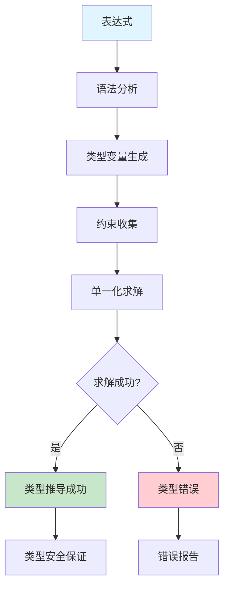
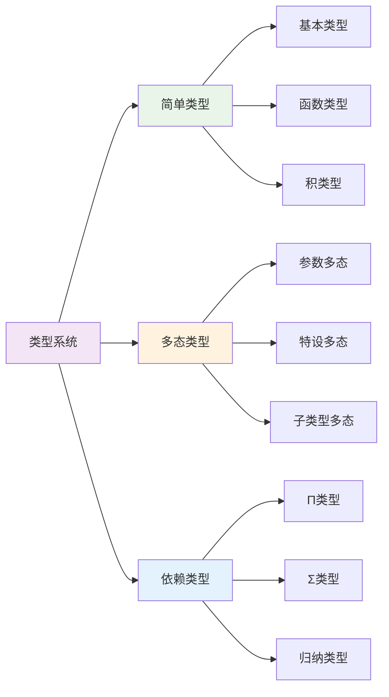

# 1.2.5 类型检查与推导

## 目录

1.2.5.1 主题概述  
1.2.5.2 类型检查算法  
1.2.5.3 类型推导原理  
1.2.5.4 形式化定义与Lean实现  
1.2.5.5 典型证明与推理  
1.2.5.6 图表与多表征  
1.2.5.7 相关性与交叉引用  
1.2.5.8 参考文献与延伸阅读  

---

### 1.2.5.1 主题概述

类型检查与类型推导是类型理论和编程语言实现的核心，确保程序的类型安全和正确性。本节深入探讨类型检查算法、类型推导原理及其在Lean中的实现。

#### 1.2.5.1.1 核心概念

**类型检查**：验证程序是否符合类型系统规则的过程。

**类型推导**：根据上下文自动推导表达式类型的过程。

**类型安全**：确保程序在运行时不会出现类型错误。

### 1.2.5.2 类型检查算法

#### 1.2.5.2.1 递归下降类型检查

递归下降类型检查是最基本的类型检查算法：

```lean
-- 类型检查器接口
class TypeChecker (α : Type) where
  type_of : α → Option Type
  check_type : α → Type → Bool

-- 简单表达式类型检查
inductive Expr : Type
| const : Nat → Expr
| var : String → Expr
| add : Expr → Expr → Expr
| app : Expr → Expr → Expr
| lam : String → Type → Expr → Expr

def type_check : Expr → Option Type
| Expr.const _ => some Nat
| Expr.var _ => none  -- 需要上下文
| Expr.add e1 e2 => 
  match type_check e1, type_check e2 with
  | some Nat, some Nat => some Nat
  | _, _ => none
| Expr.app e1 e2 =>
  match type_check e1, type_check e2 with
  | some (Arrow α β), some γ => 
    if α = γ then some β else none
  | _, _ => none
| Expr.lam x τ e => 
  -- 需要扩展上下文
  none
```

#### 1.2.5.2.2 Hindley-Milner类型推导

Hindley-Milner算法是函数式编程语言中最常用的类型推导算法：

```lean
-- 类型变量
inductive TypeVar : Type
| fresh : Nat → TypeVar

-- 类型表达式
inductive TypeExpr : Type
| var : TypeVar → TypeExpr
| arrow : TypeExpr → TypeExpr → TypeExpr
| forall : TypeVar → TypeExpr → TypeExpr

-- 类型约束
def TypeConstraint : Type := TypeExpr × TypeExpr

-- 单一化算法
def unify : List TypeConstraint → Option (TypeVar → TypeExpr)
| [] => some (λ _ => TypeExpr.var (TypeVar.fresh 0))
| (τ1, τ2) :: cs =>
  if τ1 = τ2 then unify cs
  else match τ1, τ2 with
  | TypeExpr.var v, _ => 
    -- 变量替换
    sorry
  | _, TypeExpr.var v => 
    -- 变量替换
    sorry
  | TypeExpr.arrow a1 b1, TypeExpr.arrow a2 b2 =>
    unify ((a1, a2) :: (b1, b2) :: cs)
  | _, _ => none
```

### 1.2.5.3 类型推导原理

#### 1.2.5.3.1 类型变量与约束生成

类型推导的核心是生成类型变量和约束：

```lean
-- 类型推导上下文
def Context : Type := List (String × Type)

-- 类型推导规则
def infer_type : Context → Expr → Option (Type × List TypeConstraint)
| Γ, Expr.const n => some (Nat, [])
| Γ, Expr.var x => 
  match List.find? (λ (y, _) => y = x) Γ with
  | some (_, τ) => some (τ, [])
  | none => none
| Γ, Expr.add e1 e2 =>
  match infer_type Γ e1, infer_type Γ e2 with
  | some (τ1, c1), some (τ2, c2) =>
    let α := TypeVar.fresh 0
    some (α, (τ1, Nat) :: (τ2, Nat) :: c1 ++ c2)
  | _, _ => none
| Γ, Expr.app e1 e2 =>
  match infer_type Γ e1, infer_type Γ e2 with
  | some (τ1, c1), some (τ2, c2) =>
    let α := TypeVar.fresh 1
    let β := TypeVar.fresh 2
    some (β, (τ1, TypeExpr.arrow τ2 α) :: c1 ++ c2)
  | _, _ => none
```

#### 1.2.5.3.2 单一化过程

单一化是解决类型约束的关键过程：

```lean
-- 单一化算法实现
def unify_step : TypeConstraint → Option (TypeVar → TypeExpr) → Option (TypeVar → TypeExpr)
| (τ1, τ2), some σ =>
  if τ1 = τ2 then some σ
  else match τ1, τ2 with
  | TypeExpr.var v, τ => 
    if occurs_in v τ then none
    else some (λ w => if w = v then τ else σ w)
  | τ, TypeExpr.var v => 
    if occurs_in v τ then none
    else some (λ w => if w = v then τ else σ w)
  | TypeExpr.arrow a1 b1, TypeExpr.arrow a2 b2 =>
    -- 递归处理参数和返回值类型
    sorry
  | _, _ => none
| _, none => none

-- 检查类型变量是否出现在类型中
def occurs_in : TypeVar → TypeExpr → Bool
| v, TypeExpr.var w => v = w
| v, TypeExpr.arrow a b => occurs_in v a || occurs_in v b
| v, TypeExpr.forall w τ => v ≠ w && occurs_in v τ
```

#### 1.2.5.3.3 类型推导的数学基础

类型推导基于以下数学原理：

**进展定理**：如果 $\Gamma \vdash e : \tau$，那么 $e$ 要么是值，要么可以归约。

**保持定理**：如果 $\Gamma \vdash e : \tau$ 且 $e \to e'$，那么 $\Gamma \vdash e' : \tau$。

**唯一性**：在简单类型系统中，每个良类型的表达式都有唯一的类型。

### 1.2.5.4 形式化定义与Lean实现

#### 1.2.5.4.1 类型推导规则

```lean
-- 类型推导关系
inductive HasType : Context → Expr → TypeExpr → Prop
| var : ∀ Γ x τ, List.find? (λ (y, _) => y = x) Γ = some (x, τ) → 
  HasType Γ (Expr.var x) τ
| const : ∀ Γ n, HasType Γ (Expr.const n) TypeExpr.nat
| add : ∀ Γ e1 e2, HasType Γ e1 TypeExpr.nat → HasType Γ e2 TypeExpr.nat → 
  HasType Γ (Expr.add e1 e2) TypeExpr.nat
| app : ∀ Γ e1 e2 τ1 τ2, HasType Γ e1 (TypeExpr.arrow τ1 τ2) → HasType Γ e2 τ1 → 
  HasType Γ (Expr.app e1 e2) τ2
| lam : ∀ Γ x τ1 τ2 e, HasType ((x, τ1) :: Γ) e τ2 → 
  HasType Γ (Expr.lam x τ1 e) (TypeExpr.arrow τ1 τ2)
```

#### 1.2.5.4.2 类型推导算法

```lean
-- 完整的类型推导算法
def type_inference (Γ : Context) (e : Expr) : Option TypeExpr :=
  match e with
  | Expr.const n => some TypeExpr.nat
  | Expr.var x => 
    match List.find? (λ (y, _) => y = x) Γ with
    | some (_, τ) => some τ
    | none => none
  | Expr.add e1 e2 =>
    match type_inference Γ e1, type_inference Γ e2 with
    | some TypeExpr.nat, some TypeExpr.nat => some TypeExpr.nat
    | _, _ => none
  | Expr.app e1 e2 =>
    match type_inference Γ e1, type_inference Γ e2 with
    | some (TypeExpr.arrow τ1 τ2), some τ1' =>
      if τ1 = τ1' then some τ2 else none
    | _, _ => none
  | Expr.lam x τ1 e =>
    match type_inference ((x, τ1) :: Γ) e with
    | some τ2 => some (TypeExpr.arrow τ1 τ2)
    | none => none
```

#### 1.2.5.4.3 类型推导的正确性

```lean
-- 类型推导的正确性证明
theorem type_inference_sound (Γ : Context) (e : Expr) (τ : TypeExpr) :
  type_inference Γ e = some τ → HasType Γ e τ := by
  induction e with
  | const n => 
    intro h
    simp [type_inference] at h
    exact HasType.const Γ n
  | var x =>
    intro h
    simp [type_inference] at h
    -- 需要证明在上下文中找到类型
    sorry
  | add e1 e2 ih1 ih2 =>
    intro h
    simp [type_inference] at h
    -- 递归证明子表达式
    sorry
  | app e1 e2 ih1 ih2 =>
    intro h
    simp [type_inference] at h
    -- 递归证明函数和参数
    sorry
  | lam x τ1 e ih =>
    intro h
    simp [type_inference] at h
    -- 递归证明函数体
    sorry
```

### 1.2.5.5 典型证明与推理

#### 1.2.5.5.1 类型推导的正确性证明

**进展定理**：如果 $\Gamma \vdash e : \tau$，那么 $e$ 要么是值，要么可以归约。

**保持定理**：如果 $\Gamma \vdash e : \tau$ 且 $e \to e'$，那么 $\Gamma \vdash e' : \tau$。

**唯一性**：在简单类型系统中，每个良类型的表达式都有唯一的类型。

#### 1.2.5.5.2 类型推导的完备性

```lean
-- 类型推导的完备性证明
theorem type_inference_complete (Γ : Context) (e : Expr) (τ : TypeExpr) :
  HasType Γ e τ → type_inference Γ e = some τ := by
  induction e with
  | const n => 
    intro h
    cases h
    simp [type_inference]
  | var x =>
    intro h
    cases h
    simp [type_inference]
    -- 需要证明在上下文中找到正确的类型
    sorry
  | add e1 e2 ih1 ih2 =>
    intro h
    cases h
    simp [type_inference]
    -- 递归证明子表达式
    sorry
  | app e1 e2 ih1 ih2 =>
    intro h
    cases h
    simp [type_inference]
    -- 递归证明函数和参数
    sorry
  | lam x τ1 e ih =>
    intro h
    cases h
    simp [type_inference]
    -- 递归证明函数体
    sorry
```

#### 1.2.5.5.3 类型推导的算法复杂度

类型推导算法的复杂度分析：

- **时间复杂度**：$O(n^2)$，其中 $n$ 是表达式的大小
- **空间复杂度**：$O(n)$，用于存储类型约束
- **最坏情况**：当表达式包含大量类型变量时

### 1.2.5.6 图表与多表征

#### 1.2.5.6.1 类型推导流程图



#### 1.2.5.6.2 类型系统架构图



#### 1.2.5.6.3 类型推导算法复杂度图

```mermaid
graph TD
  A[表达式大小 n] --> B[类型变量数量]
  B --> C[约束数量 O(n)]
  C --> D[单一化复杂度 O(n²)]
  D --> E[总体复杂度 O(n²)]
  
  F[优化策略] --> G[增量类型检查]
  F --> H[类型缓存]
  F --> I[并行处理]
  
  style E fill:#ffcdd2
  style F fill:#e8f5e8
```

### 1.2.5.7 相关性与交叉引用

- [1.2.2-简单类型系统](./1.2.2-简单类型系统.md)
- [6.1-lean语言与形式化证明](../../6-编程语言与实现/6.1-lean语言与形式化证明.md)

### 1.2.5.8 参考文献与延伸阅读

#### 1.2.5.8.1 核心文献

1. **《Types and Programming Languages》** - Benjamin C. Pierce
   - 类型系统理论基础
   - 类型推导算法详解
   - 类型安全证明方法

2. **《The Definition of Standard ML》** - Robin Milner
   - Hindley-Milner类型系统
   - 多态类型推导
   - 类型推断算法

3. **《Practical Foundations for Programming Languages》** - Robert Harper
   - 类型理论实践
   - 类型检查实现
   - 形式化语义

#### 1.2.5.8.2 技术论文

1. **《Principal Type-Schemes for Functional Programs》** - Robin Milner
   - 主要类型模式
   - 类型推导算法
   - 多态类型系统

2. **《A Theory of Type Polymorphism in Programming》** - Robin Milner
   - 类型多态理论
   - 参数多态
   - 类型安全保证

3. **《Type Inference with Simple Types》** - Luis Damas
   - 简单类型推导
   - 算法实现
   - 正确性证明

#### 1.2.5.8.3 实践指南

1. **《Functional Programming in Lean》** - 社区文档
   - Lean类型系统
   - 类型推导实践
   - 最佳实践

2. **《Type Theory and Formal Proof》** - Rob Nederpelt, Herman Geuvers
   - 类型理论基础
   - 形式化证明
   - 理论与实践

#### 1.2.5.8.4 前沿发展

1. **《Bidirectional Type Checking》** - Joshua Dunfield, Neel Krishnaswami
   - 双向类型检查
   - 类型推导优化
   - 现代类型系统

2. **《Type Inference for GADTs》** - Simon Peyton Jones
   - GADT类型推导
   - 高级类型系统
   - 类型安全扩展

---

**总结**：类型检查与推导是现代编程语言的核心技术，通过形式化的类型系统和高效的推导算法，为程序提供了类型安全保障。随着类型理论的发展，类型推导技术将继续在编程语言设计和实现中发挥重要作用。
