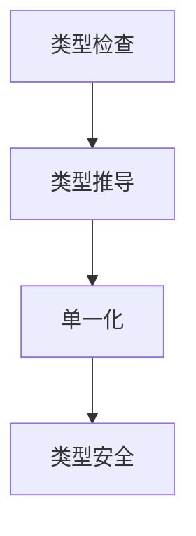

# 1.2.5 类型检查与推导

## 目录

1.2.5.1 主题概述  
1.2.5.2 类型检查算法  
1.2.5.3 类型推导原理  
1.2.5.4 形式化定义与Lean实现  
1.2.5.5 典型证明与推理  
1.2.5.6 图表与多表征  
1.2.5.7 相关性与交叉引用  
1.2.5.8 参考文献与延伸阅读  

---

### 1.2.5.1 主题概述

类型检查与类型推导是类型理论和编程语言实现的核心，确保程序的类型安全和正确性。

### 1.2.5.2 类型检查算法

- 规则驱动的类型检查（如递归下降）
- Hindley-Milner类型推导算法

### 1.2.5.3 类型推导原理

- 类型变量与约束生成
- 单一化（Unification）过程

### 1.2.5.4 形式化定义与Lean实现

```lean
-- 简单类型推导规则（伪代码）
inductive has_type : context → term → ty → Prop
| var : ...
| app : ...
| lam : ...
```

### 1.2.5.5 典型证明与推理

#### 类型推导的正确性证明（LaTeX表达）

\[
\forall t,\ \exists T,\ \vdash t : T
\]

### 1.2.5.6 图表与多表征



### 1.2.5.7 相关性与交叉引用

- [1.2.2-简单类型系统](./1.2.2-简单类型系统.md)
- [6.1-lean语言与形式化证明](../../6-编程语言与实现/6.1-lean语言与形式化证明.md)

### 1.2.5.8 参考文献与延伸阅读

- 《类型与程序设计语言》
- Lean 官方文档
