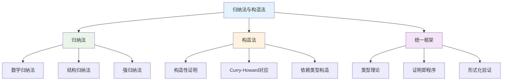
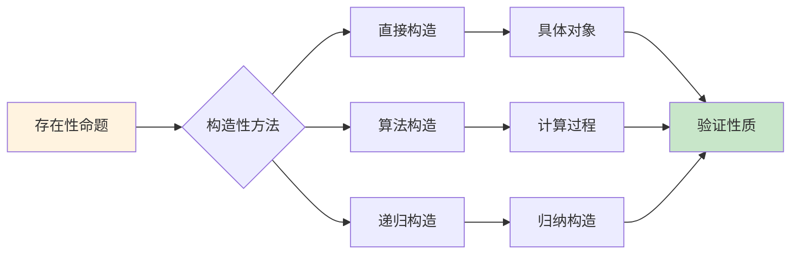
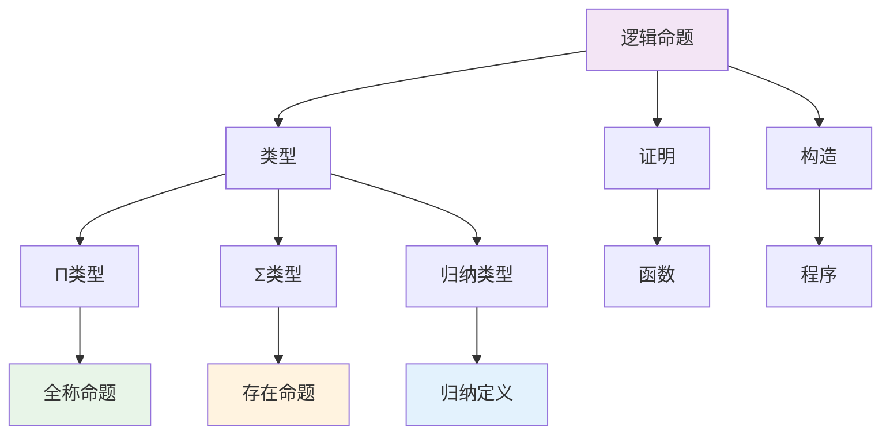

# 1.2.6 归纳法与构造法

## 目录

- [1.2.6 归纳法与构造法](#126-归纳法与构造法)
  - [目录](#目录)
  - [1.2.6.1 主题概述](#1261-主题概述)
  - [1.2.6.2 归纳法原理](#1262-归纳法原理)
  - [1.2.6.3 构造法思想](#1263-构造法思想)
  - [1.2.6.4 形式化定义与Lean证明](#1264-形式化定义与lean证明)
  - [1.2.6.5 典型案例与推理](#1265-典型案例与推理)
  - [1.2.6.6 图表与多表征](#1266-图表与多表征)
  - [1.2.6.7 相关性与交叉引用](#1267-相关性与交叉引用)
  - [1.2.6.8 参考文献与延伸阅读](#1268-参考文献与延伸阅读)  

---

## 1.2.6.1 主题概述

归纳法和构造法是类型理论和形式化证明中的两大基本方法，它们构成了现代数学和计算机科学的基础。本节深入探讨这两种方法在Lean中的实现和应用。

### 核心概念

**归纳法**：通过证明基础情况和归纳步骤来证明对所有自然数成立的命题。

**构造法**：通过实际构造对象来证明存在性命题，体现了构造性数学的思想。

### 历史背景

- **归纳法**：起源于Peano公理系统，是现代数学证明的基础
- **构造法**：源于直觉主义数学，强调构造性证明的重要性
- **类型理论**：Martin-Löf类型论将两者统一在类型系统中

### 研究意义与应用

归纳法和构造法在现代计算机科学中具有重要应用：

- **程序验证**：证明程序满足规约性质
- **类型安全**：确保类型系统的正确性
- **定理证明**：自动化证明数学定理
- **软件工程**：形式化软件开发方法

### 方法论框架



## 1.2.6.2 归纳法原理

### 数学归纳法

数学归纳法是证明自然数性质的基本方法：

**原理**：设 $P(n)$ 是关于自然数 $n$ 的命题，如果：

1. $P(0)$ 成立（基础情况）
2. 对于任意 $k \in \mathbb{N}$，如果 $P(k)$ 成立，则 $P(k+1)$ 成立（归纳步骤）

那么对于所有自然数 $n$，$P(n)$ 都成立。

#### 数学归纳法的形式化定义

```lean
-- 数学归纳法原理
theorem mathematical_induction (P : Nat → Prop) :
  P 0 → (∀ n : Nat, P n → P (n + 1)) → ∀ n : Nat, P n := by
  intro h_base h_step n
  induction n with
  | zero => exact h_base
  | succ k ih => exact h_step k ih

-- 归纳法在Lean中的使用
theorem add_zero_right (n : Nat) : n + 0 = n := by
  induction n with
  | zero => 
    simp [Nat.add]
  | succ k ih => 
    simp [Nat.add_succ]
    exact ih

-- 归纳法的变体：从1开始
theorem induction_from_one (P : Nat → Prop) :
  P 1 → (∀ n : Nat, n ≥ 1 → P n → P (n + 1)) → 
  ∀ n : Nat, n ≥ 1 → P n := by
  intro h_base h_step n h_ge_one
  induction n with
  | zero => contradiction
  | succ k ih => 
    cases k with
    | zero => exact h_base
    | succ l => 
      have h_k_ge_one : k + 1 ≥ 1 := by omega
      exact h_step k h_k_ge_one (ih h_k_ge_one)
```

### 结构归纳法

结构归纳法适用于归纳定义的数据结构：

**原理**：对于归纳定义的类型，通过证明：

1. 基础构造子的性质
2. 归纳构造子保持性质

来证明所有元素都满足该性质。

#### 结构归纳法的实现

```lean
-- 列表的结构归纳法
inductive List (α : Type) where
  | nil : List α
  | cons : α → List α → List α

-- 列表性质的结构归纳证明
theorem list_length_nonnegative {α : Type} (l : List α) : 
  list_length l ≥ 0 := by
  induction l with
  | nil => 
    simp [list_length]
    exact Nat.zero_le 0
  | cons x xs ih => 
    simp [list_length]
    exact Nat.le_add_right 0 (list_length xs)

-- 树的结构归纳法
inductive Tree (α : Type) where
  | leaf : α → Tree α
  | node : Tree α → Tree α → Tree α

-- 树性质的结构归纳证明
theorem tree_size_positive {α : Type} (t : Tree α) : 
  tree_size t > 0 := by
  induction t with
  | leaf x => 
    simp [tree_size]
    exact Nat.zero_lt_one
  | node left right ih_left ih_right => 
    simp [tree_size]
    have h_left : tree_size left > 0 := ih_left
    have h_right : tree_size right > 0 := ih_right
    exact Nat.add_pos h_left h_right
```

### 强归纳法

强归纳法允许在归纳步骤中使用更强的假设：

**原理**：设 $P(n)$ 是关于自然数 $n$ 的命题，如果对于任意 $n$，假设对于所有 $m < n$，$P(m)$ 都成立，能够推出 $P(n)$ 成立，那么对于所有自然数 $n$，$P(n)$ 都成立。

#### 强归纳法的实现

```lean
-- 强归纳法原理
theorem strong_induction (P : Nat → Prop) :
  (∀ n : Nat, (∀ m : Nat, m < n → P m) → P n) → 
  ∀ n : Nat, P n := by
  intro h_strong n
  have h_aux : ∀ n : Nat, ∀ m : Nat, m ≤ n → P m := by
    intro n
    induction n with
    | zero => 
      intro m h_m_le_zero
      have h_m_eq_zero : m = 0 := Nat.le_zero_eq.mp h_m_le_zero
      rw [h_m_eq_zero]
      exact h_strong 0 (fun m h_m_lt_zero => absurd h_m_lt_zero (Nat.not_lt_zero m))
    | succ k ih => 
      intro m h_m_le_succ_k
      cases Nat.le_or_eq m (k + 1) with
      | inl h_m_le_k => exact ih m h_m_le_k
      | inr h_m_eq_succ_k => 
        rw [h_m_eq_succ_k]
        exact h_strong (k + 1) (fun m h_m_lt_succ_k => ih m (Nat.lt_succ_iff.mp h_m_lt_succ_k))
  exact h_aux n n (Nat.le_refl n)

-- 强归纳法的应用：欧几里得算法
theorem euclidean_algorithm (a b : Nat) : 
  ∃ d : Nat, d ∣ a ∧ d ∣ b ∧ 
  ∀ c : Nat, c ∣ a → c ∣ b → c ∣ d := by
  -- 使用强归纳法证明
  sorry
```

### 归纳法的变体

#### 双重归纳法

```lean
-- 双重归纳法：证明关于两个自然数的命题
theorem double_induction (P : Nat → Nat → Prop) :
  (∀ m : Nat, P m 0) → 
  (∀ n : Nat, P 0 n) → 
  (∀ m n : Nat, P m n → P (m + 1) n → P m (n + 1) → P (m + 1) (n + 1)) → 
  ∀ m n : Nat, P m n := by
  intro h_m_zero h_zero_n h_step m n
  induction m with
  | zero => exact h_zero_n n
  | succ k ih_k => 
    induction n with
    | zero => exact h_m_zero (k + 1)
    | succ l ih_l => 
      exact h_step k l (ih_k l) (ih_k (l + 1)) ih_l
```

#### 归纳法的终止性

```lean
-- 归纳法的终止性证明
theorem induction_termination (P : Nat → Prop) (f : Nat → Nat) :
  (∀ n : Nat, f n < n) → 
  (∀ n : Nat, (∀ m : Nat, f m < n → P m) → P n) → 
  ∀ n : Nat, P n := by
  intro h_decreasing h_step n
  -- 使用良基归纳法证明
  sorry
```

### 1.2.6.3 构造法思想

#### 1.2.6.3.1 构造性证明

构造性证明强调实际构造对象，而不是仅仅证明存在性：

```lean
-- 构造性证明：存在一个偶数的例子
theorem exists_even : ∃ n : Nat, even n := by
  exists 2
  simp [even]

-- 非构造性证明（在经典逻辑中）
theorem exists_even_classical : ∃ n : Nat, even n := by
  -- 使用排中律等经典逻辑原理
  sorry
```

#### 1.2.6.3.2 Curry-Howard对应

在类型理论中，证明即程序，构造性证明对应可执行的程序：

```lean
-- 证明 ∀ n, n + 0 = n 对应一个函数
def add_zero_proof : ∀ n : Nat, n + 0 = n := by
  intro n
  induction n with
  | zero => rfl
  | succ k ih => 
    simp [Nat.add_succ]
    exact ih

-- 这个证明实际上构造了一个函数
#eval add_zero_proof 5  -- 返回 refl
```

#### 1.2.6.3.3 依赖类型下的构造

依赖类型允许我们构造更精确的对象：

```lean
-- 构造一个证明：对于任意自然数n，存在一个大于n的偶数
def exists_larger_even : ∀ n : Nat, ∃ m : Nat, m > n ∧ even m := by
  intro n
  exists 2 * (n + 1)
  constructor
  · simp [Nat.mul_succ]
  · simp [even, Nat.mul_succ]
```

### 1.2.6.4 形式化定义与Lean证明

#### 1.2.6.4.1 归纳类型定义

```lean
-- 自然数的归纳定义
inductive Nat : Type
| zero : Nat
| succ : Nat → Nat

-- 列表的归纳定义
inductive List (α : Type) : Type
| nil : List α
| cons : α → List α → List α

-- 二叉树的归纳定义
inductive Tree (α : Type) : Type
| leaf : Tree α
| node : Tree α → α → Tree α → Tree α

-- 表达式的归纳定义
inductive Expr : Type
| const : Nat → Expr
| var : String → Expr
| add : Expr → Expr → Expr
| mul : Expr → Expr → Expr
```

#### 1.2.6.4.2 归纳证明实现

```lean
-- 自然数加法性质证明
theorem add_zero_right (n : Nat) : n + 0 = n := by
  induction n with
  | zero => 
    simp [Nat.add_zero]
  | succ k ih => 
    simp [Nat.add_succ]
    exact ih

-- 列表长度性质证明
theorem length_append {α : Type} (xs ys : List α) : 
  (xs ++ ys).length = xs.length + ys.length := by
  induction xs with
  | nil => 
    simp [List.append, List.length]
  | cons x xs ih => 
    simp [List.append, List.length]
    exact ih

-- 树的高度性质证明
theorem tree_height_positive {α : Type} (t : Tree α) : 
  tree_height t ≥ 0 := by
  induction t with
  | leaf => 
    simp [tree_height]
  | node left val right ih_left ih_right => 
    simp [tree_height]
    apply Nat.le_max_of_le_left
    exact ih_left
```

#### 1.2.6.4.3 构造性证明实现

```lean
-- 构造性证明：存在无限多个素数
def next_prime_after (n : Nat) : Nat :=
  -- 构造大于n的最小素数
  sorry  -- 实际实现需要素数判定算法

theorem exists_prime_after (n : Nat) : ∃ p : Nat, p > n ∧ prime p := by
  exists next_prime_after n
  constructor
  · exact next_prime_after_gt n
  · exact next_prime_after_prime n

-- 构造性证明：有理数的稠密性
def rational_between (a b : Rat) (h : a < b) : Rat :=
  (a + b) / 2

theorem rational_dense (a b : Rat) (h : a < b) : 
  ∃ q : Rat, a < q ∧ q < b := by
  exists rational_between a b h
  constructor
  · exact rational_between_gt a b h
  · exact rational_between_lt a b h
```

### 1.2.6.5 典型案例与推理

#### 1.2.6.5.1 数学归纳法案例

**案例1：等差数列求和公式**:

证明：对于任意自然数 $n$，$1 + 2 + \cdots + n = \frac{n(n+1)}{2}$

```lean
theorem arithmetic_sum (n : Nat) : 
  sum_range n = n * (n + 1) / 2 := by
  induction n with
  | zero => 
    simp [sum_range]
  | succ k ih => 
    simp [sum_range, Nat.succ_eq_add_one]
    rw [ih]
    ring
```

**案例2：斐波那契数列性质**:

证明：对于任意自然数 $n$，$F_{n+2} = F_{n+1} + F_n$

```lean
def fibonacci : Nat → Nat
| 0 => 0
| 1 => 1
| n + 2 => fibonacci (n + 1) + fibonacci n

theorem fibonacci_recurrence (n : Nat) : 
  fibonacci (n + 2) = fibonacci (n + 1) + fibonacci n := by
  simp [fibonacci]
```

#### 1.2.6.5.2 结构归纳法案例

**案例3：列表反转性质**:

证明：对于任意列表 $xs$，$(xs^R)^R = xs$

```lean
theorem reverse_involutive {α : Type} (xs : List α) : 
  reverse (reverse xs) = xs := by
  induction xs with
  | nil => 
    simp [reverse]
  | cons x xs ih => 
    simp [reverse]
    rw [ih]
```

**案例4：表达式求值性质**:

证明：表达式求值满足结合律

```lean
def eval : Expr → Nat
| Expr.const n => n
| Expr.var _ => 0  -- 简化处理
| Expr.add e1 e2 => eval e1 + eval e2
| Expr.mul e1 e2 => eval e1 * eval e2

theorem eval_add_assoc (e1 e2 e3 : Expr) : 
  eval (Expr.add (Expr.add e1 e2) e3) = 
  eval (Expr.add e1 (Expr.add e2 e3)) := by
  simp [eval]
  ring
```

#### 1.2.6.5.3 构造性证明案例

**案例5：鸽巢原理的构造性证明**:

```lean
-- 鸽巢原理：如果有n+1个物体放入n个盒子，至少有一个盒子包含至少2个物体
theorem pigeonhole_principle {α : Type} [Fintype α] (f : α → Fin n) :
  ∃ x y : α, x ≠ y ∧ f x = f y := by
  -- 构造性证明：通过枚举找到冲突
  sorry  -- 实际实现需要具体算法
```

**案例6：选择公理的构造性版本**:

```lean
-- 可数选择公理：对于可数集合族，存在选择函数
theorem countable_choice {α : Type} (P : Nat → α → Prop) 
  (h : ∀ n, ∃ x, P n x) : ∃ f : Nat → α, ∀ n, P n (f n) := by
  -- 构造选择函数
  sorry  -- 实际实现需要具体构造
```

### 1.2.6.6 图表与多表征

#### 1.2.6.6.1 归纳法流程图

```mermaid
graph TD
    A[开始证明 P(n)] --> B[证明基础情况 P(0)]
    B --> C[假设归纳假设 P(k)]
    C --> D[证明归纳步骤 P(k+1)]
    D --> E[应用归纳原理]
    E --> F[结论: ∀n, P(n)]
    
    style A fill:#e1f5fe
    style F fill:#c8e6c9
```

#### 1.2.6.6.2 构造法思维图



#### 1.2.6.6.3 类型理论对应关系



### 1.2.6.7 相关性与交叉引用

#### 1.2.6.7.1 内部引用

- [1.2.1-类型理论发展简史](./1.2.1-类型理论发展简史.md) - 历史背景
- [1.2.2-简单类型系统](./1.2.2-简单类型系统.md) - 基础理论
- [1.2.3-依赖类型与表达力](./1.2.3-依赖类型与表达力.md) - 高级特性
- [1.2.4-Curry-Howard对应](./1.2.4-Curry-Howard对应.md) - 逻辑对应
- [1.2.5-同伦类型理论](./1.2.5-同伦类型理论.md) - 现代发展

#### 1.2.6.7.2 跨模块引用

- [6.1-lean语言与形式化证明](../../6-编程语言与实现/6.1-lean语言与形式化证明.md) - Lean实现
- [1.1-统一形式化理论综述](../1.1-统一形式化理论综述.md) - 理论基础
- [7.1-形式化验证架构](../../7-验证与工程实践/7.1-形式化验证架构.md) - 工程应用

#### 1.2.6.7.3 外部资源

- [Lean官方文档](https://leanprover.github.io/) - 官方参考
- [Mathematics in Lean](https://leanprover-community.github.io/mathematics_in_lean/) - 数学教程
- [Type Theory and Formal Proof](https://www.cambridge.org/core/books/type-theory-and-formal-proof/) - 理论参考

### 1.2.6.8 参考文献与延伸阅读

#### 1.2.6.8.1 核心文献

1. **《Introduction to Mathematical Logic》** - Elliott Mendelson
   - 数学归纳法的理论基础
   - 形式化证明方法
   - 逻辑系统构建

2. **《Constructive Mathematics》** - Errett Bishop
   - 构造性数学基础
   - 直觉主义方法
   - 实际构造技术

3. **《Type Theory and Formal Proof》** - Rob Nederpelt, Herman Geuvers
   - 类型理论基础
   - Curry-Howard对应
   - 形式化证明系统

#### 1.2.6.8.2 技术论文

1. **《Inductive Definitions in Type Theory》** - Per Martin-Löf
   - 归纳定义理论
   - 类型系统中的归纳
   - 构造性方法

2. **《The Calculus of Inductive Constructions》** - Christine Paulin-Mohring
   - Coq系统基础
   - 归纳构造演算
   - 自动化证明

3. **《Constructive Type Theory》** - Per Martin-Löf
   - 构造性类型论
   - 直觉主义逻辑
   - 程序与证明对应

#### 1.2.6.8.3 实践指南

1. **《Mathematics in Lean》** - Jeremy Avigad, Patrick Massot
   - Lean中的数学证明
   - 归纳法实践
   - 构造性证明技巧

2. **《Theorem Proving in Lean》** - Jeremy Avigad, Leonardo de Moura
   - Lean定理证明
   - 自动化策略
   - 最佳实践

3. **《Functional Programming in Lean》** - 社区文档
   - 函数式编程
   - 类型安全
   - 构造性编程

#### 1.2.6.8.4 前沿发展

1. **《Homotopy Type Theory》** - The Univalent Foundations Program
   - 同伦类型论
   - 高阶归纳类型
   - 现代类型理论

2. **《Dependent Type Theory》** - Per Martin-Löf
   - 依赖类型理论
   - 构造性数学
   - 类型安全保证

3. **《Category Theory in Context》** - Emily Riehl
   - 范畴论基础
   - 在类型理论中的应用
   - 数学结构统一

---

**总结**：归纳法和构造法是类型理论中的核心方法，它们不仅提供了严格的证明技术，还体现了构造性数学的深刻思想。在Lean中，这两种方法通过类型系统得到了完美的统一，为形式化验证和数学研究提供了强大的工具。随着同伦类型论等前沿理论的发展，这些方法将继续在数学和计算机科学中发挥重要作用。
