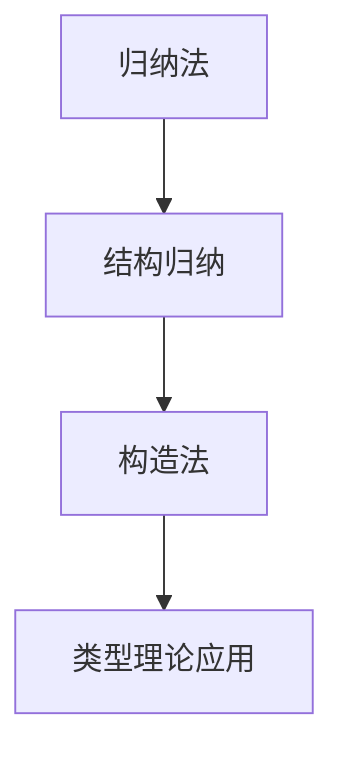

# 1.2.6 归纳法与构造法

## 目录

1.2.6.1 主题概述  
1.2.6.2 归纳法原理  
1.2.6.3 构造法思想  
1.2.6.4 形式化定义与Lean证明  
1.2.6.5 典型案例与推理  
1.2.6.6 图表与多表征  
1.2.6.7 相关性与交叉引用  
1.2.6.8 参考文献与延伸阅读  

---

### 1.2.6.1 主题概述

归纳法和构造法是类型理论和形式化证明中的两大基本方法。

### 1.2.6.2 归纳法原理

- 数学归纳法、结构归纳法
- 归纳定义与归纳证明

### 1.2.6.3 构造法思想

- 证明即构造对象
- 依赖类型下的构造性证明

### 1.2.6.4 形式化定义与Lean证明

```lean
-- 自然数归纳证明示例
theorem add_zero (n : Nat) : n + 0 = n :=
begin
  induction n,
  case zero { refl },
  case succ k ih { simp [ih] }
end
```

### 1.2.6.5 典型案例与推理

#### 归纳法证明（LaTeX表达）

\[
P(0) \land (\forall n, P(n) \implies P(n+1)) \implies \forall n, P(n)
\]

### 1.2.6.6 图表与多表征



### 1.2.6.7 相关性与交叉引用

- [1.2.3-依赖类型与表达力](./1.2.3-依赖类型与表达力.md)
- [6.1-lean语言与形式化证明](../../6-编程语言与实现/6.1-lean语言与形式化证明.md)

### 1.2.6.8 参考文献与延伸阅读

- 《类型理论与程序设计语言》
- Lean 官方文档
