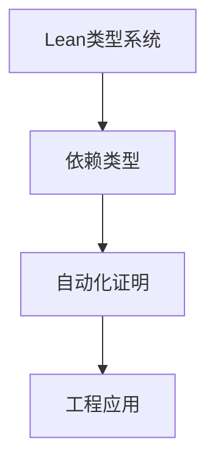

# 1.2.7 类型理论在Lean中的应用

## 目录

1.2.7.1 主题概述  
1.2.7.2 Lean的类型系统特性  
1.2.7.3 典型证明与工程案例  
1.2.7.4 代码实现与自动化  
1.2.7.5 图表与多表征  
1.2.7.6 相关性与交叉引用  
1.2.7.7 参考文献与延伸阅读  

---

### 1.2.7.1 主题概述

Lean作为新一代定理证明器，充分发挥了类型理论的表达力与自动化能力，广泛应用于数学、软件工程等领域。

### 1.2.7.2 Lean的类型系统特性

- 依赖类型、归纳类型、类型类
- tactic脚本与自动化证明

### 1.2.7.3 典型证明与工程案例

- 数学定理自动化证明
- 软件安全属性验证

### 1.2.7.4 代码实现与自动化

```lean
-- 归纳定义自然数与加法
def add : Nat → Nat → Nat
| Nat.zero, n => n
| Nat.succ m, n => Nat.succ (add m n)

-- 自动化证明加法交换律
theorem add_comm (m n : Nat) : add m n = add n m :=
begin
  induction m,
  case zero { simp [add] },
  case succ k ih { simp [add, ih] }
end
```

### 1.2.7.5 图表与多表征



### 1.2.7.6 相关性与交叉引用

- [6.1-lean语言与形式化证明](../../6-编程语言与实现/6.1-lean语言与形式化证明.md)
- [1.2.3-依赖类型与表达力](./1.2.3-依赖类型与表达力.md)

### 1.2.7.7 参考文献与延伸阅读

- Lean 官方文档
- mathlib 项目
- 相关论文与开源项目
