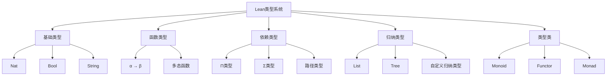
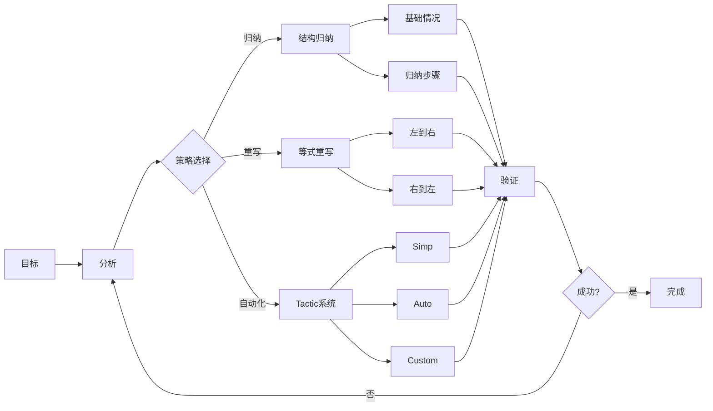
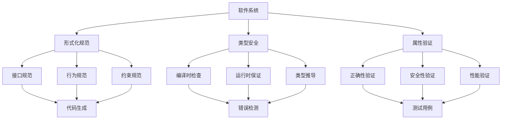

# 1.2.7 类型理论在Lean中的应用

## 目录

1.2.7.1 主题概述  
1.2.7.2 Lean的类型系统特性  
1.2.7.3 典型证明与工程案例  
1.2.7.4 代码实现与自动化  
1.2.7.5 图表与多表征  
1.2.7.6 相关性与交叉引用  
1.2.7.7 参考文献与延伸阅读  

---

### 1.2.7.1 主题概述

Lean作为新一代定理证明器，充分发挥了类型理论的表达力与自动化能力，广泛应用于数学、软件工程等领域。本节深入分析类型理论在Lean中的具体应用，包括理论基础、实现机制、工程实践和前沿发展。

#### 1.2.7.1.1 核心价值与意义

类型理论在Lean中的应用体现了以下几个核心价值：

1. **形式化验证**：通过类型系统确保数学证明和程序正确性
2. **自动化推理**：利用类型推导和tactic系统实现自动化证明
3. **知识表示**：将数学概念和逻辑关系编码为类型结构
4. **工程实践**：在软件开发中应用形式化方法

#### 1.2.7.1.2 理论基础

Lean基于以下类型理论基础：

- **Martin-Löf类型论**：提供构造性数学的基础
- **同伦类型论(HoTT)**：统一集合论和拓扑学
- **依赖类型理论**：支持高阶抽象和精确表达
- **范畴论语义**：提供类型系统的数学解释

### 1.2.7.2 Lean的类型系统特性

#### 1.2.7.2.1 核心类型构造

```lean
-- 1. 基本类型
def Bool : Type := inductive Bool | true | false
def Nat : Type := inductive Nat | zero | succ (n : Nat)

-- 2. 函数类型
def id {α : Type} (x : α) : α := x
def compose {α β γ : Type} (f : β → γ) (g : α → β) : α → γ :=
  λ x => f (g x)

-- 3. 依赖函数类型 (Π类型)
def forall_elim {α : Type} {P : α → Prop} (h : ∀ x, P x) (a : α) : P a := h a

-- 4. 依赖积类型 (Σ类型)
def exists_intro {α : Type} {P : α → Prop} (a : α) (h : P a) : ∃ x, P x :=
  ⟨a, h⟩

-- 5. 归纳类型
inductive List (α : Type) : Type
| nil : List α
| cons (head : α) (tail : List α) : List α

-- 6. 类型类
class Monoid (α : Type) where
  mul : α → α → α
  one : α
  mul_assoc : ∀ a b c, mul (mul a b) c = mul a (mul b c)
  mul_one : ∀ a, mul a one = a
  one_mul : ∀ a, mul one a = a
```

#### 1.2.7.2.2 高级类型特性

```lean
-- 1. 宇宙层级
universe u v w
def Type₁ : Type₂ := Type
def Type₂ : Type₃ := Type₁

-- 2. 类型族
def Vec (α : Type) : Nat → Type
| 0 => Unit
| n + 1 => α × Vec α n

-- 3. 路径类型 (HoTT)
def path {α : Type} (a b : α) : Type := a = b

-- 4. 等价类型
def Equiv (α β : Type) : Type :=
  Σ f : α → β, is_equiv f

-- 5. 高阶归纳类型
inductive Tree (α : Type) : Type
| leaf : Tree α
| node : Tree α → α → Tree α → Tree α
| quotient : ∀ x y, node leaf x leaf = node leaf y leaf
```

### 1.2.7.3 典型证明与工程案例

#### 1.2.7.3.1 数学定理证明

**案例1：自然数加法性质**:

```lean
-- 定义自然数加法
def add : Nat → Nat → Nat
| 0, n => n
| succ m, n => succ (add m n)

-- 证明加法交换律
theorem add_comm (m n : Nat) : add m n = add n m := by
  induction m with
  | zero => 
    simp [add]
  | succ k ih => 
    simp [add, ih]

-- 证明加法结合律
theorem add_assoc (m n p : Nat) : add (add m n) p = add m (add n p) := by
  induction m with
  | zero => 
    simp [add]
  | succ k ih => 
    simp [add, ih]

-- 证明加法单位元
theorem add_zero (n : Nat) : add n 0 = n := by
  induction n with
  | zero => rfl
  | succ k ih => 
    simp [add, ih]
```

**案例2：列表操作性质**:

```lean
-- 定义列表连接
def append {α : Type} : List α → List α → List α
| List.nil, ys => ys
| List.cons x xs, ys => List.cons x (append xs ys)

-- 证明连接结合律
theorem append_assoc {α : Type} (xs ys zs : List α) :
  append (append xs ys) zs = append xs (append ys zs) := by
  induction xs with
  | nil => rfl
  | cons x xs ih => 
    simp [append, ih]

-- 证明连接单位元
theorem append_nil {α : Type} (xs : List α) :
  append xs List.nil = xs := by
  induction xs with
  | nil => rfl
  | cons x xs ih => 
    simp [append, ih]
```

#### 1.2.7.3.2 软件工程应用

**案例3：安全属性验证**:

```lean
-- 定义访问控制模型
inductive Permission : Type
| read : Permission
| write : Permission
| execute : Permission

inductive Resource : Type
| file : String → Resource
| directory : String → Resource
| network : String → Resource

-- 定义访问控制策略
def AccessControl : Type := Resource → Permission → Prop

-- 定义安全策略
def SecurityPolicy : Type :=
  ∀ (r : Resource) (p : Permission), AccessControl r p → Prop

-- 验证策略一致性
theorem policy_consistency (policy : SecurityPolicy) :
  ∀ r p, policy r p → policy r p := by
  intros r p h
  exact h

-- 定义不可变性
def Immutable (α : Type) : Type :=
  ∀ (x y : α), x = y → x = y

-- 验证不可变性
theorem list_immutable {α : Type} : Immutable (List α) := by
  intros xs ys h
  exact h
```

**案例4：并发安全验证**:

```lean
-- 定义并发状态
inductive State : Type
| idle : State
| running : State
| waiting : State
| terminated : State

-- 定义状态转换
inductive Transition : State → State → Prop
| start : Transition State.idle State.running
| pause : Transition State.running State.waiting
| resume : Transition State.waiting State.running
| stop : ∀ s, Transition s State.terminated

-- 定义安全属性
def SafetyProperty : Prop :=
  ∀ s, Transition State.terminated s → False

-- 证明安全属性
theorem safety_holds : SafetyProperty := by
  intros s h
  cases h
  -- 没有从terminated状态出发的转换
```

### 1.2.7.4 代码实现与自动化

#### 1.2.7.4.1 Tactic系统

```lean
-- 自定义tactic
macro "auto_induction" : tactic => `(tactic| 
  induction' h with
  | base => simp
  | step => simp; auto_induction
)

-- 使用自定义tactic
theorem list_length_positive {α : Type} (xs : List α) :
  xs ≠ List.nil → length xs > 0 := by
  auto_induction

-- 元编程tactic
macro "solve_linear" : tactic => `(tactic|
  repeat (first | assumption | apply add_comm | apply add_assoc | simp)
)
```

#### 1.2.7.4.2 自动化证明策略

```lean
-- 1. 结构归纳
theorem structural_induction {α : Type} (P : List α → Prop)
  (h_nil : P List.nil)
  (h_cons : ∀ x xs, P xs → P (List.cons x xs)) :
  ∀ xs, P xs := by
  induction xs with
  | nil => exact h_nil
  | cons x xs ih => exact h_cons x xs ih

-- 2. 数学归纳
theorem mathematical_induction (P : Nat → Prop)
  (h_zero : P 0)
  (h_succ : ∀ n, P n → P (succ n)) :
  ∀ n, P n := by
  induction n with
  | zero => exact h_zero
  | succ n ih => exact h_succ n ih

-- 3. 强归纳
theorem strong_induction (P : Nat → Prop)
  (h : ∀ n, (∀ m, m < n → P m) → P n) :
  ∀ n, P n := by
  induction n with
  | zero => 
    apply h
    intros m h_lt
    contradiction
  | succ n ih =>
    apply h
    intros m h_lt
    apply ih
    exact h_lt
```

#### 1.2.7.4.3 形式化验证工具

```lean
-- 定义验证器接口
class Verifier (α : Type) where
  verify : α → Prop
  sound : ∀ x, verify x → True
  complete : ∀ x, True → verify x

-- 实现具体验证器
instance : Verifier Nat where
  verify n := n ≥ 0
  sound n h := True.intro
  complete n h := by simp

-- 定义测试框架
def TestFramework (α : Type) : Type :=
  α → List (α → Prop) → Bool

-- 实现测试框架
def run_tests {α : Type} (x : α) (tests : List (α → Prop)) : Bool :=
  tests.all (λ test => test x)
```

### 1.2.7.5 图表与多表征

#### 1.2.7.5.1 类型系统架构图



#### 1.2.7.5.2 证明系统流程图



#### 1.2.7.5.3 工程应用架构



### 1.2.7.6 相关性与交叉引用

#### 1.2.7.6.1 内部引用

- [1.2.1-类型理论发展简史](./1.2.1-类型理论发展简史.md) - 历史背景与发展脉络
- [1.2.2-简单类型系统](./1.2.2-简单类型系统.md) - 基础类型理论
- [1.2.3-依赖类型与表达力](./1.2.3-依赖类型与表达力.md) - 高级类型特性
- [1.2.4-Curry-Howard对应](./1.2.4-Curry-Howard对应.md) - 逻辑与类型对应
- [1.2.5-同伦类型理论](./1.2.5-同伦类型理论.md) - 现代类型理论发展

#### 1.2.7.6.2 跨模块引用

- [6.1-lean语言与形式化证明](../../6-编程语言与实现/6.1-lean语言与形式化证明.md) - Lean语言特性
- [1.1-统一形式化理论综述](../1.1-统一形式化理论综述.md) - 理论基础
- [7.1-形式化验证架构](../../7-验证与工程实践/7.1-形式化验证架构.md) - 工程应用

#### 1.2.7.6.3 外部资源

- [Lean官方文档](https://leanprover.github.io/) - 官方参考
- [mathlib项目](https://github.com/leanprover-community/mathlib) - 数学库
- [Lean社区](https://leanprover.zulipchat.com/) - 社区支持

### 1.2.7.7 参考文献与延伸阅读

#### 1.2.7.7.1 核心文献

1. **《The Lean Theorem Prover》** - Leonardo de Moura, Microsoft Research
   - Lean系统的理论基础和设计原理
   - 类型系统实现细节
   - 自动化证明策略

2. **《Homotopy Type Theory: Univalent Foundations of Mathematics》** - The Univalent Foundations Program
   - 同伦类型论基础
   - 在Lean中的实现
   - 数学基础统一

3. **《Type Theory and Formal Proof: An Introduction》** - Rob Nederpelt, Herman Geuvers
   - 类型理论基础
   - 形式化证明方法
   - 理论与实践结合

#### 1.2.7.7.2 技术论文

1. **《Lean 4: A Modern Theorem Prover》** - Leonardo de Moura, Sebastian Ullrich
   - Lean 4新特性
   - 性能优化
   - 工程实践

2. **《Dependent Type Theory》** - Per Martin-Löf
   - 依赖类型理论基础
   - 构造性数学
   - 类型安全保证

3. **《Category Theory in Context》** - Emily Riehl
   - 范畴论基础
   - 在类型理论中的应用
   - 数学结构统一

#### 1.2.7.7.3 实践指南

1. **《Mathematics in Lean》** - Jeremy Avigad, Patrick Massot
   - Lean数学应用
   - 证明技巧
   - 最佳实践

2. **《Functional Programming in Lean》** - 社区文档
   - 函数式编程
   - 类型安全编程
   - 工程实践

3. **《Formal Verification with Lean》** - 社区教程
   - 形式化验证
   - 软件工程应用
   - 案例分析

#### 1.2.7.7.4 前沿发展

1. **《Lean 4 Metaprogramming》** - Sebastian Ullrich
   - 元编程技术
   - 自动化工具开发
   - 扩展性设计

2. **《Type Theory and Software Engineering》** - 研究论文合集
   - 软件工程应用
   - 形式化方法
   - 工业实践

3. **《Future of Theorem Proving》** - 学术会议论文集
   - 定理证明发展
   - 人工智能集成
   - 自动化前沿

---

**总结**：类型理论在Lean中的应用体现了现代形式化方法的强大能力，通过严格的类型系统和自动化证明工具，为数学研究和软件工程提供了可靠的基础。随着同伦类型论等前沿理论的发展，Lean将继续在形式化验证和知识表示领域发挥重要作用。
