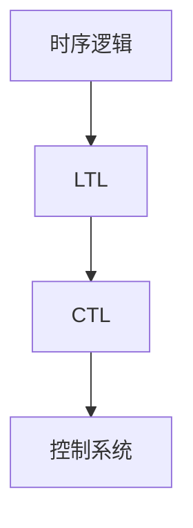

# 1.3 时序逻辑与控制

## 目录

1.3.1 主题概述  
1.3.2 时序逻辑基础  
1.3.3 主要时序逻辑系统  
1.3.4 形式化建模与证明  
1.3.5 典型案例与实现  
1.3.6 图表与多表征  
1.3.7 相关性与交叉引用  
1.3.8 参考文献与延伸阅读  

---

### 1.3.1 主题概述

本节梳理时序逻辑的发展、基本思想及其在控制系统中的应用。

### 1.3.2 时序逻辑基础

- 线性时序逻辑（LTL）
- 分支时序逻辑（CTL）
- 模态逻辑

### 1.3.3 主要时序逻辑系统

- LTL、CTL、CTL*
- 时序μ演算

### 1.3.4 形式化建模与证明

- 时序逻辑公式的建模与验证
- 控制系统的时序约束证明

### 1.3.5 典型案例与实现

#### LTL公式示例（LaTeX表达）

$$
\Box (p \rightarrow \Diamond q)
$$

#### 控制系统建模（Lean 代码示例）

```lean
structure ControlSystem :=
  (state : Type)
  (input : Type)
  (transition : state → input → state)
```

### 1.3.6 图表与多表征



### 1.3.7 相关性与交叉引用

- [1.1-统一形式化理论综述](./1.1-统一形式化理论综述.md)
- [7.1-形式化验证架构](../7-验证与工程实践/7.1-形式化验证架构.md)

### 1.3.8 参考文献与延伸阅读

- 《时序逻辑与自动机》
- 相关论文与开源项目
