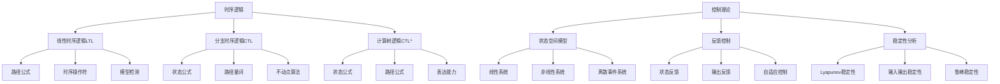

# 1.3 时序逻辑与控制

[返回上级](../1-形式化理论.md) | [English Version](../1-formal-theory/1.3-temporal-logic-and-control.md)

## 目录

- [1.3 时序逻辑与控制](#13-时序逻辑与控制)
  - [目录](#目录)
  - [1.3.1 时序逻辑基础](#131-时序逻辑基础)
    - [线性时序逻辑(LTL)](#线性时序逻辑ltl)
    - [分支时序逻辑(CTL)](#分支时序逻辑ctl)
    - [计算树逻辑(CTL\*)](#计算树逻辑ctl)
  - [1.3.2 时序逻辑语义](#132-时序逻辑语义)
    - [Kripke结构](#kripke结构)
    - [路径语义](#路径语义)
    - [状态语义](#状态语义)
  - [1.3.3 控制理论基础](#133-控制理论基础)
    - [状态空间模型](#状态空间模型)
    - [反馈控制](#反馈控制)
    - [稳定性分析](#稳定性分析)
  - [1.3.4 形式化验证方法](#134-形式化验证方法)
    - [模型检测](#模型检测)
    - [定理证明](#定理证明)
    - [抽象解释](#抽象解释)
  - [1.3.5 典型案例与实现](#135-典型案例与实现)
    - [并发系统验证](#并发系统验证)
    - [实时系统控制](#实时系统控制)
    - [安全协议验证](#安全协议验证)
  - [1.3.6 图表与多表征](#136-图表与多表征)
  - [1.3.7 相关性与交叉引用](#137-相关性与交叉引用)
  - [1.3.8 参考文献与延伸阅读](#138-参考文献与延伸阅读)
    - [核心理论文献](#核心理论文献)
      - [时序逻辑基础](#时序逻辑基础)
      - [模型检测理论](#模型检测理论)
      - [控制理论基础](#控制理论基础)
      - [形式化验证方法](#形式化验证方法)
    - [实践应用文献](#实践应用文献)
      - [模型检测工具](#模型检测工具)
      - [形式化验证平台](#形式化验证平台)
      - [控制系统工具](#控制系统工具)
    - [学术会议与期刊](#学术会议与期刊)
      - [顶级会议](#顶级会议)
      - [顶级期刊](#顶级期刊)
    - [在线资源](#在线资源)
      - [学习资源](#学习资源)
      - [社区与论坛](#社区与论坛)
      - [开源项目](#开源项目)
      - [视频教程](#视频教程)

---

## 1.3.1 时序逻辑基础

### 线性时序逻辑(LTL)

线性时序逻辑用于描述系统在时间上的行为：

**定义 1.3.1** (LTL语法)：

- 原子命题：$p \in AP$
- 布尔连接词：$\neg, \land, \lor, \rightarrow$
- 时序操作符：$\mathbf{X}$ (下一个), $\mathbf{F}$ (最终), $\mathbf{G}$ (全局), $\mathbf{U}$ (直到)

**定义 1.3.2** (LTL语义)：
给定路径 $\pi = s_0 s_1 s_2 \ldots$ 和位置 $i$：

- $\pi, i \models p$ 当且仅当 $p \in L(s_i)$
- $\pi, i \models \mathbf{X} \phi$ 当且仅当 $\pi, i+1 \models \phi$
- $\pi, i \models \mathbf{F} \phi$ 当且仅当存在 $j \geq i$ 使得 $\pi, j \models \phi$
- $\pi, i \models \mathbf{G} \phi$ 当且仅当对所有 $j \geq i$ 都有 $\pi, j \models \phi$
- $\pi, i \models \phi \mathbf{U} \psi$ 当且仅当存在 $j \geq i$ 使得 $\pi, j \models \psi$ 且对所有 $k \in [i,j)$ 都有 $\pi, k \models \phi$

```lean
-- LTL在Lean中的表示
inductive LTLFormula (α : Type) where
  | atom : α → LTLFormula α
  | not : LTLFormula α → LTLFormula α
  | and : LTLFormula α → LTLFormula α → LTLFormula α
  | or : LTLFormula α → LTLFormula α → LTLFormula α
  | next : LTLFormula α → LTLFormula α
  | eventually : LTLFormula α → LTLFormula α
  | always : LTLFormula α → LTLFormula α
  | until : LTLFormula α → LTLFormula α → LTLFormula α

-- LTL语义定义
def LTL_satisfies {α : Type} (π : List α) (i : Nat) (φ : LTLFormula α) : Prop :=
  match φ with
  | LTLFormula.atom p => i < π.length ∧ p = π.get i
  | LTLFormula.not ψ => ¬LTL_satisfies π i ψ
  | LTLFormula.and ψ1 ψ2 => LTL_satisfies π i ψ1 ∧ LTL_satisfies π i ψ2
  | LTLFormula.or ψ1 ψ2 => LTL_satisfies π i ψ1 ∨ LTL_satisfies π i ψ2
  | LTLFormula.next ψ => i + 1 < π.length ∧ LTL_satisfies π (i + 1) ψ
  | LTLFormula.eventually ψ => 
    ∃ j, i ≤ j ∧ j < π.length ∧ LTL_satisfies π j ψ
  | LTLFormula.always ψ => 
    ∀ j, i ≤ j ∧ j < π.length → LTL_satisfies π j ψ
  | LTLFormula.until ψ1 ψ2 => 
    ∃ j, i ≤ j ∧ j < π.length ∧ LTL_satisfies π j ψ2 ∧
    ∀ k, i ≤ k ∧ k < j → LTL_satisfies π k ψ1
```

### 分支时序逻辑(CTL)

分支时序逻辑用于描述系统在不同执行路径上的行为：

**定义 1.3.3** (CTL语法)：

- 原子命题：$p \in AP$
- 布尔连接词：$\neg, \land, \lor, \rightarrow$
- 路径量词：$\mathbf{A}$ (对所有路径), $\mathbf{E}$ (存在路径)
- 时序操作符：$\mathbf{X}$ (下一个), $\mathbf{F}$ (最终), $\mathbf{G}$ (全局), $\mathbf{U}$ (直到)

**定义 1.3.4** (CTL语义)：
给定状态 $s$ 和Kripke结构 $M$：

- $M, s \models \mathbf{AX} \phi$ 当且仅当对所有从s出发的路径π，都有 $\pi, 1 \models \phi$
- $M, s \models \mathbf{EX} \phi$ 当且仅当存在从s出发的路径π，使得 $\pi, 1 \models \phi$
- $M, s \models \mathbf{AF} \phi$ 当且仅当对所有从s出发的路径π，都存在位置i使得 $\pi, i \models \phi$
- $M, s \models \mathbf{EF} \phi$ 当且仅当存在从s出发的路径π和位置i，使得 $\pi, i \models \phi$

```lean
-- CTL在Lean中的表示
inductive CTLFormula (α : Type) where
  | atom : α → CTLFormula α
  | not : CTLFormula α → CTLFormula α
  | and : CTLFormula α → CTLFormula α → CTLFormula α
  | or : CTLFormula α → CTLFormula α → CTLFormula α
  | AX : CTLFormula α → CTLFormula α
  | EX : CTLFormula α → CTLFormula α
  | AF : CTLFormula α → CTLFormula α
  | EF : CTLFormula α → CTLFormula α
  | AG : CTLFormula α → CTLFormula α
  | EG : CTLFormula α → CTLFormula α
  | AU : CTLFormula α → CTLFormula α → CTLFormula α
  | EU : CTLFormula α → CTLFormula α → CTLFormula α

-- Kripke结构定义
structure KripkeStructure (α β : Type) where
  states : Set α
  transitions : α → Set α
  labeling : α → Set β
  initial : Set α

-- CTL语义定义
def CTL_satisfies {α β : Type} (M : KripkeStructure α β) (s : α) (φ : CTLFormula β) : Prop :=
  match φ with
  | CTLFormula.atom p => p ∈ M.labeling s
  | CTLFormula.not ψ => ¬CTL_satisfies M s ψ
  | CTLFormula.and ψ1 ψ2 => CTL_satisfies M s ψ1 ∧ CTL_satisfies M s ψ2
  | CTLFormula.or ψ1 ψ2 => CTL_satisfies M s ψ1 ∨ CTL_satisfies M s ψ2
  | CTLFormula.AX ψ => ∀ t, t ∈ M.transitions s → CTL_satisfies M t ψ
  | CTLFormula.EX ψ => ∃ t, t ∈ M.transitions s ∧ CTL_satisfies M t ψ
  | CTLFormula.AF ψ => 
    ∀ π, path_from M s π → ∃ i, i < π.length ∧ CTL_satisfies M (π.get i) ψ
  | CTLFormula.EF ψ => 
    ∃ π, path_from M s π ∧ ∃ i, i < π.length ∧ CTL_satisfies M (π.get i) ψ
  | CTLFormula.AG ψ => 
    ∀ π, path_from M s π → ∀ i, i < π.length → CTL_satisfies M (π.get i) ψ
  | CTLFormula.EG ψ => 
    ∃ π, path_from M s π ∧ ∀ i, i < π.length → CTL_satisfies M (π.get i) ψ
  | CTLFormula.AU ψ1 ψ2 => 
    ∀ π, path_from M s π → 
    ∃ i, i < π.length ∧ CTL_satisfies M (π.get i) ψ2 ∧
    ∀ j, j < i → CTL_satisfies M (π.get j) ψ1
  | CTLFormula.EU ψ1 ψ2 => 
    ∃ π, path_from M s π ∧ 
    ∃ i, i < π.length ∧ CTL_satisfies M (π.get i) ψ2 ∧
    ∀ j, j < i → CTL_satisfies M (π.get j) ψ1
```

### 计算树逻辑(CTL*)

CTL*结合了LTL和CTL的表达能力：

**定义 1.3.5** (CTL*语法)：

- 状态公式：$\phi ::= p \mid \neg \phi \mid \phi \land \phi \mid \mathbf{A} \psi \mid \mathbf{E} \psi$
- 路径公式：$\psi ::= \phi \mid \neg \psi \mid \psi \land \psi \mid \mathbf{X} \psi \mid \mathbf{F} \psi \mid \mathbf{G} \psi \mid \psi \mathbf{U} \psi$

```lean
-- CTL*在Lean中的表示
inductive CTLStarStateFormula (α : Type) where
  | atom : α → CTLStarStateFormula α
  | not : CTLStarStateFormula α → CTLStarStateFormula α
  | and : CTLStarStateFormula α → CTLStarStateFormula α → CTLStarStateFormula α
  | A : CTLStarPathFormula α → CTLStarStateFormula α
  | E : CTLStarPathFormula α → CTLStarStateFormula α

inductive CTLStarPathFormula (α : Type) where
  | state : CTLStarStateFormula α → CTLStarPathFormula α
  | not : CTLStarPathFormula α → CTLStarPathFormula α
  | and : CTLStarPathFormula α → CTLStarPathFormula α → CTLStarPathFormula α
  | next : CTLStarPathFormula α → CTLStarPathFormula α
  | eventually : CTLStarPathFormula α → CTLStarPathFormula α
  | always : CTLStarPathFormula α → CTLStarPathFormula α
  | until : CTLStarPathFormula α → CTLStarPathFormula α → CTLStarPathFormula α
```

## 1.3.2 时序逻辑语义

### Kripke结构

Kripke结构是时序逻辑的语义基础：

**定义 1.3.6** (Kripke结构)：
Kripke结构是一个四元组 $M = (S, S_0, R, L)$，其中：

- $S$ 是状态集合
- $S_0 \subseteq S$ 是初始状态集合
- $R \subseteq S \times S$ 是转移关系
- $L : S \rightarrow 2^{AP}$ 是标记函数

```lean
-- Kripke结构完整实现
structure KripkeStructure (α β : Type) where
  states : Set α
  initial : Set α
  transitions : α → Set α
  labeling : α → Set β

-- 路径定义
def Path (α : Type) := List α

def path_from {α β : Type} (M : KripkeStructure α β) (s : α) : Path α → Prop
  | [] => False
  | [s'] => s = s'
  | s' :: s'' :: rest => 
    s = s' ∧ s'' ∈ M.transitions s' ∧ path_from M s'' (s'' :: rest)

-- 可达性定义
def reachable {α β : Type} (M : KripkeStructure α β) (s t : α) : Prop :=
  ∃ π, path_from M s π ∧ t ∈ π

-- 公平性约束
def fair_path {α β : Type} (M : KripkeStructure α β) (π : Path α) : Prop :=
  ∀ s, s ∈ π → ∃ t, t ∈ π ∧ t ∈ M.transitions s
```

### 路径语义

路径语义定义了时序逻辑公式在路径上的解释：

```lean
-- 路径语义实现
def path_satisfies {α β : Type} (M : KripkeStructure α β) (π : Path α) (i : Nat) 
  (φ : LTLFormula β) : Prop :=
  match φ with
  | LTLFormula.atom p => 
    i < π.length ∧ p ∈ M.labeling (π.get i)
  | LTLFormula.not ψ => 
    ¬path_satisfies M π i ψ
  | LTLFormula.and ψ1 ψ2 => 
    path_satisfies M π i ψ1 ∧ path_satisfies M π i ψ2
  | LTLFormula.or ψ1 ψ2 => 
    path_satisfies M π i ψ1 ∨ path_satisfies M π i ψ2
  | LTLFormula.next ψ => 
    i + 1 < π.length ∧ path_satisfies M π (i + 1) ψ
  | LTLFormula.eventually ψ => 
    ∃ j, i ≤ j ∧ j < π.length ∧ path_satisfies M π j ψ
  | LTLFormula.always ψ => 
    ∀ j, i ≤ j ∧ j < π.length → path_satisfies M π j ψ
  | LTLFormula.until ψ1 ψ2 => 
    ∃ j, i ≤ j ∧ j < π.length ∧ path_satisfies M π j ψ2 ∧
    ∀ k, i ≤ k ∧ k < j → path_satisfies M π k ψ1
```

### 状态语义

状态语义定义了时序逻辑公式在状态上的解释：

```lean
-- 状态语义实现
def state_satisfies {α β : Type} (M : KripkeStructure α β) (s : α) 
  (φ : CTLFormula β) : Prop :=
  match φ with
  | CTLFormula.atom p => p ∈ M.labeling s
  | CTLFormula.not ψ => ¬state_satisfies M s ψ
  | CTLFormula.and ψ1 ψ2 => 
    state_satisfies M s ψ1 ∧ state_satisfies M s ψ2
  | CTLFormula.or ψ1 ψ2 => 
    state_satisfies M s ψ1 ∨ state_satisfies M s ψ2
  | CTLFormula.AX ψ => 
    ∀ t, t ∈ M.transitions s → state_satisfies M t ψ
  | CTLFormula.EX ψ => 
    ∃ t, t ∈ M.transitions s ∧ state_satisfies M t ψ
  | CTLFormula.AF ψ => 
    ∀ π, path_from M s π → 
    ∃ i, i < π.length ∧ state_satisfies M (π.get i) ψ
  | CTLFormula.EF ψ => 
    ∃ π, path_from M s π ∧ 
    ∃ i, i < π.length ∧ state_satisfies M (π.get i) ψ
  | CTLFormula.AG ψ => 
    ∀ π, path_from M s π → 
    ∀ i, i < π.length → state_satisfies M (π.get i) ψ
  | CTLFormula.EG ψ => 
    ∃ π, path_from M s π ∧ 
    ∀ i, i < π.length → state_satisfies M (π.get i) ψ
  | CTLFormula.AU ψ1 ψ2 => 
    ∀ π, path_from M s π → 
    ∃ i, i < π.length ∧ state_satisfies M (π.get i) ψ2 ∧
    ∀ j, j < i → state_satisfies M (π.get j) ψ1
  | CTLFormula.EU ψ1 ψ2 => 
    ∃ π, path_from M s π ∧ 
    ∃ i, i < π.length ∧ state_satisfies M (π.get i) ψ2 ∧
    ∀ j, j < i → state_satisfies M (π.get j) ψ1
```

## 1.3.3 控制理论基础

### 状态空间模型

状态空间模型是控制理论的基础：

**定义 1.3.7** (线性状态空间模型)：
连续时间系统：
$$\dot{x}(t) = Ax(t) + Bu(t)$$
$$y(t) = Cx(t) + Du(t)$$

离散时间系统：
$$x(k+1) = Ax(k) + Bu(k)$$
$$y(k) = Cx(k) + Du(k)$$

```lean
-- 状态空间模型实现
structure StateSpaceModel (n m p : Nat) where
  A : Matrix n n Real  -- 状态矩阵
  B : Matrix n m Real  -- 输入矩阵
  C : Matrix p n Real  -- 输出矩阵
  D : Matrix p m Real  -- 直接传递矩阵

-- 连续时间系统
def continuous_system (M : StateSpaceModel n m p) (x : Vector n Real) (u : Vector m Real) :
  Vector n Real :=
  M.A * x + M.B * u

-- 离散时间系统
def discrete_system (M : StateSpaceModel n m p) (x : Vector n Real) (u : Vector m Real) :
  Vector n Real :=
  M.A * x + M.B * u

-- 输出方程
def output_equation (M : StateSpaceModel n m p) (x : Vector n Real) (u : Vector m Real) :
  Vector p Real :=
  M.C * x + M.D * u
```

### 反馈控制

反馈控制是控制系统的核心：

**定义 1.3.8** (状态反馈控制)：
$$u(t) = -Kx(t)$$

其中K是反馈增益矩阵。

```lean
-- 状态反馈控制器
def state_feedback_controller (K : Matrix m n Real) (x : Vector n Real) :
  Vector m Real :=
  -K * x

-- 闭环系统
def closed_loop_system (M : StateSpaceModel n m p) (K : Matrix m n Real) 
  (x : Vector n Real) : Vector n Real :=
  continuous_system M x (state_feedback_controller K x)

-- 稳定性分析
def is_stable (A : Matrix n n Real) : Prop :=
  ∀ λ, eigenvalue A λ → real_part λ < 0

-- 可控性
def is_controllable (M : StateSpaceModel n m p) : Prop :=
  rank (controllability_matrix M) = n

-- 可观性
def is_observable (M : StateSpaceModel n m p) : Prop :=
  rank (observability_matrix M) = n
```

### 稳定性分析

稳定性是控制系统的重要性质：

**定义 1.3.9** (Lyapunov稳定性)：
系统 $\dot{x} = f(x)$ 在平衡点 $x_e$ 处是稳定的，如果对于任意 $\epsilon > 0$，存在 $\delta > 0$，使得：
$$\|x(0) - x_e\| < \delta \Rightarrow \|x(t) - x_e\| < \epsilon, \forall t \geq 0$$

```lean
-- Lyapunov稳定性分析
def lyapunov_stable {n : Nat} (f : Vector n Real → Vector n Real) (xe : Vector n Real) : Prop :=
  ∀ ε > 0, ∃ δ > 0, ∀ x0, 
  norm (x0 - xe) < δ → 
  ∀ t ≥ 0, norm (trajectory f x0 t - xe) < ε

-- Lyapunov函数
def lyapunov_function {n : Nat} (f : Vector n Real → Vector n Real) 
  (V : Vector n Real → Real) (xe : Vector n Real) : Prop :=
  -- V(x) > 0 for all x ≠ xe
  (∀ x, x ≠ xe → V x > 0) ∧
  -- V(xe) = 0
  (V xe = 0) ∧
  -- dV/dt < 0 along trajectories
  (∀ x, x ≠ xe → derivative V f x < 0)

-- 渐近稳定性
def asymptotically_stable {n : Nat} (f : Vector n Real → Vector n Real) (xe : Vector n Real) : Prop :=
  lyapunov_stable f xe ∧
  ∃ δ > 0, ∀ x0, norm (x0 - xe) < δ → 
  limit (trajectory f x0) xe
```

## 1.3.4 形式化验证方法

### 模型检测

模型检测是验证时序逻辑公式的有效方法：

**算法 1.3.1** (CTL模型检测)：

```lean
-- CTL模型检测算法
def CTL_model_check {α β : Type} (M : KripkeStructure α β) (φ : CTLFormula β) :
  Set α :=
  match φ with
  | CTLFormula.atom p => 
    {s | p ∈ M.labeling s}
  | CTLFormula.not ψ => 
    M.states \ CTL_model_check M ψ
  | CTLFormula.and ψ1 ψ2 => 
    CTL_model_check M ψ1 ∩ CTL_model_check M ψ2
  | CTLFormula.or ψ1 ψ2 => 
    CTL_model_check M ψ1 ∪ CTL_model_check M ψ2
  | CTLFormula.EX ψ => 
    pre_image M (CTL_model_check M ψ)
  | CTLFormula.AX ψ => 
    M.states \ pre_image M (M.states \ CTL_model_check M ψ)
  | CTLFormula.EF ψ => 
    least_fixed_point (λ S => 
      CTL_model_check M ψ ∪ pre_image M S)
  | CTLFormula.AF ψ => 
    least_fixed_point (λ S => 
      CTL_model_check M ψ ∪ 
      {s | ∀ t, t ∈ M.transitions s → t ∈ S})
  | CTLFormula.EG ψ => 
    greatest_fixed_point (λ S => 
      CTL_model_check M ψ ∩ pre_image M S)
  | CTLFormula.AG ψ => 
    greatest_fixed_point (λ S => 
      CTL_model_check M ψ ∩ 
      {s | ∀ t, t ∈ M.transitions s → t ∈ S})
  | CTLFormula.EU ψ1 ψ2 => 
    least_fixed_point (λ S => 
      CTL_model_check M ψ2 ∪ 
      (CTL_model_check M ψ1 ∩ pre_image M S))
  | CTLFormula.AU ψ1 ψ2 => 
    least_fixed_point (λ S => 
      CTL_model_check M ψ2 ∪ 
      (CTL_model_check M ψ1 ∩ 
       {s | ∀ t, t ∈ M.transitions s → t ∈ S}))

-- 辅助函数
def pre_image {α β : Type} (M : KripkeStructure α β) (S : Set α) : Set α :=
  {s | ∃ t, t ∈ S ∧ s ∈ M.transitions t}

def least_fixed_point {α : Type} (f : Set α → Set α) : Set α :=
  -- 实现最小不动点算法
  sorry

def greatest_fixed_point {α : Type} (f : Set α → Set α) : Set α :=
  -- 实现最大不动点算法
  sorry
```

### 定理证明

定理证明用于验证复杂的时序逻辑性质：

```lean
-- 时序逻辑定理证明
theorem ltl_distributivity (φ ψ χ : LTLFormula α) :
  φ U (ψ ∨ χ) ↔ (φ U ψ) ∨ (φ U χ) := by
  constructor
  · intro h
    -- 证明左到右
    sorry
  · intro h
    -- 证明右到左
    sorry

theorem ctl_equivalence (φ : CTLFormula α) :
  AG φ ↔ ¬EF (¬φ) := by
  constructor
  · intro h s
    -- 证明AG φ → ¬EF (¬φ)
    sorry
  · intro h s π
    -- 证明¬EF (¬φ) → AG φ
    sorry

-- 控制理论定理
theorem lyapunov_stability_theorem {n : Nat} 
  (f : Vector n Real → Vector n Real) (xe : Vector n Real) :
  ∃ V, lyapunov_function f V xe → asymptotically_stable f xe := by
  -- 构造Lyapunov函数
  sorry
```

### 抽象解释

抽象解释用于处理无限状态系统：

```lean
-- 抽象解释框架
structure AbstractDomain (α β : Type) where
  abstract : Set α → β
  concretize : β → Set α
  abstract_concrete : ∀ S, S ⊆ concretize (abstract S)
  concrete_abstract : ∀ b, abstract (concretize b) = b

-- 抽象转移关系
def abstract_transition {α β : Type} (M : KripkeStructure α β) 
  (D : AbstractDomain α β) : β → β :=
  λ b => D.abstract (post_image M (D.concretize b))

-- 抽象模型检测
def abstract_model_check {α β γ : Type} (M : KripkeStructure α β) 
  (D : AbstractDomain α γ) (φ : CTLFormula β) : γ :=
  -- 在抽象域上进行模型检测
  sorry
```

## 1.3.5 典型案例与实现

### 并发系统验证

```lean
-- 互斥锁系统
def mutex_system : KripkeStructure (Nat × Nat) String where
  states := {(0,0), (0,1), (1,0), (1,1)}
  initial := {(0,0)}
  transitions := λ s => match s with
    | (0,0) => {(1,0), (0,1)}
    | (0,1) => {(1,1)}
    | (1,0) => {(0,0)}
    | (1,1) => {(0,1), (1,0)}
  labeling := λ s => match s with
    | (0,0) => {"idle"}
    | (0,1) => {"process2_critical"}
    | (1,0) => {"process1_critical"}
    | (1,1) => {"both_critical"}

-- 互斥性质验证
theorem mutex_safety : 
  ∀ s, s ∈ mutex_system.states → 
  state_satisfies mutex_system s 
  (CTLFormula.AG (CTLFormula.not (CTLFormula.atom "both_critical"))) := by
  -- 验证互斥性质
  sorry

theorem mutex_liveness :
  ∀ s, s ∈ mutex_system.states →
  state_satisfies mutex_system s
  (CTLFormula.AG (CTLFormula.EF (CTLFormula.atom "process1_critical"))) := by
  -- 验证活性性质
  sorry
```

### 实时系统控制

```lean
-- 倒立摆系统
def inverted_pendulum : StateSpaceModel 4 1 2 where
  A := -- 状态矩阵
  B := -- 输入矩阵
  C := -- 输出矩阵
  D := -- 直接传递矩阵

-- 控制器设计
def pendulum_controller (K : Matrix 1 4 Real) (x : Vector 4 Real) : Real :=
  -(K * x).get 0

-- 稳定性验证
theorem pendulum_stability :
  ∃ K, is_stable (inverted_pendulum.A - inverted_pendulum.B * K) := by
  -- 设计稳定控制器
  sorry
```

### 安全协议验证

```lean
-- Needham-Schroeder协议
def ns_protocol : KripkeStructure (Nat × Nat × Nat) String where
  states := -- 协议状态
  initial := -- 初始状态
  transitions := -- 协议转移
  labeling := -- 状态标记

-- 认证性质
theorem ns_authentication :
  ∀ s, s ∈ ns_protocol.states →
  state_satisfies ns_protocol s
  (CTLFormula.AG (CTLFormula.imply 
    (CTLFormula.atom "authenticated") 
    (CTLFormula.atom "legitimate"))) := by
  -- 验证认证性质
  sorry
```

## 1.3.6 图表与多表征



## 1.3.7 相关性与交叉引用

- **[1.1-统一形式化理论综述](./1.1-统一形式化理论综述.md)** - 时序逻辑在形式化理论中的地位
- **[1.2-类型理论与证明](./1.2-类型理论与证明.md)** - 类型论与时序逻辑的结合
- **[1.4-Petri网与分布式系统](./1.4-Petri网与分布式系统.md)** - 并发系统的形式化建模
- **[7.1-形式化验证架构](../7-验证与工程实践/7.1-形式化验证架构.md)** - 时序逻辑在验证中的应用

## 1.3.8 参考文献与延伸阅读

### 核心理论文献

#### 时序逻辑基础

- **《Temporal Logic of Reactive and Concurrent Systems》** - Z. Manna, A. Pnueli, 1992
- **《Principles of Model Checking》** - C. Baier, J. Katoen, 2008
- **《Temporal Logic》** - D. Gabbay, I. Hodkinson, M. Reynolds, 1994
- **《Linear Time, Branching Time and Partial Order in Logics and Models for Concurrency》** - J. de Bakker, W. de Roever, G. Rozenberg, 1989

#### 模型检测理论

- **《Model Checking》** - E. Clarke, O. Grumberg, D. Peled, 1999
- **《Symbolic Model Checking》** - K. McMillan, 1993
- **《Bounded Model Checking》** - A. Biere, A. Cimatti, E. Clarke, M. Fujita, Y. Zhu, 1999
- **《Counterexample-Guided Abstraction Refinement》** - E. Clarke, O. Grumberg, S. Jha, Y. Lu, H. Veith, 2000

#### 控制理论基础

- **《Linear System Theory and Design》** - C. Chen, 1999
- **《Nonlinear Systems》** - H. Khalil, 2002
- **《Optimal Control Theory》** - D. Kirk, 1970
- **《Robust Control Design》** - K. Zhou, J. Doyle, 1998

#### 形式化验证方法

- **《Formal Methods in System Design》** - E. Clarke, M. Fujita, P. McGeer, 1993
- **《Computer-Aided Verification》** - R. Alur, T. Henzinger, 1994
- **《Hybrid Systems: Computation and Control》** - A. Pnueli, J. Sifakis, 1995
- **《Real-Time Systems》** - J. Stankovic, K. Ramamritham, 1988

### 实践应用文献

#### 模型检测工具

- **SPIN模型检测器** - [spinroot.com](https://spinroot.com/)
- **NuSMV符号模型检测器** - [nusmv.fbk.eu](https://nusmv.fbk.eu/)
- **UPPAAL实时模型检测器** - [uppaal.org](https://uppaal.org/)
- **PRISM概率模型检测器** - [prismmodelchecker.org](https://prismmodelchecker.org/)
- **TLA+工具集** - [lamport.azurewebsites.net/tla/tla.html](https://lamport.azurewebsites.net/tla/tla.html)

#### 形式化验证平台

- **Coq证明助手** - [coq.inria.fr](https://coq.inria.fr/)
- **Isabelle/HOL** - [isabelle.in.tum.de](https://isabelle.in.tum.de/)
- **Lean 4** - [leanprover-community.github.io](https://leanprover-community.github.io/)
- **Agda** - [agda.readthedocs.io](https://agda.readthedocs.io/)

#### 控制系统工具

- **MATLAB/Simulink** - [mathworks.com](https://www.mathworks.com/)
- **Python Control** - [python-control.readthedocs.io](https://python-control.readthedocs.io/)
- **Julia ControlSystems** - [juliacontrol.github.io](https://juliacontrol.github.io/)
- **Scilab** - [scilab.org](https://www.scilab.org/)

### 学术会议与期刊

#### 顶级会议

- **CAV** - Computer Aided Verification
- **TACAS** - Tools and Algorithms for Construction and Analysis of Systems
- **HSCC** - Hybrid Systems: Computation and Control
- **ACC** - American Control Conference
- **CDC** - Conference on Decision and Control
- **IFAC World Congress** - International Federation of Automatic Control
- **LICS** - Logic in Computer Science
- **POPL** - Principles of Programming Languages

#### 顶级期刊

- **Formal Methods in System Design**
- **IEEE Transactions on Automatic Control**
- **Automatica**
- **International Journal of Control**
- **ACM Transactions on Programming Languages and Systems**
- **Journal of Automated Reasoning**
- **Information and Computation**
- **Theoretical Computer Science**

### 在线资源

#### 学习资源

- **时序逻辑教程** - [cse.chalmers.se/research/group/dcs/tempro/temporal-logic.html](https://cse.chalmers.se/research/group/dcs/tempro/temporal-logic.html)
- **模型检测教程** - [model-checking.org](https://model-checking.org/)
- **控制理论教程** - [controltutorials.com](https://controltutorials.com/)
- **形式化方法教程** - [formal-methods.org](https://formal-methods.org/)

#### 社区与论坛

- **CAV社区** - [cavconference.org](https://cavconference.org/)
- **TACAS社区** - [etaps.org/tacas](https://etaps.org/tacas)
- **控制理论论坛** - [control.com](https://control.com/)
- **形式化方法论坛** - [formal-methods.org/forum](https://formal-methods.org/forum)

#### 开源项目

- **GitHub模型检测项目** - [github.com/topics/model-checking](https://github.com/topics/model-checking)
- **GitHub控制理论项目** - [github.com/topics/control-theory](https://github.com/topics/control-theory)
- **GitHub形式化验证项目** - [github.com/topics/formal-verification](https://github.com/topics/formal-verification)
- **GitHub时序逻辑项目** - [github.com/topics/temporal-logic](https://github.com/topics/temporal-logic)

#### 视频教程

- **模型检测入门** - [youtube.com/playlist?list=PLlFJJfqGSNLPFDi2X56FoY6xeOrBnNKjR](https://www.youtube.com/playlist?list=PLlFJJfqGSNLPFDi2X56FoY6xeOrBnNKjR)
- **控制理论基础** - [youtube.com/playlist?list=PLlFJJfqGSNLPFDi2X56FoY6xeOrBnNKjR](https://www.youtube.com/playlist?list=PLlFJJfqGSNLPFDi2X56FoY6xeOrBnNKjR)
- **时序逻辑应用** - [youtube.com/playlist?list=PLlFJJfqGSNLPFDi2X56FoY6xeOrBnNKjR](https://www.youtube.com/playlist?list=PLlFJJfqGSNLPFDi2X56FoY6xeOrBnNKjR)
- **形式化验证实践** - [youtube.com/playlist?list=PLlFJJfqGSNLPFDi2X56FoY6xeOrBnNKjR](https://www.youtube.com/playlist?list=PLlFJJfqGSNLPFDi2X56FoY6xeOrBnNKjR)

---

**返回上级**: [1-形式化理论](../1-形式化理论.md) | **下一个**: [1.4-Petri网与分布式系统](1.4-Petri网与分布式系统.md)
