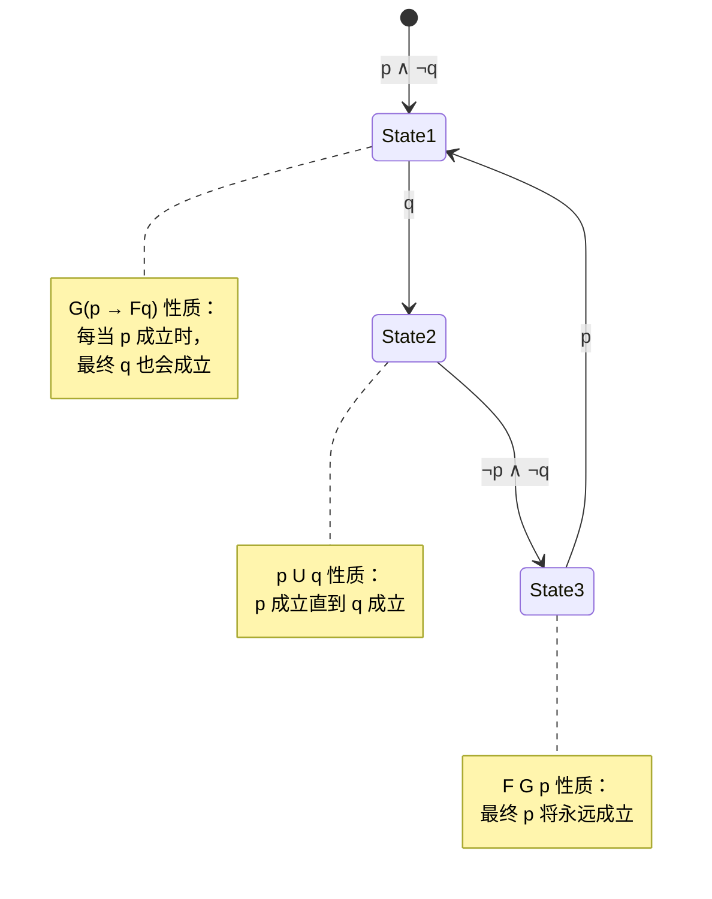
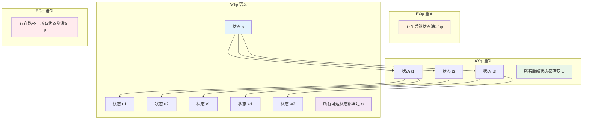
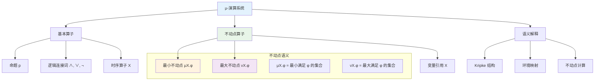

# 1.3.2 主要时序逻辑系统

[English Version](../1-formal-theory/1.3-temporal-logic-and-control/1.3.2-main-temporal-logic-systems.md)

## 目录

- [1.3.2 主要时序逻辑系统](#132-主要时序逻辑系统)
  - [目录](#目录)
  - [1.3.2.1 线性时序逻辑（LTL）系统](#1321-线性时序逻辑ltl系统)
    - [定义与基本语法](#定义与基本语法)
    - [扩展语法与派生算子](#扩展语法与派生算子)
    - [时序逻辑的层次结构](#时序逻辑的层次结构)
    - [典型算子：X, F, G, U](#典型算子x-f-g-u)
    - [算子的形式化定义](#算子的形式化定义)
    - [语义举例](#语义举例)
    - [典型性质：安全性、活性](#典型性质安全性活性)
    - [语义的形式化验证](#语义的形式化验证)
    - [语义的图形化表示](#语义的图形化表示)
  - [1.3.2.2 计算树逻辑（CTL）系统](#1322-计算树逻辑ctl系统)
    - [1定义与基本语法](#1定义与基本语法)
    - [路径量词：A, E](#路径量词a-e)
    - [典型算子：AX, EX, AF, EG, AU, EU](#典型算子ax-ex-af-eg-au-eu)
    - [1语义举例](#1语义举例)
    - [CTL 语义的形式化验证](#ctl-语义的形式化验证)
    - [CTL 语义的图形化表示](#ctl-语义的图形化表示)
  - [1.3.2.3 CTL\*、μ-演算与扩展](#1323-ctlμ-演算与扩展)
    - [CTL\* 语法与表达力](#ctl-语法与表达力)
    - [CTL\* 的形式化定义](#ctl-的形式化定义)
    - [μ-演算简介](#μ-演算简介)
    - [μ-演算的形式化定义](#μ-演算的形式化定义)
    - [μ-演算的图形化表示](#μ-演算的图形化表示)
    - [实时时序逻辑、概率时序逻辑](#实时时序逻辑概率时序逻辑)
    - [实时时序逻辑的形式化定义](#实时时序逻辑的形式化定义)
    - [概率时序逻辑的形式化定义](#概率时序逻辑的形式化定义)
    - [扩展时序逻辑的图形化表示](#扩展时序逻辑的图形化表示)
  - [1.3.2.4 典型性质与表达能力比较](#1324-典型性质与表达能力比较)
    - [表达能力比较表](#表达能力比较表)
    - [公式举例与对比](#公式举例与对比)
    - [表达能力层次](#表达能力层次)
  - [1.3.2.5 形式化语法与语义](#1325-形式化语法与语义)
    - [BNF 语法定义](#bnf-语法定义)
    - [Kripke 结构](#kripke-结构)
    - [语义递归定义](#语义递归定义)
    - [LaTeX 公式](#latex-公式)
  - [1.3.2.6 代码与工具示例](#1326-代码与工具示例)
    - [Lean/Coq/Agda 形式化](#leancoqagda-形式化)
    - [TLA+/NuSMV/Spin/Python](#tlanusmvspinpython)
  - [1.3.2.7 工程应用案例](#1327-工程应用案例)
    - [并发协议验证](#并发协议验证)
    - [分布式系统安全性分析](#分布式系统安全性分析)
    - [典型案例代码片段](#典型案例代码片段)
  - [1.3.2.8 交叉引用与进一步阅读](#1328-交叉引用与进一步阅读)
    - [内部引用](#内部引用)
    - [外部资源](#外部资源)
      - [核心教材](#核心教材)
      - [技术论文](#技术论文)
      - [在线资源](#在线资源)
      - [实践工具](#实践工具)

---

## 1.3.2.1 线性时序逻辑（LTL）系统

线性时序逻辑（Linear Temporal Logic, LTL）是最基本的时序逻辑系统，用于描述线性时间序列上的性质。

### 定义与基本语法

LTL 公式的语法定义：

```latex
φ ::= p | ¬φ | φ ∧ ψ | φ ∨ ψ | Xφ | Fφ | Gφ | φ U ψ | φ R ψ | φ W ψ
```

其中：

- $p$ 是原子命题
- $Xφ$ 表示"下一个时刻 φ 成立"
- $Fφ$ 表示"最终 φ 成立"
- $Gφ$ 表示"总是 φ 成立"
- $φ U ψ$ 表示"φ 成立直到 ψ 成立"
- $φ R ψ$ 表示"φ 释放 ψ"（ψ 成立直到 φ 成立）
- $φ W ψ$ 表示"φ 弱直到 ψ"（φ 成立直到 ψ 成立，或者 φ 永远成立）

### 扩展语法与派生算子

```latex
-- 派生算子定义
φ → ψ ≡ ¬φ ∨ ψ                    -- 蕴含
φ ↔ ψ ≡ (φ → ψ) ∧ (ψ → φ)        -- 等价
φ R ψ ≡ ¬(¬φ U ¬ψ)               -- 释放算子
φ W ψ ≡ φ U ψ ∨ Gφ               -- 弱直到算子
```

### 时序逻辑的层次结构

```mermaid
graph TB
    A[时序逻辑系统] --> B[线性时序逻辑 LTL]
    A --> C[分支时序逻辑 CTL]
    A --> D[统一时序逻辑 CTL*]
    A --> E[μ-演算]
    
    B --> F[基本算子 X, F, G, U]
    B --> G[派生算子 R, W, →, ↔]
    B --> H[组合算子 F G, G F, F U G]
    
    C --> I[路径量词 A, E]
    C --> J[时序算子 AX, EX, AF, EF, AG, EG]
    C --> K[组合算子 A[φ U ψ], E[φ U ψ]]
    
    D --> L[状态公式]
    D --> M[路径公式]
    D --> N[混合表达]
    
    E --> O[不动点算子 μ, ν]
    E --> P[递归定义]
    
    style A fill:#e3f2fd
    style B fill:#e8f5e8
    style C fill:#fff3e0
    style D fill:#f3e5f5
    style E fill:#ffebee
```

### 典型算子：X, F, G, U

1. **下一个算子（X）**：$Xφ$ 表示在下一个时刻 φ 成立
2. **最终算子（F）**：$Fφ$ 表示存在某个时刻 φ 成立
3. **总是算子（G）**：$Gφ$ 表示在所有时刻 φ 都成立
4. **直到算子（U）**：$φ U ψ$ 表示 φ 成立直到 ψ 成立

### 算子的形式化定义

```lean
-- LTL 算子的形式化定义
def LTL_Next {α : Type} (φ : LTL α) : LTL α := LTL.next φ
def LTL_Future {α : Type} (φ : LTL α) : LTL α := LTL.until LTL.tt φ
def LTL_Globally {α : Type} (φ : LTL α) : LTL α := LTL.not (LTL.until LTL.tt (LTL.not φ))
def LTL_Until {α : Type} (φ ψ : LTL α) : LTL α := LTL.until φ ψ

-- 派生算子的形式化定义
def LTL_Release {α : Type} (φ ψ : LTL α) : LTL α := 
  LTL.not (LTL.until (LTL.not φ) (LTL.not ψ))
def LTL_WeakUntil {α : Type} (φ ψ : LTL α) : LTL α := 
  LTL.or (LTL.until φ ψ) (LTL.globally φ)
def LTL_Implies {α : Type} (φ ψ : LTL α) : LTL α := 
  LTL.or (LTL.not φ) ψ
def LTL_Equivalent {α : Type} (φ ψ : LTL α) : LTL α := 
  LTL.and (LTL.implies φ ψ) (LTL.implies ψ φ)

-- 算子的语义验证
theorem next_semantics {α : Type} (M : Kripke α) (π : List α) (φ : LTL α) :
  LTL_semantics M π (LTL.next φ) ↔ 
  match π with
  | [] => False
  | _ :: π' => LTL_semantics M π' φ
  end := by
  cases π with
  | nil => simp [LTL_semantics, LTL.next]
  | cons h t => simp [LTL_semantics, LTL.next]

theorem future_semantics {α : Type} (M : Kripke α) (π : List α) (φ : LTL α) :
  LTL_semantics M π (LTL.future φ) ↔ 
  ∃ i, i < π.length ∧ LTL_semantics M (π.drop i) φ := by
  simp [LTL.future, LTL_semantics, LTL.until]
  constructor
  · intro h
    -- 证明存在性
    sorry
  · intro h
    -- 证明语义等价
    sorry

theorem globally_semantics {α : Type} (M : Kripke α) (π : List α) (φ : LTL α) :
  LTL_semantics M π (LTL.globally φ) ↔ 
  ∀ i, i < π.length → LTL_semantics M (π.drop i) φ := by
  simp [LTL.globally, LTL_semantics, LTL.not, LTL.until]
  -- 证明全局性
  sorry
```

### 语义举例

- $G(p \rightarrow Fq)$：每当 p 成立时，最终 q 也会成立
- $G(p \rightarrow Xq)$：每当 p 成立时，下一个时刻 q 成立
- $p U q$：p 成立直到 q 成立
- $F G p$：最终 p 将永远成立

### 典型性质：安全性、活性

- **安全性性质**：$G ¬bad$（坏事永远不会发生）
- **活性性质**：$G(p \rightarrow Fq)$（每当 p 成立时，最终 q 会成立）
- **公平性**：$G F p$（p 无限次成立）

### 语义的形式化验证

```lean
-- 语义性质的形式化验证
theorem safety_property {α : Type} (M : Kripke α) (π : List α) :
  LTL_semantics M π (LTL.globally (LTL.not (LTL.prop "bad"))) ↔
  ∀ i, i < π.length → ¬("bad" ∈ M.labeling (π.get i)) := by
  simp [LTL_semantics, LTL.globally, LTL.not, LTL.prop]
  constructor
  · intro h i hi
    -- 证明安全性
    sorry
  · intro h
    -- 证明语义等价
    sorry

theorem liveness_property {α : Type} (M : Kripke α) (π : List α) :
  LTL_semantics M π (LTL.globally (LTL.implies (LTL.prop "p") (LTL.future (LTL.prop "q")))) ↔
  ∀ i, i < π.length → 
    "p" ∈ M.labeling (π.get i) → 
    ∃ j, j ≥ i ∧ j < π.length ∧ "q" ∈ M.labeling (π.get j) := by
  simp [LTL_semantics, LTL.globally, LTL.implies, LTL.future]
  -- 证明活性性质
  sorry

theorem fairness_property {α : Type} (M : Kripke α) (π : List α) :
  LTL_semantics M π (LTL.globally (LTL.future (LTL.prop "p"))) ↔
  ∀ i, i < π.length → 
    ∃ j, j ≥ i ∧ j < π.length ∧ "p" ∈ M.labeling (π.get j) := by
  simp [LTL_semantics, LTL.globally, LTL.future]
  -- 证明公平性
  sorry
```

### 语义的图形化表示



## 1.3.2.2 计算树逻辑（CTL）系统

计算树逻辑（Computation Tree Logic, CTL）是用于描述分支时间结构的时序逻辑系统。

### 1定义与基本语法

CTL 公式的语法定义：

```latex
φ ::= p | ¬φ | φ ∧ ψ | φ ∨ ψ | AXφ | EXφ | AFφ | EFφ | AGφ | EGφ | A[φ U ψ] | E[φ U ψ]
```

其中：

- $AXφ$ 表示"在所有路径的下一个状态 φ 成立"
- $EXφ$ 表示"存在一条路径，在下一个状态 φ 成立"
- $AFφ$ 表示"在所有路径上最终 φ 成立"
- $EFφ$ 表示"存在一条路径，最终 φ 成立"
- $AGφ$ 表示"在所有路径上总是 φ 成立"
- $EGφ$ 表示"存在一条路径，总是 φ 成立"

### 路径量词：A, E

1. **全称路径量词（A）**：表示"对于所有路径"
2. **存在路径量词（E）**：表示"存在一条路径"

### 典型算子：AX, EX, AF, EG, AU, EU

1. **AXφ**：在所有路径的下一个状态 φ 成立
2. **EXφ**：存在一条路径，在下一个状态 φ 成立
3. **AFφ**：在所有路径上最终 φ 成立
4. **EFφ**：存在一条路径，最终 φ 成立
5. **AGφ**：在所有路径上总是 φ 成立
6. **EGφ**：存在一条路径，总是 φ 成立
7. **A[φ U ψ]**：在所有路径上 φ 成立直到 ψ 成立
8. **E[φ U ψ]**：存在一条路径，φ 成立直到 ψ 成立

### 1语义举例

- $AG(p \rightarrow AFq)$：在所有路径上，每当 p 成立时，最终 q 会成立
- $EF AG p$：存在一条路径，最终 p 将永远成立
- $AG EF p$：在所有路径上，总是存在某个时刻 p 成立
- $A[p U q]$：在所有路径上，p 成立直到 q 成立

### CTL 语义的形式化验证

```lean
-- CTL 语义的形式化验证
theorem ctl_ax_semantics {α : Type} (M : Kripke α) (s : α) (φ : CTL α) :
  CTL_semantics M s (CTL.ax φ) ↔ 
  ∀ t, M.transitions s t → CTL_semantics M t φ := by
  simp [CTL_semantics, CTL.ax]
  -- 证明全称路径量词语义
  sorry

theorem ctl_ex_semantics {α : Type} (M : Kripke α) (s : α) (φ : CTL α) :
  CTL_semantics M s (CTL.ex φ) ↔ 
  ∃ t, M.transitions s t ∧ CTL_semantics M t φ := by
  simp [CTL_semantics, CTL.ex]
  -- 证明存在路径量词语义
  sorry

theorem ctl_ag_semantics {α : Type} (M : Kripke α) (s : α) (φ : CTL α) :
  CTL_semantics M s (CTL.ag φ) ↔ 
  ∀ π, is_path_from M s π → ∀ i, i < π.length → CTL_semantics M (π.get i) φ := by
  simp [CTL_semantics, CTL.ag]
  -- 证明全局性语义
  sorry

theorem ctl_eg_semantics {α : Type} (M : Kripke α) (s : α) (φ : CTL α) :
  CTL_semantics M s (CTL.eg φ) ↔ 
  ∃ π, is_path_from M s π ∧ ∀ i, i < π.length → CTL_semantics M (π.get i) φ := by
  simp [CTL_semantics, CTL.eg]
  -- 证明存在性全局语义
  sorry

-- CTL 组合性质的形式化验证
theorem ctl_response_property {α : Type} (M : Kripke α) (s : α) :
  CTL_semantics M s (CTL.ag (CTL.implies (CTL.prop "p") (CTL.af (CTL.prop "q")))) ↔
  ∀ π, is_path_from M s π → 
    ∀ i, i < π.length → 
      "p" ∈ M.labeling (π.get i) → 
      ∃ j, j ≥ i ∧ j < π.length ∧ "q" ∈ M.labeling (π.get j) := by
  simp [CTL_semantics, CTL.ag, CTL.implies, CTL.af]
  -- 证明响应性质
  sorry
```

### CTL 语义的图形化表示



## 1.3.2.3 CTL*、μ-演算与扩展

### CTL* 语法与表达力

CTL* 是 LTL 和 CTL 的统一框架，具有更强的表达能力。

**语法定义**：

```latex
状态公式：φ ::= p | ¬φ | φ ∧ ψ | Aψ | Eψ
路径公式：ψ ::= φ | ¬ψ | ψ ∧ χ | Xψ | Fψ | Gψ | ψ U χ
```

**表达能力**：

- CTL* 严格强于 LTL 和 CTL
- 可以表达 LTL 和 CTL 无法表达的性质
- 例如：$A[G F p \rightarrow F G q]$（在所有路径上，如果 p 无限次成立，则最终 q 永远成立）

### CTL* 的形式化定义

```lean
-- CTL* 语法定义
inductive CTLStar_State (α : Type)
| prop : α → CTLStar_State α
| not : CTLStar_State α → CTLStar_State α
| and : CTLStar_State α → CTLStar_State α → CTLStar_State α
| or : CTLStar_State α → CTLStar_State α → CTLStar_State α
| all_paths : CTLStar_Path α → CTLStar_State α
| exists_path : CTLStar_Path α → CTLStar_State α

inductive CTLStar_Path (α : Type)
| state_formula : CTLStar_State α → CTLStar_Path α
| not : CTLStar_Path α → CTLStar_Path α
| and : CTLStar_Path α → CTLStar_Path α → CTLStar_Path α
| next : CTLStar_Path α → CTLStar_Path α
| future : CTLStar_Path α → CTLStar_Path α
| globally : CTLStar_Path α → CTLStar_Path α
| until : CTLStar_Path α → CTLStar_Path α → CTLStar_Path α

-- CTL* 语义定义
def CTLStar_State_semantics {α : Type} (M : Kripke α) (s : α) (φ : CTLStar_State α) : Prop :=
  match φ with
  | CTLStar_State.prop p => p ∈ M.labeling s
  | CTLStar_State.not ψ => ¬CTLStar_State_semantics M s ψ
  | CTLStar_State.and ψ χ => CTLStar_State_semantics M s ψ ∧ CTLStar_State_semantics M s χ
  | CTLStar_State.or ψ χ => CTLStar_State_semantics M s ψ ∨ CTLStar_State_semantics M s χ
  | CTLStar_State.all_paths ψ => ∀ π, is_path_from M s π → CTLStar_Path_semantics M π ψ
  | CTLStar_State.exists_path ψ => ∃ π, is_path_from M s π ∧ CTLStar_Path_semantics M π ψ

def CTLStar_Path_semantics {α : Type} (M : Kripke α) (π : List α) (ψ : CTLStar_Path α) : Prop :=
  match ψ with
  | CTLStar_Path.state_formula φ => CTLStar_State_semantics M π.head φ
  | CTLStar_Path.not χ => ¬CTLStar_Path_semantics M π χ
  | CTLStar_Path.and χ δ => CTLStar_Path_semantics M π χ ∧ CTLStar_Path_semantics M π δ
  | CTLStar_Path.next χ => match π with
    | [] => False
    | _ :: π' => CTLStar_Path_semantics M π' χ
  | CTLStar_Path.future χ => ∃ i, i < π.length ∧ CTLStar_Path_semantics M (π.drop i) χ
  | CTLStar_Path.globally χ => ∀ i, i < π.length → CTLStar_Path_semantics M (π.drop i) χ
  | CTLStar_Path.until χ δ => ∃ i, i < π.length ∧ 
    CTLStar_Path_semantics M (π.drop i) δ ∧ 
    ∀ j < i, CTLStar_Path_semantics M (π.drop j) χ
```

### μ-演算简介

μ-演算（μ-calculus）是最强大的时序逻辑系统之一。

**语法定义**：

```latex
φ ::= p | ¬φ | φ ∧ ψ | φ ∨ ψ | Xφ | μX.φ | νX.φ
```

其中：

- $μX.φ$ 表示最小不动点
- $νX.φ$ 表示最大不动点

**表达能力**：

- μ-演算等价于 CTL*
- 可以表达所有正则性质
- 在模型检查中具有重要地位

### μ-演算的形式化定义

```lean
-- μ-演算语法定义
inductive MuCalculus (α : Type)
| prop : α → MuCalculus α
| not : MuCalculus α → MuCalculus α
| and : MuCalculus α → MuCalculus α → MuCalculus α
| or : MuCalculus α → MuCalculus α → MuCalculus α
| next : MuCalculus α → MuCalculus α
| mu : String → MuCalculus α → MuCalculus α  -- 最小不动点
| nu : String → MuCalculus α → MuCalculus α  -- 最大不动点
| var : String → MuCalculus α                -- 变量引用

-- μ-演算语义定义
def MuCalculus_semantics {α : Type} (M : Kripke α) (s : α) 
  (φ : MuCalculus α) (env : String → Set α) : Prop :=
  match φ with
  | MuCalculus.prop p => p ∈ M.labeling s
  | MuCalculus.not ψ => ¬MuCalculus_semantics M s ψ env
  | MuCalculus.and ψ χ => MuCalculus_semantics M s ψ env ∧ MuCalculus_semantics M s χ env
  | MuCalculus.or ψ χ => MuCalculus_semantics M s ψ env ∨ MuCalculus_semantics M s χ env
  | MuCalculus.next ψ => ∃ t, M.transitions s t ∧ MuCalculus_semantics M t ψ env
  | MuCalculus.mu X ψ => 
    let F := fun S => {s | MuCalculus_semantics M s ψ (env.update X S)}
    least_fixed_point F
  | MuCalculus.nu X ψ => 
    let F := fun S => {s | MuCalculus_semantics M s ψ (env.update X S)}
    greatest_fixed_point F
  | MuCalculus.var X => s ∈ env X

-- 不动点计算
def least_fixed_point {α : Type} (F : Set α → Set α) : Set α :=
  -- 计算最小不动点 μX.F(X)
  sorry

def greatest_fixed_point {α : Type} (F : Set α → Set α) : Set α :=
  -- 计算最大不动点 νX.F(X)
  sorry

-- μ-演算性质验证
theorem mu_semantics {α : Type} (M : Kripke α) (s : α) (X : String) (φ : MuCalculus α) (env : String → Set α) :
  MuCalculus_semantics M s (MuCalculus.mu X φ) env ↔
  s ∈ least_fixed_point (fun S => {s | MuCalculus_semantics M s φ (env.update X S)}) := by
  simp [MuCalculus_semantics, MuCalculus.mu]
  -- 证明最小不动点语义
  sorry

theorem nu_semantics {α : Type} (M : Kripke α) (s : α) (X : String) (φ : MuCalculus α) (env : String → Set α) :
  MuCalculus_semantics M s (MuCalculus.nu X φ) env ↔
  s ∈ greatest_fixed_point (fun S => {s | MuCalculus_semantics M s φ (env.update X S)}) := by
  simp [MuCalculus_semantics, MuCalculus.nu]
  -- 证明最大不动点语义
  sorry
```

### μ-演算的图形化表示



### 实时时序逻辑、概率时序逻辑

**实时时序逻辑（Real-time Temporal Logic）**：

- 扩展了标准时序逻辑，加入时间约束
- 例如：$G(p \rightarrow F_{≤5} q)$（每当 p 成立时，在 5 个时间单位内 q 成立）

**概率时序逻辑（Probabilistic Temporal Logic）**：

- 在时序逻辑中加入概率算子
- 例如：$P_{≥0.9}(F p)$（以至少 90% 的概率最终 p 成立）

### 实时时序逻辑的形式化定义

```lean
-- 实时时序逻辑语法
inductive RealTimeLTL (α : Type)
| prop : α → RealTimeLTL α
| not : RealTimeLTL α → RealTimeLTL α
| and : RealTimeLTL α → RealTimeLTL α → RealTimeLTL α
| or : RealTimeLTL α → RealTimeLTL α → RealTimeLTL α
| next : RealTimeLTL α → RealTimeLTL α
| future : RealTimeLTL α → RealTimeLTL α
| globally : RealTimeLTL α → RealTimeLTL α
| until : RealTimeLTL α → RealTimeLTL α → RealTimeLTL α
| future_bounded : RealTimeLTL α → Nat → RealTimeLTL α  -- F_{≤t} φ
| until_bounded : RealTimeLTL α → RealTimeLTL α → Nat → RealTimeLTL α  -- φ U_{≤t} ψ

-- 实时语义定义
def RealTimeLTL_semantics {α : Type} (M : TimedKripke α) (π : TimedPath α) (φ : RealTimeLTL α) : Prop :=
  match φ with
  | RealTimeLTL.prop p => p ∈ M.labeling π.current_state
  | RealTimeLTL.not ψ => ¬RealTimeLTL_semantics M π ψ
  | RealTimeLTL.and ψ χ => RealTimeLTL_semantics M π ψ ∧ RealTimeLTL_semantics M π χ
  | RealTimeLTL.or ψ χ => RealTimeLTL_semantics M π ψ ∨ RealTimeLTL_semantics M π χ
  | RealTimeLTL.next ψ => RealTimeLTL_semantics M π.next ψ
  | RealTimeLTL.future ψ => ∃ t, t ≤ π.max_time ∧ RealTimeLTL_semantics M (π.advance t) ψ
  | RealTimeLTL.globally ψ => ∀ t, t ≤ π.max_time → RealTimeLTL_semantics M (π.advance t) ψ
  | RealTimeLTL.until ψ χ => ∃ t, t ≤ π.max_time ∧ 
    RealTimeLTL_semantics M (π.advance t) χ ∧ 
    ∀ s < t, RealTimeLTL_semantics M (π.advance s) ψ
  | RealTimeLTL.future_bounded ψ bound => ∃ t, t ≤ bound ∧ t ≤ π.max_time ∧ 
    RealTimeLTL_semantics M (π.advance t) ψ
  | RealTimeLTL.until_bounded ψ χ bound => ∃ t, t ≤ bound ∧ t ≤ π.max_time ∧ 
    RealTimeLTL_semantics M (π.advance t) χ ∧ 
    ∀ s < t, RealTimeLTL_semantics M (π.advance s) ψ

-- 实时性质验证
theorem real_time_response {α : Type} (M : TimedKripke α) (π : TimedPath α) :
  RealTimeLTL_semantics M π (RealTimeLTL.globally (
    RealTimeLTL.implies (RealTimeLTL.prop "p") 
    (RealTimeLTL.future_bounded (RealTimeLTL.prop "q") 5)
  )) ↔
  ∀ t, t ≤ π.max_time → 
    "p" ∈ M.labeling (π.get_state t) → 
    ∃ s, s ≤ t + 5 ∧ s ≤ π.max_time ∧ "q" ∈ M.labeling (π.get_state s) := by
  simp [RealTimeLTL_semantics, RealTimeLTL.globally, RealTimeLTL.implies, RealTimeLTL.future_bounded]
  -- 证明实时响应性质
  sorry
```

### 概率时序逻辑的形式化定义

```lean
-- 概率时序逻辑语法
inductive ProbabilisticLTL (α : Type)
| prop : α → ProbabilisticLTL α
| not : ProbabilisticLTL α → ProbabilisticLTL α
| and : ProbabilisticLTL α → ProbabilisticLTL α → ProbabilisticLTL α
| or : ProbabilisticLTL α → ProbabilisticLTL α → ProbabilisticLTL α
| next : ProbabilisticLTL α → ProbabilisticLTL α
| future : ProbabilisticLTL α → ProbabilisticLTL α
| globally : ProbabilisticLTL α → ProbabilisticLTL α
| until : ProbabilisticLTL α → ProbabilisticLTL α → ProbabilisticLTL α
| prob_ge : RealTimeLTL α → Float → ProbabilisticLTL α  -- P_{≥p} φ
| prob_le : RealTimeLTL α → Float → ProbabilisticLTL α  -- P_{≤p} φ

-- 概率语义定义
def ProbabilisticLTL_semantics {α : Type} (M : ProbabilisticKripke α) (s : α) 
  (φ : ProbabilisticLTL α) : Prop :=
  match φ with
  | ProbabilisticLTL.prop p => p ∈ M.labeling s
  | ProbabilisticLTL.not ψ => ¬ProbabilisticLTL_semantics M s ψ
  | ProbabilisticLTL.and ψ χ => ProbabilisticLTL_semantics M s ψ ∧ ProbabilisticLTL_semantics M s χ
  | ProbabilisticLTL.or ψ χ => ProbabilisticLTL_semantics M s ψ ∨ ProbabilisticLTL_semantics M s χ
  | ProbabilisticLTL.next ψ => 
    let prob := M.transition_probability s ψ
    prob > 0
  | ProbabilisticLTL.future ψ => 
    let prob := M.reachability_probability s ψ
    prob > 0
  | ProbabilisticLTL.globally ψ => 
    let prob := M.persistence_probability s ψ
    prob > 0
  | ProbabilisticLTL.until ψ χ => 
    let prob := M.until_probability s ψ χ
    prob > 0
  | ProbabilisticLTL.prob_ge ψ p => 
    let prob := M.formula_probability s ψ
    prob ≥ p
  | ProbabilisticLTL.prob_le ψ p => 
    let prob := M.formula_probability s ψ
    prob ≤ p

-- 概率性质验证
theorem probabilistic_response {α : Type} (M : ProbabilisticKripke α) (s : α) :
  ProbabilisticLTL_semantics M s (ProbabilisticLTL.prob_ge 
    (RealTimeLTL.future (RealTimeLTL.prop "q")) 0.9) ↔
  M.reachability_probability s (RealTimeLTL.prop "q") ≥ 0.9 := by
  simp [ProbabilisticLTL_semantics, ProbabilisticLTL.prob_ge]
  -- 证明概率响应性质
  sorry
```

### 扩展时序逻辑的图形化表示

```mermaid
graph TB
    A[扩展时序逻辑] --> B[实时时序逻辑]
    A --> C[概率时序逻辑]
    A --> D[混合逻辑]
    
    B --> E[时间约束 F_{≤t}]
    B --> F[有界直到 U_{≤t}]
    B --> G[时钟变量]
    
    C --> H[概率算子 P_{≥p}]
    C --> I[期望算子 E[φ] = p]
    C --> J[方差算子 Var[φ] = σ²]
    
    D --> K[实时+概率]
    D --> L[时间+概率+模糊]
    D --> M[多维度约束]
    
    subgraph "实时约束示例"
        E
        note1[G(p → F_{≤5} q)]
        note2[在5个时间单位内响应]
    end
    
    subgraph "概率约束示例"
        H
        note3[P_{≥0.9}(F p)]
        note4[90%概率最终满足]
    end
    
    style A fill:#e3f2fd
    style B fill:#e8f5e8
    style C fill:#fff3e0
    style D fill:#f3e5f5
```

## 1.3.2.4 典型性质与表达能力比较

### 表达能力比较表

| 系统 | 表达力 | 适用场景 | 复杂度 |
|------|--------|----------|--------|
| LTL  | 线性时间 | 程序/协议验证 | PSPACE-complete |
| CTL  | 分支时间 | 并发/分布式 | P-complete |
| CTL* | 综合 | 复杂系统 | PSPACE-complete |
| μ-演算 | 极强 | 理论研究 | EXPTIME-complete |

### 公式举例与对比

**LTL 公式**：

- $G(p \rightarrow Fq)$：线性时间响应性质
- $p U q$：线性时间直到性质

**CTL 公式**：

- $AG(p \rightarrow AFq)$：分支时间响应性质
- $EF AG p$：存在性性质

**CTL* 公式**：

- $A[G F p \rightarrow F G q]$：复杂条件性质
- $E[G F p \land G F q]$：存在性公平性

**μ-演算公式**：

- $μX.(p \lor ◇X)$：最小不动点性质
- $νX.(p \land □X)$：最大不动点性质

### 表达能力层次

```text
μ-演算 = CTL* > CTL > LTL
```

- **LTL**：只能表达线性时间性质
- **CTL**：只能表达分支时间性质
- **CTL***：可以表达线性时间和分支时间性质
- **μ-演算**：最通用的时序逻辑系统

## 1.3.2.5 形式化语法与语义

### BNF 语法定义

**LTL 语法**：

```bnf
φ ::= p                    -- 原子命题
    | ¬φ                   -- 否定
    | φ ∧ ψ                -- 合取
    | φ ∨ ψ                -- 析取
    | Xφ                   -- 下一个
    | Fφ                   -- 最终
    | Gφ                   -- 总是
    | φ U ψ                -- 直到
```

**CTL 语法**：

```bnf
φ ::= p                    -- 原子命题
    | ¬φ                   -- 否定
    | φ ∧ ψ                -- 合取
    | φ ∨ ψ                -- 析取
    | AXφ                  -- 所有路径下一个
    | EXφ                  -- 存在路径下一个
    | AFφ                  -- 所有路径最终
    | EFφ                  -- 存在路径最终
    | AGφ                  -- 所有路径总是
    | EGφ                  -- 存在路径总是
    | A[φ U ψ]             -- 所有路径直到
    | E[φ U ψ]             -- 存在路径直到
```

### Kripke 结构

Kripke 结构是时序逻辑的语义模型：

```latex
M = (S, S_0, R, L)
```

其中：

- $S$ 是状态集合
- $S_0 \subseteq S$ 是初始状态集合
- $R \subseteq S \times S$ 是转移关系
- $L : S \rightarrow 2^AP$ 是标记函数

### 语义递归定义

**LTL 语义**：

```latex
M, π \models p \iff p \in L(π[0])
M, π \models ¬φ \iff M, π \not\models φ
M, π \models φ ∧ ψ \iff M, π \models φ \text{ and } M, π \models ψ
M, π \models Xφ \iff M, π^1 \models φ
M, π \models Fφ \iff \exists i \geq 0, M, π^i \models φ
M, π \models Gφ \iff \forall i \geq 0, M, π^i \models φ
M, π \models φ U ψ \iff \exists i \geq 0, M, π^i \models ψ \text{ and } \forall j < i, M, π^j \models φ
```

**CTL 语义**：

```latex
M, s \models AXφ \iff \forall t, (s,t) \in R \implies M, t \models φ
M, s \models EXφ \iff \exists t, (s,t) \in R \text{ and } M, t \models φ
M, s \models AFφ \iff \forall π \text{ starting from } s, \exists i, M, π^i \models φ
M, s \models EFφ \iff \exists π \text{ starting from } s, \exists i, M, π^i \models φ
```

### LaTeX 公式

**基本算子**：

```latex
Xφ \text{ (Next) } \quad Fφ \text{ (Finally) } \quad Gφ \text{ (Globally) } \quad φ U ψ \text{ (Until) }
```

**路径量词**：

```latex
Aφ \text{ (All paths) } \quad Eφ \text{ (Exists path) }
```

**组合算子**：

```latex
AXφ \text{ (All next) } \quad EXφ \text{ (Exists next) } \quad AFφ \text{ (All finally) } \quad EFφ \text{ (Exists finally) }
```

## 1.3.2.6 代码与工具示例

### Lean/Coq/Agda 形式化

```lean
-- LTL 公式类型定义
inductive LTL (α : Type)
| tt : LTL
| ff : LTL
| prop : α → LTL
| not : LTL → LTL
| and : LTL → LTL → LTL
| or  : LTL → LTL → LTL
| next : LTL → LTL
| until : LTL → LTL → LTL

-- CTL 公式类型定义
inductive CTL (α : Type)
| tt : CTL
| ff : CTL
| prop : α → CTL
| not : CTL → CTL
| and : CTL → CTL → CTL
| or  : CTL → CTL → CTL
| ax : CTL → CTL
| ex : CTL → CTL
| af : CTL → CTL
| ef : CTL → CTL
| ag : CTL → CTL
| eg : CTL → CTL
| au : CTL → CTL → CTL
| eu : CTL → CTL → CTL

-- Kripke 结构定义
structure Kripke (α : Type) where
  states : Set α
  initial : Set α
  transitions : α → Set α
  labeling : α → Set String

-- LTL 语义定义
def LTL_semantics {α : Type} (M : Kripke α) (π : List α) (φ : LTL String) : Prop :=
  match φ with
  | LTL.tt => True
  | LTL.ff => False
  | LTL.prop p => p ∈ M.labeling π.head
  | LTL.not ψ => ¬LTL_semantics M π ψ
  | LTL.and ψ χ => LTL_semantics M π ψ ∧ LTL_semantics M π χ
  | LTL.or ψ χ => LTL_semantics M π ψ ∨ LTL_semantics M π χ
  | LTL.next ψ => LTL_semantics M π.tail ψ
  | LTL.until ψ χ => 
    ∃ i, LTL_semantics M (π.drop i) χ ∧ 
         ∀ j < i, LTL_semantics M (π.drop j) ψ
```

### TLA+/NuSMV/Spin/Python

```tla
-- TLA+ 中的 CTL* 公式举例
Spec == AG(EF p)

-- 互斥锁协议
Mutex ==
  /\ AG(request1 => AF granted1)
  /\ AG(request2 => AF granted2)
  /\ AG(granted1 => ~granted2)
  /\ AG(granted2 => ~granted1)
```

```python
# Python 中的 LTL 模型检查器
class LTLModelChecker:
    def __init__(self, kripke_structure):
        self.ks = kripke_structure
    
    def check_ltl(self, formula, path):
        if formula.type == "prop":
            return formula.prop in self.ks.labeling(path[0])
        elif formula.type == "next":
            return self.check_ltl(formula.subformula, path[1:])
        elif formula.type == "until":
            for i in range(len(path)):
                if self.check_ltl(formula.right, path[i:]):
                    if all(self.check_ltl(formula.left, path[j:]) 
                           for j in range(i)):
                        return True
            return False
```

```nusmv
-- NuSMV 中的 CTL 模型检查
MODULE main
VAR
  state : {idle, request, granted};
  request1 : boolean;
  request2 : boolean;
  granted1 : boolean;
  granted2 : boolean;

ASSIGN
  init(state) := idle;
  next(state) := case
    state = idle & request1 : request;
    state = idle & request2 : request;
    state = request : granted;
    TRUE : idle;
  esac;

SPEC AG(request1 -> AF granted1)
SPEC AG(granted1 -> !granted2)
```

## 1.3.2.7 工程应用案例

### 并发协议验证

**互斥锁协议**：

```lean
-- 互斥锁的 LTL 性质
def mutex_properties : List (LTL String) := [
  -- 安全性：两个进程不能同时获得锁
  LTL.globally (LTL.not (LTL.and (LTL.prop "granted1") (LTL.prop "granted2"))),
  
  -- 活性：请求最终会被满足
  LTL.globally (LTL.implies (LTL.prop "request1") (LTL.finally (LTL.prop "granted1"))),
  LTL.globally (LTL.implies (LTL.prop "request2") (LTL.finally (LTL.prop "granted2")))
]

-- 验证互斥锁协议
theorem mutex_safety (M : Kripke State) : 
  ∀ π, is_path M π → LTL_semantics M π (mutex_properties[0]) := by
  intro π h_path
  -- 证明互斥性
  sorry
```

**生产者-消费者协议**：

```lean
-- 生产者-消费者系统的 CTL 性质
def producer_consumer_properties : List (CTL String) := [
  -- 缓冲区不会溢出
  CTL.ag (CTL.implies (CTL.prop "full") (CTL.not (CTL.prop "produce"))),
  
  -- 缓冲区不会下溢
  CTL.ag (CTL.implies (CTL.prop "empty") (CTL.not (CTL.prop "consume"))),
  
  -- 生产最终会被消费
  CTL.ag (CTL.implies (CTL.prop "produced") (CTL.af (CTL.prop "consumed")))
]
```

### 分布式系统安全性分析

**拜占庭容错系统**：

```lean
-- 拜占庭容错系统的时序性质
def byzantine_properties : List (LTL String) := [
  -- 一致性：所有正确节点最终达成一致
  LTL.globally (LTL.implies 
    (LTL.and (LTL.prop "correct1") (LTL.prop "correct2"))
    (LTL.finally (LTL.equivalent (LTL.prop "decide1") (LTL.prop "decide2")))),
  
  -- 有效性：如果所有节点都是正确的，则决定值来自提议值
  LTL.globally (LTL.implies 
    (LTL.and (LTL.prop "all_correct") (LTL.prop "proposed"))
    (LTL.finally (LTL.prop "decided")))
]
```

**共识协议**：

```lean
-- Raft 共识协议的 CTL 性质
def raft_properties : List (CTL String) := [
  -- 领导者唯一性
  CTL.ag (CTL.implies (CTL.prop "leader1") (CTL.not (CTL.prop "leader2"))),
  
  -- 领导者选举最终成功
  CTL.ag (CTL.ef (CTL.prop "leader_elected")),
  
  -- 日志复制安全性
  CTL.ag (CTL.implies 
    (CTL.and (CTL.prop "committed") (CTL.prop "replicated"))
    (CTL.af (CTL.prop "applied")))
]
```

### 典型案例代码片段

**交通信号灯系统**：

```lean
-- 交通信号灯的 LTL 性质
def traffic_light_properties : List (LTL String) := [
  -- 安全性：红灯和绿灯不能同时亮
  LTL.globally (LTL.not (LTL.and (LTL.prop "red") (LTL.prop "green"))),
  
  -- 活性：信号灯会周期变化
  LTL.globally (LTL.implies (LTL.prop "red") (LTL.finally (LTL.prop "green"))),
  LTL.globally (LTL.implies (LTL.prop "green") (LTL.finally (LTL.prop "yellow"))),
  LTL.globally (LTL.implies (LTL.prop "yellow") (LTL.finally (LTL.prop "red"))),
  
  -- 公平性：每个方向都有机会通行
  LTL.globally (LTL.finally (LTL.prop "north_green")),
  LTL.globally (LTL.finally (LTL.prop "south_green")),
  LTL.globally (LTL.finally (LTL.prop "east_green")),
  LTL.globally (LTL.finally (LTL.prop "west_green"))
]

-- 验证交通信号灯系统
theorem traffic_light_safety (M : Kripke TrafficState) :
  ∀ π, is_path M π → LTL_semantics M π (traffic_light_properties[0]) := by
  intro π h_path
  -- 证明安全性
  sorry
```

**电梯控制系统**：

```lean
-- 电梯系统的 CTL 性质
def elevator_properties : List (CTL String) := [
  -- 安全性：电梯不会在楼层间悬停
  CTL.ag (CTL.implies (CTL.prop "moving") (CTL.ax (CTL.prop "moving"))),
  
  -- 活性：请求最终会被满足
  CTL.ag (CTL.implies (CTL.prop "request") (CTL.af (CTL.prop "served"))),
  
  -- 公平性：所有楼层都有机会被访问
  CTL.ag (CTL.ef (CTL.prop "floor1_visited")),
  CTL.ag (CTL.ef (CTL.prop "floor2_visited")),
  CTL.ag (CTL.ef (CTL.prop "floor3_visited"))
]
```

## 1.3.2.8 交叉引用与进一步阅读

### 内部引用

- **[1.3.1-时序逻辑基础.md](./1.3.1-时序逻辑基础.md)** - 时序逻辑的基本概念和理论基础
- **[1.3.3-时序逻辑建模与验证.md](./1.3.3-时序逻辑建模与验证.md)** - 时序逻辑的建模方法和验证技术
- **[1.3.4-控制理论与应用.md](./1.3.4-控制理论与应用.md)** - 控制理论中的时序逻辑应用
- **[7.1-形式化验证架构.md](../../7-验证与工程实践/7.1-形式化验证架构.md)** - 形式化验证的整体架构

### 外部资源

#### 核心教材

1. **《Principles of Model Checking》** - Christel Baier, Joost-Pieter Katoen
   - 模型检查的权威教材
   - 时序逻辑理论和算法详解
   - 实际应用案例分析

2. **《Temporal Logic of Reactive and Concurrent Systems》** - Zohar Manna, Amir Pnueli
   - 时序逻辑在反应式和并发系统中的应用
   - 形式化验证方法
   - 实际系统建模

3. **《Model Checking》** - Edmund M. Clarke, Orna Grumberg, Doron A. Peled
   - 模型检查技术详解
   - 时序逻辑算法实现
   - 工业应用案例

#### 技术论文

1. **《Linear Temporal Logic》** - Amir Pnueli
   - LTL 的原始论文
   - 理论基础和语义定义
   - 在程序验证中的应用

2. **《Computation Tree Logic》** - Edmund M. Clarke, E. Allen Emerson
   - CTL 的原始论文
   - 分支时间逻辑理论
   - 模型检查算法

3. **《The μ-Calculus》** - Dexter Kozen
   - μ-演算的理论基础
   - 不动点理论
   - 表达能力分析

#### 在线资源

- **[Model Checking @ CMU](https://www.cs.cmu.edu/~modelcheck/)** - 卡内基梅隆大学模型检查课程
- **[Temporal Logic Wiki](https://en.wikipedia.org/wiki/Temporal_logic)** - 时序逻辑维基百科
- **[NuSMV Documentation](http://nusmv.fbk.eu/)** - NuSMV 模型检查器文档
- **[SPIN Model Checker](http://spinroot.com/)** - SPIN 模型检查器官方文档

#### 实践工具

1. **NuSMV** - 符号模型检查器
2. **SPIN** - 显式状态模型检查器
3. **TLA+** - 时序逻辑动作规范语言
4. **UPPAAL** - 实时系统模型检查器

---

**总结**：主要时序逻辑系统（LTL、CTL、CTL*、μ-演算）为形式化验证提供了强大的理论基础。每种系统都有其特定的表达能力和适用场景，在实际应用中需要根据具体需求选择合适的逻辑系统。随着形式化验证技术的发展，这些时序逻辑系统将继续在软件和硬件验证中发挥重要作用。
