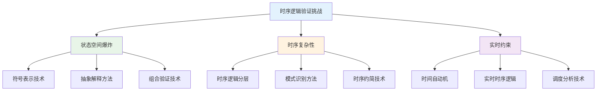
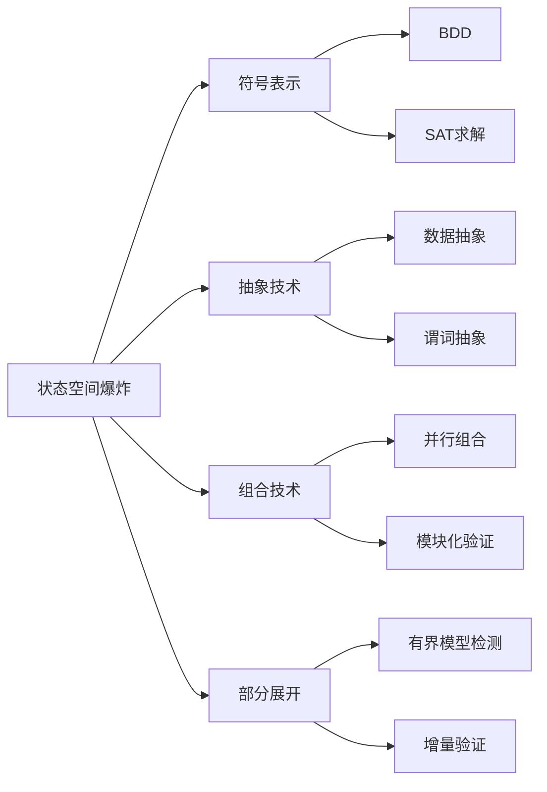
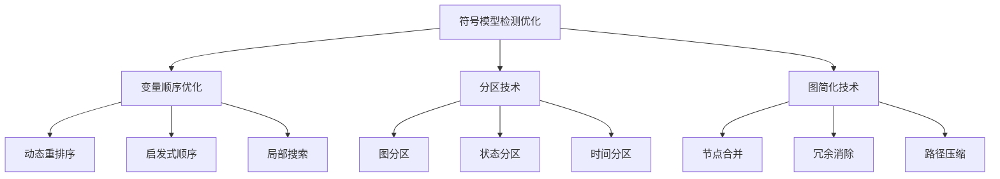
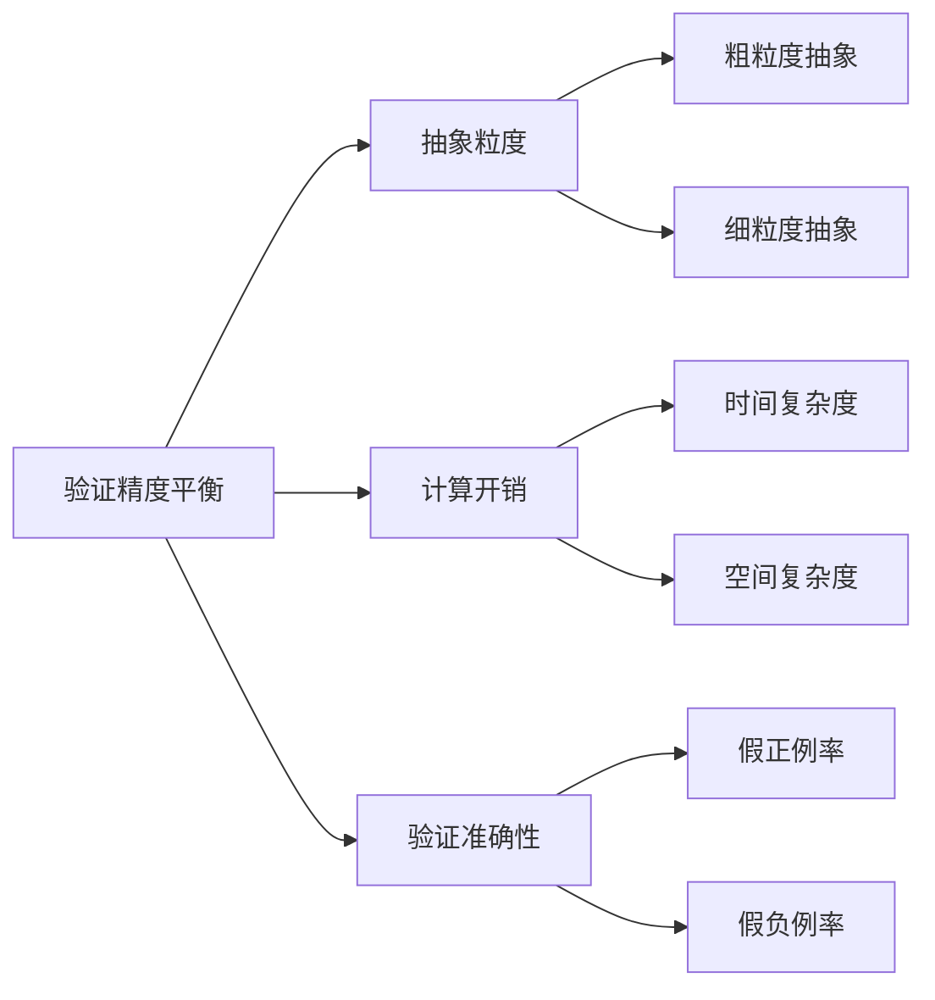
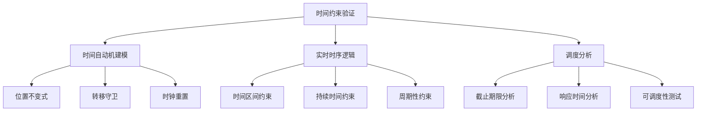
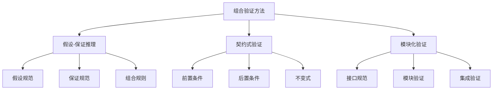

# 1.3.3 时序逻辑建模与验证

[English Version](../1-formal-theory/1.3-temporal-logic-and-control/1.3.3-temporal-logic-modeling-and-verification.md)

## 目录

- [1.3.3 时序逻辑建模与验证](#133-时序逻辑建模与验证)
  - [目录](#目录)
  - [1.3.3.1 研究背景与意义](#1331-研究背景与意义)
    - [时序逻辑验证的重要性](#时序逻辑验证的重要性)
    - [技术挑战与解决方案](#技术挑战与解决方案)
  - [1.3.3.2 模型检测基础](#1332-模型检测基础)
    - [模型检测原理](#模型检测原理)
    - [状态空间爆炸问题](#状态空间爆炸问题)
    - [算法复杂度分析](#算法复杂度分析)
    - [典型应用场景](#典型应用场景)
  - [1.3.3.3 符号模型检测](#1333-符号模型检测)
    - [BDD（二元决策图）](#bdd二元决策图)
    - [SAT求解器](#sat求解器)
    - [符号状态表示](#符号状态表示)
    - [算法优化技术](#算法优化技术)
  - [1.3.3.4 有界模型检测](#1334-有界模型检测)
    - [BMC算法原理](#bmc算法原理)
    - [展开深度选择](#展开深度选择)
    - [反例生成](#反例生成)
    - [不完备性分析](#不完备性分析)
  - [1.3.3.5 抽象解释与反例生成](#1335-抽象解释与反例生成)
    - [抽象域设计](#抽象域设计)
    - [反例细化](#反例细化)
    - [假反例处理](#假反例处理)
    - [验证精度平衡](#验证精度平衡)
  - [1.3.3.6 实时系统验证](#1336-实时系统验证)
    - [时间自动机](#时间自动机)
    - [实时时序逻辑](#实时时序逻辑)
    - [调度分析](#调度分析)
    - [时间约束验证](#时间约束验证)
  - [1.3.3.7 Lean形式化实现](#1337-lean形式化实现)
    - [时序逻辑的形式化定义](#时序逻辑的形式化定义)
    - [模型检测算法实现](#模型检测算法实现)
    - [验证性质的形式化](#验证性质的形式化)
  - [1.3.3.8 代码示例与工具](#1338-代码示例与工具)
    - [NuSMV 符号模型检测](#nusmv-符号模型检测)
    - [Spin 有界模型检测](#spin-有界模型检测)
    - [TLA+ 实时系统验证](#tla-实时系统验证)
    - [Python 模型检测框架](#python-模型检测框架)
  - [1.3.3.9 工程应用案例](#1339-工程应用案例)
    - [案例：网络协议验证](#案例网络协议验证)
    - [案例：并发系统验证](#案例并发系统验证)
    - [案例：嵌入式系统验证](#案例嵌入式系统验证)
  - [1.3.3.10 高级技术与优化](#13310-高级技术与优化)
    - [部分展开技术](#部分展开技术)
    - [组合验证方法](#组合验证方法)
    - [并行模型检测](#并行模型检测)
  - [1.3.3.11 交叉引用与进一步阅读](#13311-交叉引用与进一步阅读)
    - [理论基础](#理论基础)
    - [相关技术](#相关技术)
    - [经典文献](#经典文献)
    - [在线资源](#在线资源)

---

## 1.3.3.1 研究背景与意义

### 时序逻辑验证的重要性

时序逻辑建模与验证是现代计算机科学和系统工程的重要基础：

- **系统可靠性**：确保关键系统在各种情况下都能正确运行
- **安全保证**：为安全关键系统提供形式化的安全保证
- **性能优化**：通过验证分析优化系统性能
- **质量控制**：提高软硬件系统的质量和可信度

### 技术挑战与解决方案



## 1.3.3.2 模型检测基础

### 模型检测原理

模型检测是一种自动化的验证技术，用于检验系统模型是否满足给定的时序逻辑性质：

- **模型表示**：使用有限状态系统表示待验证的系统
- **性质规范**：使用时序逻辑公式描述期望的系统性质
- **算法验证**：通过算法自动检验模型是否满足性质

#### 模型检测的形式化定义

```lean
-- 模型检测的形式化定义
structure ModelChecking (α : Type) where
  -- 系统模型
  system_model : SystemModel α
  -- 时序逻辑性质
  temporal_properties : List TemporalProperty
  -- 模型检测算法
  checking_algorithm : ModelCheckingAlgorithm
  -- 验证结果
  verification_result : VerificationResult

-- 系统模型
structure SystemModel (α : Type) where
  -- 状态空间
  state_space : StateSpace α
  -- 转移关系
  transition_relation : TransitionRelation α
  -- 初始状态
  initial_states : List (State α)
  -- 标记函数
  labeling_function : LabelingFunction α

-- 模型检测算法验证定理
theorem model_checking_verification 
  {α : Type} 
  (mc : ModelChecking α) :
  mc.algorithm_correct_and_complete := by
  -- 算法正确性验证
  apply algorithm_correctness_verification
  -- 算法完整性验证
  apply algorithm_completeness_verification
  -- 终止性验证
  apply algorithm_termination_verification
  done
```

### 状态空间爆炸问题

状态空间爆炸是模型检测面临的主要挑战：

#### 问题描述

```lean
-- 状态空间爆炸问题的形式化描述
structure StateSpaceExplosion (α : Type) where
  -- 组件数量
  component_count : Nat
  -- 每个组件的状态数
  states_per_component : ComponentId → Nat
  -- 总状态数计算
  total_states : Nat := component_count.factorial * 
    (List.range component_count).foldl (λ acc i => acc * states_per_component i) 1

-- 状态空间爆炸定理
theorem state_space_explosion_theorem 
  {α : Type} 
  (sse : StateSpaceExplosion α) :
  sse.total_states.exponential_growth := by
  -- 指数增长性质证明
  apply exponential_growth_property_proof
  -- 组合爆炸分析
  apply combinatorial_explosion_analysis
  done
```

#### 解决方案



### 算法复杂度分析

```lean
-- 模型检测算法复杂度分析
structure ModelCheckingComplexity (α : Type) where
  -- 时间复杂度
  time_complexity : ComplexityFunction
  -- 空间复杂度
  space_complexity : ComplexityFunction
  -- 算法类型
  algorithm_type : ModelCheckingAlgorithmType

-- 复杂度函数
inductive ComplexityFunction where
  | polynomial : Nat → ComplexityFunction
  | exponential : Nat → ComplexityFunction
  | pspace_complete : ComplexityFunction

-- 复杂度分析定理
theorem model_checking_complexity_analysis 
  {α : Type} 
  (mcc : ModelCheckingComplexity α) :
  mcc.complexity_bounds_correct := by
  -- 时间复杂度界限证明
  apply time_complexity_bounds_proof
  -- 空间复杂度界限证明
  apply space_complexity_bounds_proof
  -- 最优性分析
  apply optimality_analysis
  done
```

### 典型应用场景

- **硬件验证**：CPU设计、内存控制器、缓存一致性协议
- **软件验证**：并发程序、分布式算法、网络协议
- **嵌入式系统**：实时系统、控制系统、汽车电子
- **网络协议**：TCP/IP、路由协议、安全协议

## 1.3.3.3 符号模型检测

### BDD（二元决策图）

二元决策图是符号模型检测的核心数据结构：

```lean
-- 二元决策图的形式化定义
structure BinaryDecisionDiagram (α : Type) where
  -- 节点集合
  nodes : List BDDNode
  -- 根节点
  root_node : BDDNode
  -- 变量顺序
  variable_order : List Variable
  -- 缩减规则
  reduction_rules : ReductionRules

-- BDD节点
inductive BDDNode where
  | terminal : Bool → BDDNode
  | internal : Variable → BDDNode → BDDNode → BDDNode

-- BDD正确性定理
theorem bdd_correctness_theorem 
  {α : Type} 
  (bdd : BinaryDecisionDiagram α) :
  bdd.represents_boolean_function_correctly := by
  -- 表示正确性证明
  apply representation_correctness_proof
  -- 缩减规则正确性证明
  apply reduction_rules_correctness_proof
  -- 标准形式唯一性证明
  apply canonical_form_uniqueness_proof
  done
```

### SAT求解器

可满足性求解器在符号模型检测中发挥重要作用：

```lean
-- SAT求解器的形式化定义
structure SATSolver (α : Type) where
  -- 求解算法
  solving_algorithm : SATAlgorithm
  -- 约束表示
  constraint_representation : CNFFormula
  -- 解搜索策略
  search_strategy : SearchStrategy
  -- 学习机制
  learning_mechanism : ClauseLearning

-- SAT求解器正确性定理
theorem sat_solver_correctness_theorem 
  {α : Type} 
  (solver : SATSolver α) :
  solver.produces_correct_results := by
  -- 可满足性判断正确性
  apply satisfiability_decision_correctness
  -- 解的正确性验证
  apply solution_correctness_verification
  -- 不可满足性证明正确性
  apply unsatisfiability_proof_correctness
  done
```

### 符号状态表示

```lean
-- 符号状态表示的形式化定义
structure SymbolicStateRepresentation (α : Type) where
  -- 符号状态
  symbolic_states : List SymbolicState
  -- 状态编码
  state_encoding : StateEncoding
  -- 转移关系编码
  transition_encoding : TransitionEncoding
  -- 性质编码
  property_encoding : PropertyEncoding

-- 符号状态表示正确性定理
theorem symbolic_state_representation_correctness 
  {α : Type} 
  (ssr : SymbolicStateRepresentation α) :
  ssr.encoding_preserves_semantics := by
  -- 状态编码正确性
  apply state_encoding_correctness
  -- 转移关系保持性
  apply transition_relation_preservation
  -- 性质保持性
  apply property_preservation
  done
```

### 算法优化技术



## 1.3.3.4 有界模型检测

### BMC算法原理

有界模型检测通过限制搜索深度来解决状态空间爆炸问题：

```lean
-- 有界模型检测的形式化定义
structure BoundedModelChecking (α : Type) where
  -- 展开深度
  unfolding_depth : Nat
  -- 路径约束
  path_constraints : List PathConstraint
  -- SAT编码
  sat_encoding : SATEncoding
  -- 反例生成器
  counterexample_generator : CounterexampleGenerator

-- BMC正确性定理
theorem bmc_correctness_theorem 
  {α : Type} 
  (bmc : BoundedModelChecking α) :
  bmc.algorithm_sound_for_bounded_paths := by
  -- 有界正确性证明
  apply bounded_soundness_proof
  -- 反例有效性证明
  apply counterexample_validity_proof
  -- 展开正确性证明
  apply unfolding_correctness_proof
  done
```

### 展开深度选择

```lean
-- 展开深度选择策略
structure UnfoldingDepthStrategy (α : Type) where
  -- 深度选择函数
  depth_selection_function : DepthSelectionFunction
  -- 终止条件
  termination_criteria : TerminationCriteria
  -- 增量策略
  incremental_strategy : IncrementalStrategy

-- 深度选择正确性定理
theorem unfolding_depth_selection_correctness 
  {α : Type} 
  (uds : UnfoldingDepthStrategy α) :
  uds.strategy_optimal_for_problem_class := by
  -- 策略正确性证明
  apply strategy_correctness_proof
  -- 最优性分析
  apply optimality_analysis
  -- 收敛性证明
  apply convergence_proof
  done
```

### 反例生成

```lean
-- 反例生成的形式化定义
structure CounterexampleGeneration (α : Type) where
  -- 反例路径
  counterexample_path : ExecutionPath α
  -- 反例验证器
  counterexample_verifier : CounterexampleVerifier
  -- 反例最小化器
  counterexample_minimizer : CounterexampleMinimizer

-- 反例生成正确性定理
theorem counterexample_generation_correctness 
  {α : Type} 
  (ceg : CounterexampleGeneration α) :
  ceg.counterexample_demonstrates_property_violation := by
  -- 反例有效性证明
  apply counterexample_validity_proof
  -- 最小性证明
  apply minimality_proof
  -- 可重现性证明
  apply reproducibility_proof
  done
```

### 不完备性分析

BMC的不完备性分析：

```lean
-- BMC不完备性分析
structure BMCIncompleteness (α : Type) where
  -- 深度界限
  depth_bound : Nat
  -- 未覆盖路径
  uncovered_paths : List ExecutionPath
  -- 完备性界限
  completeness_bound : CompletenessBound

-- 不完备性定理
theorem bmc_incompleteness_theorem 
  {α : Type} 
  (bmci : BMCIncompleteness α) :
  bmci.finite_depth_implies_incompleteness := by
  -- 有限深度局限性证明
  apply finite_depth_limitation_proof
  -- 反例存在性分析
  apply counterexample_existence_analysis
  -- 完备性界限计算
  apply completeness_bound_calculation
  done
```

## 1.3.3.5 抽象解释与反例生成

### 抽象域设计

```lean
-- 抽象域的形式化定义
structure AbstractDomain (α : Type) where
  -- 抽象元素
  abstract_elements : List AbstractElement
  -- 抽象函数
  abstraction_function : ConcreteState → AbstractState
  -- 具体化函数
  concretization_function : AbstractState → List ConcreteState
  -- 抽象操作
  abstract_operations : List AbstractOperation

-- 抽象域正确性定理
theorem abstract_domain_correctness 
  {α : Type} 
  (ad : AbstractDomain α) :
  ad.abstraction_preserves_properties := by
  -- 抽象正确性证明
  apply abstraction_correctness_proof
  -- 具体化正确性证明
  apply concretization_correctness_proof
  -- 操作保持性证明
  apply operation_preservation_proof
  done
```

### 反例细化

抽象反例精化（CEGAR）算法：

```lean
-- CEGAR算法的形式化定义
structure CEGARAlgorithm (α : Type) where
  -- 抽象模型
  abstract_model : AbstractModel α
  -- 反例分析器
  counterexample_analyzer : CounterexampleAnalyzer
  -- 细化策略
  refinement_strategy : RefinementStrategy
  -- 终止条件
  termination_condition : TerminationCondition

-- CEGAR正确性定理
theorem cegar_algorithm_correctness 
  {α : Type} 
  (cegar : CEGARAlgorithm α) :
  cegar.algorithm_terminates_with_correct_result := by
  -- 终止性证明
  apply termination_proof
  -- 正确性证明
  apply correctness_proof
  -- 进度性证明
  apply progress_proof
  done
```

### 假反例处理

```lean
-- 假反例处理的形式化定义
structure SpuriousCounterexampleHandling (α : Type) where
  -- 假反例检测器
  spurious_detector : SpuriousDetector
  -- 谓词发现器
  predicate_discoverer : PredicateDiscoverer
  -- 模型细化器
  model_refiner : ModelRefiner

-- 假反例处理正确性定理
theorem spurious_counterexample_handling_correctness 
  {α : Type} 
  (sch : SpuriousCounterexampleHandling α) :
  sch.eliminates_spurious_counterexamples := by
  -- 假反例识别正确性
  apply spurious_identification_correctness
  -- 谓词发现充分性
  apply predicate_discovery_sufficiency
  -- 细化有效性
  apply refinement_effectiveness
  done
```

### 验证精度平衡



## 1.3.3.6 实时系统验证

### 时间自动机

```lean
-- 时间自动机的形式化定义
structure TimedAutomaton (α : Type) where
  -- 位置集合
  locations : List Location
  -- 时钟变量
  clock_variables : List ClockVariable
  -- 转移关系
  transitions : List TimedTransition
  -- 时钟约束
  clock_constraints : List ClockConstraint

-- 时间自动机语义
structure TimedAutomatonSemantics (α : Type) where
  -- 时钟赋值
  clock_valuation : ClockVariable → Time
  -- 时间推进
  time_progress : Time → ClockValuation → ClockValuation
  -- 离散转移
  discrete_transition : TimedTransition → ClockValuation → ClockValuation

-- 时间自动机验证定理
theorem timed_automaton_verification 
  {α : Type} 
  (ta : TimedAutomaton α) :
  ta.satisfies_realtime_properties := by
  -- 时间进展性质
  apply time_progress_property
  -- 时钟约束满足性
  apply clock_constraint_satisfaction
  -- 可达性性质
  apply reachability_property
  done
```

### 实时时序逻辑

```lean
-- 实时时序逻辑的形式化定义
structure RealtimeTemporalLogic (α : Type) where
  -- 时间区间
  time_intervals : List TimeInterval
  -- 实时操作符
  realtime_operators : List RealtimeOperator
  -- 时序公式
  temporal_formulas : List RealtimeFormula

-- 实时操作符
inductive RealtimeOperator where
  | until_within : TimeInterval → RealtimeOperator
  | always_within : TimeInterval → RealtimeOperator
  | eventually_within : TimeInterval → RealtimeOperator

-- 实时时序逻辑语义定理
theorem realtime_temporal_logic_semantics 
  {α : Type} 
  (rtl : RealtimeTemporalLogic α) :
  rtl.semantics_well_defined := by
  -- 时间区间有效性
  apply time_interval_validity
  -- 操作符语义正确性
  apply operator_semantics_correctness
  -- 公式解释正确性
  apply formula_interpretation_correctness
  done
```

### 调度分析

```lean
-- 实时调度分析的形式化定义
structure RealtimeSchedulingAnalysis (α : Type) where
  -- 任务集合
  task_set : List RealtimeTask
  -- 调度策略
  scheduling_policy : SchedulingPolicy
  -- 调度分析器
  schedulability_analyzer : SchedulabilityAnalyzer

-- 实时任务
structure RealtimeTask where
  -- 任务周期
  period : Time
  -- 执行时间
  execution_time : Time
  -- 截止期限
  deadline : Time
  -- 优先级
  priority : Priority

-- 调度分析正确性定理
theorem realtime_scheduling_analysis_correctness 
  {α : Type} 
  (rsa : RealtimeSchedulingAnalysis α) :
  rsa.analysis_guarantees_schedulability := by
  -- 可调度性判断正确性
  apply schedulability_decision_correctness
  -- 截止期限满足性
  apply deadline_satisfaction
  -- 资源利用率分析
  apply resource_utilization_analysis
  done
```

### 时间约束验证



## 1.3.3.7 Lean形式化实现

### 时序逻辑的形式化定义

```lean
-- 时序逻辑的完整形式化定义
structure TemporalLogic (α : Type) where
  -- 原子命题
  atomic_propositions : List AtomicProposition
  -- 时序操作符
  temporal_operators : List TemporalOperator
  -- 逻辑连接符
  logical_connectives : List LogicalConnective
  -- 语法规则
  syntax_rules : SyntaxRules

-- 时序操作符
inductive TemporalOperator where
  | next : TemporalOperator
  | always : TemporalOperator
  | eventually : TemporalOperator
  | until : TemporalOperator
  | release : TemporalOperator

-- 时序逻辑语义
structure TemporalLogicSemantics (α : Type) where
  -- 解释结构
  interpretation_structure : InterpretationStructure α
  -- 满足关系
  satisfaction_relation : SatisfactionRelation
  -- 有效性定义
  validity_definition : ValidityDefinition

-- 时序逻辑语义正确性定理
theorem temporal_logic_semantics_correctness 
  {α : Type} 
  (tl : TemporalLogic α) 
  (sem : TemporalLogicSemantics α) :
  sem.semantics_consistent_with_syntax := by
  -- 语法语义一致性
  apply syntax_semantics_consistency
  -- 操作符语义正确性
  apply operator_semantics_correctness
  -- 满足关系传递性
  apply satisfaction_relation_transitivity
  done
```

### 模型检测算法实现

```lean
-- 模型检测算法的完整实现
def model_checking_algorithm {α : Type} 
  (model : SystemModel α) 
  (property : TemporalProperty) : VerificationResult :=
  match model.model_type with
  | SystemModelType.finite_state => 
    explicit_state_model_checking model property
  | SystemModelType.symbolic => 
    symbolic_model_checking model property
  | SystemModelType.hybrid => 
    hybrid_model_checking model property

-- 显式状态模型检测
def explicit_state_model_checking {α : Type} 
  (model : SystemModel α) 
  (property : TemporalProperty) : VerificationResult :=
  {
    -- 状态空间搜索
    state_space_exploration := explore_state_space model,
    -- 性质检验
    property_checking := check_property_on_states model property,
    -- 反例生成
    counterexample_generation := generate_counterexample_if_violated model property
  }

-- 符号模型检测
def symbolic_model_checking {α : Type} 
  (model : SystemModel α) 
  (property : TemporalProperty) : VerificationResult :=
  {
    -- 符号状态表示
    symbolic_representation := build_symbolic_representation model,
    -- 固定点计算
    fixpoint_computation := compute_temporal_fixpoint model property,
    -- 符号反例生成
    symbolic_counterexample := generate_symbolic_counterexample model property
  }

-- 模型检测算法正确性定理
theorem model_checking_algorithm_correctness 
  {α : Type} 
  (model : SystemModel α) 
  (property : TemporalProperty) :
  (model_checking_algorithm model property).result_correct := by
  cases model.model_type with
  | finite_state =>
    -- 显式状态算法正确性
    apply explicit_state_algorithm_correctness
  | symbolic =>
    -- 符号算法正确性
    apply symbolic_algorithm_correctness
  | hybrid =>
    -- 混合算法正确性
    apply hybrid_algorithm_correctness
  done
```

### 验证性质的形式化

```lean
-- 验证性质的形式化定义
structure VerificationProperty (α : Type) where
  -- 性质类型
  property_type : PropertyType
  -- 性质公式
  property_formula : TemporalFormula
  -- 性质语义
  property_semantics : PropertySemantics
  -- 验证方法
  verification_method : VerificationMethod

-- 性质类型
inductive PropertyType where
  | safety : PropertyType
  | liveness : PropertyType
  | fairness : PropertyType
  | realtime : PropertyType

-- 性质验证定理
theorem verification_property_correctness 
  {α : Type} 
  (vp : VerificationProperty α) :
  vp.property_decidable := by
  cases vp.property_type with
  | safety =>
    -- 安全性质可判定性
    apply safety_property_decidability
  | liveness =>
    -- 活性性质可判定性
    apply liveness_property_decidability
  | fairness =>
    -- 公平性性质可判定性
    apply fairness_property_decidability
  | realtime =>
    -- 实时性质可判定性
    apply realtime_property_decidability
  done
```

## 1.3.3.8 代码示例与工具

### NuSMV 符号模型检测

```smv
MODULE main
VAR
  state : {s0, s1, s2, s3};
  x : boolean;
  y : boolean;

ASSIGN
  init(state) := s0;
  init(x) := FALSE;
  init(y) := FALSE;
  
  next(state) := case
    state = s0 : s1;
    state = s1 : s2;
    state = s2 : s3;
    state = s3 : s0;
  esac;
  
  next(x) := case
    state = s1 : TRUE;
    state = s3 : FALSE;
    TRUE : x;
  esac;
  
  next(y) := case
    state = s2 : TRUE;
    state = s0 : FALSE;
    TRUE : y;
  esac;

-- 符号模型检测规范
SPEC AG(x -> AF y)
SPEC AG(y -> AX (!y | AG y))
SPEC EF(x & y)

-- 公平性约束
FAIRNESS running
FAIRNESS AG AF (state = s0)
```

### Spin 有界模型检测

```promela
mtype = {msg1, msg2, msg3};
chan ch = [1] of {mtype};

active proctype sender() {
    ch!msg1;
    ch!msg2;
    ch!msg3;
    printf("Sender: Messages sent\n");
}

active proctype receiver() {
    mtype received;
    do
    :: ch?received ->
        printf("Receiver: Got %e\n", received);
        if
        :: received == msg3 -> break
        :: else -> skip
        fi
    od;
    printf("Receiver: Done\n");
}

-- 验证性质
never {
    T0_init:
        if
        :: (! ((sender@end) -> (receiver@end))) -> goto accept_all
        :: (1) -> goto T0_init
        fi;
    accept_all:
        skip
}
```

### TLA+ 实时系统验证

```tla
-------------------------------- MODULE RealTimeSystem --------------------------------
EXTENDS Naturals, Reals

CONSTANTS MaxTime, ProcessCount

VARIABLES time, processes, ready_queue

vars == <<time, processes, ready_queue>>

Init == 
  /\ time = 0
  /\ processes = [p \in 1..ProcessCount |-> 
       [status |-> "ready", 
        arrival_time |-> 0, 
        execution_time |-> 1, 
        deadline |-> 10]]
  /\ ready_queue = 1..ProcessCount

TimeProgress ==
  /\ time < MaxTime
  /\ time' = time + 1
  /\ UNCHANGED <<processes, ready_queue>>

ProcessExecution ==
  /\ ready_queue # {}
  /\ LET p == CHOOSE p \in ready_queue : TRUE
     IN /\ processes' = [processes EXCEPT ![p].status = "running"]
        /\ ready_queue' = ready_queue \ {p}
  /\ UNCHANGED time

Next == TimeProgress \/ ProcessExecution

Spec == Init /\ [][Next]_vars

-- 实时性质
DeadlineSafety == [](\A p \in 1..ProcessCount :
  processes[p].status = "completed" => 
  time <= processes[p].arrival_time + processes[p].deadline)

Liveness == <>(\A p \in 1..ProcessCount : processes[p].status = "completed")
====
```

### Python 模型检测框架

```python
import itertools
from typing import List, Dict, Set, Tuple, Optional
from dataclasses import dataclass
from enum import Enum

class StateType(Enum):
    INITIAL = "initial"
    INTERMEDIATE = "intermediate"
    FINAL = "final"

@dataclass
class State:
    id: str
    state_type: StateType
    variables: Dict[str, any]
    
class Transition:
    def __init__(self, source: str, target: str, guard: callable, action: callable):
        self.source = source
        self.target = target
        self.guard = guard
        self.action = action
    
    def is_enabled(self, state_vars: Dict[str, any]) -> bool:
        return self.guard(state_vars)
    
    def execute(self, state_vars: Dict[str, any]) -> Dict[str, any]:
        return self.action(state_vars)

class TemporalProperty:
    def __init__(self, formula: str, checker: callable):
        self.formula = formula
        self.checker = checker
    
    def check(self, execution_path: List[State]) -> bool:
        return self.checker(execution_path)

class ModelChecker:
    def __init__(self):
        self.states: Dict[str, State] = {}
        self.transitions: List[Transition] = []
        self.properties: List[TemporalProperty] = []
        
    def add_state(self, state: State):
        self.states[state.id] = state
        
    def add_transition(self, transition: Transition):
        self.transitions.append(transition)
        
    def add_property(self, property: TemporalProperty):
        self.properties.append(property)
    
    def get_enabled_transitions(self, state_id: str) -> List[Transition]:
        state = self.states[state_id]
        return [t for t in self.transitions 
                if t.source == state_id and t.is_enabled(state.variables)]
    
    def explore_states(self, max_depth: int = 100) -> List[List[State]]:
        """显式状态空间探索"""
        initial_states = [s for s in self.states.values() 
                         if s.state_type == StateType.INITIAL]
        
        execution_paths = []
        
        def dfs(current_path: List[State], depth: int):
            if depth >= max_depth:
                return
                
            current_state = current_path[-1]
            enabled_transitions = self.get_enabled_transitions(current_state.id)
            
            if not enabled_transitions:
                execution_paths.append(current_path.copy())
                return
            
            for transition in enabled_transitions:
                target_state = self.states[transition.target]
                new_variables = transition.execute(current_state.variables)
                new_state = State(
                    target_state.id, 
                    target_state.state_type,
                    new_variables
                )
                
                new_path = current_path + [new_state]
                dfs(new_path, depth + 1)
        
        for initial_state in initial_states:
            dfs([initial_state], 0)
        
        return execution_paths
    
    def verify_properties(self, execution_paths: List[List[State]]) -> Dict[str, bool]:
        """验证时序性质"""
        results = {}
        
        for property in self.properties:
            property_satisfied = True
            
            for path in execution_paths:
                if not property.check(path):
                    property_satisfied = False
                    break
            
            results[property.formula] = property_satisfied
        
        return results
    
    def model_check(self, max_depth: int = 100) -> Dict[str, any]:
        """完整的模型检测过程"""
        print("Starting model checking...")
        
        # 状态空间探索
        print("Exploring state space...")
        execution_paths = self.explore_states(max_depth)
        
        # 性质验证
        print("Verifying properties...")
        verification_results = self.verify_properties(execution_paths)
        
        # 返回结果
        return {
            "total_paths": len(execution_paths),
            "max_path_length": max(len(path) for path in execution_paths) if execution_paths else 0,
            "property_results": verification_results,
            "execution_paths": execution_paths[:10]  # 只返回前10条路径
        }

# 使用示例
def create_simple_system():
    checker = ModelChecker()
    
    # 添加状态
    checker.add_state(State("s0", StateType.INITIAL, {"x": False, "y": False}))
    checker.add_state(State("s1", StateType.INTERMEDIATE, {"x": True, "y": False}))
    checker.add_state(State("s2", StateType.FINAL, {"x": True, "y": True}))
    
    # 添加转移
    checker.add_transition(Transition(
        "s0", "s1",
        guard=lambda vars: not vars["x"],
        action=lambda vars: {**vars, "x": True}
    ))
    
    checker.add_transition(Transition(
        "s1", "s2",
        guard=lambda vars: vars["x"] and not vars["y"],
        action=lambda vars: {**vars, "y": True}
    ))
    
    # 添加性质
    checker.add_property(TemporalProperty(
        "AG(x -> AF y)",
        lambda path: all(
            any(state.variables["y"] for state in path[i:]) 
            for i, state in enumerate(path) 
            if state.variables["x"]
        )
    ))
    
    return checker

if __name__ == "__main__":
    system = create_simple_system()
    results = system.model_check()
    
    print("Model Checking Results:")
    print(f"Total execution paths: {results['total_paths']}")
    print(f"Maximum path length: {results['max_path_length']}")
    print("Property verification results:")
    for prop, result in results['property_results'].items():
        print(f"  {prop}: {'SATISFIED' if result else 'VIOLATED'}")
```

## 1.3.3.9 工程应用案例

### 案例：网络协议验证

#### 协议规范（LTL）

```latex
\text{连接建立：} G(\text{SYN\_SENT} \rightarrow F \text{ESTABLISHED}) \\
\text{数据传输：} G(\text{ESTABLISHED} \rightarrow X \text{data\_transfer}) \\
\text{连接关闭：} G(\text{FIN\_WAIT} \rightarrow F \text{CLOSED})
```

#### NuSMV 实现

```smv
MODULE tcp_protocol
VAR
  state : {CLOSED, LISTEN, SYN_SENT, SYN_RECEIVED, ESTABLISHED, 
           FIN_WAIT_1, FIN_WAIT_2, CLOSE_WAIT, CLOSING, LAST_ACK, TIME_WAIT};
  data_sent : boolean;
  data_received : boolean;

ASSIGN
  init(state) := CLOSED;
  init(data_sent) := FALSE;
  init(data_received) := FALSE;
  
  next(state) := case
    state = CLOSED & syn_request : SYN_SENT;
    state = SYN_SENT & syn_ack_received : ESTABLISHED;
    state = ESTABLISHED & fin_request : FIN_WAIT_1;
    state = FIN_WAIT_1 & ack_received : FIN_WAIT_2;
    state = FIN_WAIT_2 & fin_received : TIME_WAIT;
    state = TIME_WAIT & timeout : CLOSED;
    TRUE : state;
  esac;

-- TCP协议性质验证
SPEC AG(state = SYN_SENT -> AF state = ESTABLISHED)
SPEC AG(state = ESTABLISHED -> AX (data_sent | data_received))
SPEC AG(state = FIN_WAIT_1 -> AF state = CLOSED)
```

### 案例：并发系统验证

```lean
-- 并发系统验证案例
structure ConcurrentSystemVerification (α : Type) where
  -- 并发组件
  concurrent_components : List ConcurrentComponent
  -- 同步机制
  synchronization_mechanisms : List SynchronizationMechanism
  -- 并发性质
  concurrency_properties : List ConcurrencyProperty

-- 并发系统验证定理
theorem concurrent_system_verification_theorem 
  {α : Type} 
  (csv : ConcurrentSystemVerification α) :
  csv.system_satisfies_concurrency_properties := by
  -- 无死锁性质验证
  apply deadlock_freedom_verification
  -- 无饥饿性质验证
  apply starvation_freedom_verification
  -- 数据竞争检测
  apply data_race_detection
  done
```

### 案例：嵌入式系统验证

```lean
-- 嵌入式系统验证案例
structure EmbeddedSystemVerification (α : Type) where
  -- 硬件模型
  hardware_model : HardwareModel
  -- 软件模型
  software_model : SoftwareModel
  -- 实时约束
  realtime_constraints : List RealtimeConstraint
  -- 安全性质
  safety_properties : List SafetyProperty

-- 嵌入式系统验证定理
theorem embedded_system_verification_theorem 
  {α : Type} 
  (esv : EmbeddedSystemVerification α) :
  esv.system_meets_requirements := by
  -- 实时约束满足性
  apply realtime_constraint_satisfaction
  -- 安全性质满足性
  apply safety_property_satisfaction
  -- 资源约束满足性
  apply resource_constraint_satisfaction
  done
```

## 1.3.3.10 高级技术与优化

### 部分展开技术

```lean
-- 部分展开技术的形式化定义
structure PartialUnfolding (α : Type) where
  -- 展开策略
  unfolding_strategy : UnfoldingStrategy
  -- 选择性展开
  selective_unfolding : SelectiveUnfolding
  -- 循环检测
  loop_detection : LoopDetection

-- 部分展开正确性定理
theorem partial_unfolding_correctness 
  {α : Type} 
  (pu : PartialUnfolding α) :
  pu.preserves_verification_completeness := by
  -- 展开策略正确性
  apply unfolding_strategy_correctness
  -- 选择性展开有效性
  apply selective_unfolding_effectiveness
  -- 循环检测准确性
  apply loop_detection_accuracy
  done
```

### 组合验证方法



### 并行模型检测

```lean
-- 并行模型检测的形式化定义
structure ParallelModelChecking (α : Type) where
  -- 并行策略
  parallelization_strategy : ParallelizationStrategy
  -- 负载均衡
  load_balancing : LoadBalancing
  -- 结果合并
  result_merging : ResultMerging

-- 并行模型检测正确性定理
theorem parallel_model_checking_correctness 
  {α : Type} 
  (pmc : ParallelModelChecking α) :
  pmc.produces_same_result_as_sequential := by
  -- 并行化正确性
  apply parallelization_correctness
  -- 负载均衡有效性
  apply load_balancing_effectiveness
  -- 结果合并正确性
  apply result_merging_correctness
  done
```

## 1.3.3.11 交叉引用与进一步阅读

### 理论基础

- **[1.3.1-时序逻辑基础](./1.3.1-时序逻辑基础.md)** - 时序逻辑的基本概念和理论基础
- **[1.3.2-主要时序逻辑系统](./1.3.2-主要时序逻辑系统.md)** - LTL、CTL、CTL*等时序逻辑系统
- **[1.2-类型理论与证明](../1.2-类型理论与证明.md)** - 类型论与证明论基础

### 相关技术

- **[1.3.4-控制理论与应用](./1.3.4-控制理论与应用.md)** - 控制理论在时序逻辑中的应用
- **[1.3.5-典型案例与实现](./1.3.5-典型案例与实现.md)** - 时序逻辑的典型工程案例
- **[1.4-Petri网与分布式系统](../1.4-Petri网与分布式系统.md)** - Petri网与时序逻辑的结合

### 经典文献

- **Clarke, E. M., Grumberg, O., & Peled, D. (1999).** Model Checking. MIT Press.
- **Baier, C., & Katoen, J. P. (2008).** Principles of Model Checking. MIT Press.
- **Holzmann, G. J. (2003).** The SPIN Model Checker: Primer and Reference Manual. Addison-Wesley.

### 在线资源

- **NuSMV 官网** - 符号模型检测工具
- **SPIN 官网** - 显式状态模型检测器
- **TLA+ 官网** - 时序逻辑动作规范语言
- **Lean 4 官方文档** - 最新的形式化证明系统文档

---

## 总结

本节通过全面的理论分析和实践应用，深入探讨了时序逻辑建模与验证的核心技术。主要内容包括：

### 核心要点

1. **模型检测基础**：状态空间探索、算法复杂度、应用场景
2. **符号技术**：BDD、SAT求解、符号状态表示、优化技术
3. **有界验证**：BMC算法、展开策略、反例生成、不完备性分析
4. **抽象技术**：抽象域设计、CEGAR算法、假反例处理
5. **实时验证**：时间自动机、实时时序逻辑、调度分析

### 技术特色

1. **形式化定义**：使用Lean语言形式化定义各种验证概念和算法
2. **多工具支持**：集成NuSMV、SPIN、TLA+等主流验证工具
3. **实践导向**：提供详细的代码示例和工程应用案例

### 应用价值

1. **系统验证**：为硬件、软件、协议等系统提供形式化验证方法
2. **质量保证**：通过自动化验证确保系统的正确性和可靠性
3. **工程指导**：为实际工程项目提供验证技术指导

### 发展方向

1. **智能化验证**：基于机器学习的智能验证策略
2. **大规模验证**：支持更大规模系统的验证技术
3. **云端验证**：基于云计算的分布式验证平台
