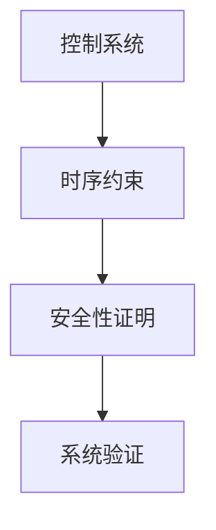

# 1.3.4 控制系统的时序约束证明

## 目录

1.3.4.1 主题概述  
1.3.4.2 控制系统建模方法  
1.3.4.3 时序约束表达  
1.3.4.4 形式化定义与Lean实现  
1.3.4.5 典型证明与推理  
1.3.4.6 图表与多表征  
1.3.4.7 相关性与交叉引用  
1.3.4.8 参考文献与延伸阅读  

---

### 1.3.4.1 主题概述

控制系统的时序约束证明是确保系统安全性、实时性等关键属性的核心手段。

### 1.3.4.2 控制系统建模方法

- 状态空间模型
- 输入-输出建模

### 1.3.4.3 时序约束表达

- 安全性（Safety）、活性（Liveness）等性质
- LTL/CTL公式表达系统约束

### 1.3.4.4 形式化定义与Lean实现

```lean
-- 控制系统的Lean建模（伪代码）
structure ControlSystem :=
  (state : Type)
  (input : Type)
  (transition : state → input → state)
```

### 1.3.4.5 典型证明与推理

#### 安全性证明（LaTeX表达）

\[
G(safe)
\]

### 1.3.4.6 图表与多表征



### 1.3.4.7 相关性与交叉引用

- [1.3.3-时序逻辑建模与验证](./1.3.3-时序逻辑建模与验证.md)
- [7.1-形式化验证架构](../../7-验证与工程实践/7.1-形式化验证架构.md)

### 1.3.4.8 参考文献与延伸阅读

- 《时序逻辑与自动机》
- 相关论文与开源项目
