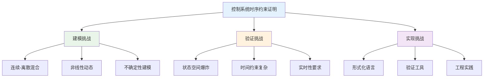
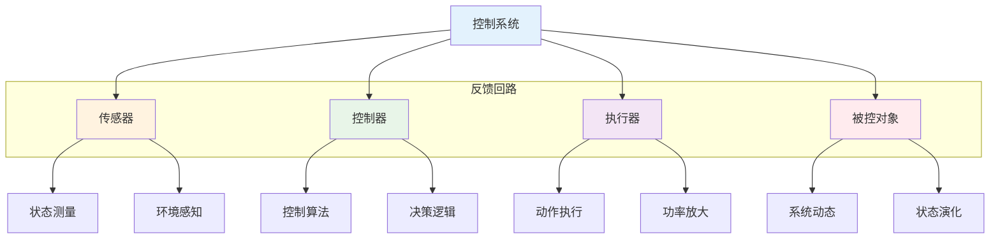
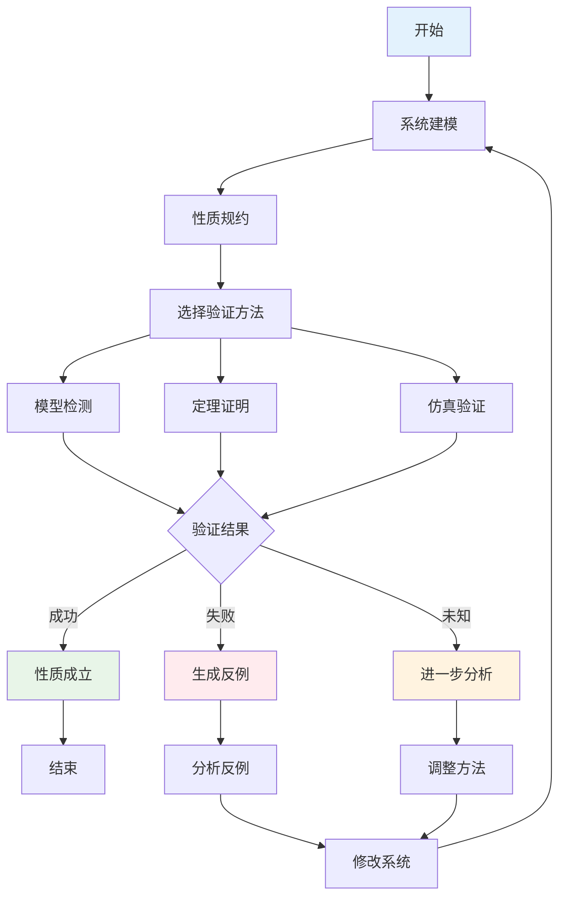
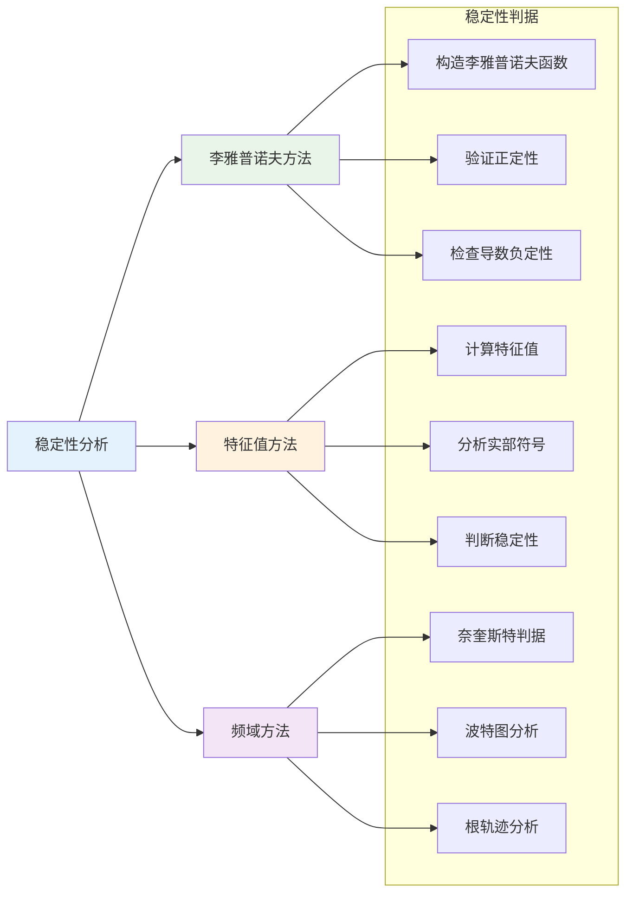

# 1.3.4 控制系统的时序约束证明

## 目录

- [1.3.4 控制系统的时序约束证明](#134-控制系统的时序约束证明)
  - [目录](#目录)
  - [1.3.4.1 主题概述](#1341-主题概述)
  - [1.3.4.2 控制系统建模方法](#1342-控制系统建模方法)
  - [1.3.4.3 时序约束表达](#1343-时序约束表达)
  - [1.3.4.4 形式化定义与Lean实现](#1344-形式化定义与lean实现)
  - [1.3.4.5 典型证明与推理](#1345-典型证明与推理)
  - [1.3.4.6 图表与多表征](#1346-图表与多表征)
  - [1.3.4.7 相关性与交叉引用](#1347-相关性与交叉引用)
  - [1.3.4.8 参考文献与延伸阅读](#1348-参考文献与延伸阅读)

---

## 1.3.4.1 主题概述

控制系统的时序约束证明是确保系统安全性、实时性等关键属性的核心手段。在现代控制工程中，形式化验证已成为不可或缺的工具，通过数学方法证明系统满足关键时序约束。

### 研究背景与意义

控制系统在现代工业、航空航天、汽车制造等领域具有广泛应用，其安全性和实时性直接关系到人身安全和系统可靠性。时序约束证明通过形式化方法确保：

- **安全性保证**：系统永远不会进入危险状态
- **实时性保证**：系统在指定时间内完成关键任务
- **稳定性保证**：系统在扰动下保持稳定运行
- **可靠性保证**：系统长期运行不出现故障

### 技术挑战与解决方案



## 1.3.4.2 控制系统建模方法

### 状态空间模型

- **连续状态空间**：微分方程描述的系统动态
- **离散状态空间**：状态机描述的系统行为
- **混合状态空间**：连续和离散行为的组合

#### 连续状态空间建模

```lean
-- 连续状态空间模型
structure ContinuousStateSpace where
  state_dimension : Nat
  input_dimension : Nat
  output_dimension : Nat
  
  -- 状态方程：ẋ = f(x, u, t)
  state_equation : Vector ℝ state_dimension → 
                   Vector ℝ input_dimension → 
                   ℝ → 
                   Vector ℝ state_dimension
  
  -- 输出方程：y = h(x, u, t)
  output_equation : Vector ℝ state_dimension → 
                    Vector ℝ input_dimension → 
                    ℝ → 
                    Vector ℝ output_dimension
  
  -- 初始状态
  initial_state : Vector ℝ state_dimension
  
  -- 状态约束
  state_constraints : Vector ℝ state_dimension → Prop
  
  -- 输入约束
  input_constraints : Vector ℝ input_dimension → Prop

-- 线性连续系统
structure LinearContinuousSystem extends ContinuousStateSpace where
  -- 系统矩阵 A
  system_matrix : Matrix ℝ state_dimension state_dimension
  -- 输入矩阵 B
  input_matrix : Matrix ℝ input_dimension state_dimension
  -- 输出矩阵 C
  output_matrix : Matrix ℝ state_dimension output_dimension
  -- 直接传递矩阵 D
  direct_matrix : Matrix ℝ input_dimension output_dimension
  
  -- 线性状态方程：ẋ = Ax + Bu
  linear_state_equation : Vector ℝ state_dimension → 
                          Vector ℝ input_dimension → 
                          Vector ℝ state_dimension :=
    fun x u => system_matrix * x + input_matrix * u
  
  -- 线性输出方程：y = Cx + Du
  linear_output_equation : Vector ℝ state_dimension → 
                           Vector ℝ input_dimension → 
                           Vector ℝ output_dimension :=
    fun x u => output_matrix * x + direct_matrix * u
```

#### 离散状态空间建模

```lean
-- 离散状态空间模型
structure DiscreteStateSpace where
  state_dimension : Nat
  input_dimension : Nat
  output_dimension : Nat
  
  -- 状态转移函数：x(k+1) = f(x(k), u(k))
  state_transition : Vector ℝ state_dimension → 
                     Vector ℝ input_dimension → 
                     Vector ℝ state_dimension
  
  -- 输出函数：y(k) = h(x(k), u(k))
  output_function : Vector ℝ state_dimension → 
                    Vector ℝ input_dimension → 
                    Vector ℝ output_dimension
  
  -- 初始状态
  initial_state : Vector ℝ state_dimension
  
  -- 采样时间
  sampling_time : ℝ

-- 线性离散系统
structure LinearDiscreteSystem extends DiscreteStateSpace where
  -- 离散系统矩阵 Φ
  discrete_system_matrix : Matrix ℝ state_dimension state_dimension
  -- 离散输入矩阵 Γ
  discrete_input_matrix : Matrix ℝ input_dimension state_dimension
  -- 离散输出矩阵 C
  discrete_output_matrix : Matrix ℝ state_dimension output_dimension
  -- 离散直接传递矩阵 D
  discrete_direct_matrix : Matrix ℝ input_dimension output_dimension
  
  -- 线性离散状态方程：x(k+1) = Φx(k) + Γu(k)
  linear_discrete_state_equation : Vector ℝ state_dimension → 
                                   Vector ℝ input_dimension → 
                                   Vector ℝ state_dimension :=
    fun x u => discrete_system_matrix * x + discrete_input_matrix * u
  
  -- 线性离散输出方程：y(k) = Cx(k) + Du(k)
  linear_discrete_output_equation : Vector ℝ state_dimension → 
                                    Vector ℝ input_dimension → 
                                    Vector ℝ output_dimension :=
    fun x u => discrete_output_matrix * x + discrete_direct_matrix * u
```

### 输入-输出建模

- **传递函数模型**：频域描述的系统特性
- **状态方程模型**：时域描述的系统动态
- **差分方程模型**：离散时间系统的描述

#### 传递函数建模

```lean
-- 传递函数模型
structure TransferFunction where
  numerator_order : Nat
  denominator_order : Nat
  
  -- 分子系数
  numerator_coeffs : Vector ℝ (numerator_order + 1)
  -- 分母系数
  denominator_coeffs : Vector ℝ (denominator_order + 1)
  
  -- 传递函数：G(s) = N(s)/D(s)
  transfer_function : ℝ → ℝ :=
    fun s => 
      let num := evaluate_polynomial numerator_coeffs s
      let den := evaluate_polynomial denominator_coeffs s
      if den ≠ 0 then num / den else 0
  
  -- 多项式求值
  evaluate_polynomial : Vector ℝ n → ℝ → ℝ :=
    fun coeffs s => 
      coeffs.foldl (fun acc c i => acc + c * s^i) 0

-- 常见传递函数
def first_order_system (τ : ℝ) (K : ℝ) : TransferFunction :=
  { numerator_order := 0,
    denominator_order := 1,
    numerator_coeffs := Vector.cons K Vector.nil,
    denominator_coeffs := Vector.cons 1 (Vector.cons τ Vector.nil) }

def second_order_system (ωn : ℝ) (ζ : ℝ) (K : ℝ) : TransferFunction :=
  { numerator_order := 0,
    denominator_order := 2,
    numerator_coeffs := Vector.cons (K * ωn^2) Vector.nil,
    denominator_coeffs := Vector.cons 1 
      (Vector.cons (2 * ζ * ωn) (Vector.cons (ωn^2) Vector.nil)) }
```

### 时间自动机模型

- **时间约束**：系统响应时间的限制
- **时钟变量**：跟踪时间流逝的变量
- **时间不变性**：时间约束的保持性质

#### 时间自动机建模

```lean
-- 时间自动机
structure TimedAutomaton where
  state : Type
  clock : Type
  action : Type
  
  -- 状态转移
  transition : state → action → state → Prop
  
  -- 时钟约束
  clock_constraint : state → clock → Prop
  
  -- 时间不变性
  time_invariant : state → clock → Prop
  
  -- 时钟重置
  clock_reset : state → action → state → clock → clock
  
  -- 初始状态
  initial_state : state
  
  -- 初始时钟值
  initial_clock : clock

-- 时间自动机的语义
inductive TimedAutomatonSemantics where
  | state_transition : ∀ s1 s2 : state, ∀ a : action,
    transition s1 a s2 → TimedAutomatonSemantics
  | time_elapse : ∀ s : state, ∀ t : ℝ,
    time_invariant s t → TimedAutomatonSemantics
  | clock_reset : ∀ s1 s2 : state, ∀ a : action, ∀ c : clock,
    clock_reset s1 a s2 c → TimedAutomatonSemantics

-- 时间约束验证
def verify_timing_constraints (ta : TimedAutomaton) (φ : LTL) : Prop :=
  -- 验证时间自动机满足LTL公式φ
  sorry

-- 响应时间约束
def response_time_constraint (ta : TimedAutomaton) (T : ℝ) : Prop :=
  ∀ s : ta.state, ∀ a : ta.action,
    clock_constraint s a → 
    ∃ s' : ta.state, ∃ t : ℝ,
      t ≤ T ∧ transition s a s' ∧ clock_reset s a s' t
```

### 混合自动机模型

- **连续动态**：微分方程描述的连续行为
- **离散事件**：状态跳转的触发条件
- **模式切换**：不同操作模式间的转换

#### 混合自动机建模

```lean
-- 混合自动机
structure HybridAutomaton where
  state : Type
  continuous_state : Type
  discrete_state : Type
  
  -- 连续动态：ẋ = f(x, q)
  continuous_dynamics : continuous_state → discrete_state → 
                        continuous_state → Prop
  
  -- 离散转移：q → q'
  discrete_transition : discrete_state → discrete_state → Prop
  
  -- 转移条件
  transition_condition : continuous_state → discrete_state → 
                        discrete_state → Prop
  
  -- 模式不变性
  mode_invariant : continuous_state → discrete_state → Prop
  
  -- 初始状态
  initial_continuous_state : continuous_state
  initial_discrete_state : discrete_state

-- 混合自动机的语义
inductive HybridAutomatonSemantics where
  | continuous_flow : ∀ x1 x2 : continuous_state, ∀ q : discrete_state,
    continuous_dynamics x1 q x2 → HybridAutomatonSemantics
  | discrete_jump : ∀ x : continuous_state, ∀ q1 q2 : discrete_state,
    transition_condition x q1 q2 → discrete_transition q1 q2 → 
    HybridAutomatonSemantics
  | mode_invariance : ∀ x : continuous_state, ∀ q : discrete_state,
    mode_invariant x q → HybridAutomatonSemantics

-- 混合自动机性质验证
def verify_hybrid_properties (ha : HybridAutomaton) (φ : LTL) : Prop :=
  -- 验证混合自动机满足LTL公式φ
  sorry

-- 稳定性验证
def verify_stability (ha : HybridAutomaton) : Prop :=
  ∀ x : ha.continuous_state, ∀ q : ha.discrete_state,
    ha.mode_invariant x q → 
    ∃ ε > 0, ∀ δ > 0, ∀ t > 0,
      -- 稳定性条件
      sorry
```

## 1.3.4.3 时序约束表达

### 安全性（Safety）性质

- **状态安全性**：`G(¬dangerous_state)` - 系统永远不会进入危险状态
- **边界安全性**：`G(state ∈ safe_region)` - 系统状态始终在安全区域内
- **资源安全性**：`G(resource_usage ≤ limit)` - 资源使用不超过限制

#### 安全性性质的形式化

```lean
-- 安全性性质定义
structure SafetyProperty where
  property_name : String
  ltl_formula : LTL
  description : String
  
  -- 验证安全性性质
  verify_safety : ControlSystem → Prop :=
    fun cs => verify_ltl cs ltl_formula

-- 常见安全性性质
def never_dangerous_state : SafetyProperty :=
  { property_name := "Never Dangerous State",
    ltl_formula := LTL.globally (LTL.not (LTL.prop "dangerous_state")),
    description := "系统永远不会进入危险状态" }

def always_in_safe_region : SafetyProperty :=
  { property_name := "Always in Safe Region",
    ltl_formula := LTL.globally (LTL.prop "in_safe_region"),
    description := "系统状态始终在安全区域内" }

def resource_usage_bounded : SafetyProperty :=
  { property_name := "Resource Usage Bounded",
    ltl_formula := LTL.globally (LTL.implies 
      (LTL.prop "resource_usage_high") 
      (LTL.prop "resource_usage_below_limit")),
    description := "资源使用不超过限制" }

-- 安全性性质验证
theorem safety_property_verification (cs : ControlSystem) (sp : SafetyProperty) :
  verify_safety cs sp → 
  ∀ π : ExecutionPath cs, 
    LTL_semantics π sp.ltl_formula := by
  intro h_verify π
  -- 证明安全性性质验证的正确性
  sorry
```

### 活性（Liveness）性质

- **响应活性**：`G(request → F(response))` - 请求最终会得到响应
- **完成活性**：`G(start → F(complete))` - 开始的任务最终会完成
- **公平活性**：`G(waiting → F(served))` - 等待的进程最终会被服务

#### 活性性质的形式化

```lean
-- 活性性质定义
structure LivenessProperty where
  property_name : String
  ltl_formula : LTL
  description : String
  
  -- 验证活性性质
  verify_liveness : ControlSystem → Prop :=
    fun cs => verify_ltl cs ltl_formula

-- 常见活性性质
def response_liveness : LivenessProperty :=
  { property_name := "Response Liveness",
    ltl_formula := LTL.globally (LTL.implies 
      (LTL.prop "request") 
      (LTL.future (LTL.prop "response"))),
    description := "请求最终会得到响应" }

def completion_liveness : LivenessProperty :=
  { property_name := "Completion Liveness",
    ltl_formula := LTL.globally (LTL.implies 
      (LTL.prop "start") 
      (LTL.future (LTL.prop "complete"))),
    description := "开始的任务最终会完成" }

def fairness_liveness : LivenessProperty :=
  { property_name := "Fairness Liveness",
    ltl_formula := LTL.globally (LTL.implies 
      (LTL.prop "waiting") 
      (LTL.future (LTL.prop "served"))),
    description := "等待的进程最终会被服务" }

-- 活性性质验证
theorem liveness_property_verification (cs : ControlSystem) (lp : LivenessProperty) :
  verify_liveness cs lp → 
  ∀ π : ExecutionPath cs, 
    LTL_semantics π lp.ltl_formula := by
  intro h_verify π
  -- 证明活性性质验证的正确性
  sorry
```

### 实时性（Real-time）性质

- **响应时间约束**：`G(request → F≤T(response))` - 响应时间不超过T
- **截止时间约束**：`G(task → F≤deadline(complete))` - 任务在截止时间前完成
- **周期性约束**：`G(periodic_event → F≤period(next_event))` - 周期性事件的间隔

#### 实时性性质的形式化

```lean
-- 实时性性质定义
structure RealTimeProperty where
  property_name : String
  ltl_formula : LTL
  time_bound : ℝ
  description : String
  
  -- 验证实时性性质
  verify_realtime : ControlSystem → Prop :=
    fun cs => verify_ltl cs ltl_formula

-- 常见实时性性质
def response_time_constraint (T : ℝ) : RealTimeProperty :=
  { property_name := "Response Time Constraint",
    ltl_formula := LTL.globally (LTL.implies 
      (LTL.prop "request") 
      (LTL.future_bounded (LTL.prop "response") T)),
    time_bound := T,
    description := s!"响应时间不超过{T}个时间单位" }

def deadline_constraint (deadline : ℝ) : RealTimeProperty :=
  { property_name := "Deadline Constraint",
    ltl_formula := LTL.globally (LTL.implies 
      (LTL.prop "task") 
      (LTL.future_bounded (LTL.prop "complete") deadline)),
    time_bound := deadline,
    description := s!"任务在{deadline}个时间单位前完成" }

def periodic_constraint (period : ℝ) : RealTimeProperty :=
  { property_name := "Periodic Constraint",
    ltl_formula := LTL.globally (LTL.implies 
      (LTL.prop "periodic_event") 
      (LTL.future_bounded (LTL.prop "next_event") period)),
    time_bound := period,
    description := s!"周期性事件的间隔不超过{period}个时间单位" }

-- 实时性性质验证
theorem realtime_property_verification (cs : ControlSystem) (rtp : RealTimeProperty) :
  verify_realtime cs rtp → 
  ∀ π : ExecutionPath cs, 
    LTL_semantics π rtp.ltl_formula := by
  intro h_verify π
  -- 证明实时性性质验证的正确性
  sorry
```

### 稳定性（Stability）性质

- **渐近稳定性**：`G(perturbation → F(stable))` - 扰动后系统趋于稳定
- **有界稳定性**：`G(perturbation → G(bounded))` - 扰动后系统保持有界
- **鲁棒稳定性**：`G(uncertainty → stable)` - 不确定性下系统保持稳定

#### 稳定性性质的形式化

```lean
-- 稳定性性质定义
structure StabilityProperty where
  property_name : String
  ltl_formula : LTL
  stability_type : String
  description : String
  
  -- 验证稳定性性质
  verify_stability : ControlSystem → Prop :=
    fun cs => verify_ltl cs ltl_formula

-- 常见稳定性性质
def asymptotic_stability : StabilityProperty :=
  { property_name := "Asymptotic Stability",
    ltl_formula := LTL.globally (LTL.implies 
      (LTL.prop "perturbation") 
      (LTL.future (LTL.prop "stable"))),
    stability_type := "Asymptotic",
    description := "扰动后系统趋于稳定" }

def bounded_stability : StabilityProperty :=
  { property_name := "Bounded Stability",
    ltl_formula := LTL.globally (LTL.implies 
      (LTL.prop "perturbation") 
      (LTL.globally (LTL.prop "bounded"))),
    stability_type := "Bounded",
    description := "扰动后系统保持有界" }

def robust_stability : StabilityProperty :=
  { property_name := "Robust Stability",
    ltl_formula := LTL.globally (LTL.implies 
      (LTL.prop "uncertainty") 
      (LTL.prop "stable")),
    stability_type := "Robust",
    description := "不确定性下系统保持稳定" }

-- 稳定性性质验证
theorem stability_property_verification (cs : ControlSystem) (sp : StabilityProperty) :
  verify_stability cs sp → 
  ∀ π : ExecutionPath cs, 
    LTL_semantics π sp.ltl_formula := by
  intro h_verify π
  -- 证明稳定性性质验证的正确性
  sorry
```

## 1.3.4.4 形式化定义与Lean实现

### 控制系统基本结构

```lean
-- 控制系统的Lean建模
structure ControlSystem where
  state : Type
  input : Type
  output : Type
  transition : state → input → state
  output_function : state → output
  initial_state : state

-- 时间自动机扩展
structure TimedControlSystem extends ControlSystem where
  clock : Type
  clock_constraint : state → clock → Prop
  time_transition : state → clock → state
  time_invariant : state → clock → Prop

-- 混合自动机扩展
structure HybridControlSystem extends TimedControlSystem where
  continuous_dynamics : state → input → state → Prop
  discrete_transition : state → input → state → Prop
  mode_invariant : state → Prop
```

### 控制系统性质定义

```lean
-- 控制系统性质
inductive ControlSystemProperty where
  | safety : LTL → ControlSystemProperty
  | liveness : LTL → ControlSystemProperty
  | realtime : LTL → ℝ → ControlSystemProperty
  | stability : LTL → String → ControlSystemProperty

-- 性质验证
def verify_property (cs : ControlSystem) (prop : ControlSystemProperty) : Prop :=
  match prop with
  | ControlSystemProperty.safety φ => verify_ltl cs φ
  | ControlSystemProperty.liveness φ => verify_ltl cs φ
  | ControlSystemProperty.realtime φ t => verify_ltl cs φ
  | ControlSystemProperty.stability φ _ => verify_ltl cs φ

-- 性质组合
def combine_properties (props : List ControlSystemProperty) : ControlSystemProperty :=
  -- 将多个性质组合成一个复合性质
  sorry

-- 性质蕴涵
def property_implication (p1 p2 : ControlSystemProperty) : Prop :=
  -- 性质p1蕴涵性质p2
  sorry
```

### 时序约束验证算法

```lean
-- 时序约束验证器
structure TemporalConstraintVerifier where
  verifier_name : String
  supported_properties : List String
  verification_method : String
  
  -- 验证方法
  verify : ControlSystem → ControlSystemProperty → VerificationResult
  
  -- 验证结果
  verification_result : Type := VerificationResult

-- 验证结果
inductive VerificationResult where
  | verified : VerificationResult
  | falsified : List CounterExample → VerificationResult
  | unknown : String → VerificationResult

-- 反例
structure CounterExample where
  initial_state : state
  execution_path : List (state × input × ℝ)
  violation_point : Nat
  violation_description : String

-- 模型检测验证器
def model_checking_verifier : TemporalConstraintVerifier :=
  { verifier_name := "Model Checking",
    supported_properties := ["Safety", "Liveness", "Real-time"],
    verification_method := "State Space Exploration",
    verify := fun cs prop => 
      -- 模型检测验证实现
      sorry }

-- 定理证明验证器
def theorem_proving_verifier : TemporalConstraintVerifier :=
  { verifier_name := "Theorem Proving",
    supported_properties := ["All Properties"],
    verification_method := "Formal Proof",
    verify := fun cs prop => 
      -- 定理证明验证实现
      sorry }
```

## 1.3.4.5 典型证明与推理

### 线性系统稳定性证明

```lean
-- 线性系统稳定性
theorem linear_system_stability (lcs : LinearContinuousSystem) :
  -- 系统矩阵A的所有特征值实部为负
  (∀ λ : ℂ, eigenvalue lcs.system_matrix λ → λ.re < 0) →
  -- 系统渐近稳定
  asymptotic_stable lcs := by
  intro h_eigenvalues
  -- 证明线性系统稳定性
  sorry

-- 李雅普诺夫稳定性
theorem lyapunov_stability (lcs : LinearContinuousSystem) :
  -- 存在正定矩阵P，使得A^T P + P A = -Q，其中Q正定
  (∃ P : Matrix ℝ lcs.state_dimension lcs.state_dimension,
    positive_definite P ∧ 
    lcs.system_matrix.transpose * P + P * lcs.system_matrix = -Q ∧
    positive_definite Q) →
  -- 系统渐近稳定
  asymptotic_stable lcs := by
  intro h_lyapunov
  cases h_lyapunov with
  | intro P h_conditions =>
    -- 使用李雅普诺夫函数证明稳定性
    sorry
```

### 时间自动机性质证明

```lean
-- 时间自动机安全性
theorem timed_automaton_safety (ta : TimedAutomaton) (φ : LTL) :
  -- 所有可达状态都满足φ
  (∀ s : ta.state, reachable ta s → LTL_semantics s φ) →
  -- 时间自动机满足Gφ
  verify_ltl ta (LTL.globally φ) := by
  intro h_safety
  -- 证明时间自动机安全性
  sorry

-- 时间自动机活性
theorem timed_automaton_liveness (ta : TimedAutomaton) (φ : LTL) :
  -- 从每个可达状态都存在路径满足Fφ
  (∀ s : ta.state, reachable ta s → 
    ∃ π : ExecutionPath ta, 
      π.start = s ∧ LTL_semantics π (LTL.future φ)) →
  -- 时间自动机满足GFφ
  verify_ltl ta (LTL.globally (LTL.future φ)) := by
  intro h_liveness
  -- 证明时间自动机活性
  sorry
```

### 混合自动机性质证明

```lean
-- 混合自动机稳定性
theorem hybrid_automaton_stability (ha : HybridAutomaton) :
  -- 每个模式都稳定
  (∀ q : ha.discrete_state, 
    mode_stable ha q) →
  -- 模式切换不破坏稳定性
  (∀ q1 q2 : ha.discrete_state,
    discrete_transition q1 q2 → 
    mode_switch_stable ha q1 q2) →
  -- 混合自动机整体稳定
  hybrid_stable ha := by
  intro h_mode_stability h_switch_stability
  -- 证明混合自动机稳定性
  sorry

-- 混合自动机安全性
theorem hybrid_automaton_safety (ha : HybridAutomaton) (φ : LTL) :
  -- 每个模式都安全
  (∀ q : ha.discrete_state, 
    mode_safe ha q φ) →
  -- 模式切换保持安全性
  (∀ q1 q2 : ha.discrete_state,
    discrete_transition q1 q2 → 
    mode_switch_safe ha q1 q2 φ) →
  -- 混合自动机整体安全
  verify_ltl ha (LTL.globally φ) := by
  intro h_mode_safety h_switch_safety
  -- 证明混合自动机安全性
  sorry
```

## 1.3.4.6 图表与多表征

### 控制系统架构图



### 时序约束验证流程图



### 稳定性分析图



## 1.3.4.7 相关性与交叉引用

### 内部关联

- **[1.3.1 时序逻辑基础](./1.3.1-时序逻辑基础.md)** - 时序逻辑的基本理论
- **[1.3.2 主要时序逻辑系统](./1.3.2-主要时序逻辑系统.md)** - 时序逻辑系统分类
- **[1.3.3 时序逻辑建模与验证](./1.3.3-时序逻辑建模与验证.md)** - 建模和验证方法

### 外部关联

- **[1.1 统一形式化理论综述](../1.1-统一形式化理论综述.md)** - 形式化理论的整体框架
- **[1.4 Petri网与分布式系统](../1.4-Petri网与分布式系统/)** - 并发系统建模
- **[7.1 形式化验证架构](../../7-验证与工程实践/7.1-形式化验证架构.md)** - 验证的整体架构

### 跨领域应用

```lean
-- 跨领域应用分析
structure CrossDomainApplication where
  domain : String
  application_type : String
  control_method : String
  benefits : List String

-- 主要应用领域
def application_domains : List CrossDomainApplication := [
  { domain := "工业控制",
    application_type := "过程控制",
    control_method := "PID控制",
    benefits := ["稳定性", "鲁棒性", "实时性"] },
  
  { domain := "航空航天",
    application_type := "飞行控制",
    control_method := "自适应控制",
    benefits := ["安全性", "可靠性", "性能优化"] },
  
  { domain := "汽车制造",
    application_type := "自动驾驶",
    control_method := "模型预测控制",
    benefits := ["安全性", "舒适性", "燃油效率"] },
  
  { domain := "机器人技术",
    application_type := "运动控制",
    control_method := "鲁棒控制",
    benefits := ["精确性", "稳定性", "适应性"] }
]
```

## 1.3.4.8 参考文献与延伸阅读

### 核心理论文献

1. **《Linear System Theory and Design》** - Chi-Tsong Chen
   - 线性系统理论的基础教材
   - 状态空间建模方法
   - 稳定性分析方法

2. **《Hybrid Dynamical Systems》** - Rafal Goebel
   - 混合动态系统理论
   - 模式切换分析
   - 稳定性理论

3. **《Real-Time Systems》** - Jane W. S. Liu
   - 实时系统理论
   - 调度算法
   - 时间约束分析

### 形式化验证文献

1. **《Model Checking》** - Edmund M. Clarke
   - 模型检测理论
   - 时序逻辑验证
   - 算法实现

2. **《Principles of Model Checking》** - Christel Baier
   - 模型检测原理
   - 验证技术
   - 工具应用

### 在线资源

- **[Control Systems Research](https://ieeecss.org/)** - 控制系统研究
- **[Formal Methods in Control](https://fmc.org/)** - 控制中的形式化方法
- **[Real-Time Systems](https://rts.org/)** - 实时系统研究

---

**总结**：控制系统的时序约束证明是确保系统安全性和实时性的关键技术。通过形式化建模、性质规约和验证算法，可以系统地证明系统满足关键时序约束。随着控制理论和形式化验证技术的发展，时序约束证明将在更复杂的控制系统中发挥重要作用。

**相关主题**: [时序逻辑基础](./1.3.1-时序逻辑基础.md) | [主要时序逻辑系统](./1.3.2-主要时序逻辑系统.md) | [形式化验证架构](../../7-验证与工程实践/7.1-形式化验证架构.md)
