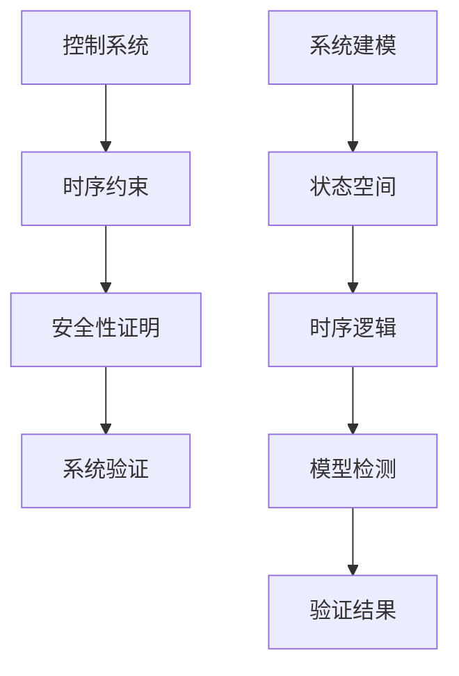
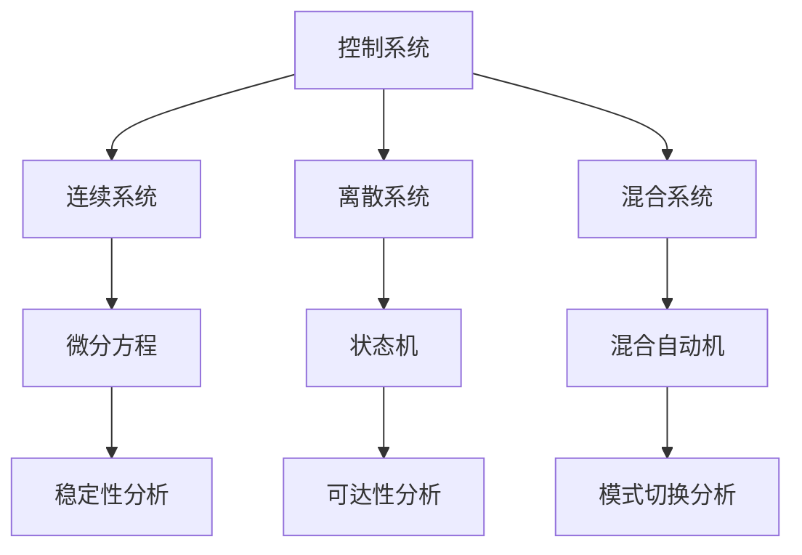

# 1.3.4 控制系统的时序约束证明

## 目录

1.3.4.1 主题概述  
1.3.4.2 控制系统建模方法  
1.3.4.3 时序约束表达  
1.3.4.4 形式化定义与Lean实现  
1.3.4.5 典型证明与推理  
1.3.4.6 图表与多表征  
1.3.4.7 相关性与交叉引用  
1.3.4.8 参考文献与延伸阅读  

---

### 1.3.4.1 主题概述

控制系统的时序约束证明是确保系统安全性、实时性等关键属性的核心手段。

### 1.3.4.2 控制系统建模方法

#### 状态空间模型

- **连续状态空间**：微分方程描述的系统动态
- **离散状态空间**：状态机描述的系统行为
- **混合状态空间**：连续和离散行为的组合

#### 输入-输出建模

- **传递函数模型**：频域描述的系统特性
- **状态方程模型**：时域描述的系统动态
- **差分方程模型**：离散时间系统的描述

#### 时间自动机模型

- **时间约束**：系统响应时间的限制
- **时钟变量**：跟踪时间流逝的变量
- **时间不变性**：时间约束的保持性质

#### 混合自动机模型

- **连续动态**：微分方程描述的连续行为
- **离散事件**：状态跳转的触发条件
- **模式切换**：不同操作模式间的转换

### 1.3.4.3 时序约束表达

#### 安全性（Safety）性质

- **状态安全性**：`G(¬dangerous_state)` - 系统永远不会进入危险状态
- **边界安全性**：`G(state ∈ safe_region)` - 系统状态始终在安全区域内
- **资源安全性**：`G(resource_usage ≤ limit)` - 资源使用不超过限制

#### 活性（Liveness）性质

- **响应活性**：`G(request → F(response))` - 请求最终会得到响应
- **完成活性**：`G(start → F(complete))` - 开始的任务最终会完成
- **公平活性**：`G(waiting → F(served))` - 等待的进程最终会被服务

#### 实时性（Real-time）性质

- **响应时间约束**：`G(request → F≤T(response))` - 响应时间不超过T
- **截止时间约束**：`G(task → F≤deadline(complete))` - 任务在截止时间前完成
- **周期性约束**：`G(periodic_event → F≤period(next_event))` - 周期性事件的间隔

#### 稳定性（Stability）性质

- **渐近稳定性**：`G(perturbation → F(stable))` - 扰动后系统趋于稳定
- **有界稳定性**：`G(perturbation → G(bounded))` - 扰动后系统保持有界
- **鲁棒稳定性**：`G(uncertainty → stable)` - 不确定性下系统保持稳定

### 1.3.4.4 形式化定义与Lean实现

#### 控制系统基本结构

```lean
-- 控制系统的Lean建模
structure ControlSystem where
  state : Type
  input : Type
  output : Type
  transition : state → input → state
  output_function : state → output
  initial_state : state

-- 时间自动机扩展
structure TimedControlSystem extends ControlSystem where
  clock : Type
  clock_constraint : state → clock → Prop
  time_transition : state → clock → state
  time_invariant : state → clock → Prop

-- 混合自动机扩展
structure HybridControlSystem extends TimedControlSystem where
  continuous_dynamics : state → input → state → Prop
  discrete_transition : state → input → state → Prop
  mode_invariant : state → Prop
```

#### 控制系统性质定义

```lean
-- 安全性性质
def Safety (sys : ControlSystem) (safe_region : sys.state → Prop) : Prop :=
  ∀ s : sys.state, reachable s → safe_region s

-- 活性性质
def Liveness (sys : ControlSystem) (goal : sys.state → Prop) : Prop :=
  ∀ s : sys.state, reachable s → eventually goal s

-- 实时性性质
def RealTime (sys : TimedControlSystem) (deadline : sys.clock) : Prop :=
  ∀ s : sys.state, ∀ i : sys.input,
    time_transition s i ≤ deadline

-- 稳定性性质
def Stability (sys : ControlSystem) (equilibrium : sys.state) : Prop :=
  ∀ ε > 0, ∃ δ > 0, ∀ s : sys.state,
    distance s equilibrium < δ →
    ∀ t ≥ 0, distance (trajectory s t) equilibrium < ε
```

### 1.3.4.5 典型证明与推理

#### 安全性证明（LaTeX表达）

**全局安全性**：
\[
G(safe)
\]

**条件安全性**：
\[
G(condition \rightarrow safe)
\]

**边界安全性**：
\[
G(state \in safe\_region)
\]

#### 活性证明（LaTeX表达）

**响应活性**：
\[
G(request \rightarrow F(response))
\]

**公平活性**：
\[
G(waiting \rightarrow F(served))
\]

**完成活性**：
\[
G(start \rightarrow F(complete))
\]

#### 实时性证明（LaTeX表达）

**响应时间约束**：
\[
G(request \rightarrow F_{\leq T}(response))
\]

**截止时间约束**：
\[
G(task \rightarrow F_{\leq deadline}(complete))
\]

#### 稳定性证明（LaTeX表达）

**渐近稳定性**：
\[
G(perturbation \rightarrow F(stable))
\]

**有界稳定性**：
\[
G(perturbation \rightarrow G(bounded))
\]

### 1.3.4.6 图表与多表征

#### 控制系统验证流程



#### 时序约束分类

```mermaid
graph LR
  A[时序约束] --> B[安全性]
  A --> C[活性]
  A --> D[实时性]
  A --> E[稳定性]
  
  B --> F[G(¬dangerous)]
  C --> G[G(request → F(response))]
  D --> H[G(request → F≤T(response))]
  E --> I[G(perturbation → F(stable))]
```

#### 控制系统类型



### 1.3.4.7 相关性与交叉引用

#### 理论基础

- [1.3.1-时序逻辑基础](./1.3.1-时序逻辑基础.md) - 时序逻辑的基本概念和语法
- [1.3.2-主要时序逻辑系统](./1.3.2-主要时序逻辑系统.md) - LTL、CTL、CTL*等时序逻辑系统
- [1.3.3-时序逻辑建模与验证](./1.3.3-时序逻辑建模与验证.md) - 时序逻辑的建模方法和验证技术

#### 应用领域

- [1.3.4-控制理论与应用](./1.3.4-控制理论与应用.md) - 控制系统中的时序逻辑应用
- [1.3.5-典型工程案例](./1.3.5-典型工程案例.md) - 实际工程中的时序逻辑应用案例

#### 相关理论

- [1.2-类型理论与证明](../1.2-类型理论与证明.md) - 类型论与证明论基础
- [1.4-Petri网与分布式系统](../1.4-Petri网与分布式系统.md) - Petri网和分布式系统理论

#### 工程实践

- [7.2-工程实践案例](../../7-验证与工程实践/7.2-工程实践案例.md) - 形式化验证的工程实践
- [7.1-形式化验证架构](../../7-验证与工程实践/7.1-形式化验证架构.md) - 形式化验证的整体架构

### 1.3.4.8 参考文献与延伸阅读

#### 核心教材

- **《时序逻辑与自动机》** - 时序逻辑的经典教材
- **《Model Checking》**（Clarke, Grumberg, Peled）- 模型检测的权威教材
- **《Principles of Model Checking》**（Baier, Katoen）- 模型检测原理

#### 经典论文

- **Pnueli, A. (1977).** The temporal logic of programs. SFCS 1977.
- **Clarke, E. M., et al. (1986).** Automatic verification of finite-state concurrent systems using temporal logic specifications. ACM TOPLAS.
- **Vardi, M. Y., & Wolper, P. (1986).** An automata-theoretic approach to automatic program verification. LICS.

#### 开源工具

- **NuSMV** - 符号模型检测工具
- **SPIN** - 显式状态模型检测器
- **TLA+** - 时序逻辑动作规范语言
- **UPPAAL** - 实时系统模型检测工具

#### 在线资源

- **Lean 官方文档**：<https://leanprover.github.io/>
- **NuSMV 官网**：<https://nusmv.fbk.eu/>
- **SPIN 官网**：<http://spinroot.com/>
- **arXiv 论文检索**：<https://arxiv.org/>
