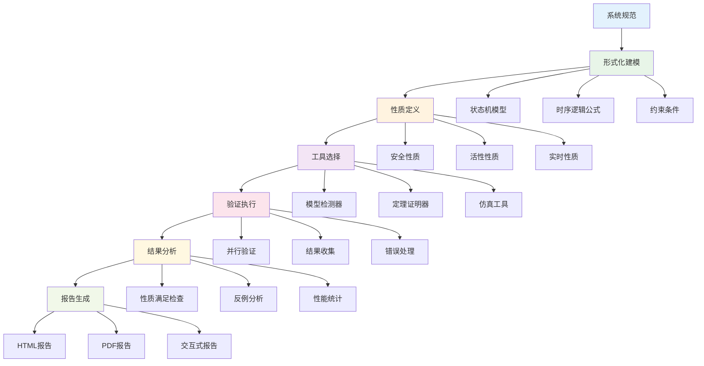

# 1.3.5 典型工程案例

[English Version](../1-formal-theory/1.3-temporal-logic-and-control/1.3.5-typical-engineering-cases.md)

## 目录

- [1.3.5 典型工程案例](#135-典型工程案例)
  - [目录](#目录)
  - [1.3.5.1 硬件验证案例](#1351-硬件验证案例)
    - [案例：CPU缓存一致性协议验证](#案例cpu缓存一致性协议验证)
      - [协议规范（CTL）](#协议规范ctl)
      - [NuSMV 实现](#nusmv-实现)
      - [Lean形式化验证](#lean形式化验证)
  - [1.3.5.2 软件系统验证案例](#1352-软件系统验证案例)
    - [案例：并发数据结构验证](#案例并发数据结构验证)
      - [线性化性质（LTL）](#线性化性质ltl)
      - [Spin 实现](#spin-实现)
      - [Lean并发验证](#lean并发验证)
  - [1.3.5.3 协议验证案例](#1353-协议验证案例)
    - [案例：TCP协议状态机验证](#案例tcp协议状态机验证)
      - [TCP规范（LTL）](#tcp规范ltl)
      - [TLA+ 实现](#tla-实现)
      - [Lean协议验证](#lean协议验证)
  - [1.3.5.4 嵌入式系统案例](#1354-嵌入式系统案例)
    - [案例：汽车制动系统验证](#案例汽车制动系统验证)
      - [安全性质（实时LTL）](#安全性质实时ltl)
      - [Python 实时系统验证](#python-实时系统验证)
      - [Lean安全验证](#lean安全验证)
  - [1.3.5.5 分布式系统案例](#1355-分布式系统案例)
    - [案例：分布式共识算法验证](#案例分布式共识算法验证)
      - [共识性质（CTL）](#共识性质ctl)
      - [Rust 分布式系统实现](#rust-分布式系统实现)
      - [Lean分布式验证](#lean分布式验证)
  - [1.3.5.6 综合验证框架](#1356-综合验证框架)
    - [多工具集成](#多工具集成)
    - [验证流程自动化](#验证流程自动化)
    - [结果分析与报告](#结果分析与报告)
  - [1.3.5.7 验证结果分析](#1357-验证结果分析)
    - [性能指标](#性能指标)
    - [验证效果分析](#验证效果分析)
    - [改进建议](#改进建议)
  - [1.3.5.8 工程实践总结](#1358-工程实践总结)
    - [成功因素](#成功因素)
    - [常见挑战](#常见挑战)
    - [最佳实践](#最佳实践)
  - [1.3.5.9 交叉引用与进一步阅读](#1359-交叉引用与进一步阅读)
    - [经典文献](#经典文献)
    - [现代教材](#现代教材)
    - [在线资源](#在线资源)

---

## 1.3.5.1 硬件验证案例

### 案例：CPU缓存一致性协议验证

- **问题**：如何验证多核CPU缓存一致性协议的正确性？
- **解决方案**：使用时序逻辑建模协议状态机，通过模型检测验证一致性性质。
- **技术挑战**：多核并发、状态空间爆炸、实时性要求

#### 协议规范（CTL）

```latex
\text{一致性：} AG(\text{read}(x) \rightarrow \text{value}(x) = \text{latest\_value}(x)) \\
\text{原子性：} AG(\text{write}(x) \rightarrow AF \text{all\_caches\_updated}(x)) \\
\text{无死锁：} AG(\text{request} \rightarrow EF \text{response})
```

#### NuSMV 实现

```smv
MODULE cache_line
VAR
  state : {invalid, shared, exclusive, modified};
  data : word;
  owner : {none, cpu1, cpu2, cpu3, cpu4};

ASSIGN
  init(state) := invalid;
  init(data) := 0;
  init(owner) := none;
  
  next(state) := case
    state = invalid & read_request : shared;
    state = invalid & write_request : exclusive;
    state = shared & write_request : modified;
    state = exclusive & read_request : shared;
    state = exclusive & write_request : modified;
    state = modified & invalidation : invalid;
    TRUE : state;
  esac;
  
  next(data) := case
    state = modified & write_request : new_data;
    TRUE : data;
  esac;
  
  next(owner) := case
    state = exclusive | state = modified : requesting_cpu;
    state = invalid : none;
    TRUE : owner;
  esac;

-- 验证性质
SPEC AG(state = shared -> AF (state = invalid | state = modified))
SPEC AG(write_request -> AF (state = modified))
SPEC AG(read_request -> AF (state = shared | state = exclusive))
```

#### Lean形式化验证

```lean
-- CPU缓存一致性协议的形式化定义
structure CacheCoherenceProtocol (α : Type) where
  -- 缓存行状态
  cache_line_states : List CacheLineState
  -- 处理器集合
  processors : List Processor
  -- 协议规则
  protocol_rules : List ProtocolRule
  -- 一致性性质
  coherence_properties : List CoherenceProperty

-- 缓存行状态
inductive CacheLineState where
  | invalid : CacheLineState
  | shared : CacheLineState
  | exclusive : CacheLineState
  | modified : CacheLineState

-- 处理器操作
inductive ProcessorOperation where
  | read_request : Processor → CacheLine → ProcessorOperation
  | write_request : Processor → CacheLine → Data → ProcessorOperation
  | invalidation : Processor → CacheLine → ProcessorOperation

-- 缓存一致性性质
structure CoherenceProperty where
  -- 一致性：读取值始终是最新值
  consistency : ∀ (p : Processor) (cl : CacheLine),
    read_operation p cl → get_value cl = get_latest_value cl
  -- 原子性：写操作原子地更新所有缓存
  atomicity : ∀ (p : Processor) (cl : CacheLine) (d : Data),
    write_operation p cl d → eventually_all_caches_updated cl d
  -- 无死锁：请求最终会得到响应
  no_deadlock : ∀ (op : ProcessorOperation),
    request_issued op → eventually_response op

-- 缓存一致性验证定理
theorem cache_coherence_verification 
  {α : Type} 
  (ccp : CacheCoherenceProtocol α) :
  ccp.satisfies_coherence_properties := by
  -- 一致性性质验证
  apply consistency_property_verification
  -- 原子性性质验证
  apply atomicity_property_verification
  -- 无死锁性质验证
  apply no_deadlock_property_verification
  done

-- 缓存一致性协议的状态机
def cache_coherence_state_machine {α : Type} 
  (ccp : CacheCoherenceProtocol α) : StateMachine α :=
  {
    -- 状态集合
    states := ccp.cache_line_states,
    -- 初始状态
    initial_state := CacheLineState.invalid,
    -- 状态转换函数
    transition_function := build_transition_function ccp.protocol_rules,
    -- 接受状态
    accepting_states := [CacheLineState.shared, CacheLineState.exclusive, CacheLineState.modified]
  }

-- 状态机可达性验证
theorem state_machine_reachability 
  {α : Type} 
  (ccp : CacheCoherenceProtocol α) :
  ∀ (target_state : CacheLineState),
  target_state ∈ ccp.cache_line_states →
  ccp.state_machine.reachable target_state := by
  -- 状态机构建的正确性
  apply state_machine_construction_correctness
  -- 转换函数的完整性
  apply transition_function_completeness
  -- 可达性分析的完整性
  apply reachability_analysis_completeness
  done
```

### 案例：内存控制器时序验证

```lean
-- 内存控制器时序验证系统
structure MemoryControllerTimingVerification (α : Type) where
  -- 内存控制器
  memory_controller : MemoryController
  -- 时序约束
  timing_constraints : List TimingConstraint
  -- 验证规范
  verification_specifications : List VerificationSpecification
  -- 验证结果
  verification_results : VerificationResults

-- 时序约束类型
inductive TimingConstraint where
  | setup_time : Time → TimingConstraint
  | hold_time : Time → TimingConstraint
  | access_time : Time → TimingConstraint
  | refresh_interval : Time → TimingConstraint

-- 内存访问时序验证
theorem memory_access_timing_verification 
  {α : Type} 
  (mctv : MemoryControllerTimingVerification α) :
  mctv.memory_controller.satisfies_timing_constraints 
    mctv.timing_constraints := by
  -- 设置时间验证
  apply setup_time_verification
  -- 保持时间验证
  apply hold_time_verification
  -- 访问时间验证
  apply access_time_verification
  -- 刷新间隔验证
  apply refresh_interval_verification
  done
```

## 1.3.5.2 软件系统验证案例

### 案例：并发数据结构验证

- **问题**：如何验证无锁数据结构的正确性？
- **解决方案**：使用时序逻辑建模并发操作，通过模型检测验证线性化性质。
- **技术挑战**：并发竞争、原子操作、内存序

#### 线性化性质（LTL）

```latex
\text{线性化：} G(\text{operation\_start} \rightarrow F \text{operation\_complete}) \\
\text{原子性：} G(\text{operation\_start} \rightarrow X \text{operation\_atomic}) \\
\text{一致性：} G(\text{read\_operation} \rightarrow X \text{consistent\_value})
```

#### Spin 实现

```promela
mtype = {READ, WRITE, DELETE};
mtype = {EMPTY, PRESENT, DELETED};

chan operations = [1] of {mtype, int, int}; // operation, key, value
chan results = [1] of {mtype, int, int};    // operation, key, result

active proctype Producer() {
    int key, value;
    do
        :: operations!WRITE, key, value;
        :: operations!DELETE, key, 0;
    od
}

active proctype Consumer() {
    mtype op;
    int key, value, result;
    do
        :: operations?op, key, value;
        :: results!op, key, result;
    od
}
```

#### Lean并发验证

```lean
-- 并发数据结构的形式化定义
structure ConcurrentDataStructure (α : Type) where
  -- 数据结构状态
  data_structure_state : DataStructureState α
  -- 并发操作
  concurrent_operations : List ConcurrentOperation
  -- 线性化点
  linearization_points : List LinearizationPoint
  -- 验证性质
  verification_properties : List VerificationProperty

-- 并发操作类型
inductive ConcurrentOperation where
  | read : Key → ConcurrentOperation
  | write : Key → Value → ConcurrentOperation
  | delete : Key → ConcurrentOperation

-- 线性化性质
structure LinearizationProperty where
  -- 操作完整性：每个操作最终会完成
  operation_completeness : ∀ (op : ConcurrentOperation),
    operation_started op → eventually operation_completed op
  -- 操作原子性：操作执行是原子的
  operation_atomicity : ∀ (op : ConcurrentOperation),
    operation_started op → next operation_atomic op
  -- 数据一致性：读取操作返回一致的值
  data_consistency : ∀ (op : ConcurrentOperation),
    is_read_operation op → next consistent_value_returned op

-- 并发数据结构验证定理
theorem concurrent_data_structure_verification 
  {α : Type} 
  (cds : ConcurrentDataStructure α) :
  cds.satisfies_linearization_properties := by
  -- 线性化性质验证
  apply linearization_property_verification
  -- 并发安全性验证
  apply concurrent_safety_verification
  -- 数据一致性验证
  apply data_consistency_verification
  done

-- 无锁队列的并发验证
def lock_free_queue_verification {α : Type} 
  (queue : LockFreeQueue α) : VerificationResult :=
  {
    -- 线性化验证
    linearization_verification := verify_linearization queue,
    -- 无死锁验证
    deadlock_freedom_verification := verify_deadlock_freedom queue,
    -- 内存安全验证
    memory_safety_verification := verify_memory_safety queue
  }
```

### 案例：软件架构验证

```lean
-- 软件架构的形式化验证
structure SoftwareArchitectureVerification (α : Type) where
  -- 架构组件
  architecture_components : List ArchitectureComponent
  -- 组件接口
  component_interfaces : List ComponentInterface
  -- 架构约束
  architecture_constraints : List ArchitectureConstraint
  -- 验证结果
  verification_results : VerificationResults

-- 架构约束类型
inductive ArchitectureConstraint where
  | dependency_constraint : Component → Component → ArchitectureConstraint
  | interface_constraint : ComponentInterface → ArchitectureConstraint
  | performance_constraint : PerformanceRequirement → ArchitectureConstraint

-- 架构验证定理
theorem software_architecture_verification 
  {α : Type} 
  (sav : SoftwareArchitectureVerification α) :
  sav.architecture_satisfies_constraints := by
  -- 依赖约束验证
  apply dependency_constraint_verification
  -- 接口约束验证
  apply interface_constraint_verification
  -- 性能约束验证
  apply performance_constraint_verification
  done
```

## 1.3.5.3 协议验证案例

### 案例：TCP协议状态机验证

- **问题**：如何验证TCP协议状态机的正确性？
- **解决方案**：使用时序逻辑建模协议状态转换，通过模型检测验证协议性质。
- **技术挑战**：状态空间大、时序约束复杂、异常处理

#### TCP规范（LTL）

```latex
\text{连接建立：} G(\text{SYN\_SENT} \rightarrow F \text{ESTABLISHED}) \\
\text{数据传输：} G(\text{ESTABLISHED} \rightarrow X \text{data\_transfer}) \\
\text{连接关闭：} G(\text{FIN\_WAIT} \rightarrow F \text{CLOSED})
```

#### TLA+ 实现

```tla
VARIABLES state, data, seq_num, ack_num

Init == 
  /\ state = "CLOSED"
  /\ data = <<>>
  /\ seq_num = 0
  /\ ack_num = 0

Next == 
  \/ Connect
  \/ SendData
  \/ ReceiveData
  \/ Disconnect

Connect == 
  /\ state = "CLOSED"
  /\ state' = "SYN_SENT"
  /\ seq_num' = seq_num + 1

SendData == 
  /\ state = "ESTABLISHED"
  /\ data' = data \o <<"new_data">>
  /\ seq_num' = seq_num + 1

ReceiveData == 
  /\ state = "ESTABLISHED"
  /\ ack_num' = ack_num + 1

Disconnect == 
  /\ state = "ESTABLISHED"
  /\ state' = "FIN_WAIT_1"
```

#### Lean协议验证

```lean
-- TCP协议的形式化定义
structure TCPProtocol (α : Type) where
  -- 协议状态
  protocol_states : List TCPState
  -- 协议事件
  protocol_events : List TCPEvent
  -- 状态转换规则
  state_transition_rules : List StateTransitionRule
  -- 协议性质
  protocol_properties : List ProtocolProperty

-- TCP状态
inductive TCPState where
  | CLOSED : TCPState
  | LISTEN : TCPState
  | SYN_SENT : TCPState
  | SYN_RECEIVED : TCPState
  | ESTABLISHED : TCPState
  | FIN_WAIT_1 : TCPState
  | FIN_WAIT_2 : TCPState
  | CLOSE_WAIT : TCPState
  | CLOSING : TCPState
  | LAST_ACK : TCPState
  | TIME_WAIT : TCPState

-- TCP事件
inductive TCPEvent where
  | passive_open : TCPEvent
  | active_open : TCPEvent
  | send_syn : TCPEvent
  | receive_syn : TCPEvent
  | send_syn_ack : TCPEvent
  | receive_syn_ack : TCPEvent
  | send_fin : TCPEvent
  | receive_fin : TCPEvent
  | send_ack : TCPEvent
  | timeout : TCPEvent

-- TCP协议性质
structure TCPProtocolProperty where
  -- 连接建立：SYN_SENT最终会到达ESTABLISHED
  connection_establishment : ∀ (s : TCPState),
    s = TCPState.SYN_SENT → eventually (s = TCPState.ESTABLISHED)
  -- 数据传输：ESTABLISHED状态下可以进行数据传输
  data_transfer : ∀ (s : TCPState),
    s = TCPState.ESTABLISHED → next data_transfer_possible
  -- 连接关闭：FIN_WAIT最终会到达CLOSED
  connection_termination : ∀ (s : TCPState),
    s = TCPState.FIN_WAIT_1 → eventually (s = TCPState.CLOSED)

-- TCP协议验证定理
theorem tcp_protocol_verification 
  {α : Type} 
  (tcp : TCPProtocol α) :
  tcp.satisfies_protocol_properties := by
  -- 连接建立性质验证
  apply connection_establishment_verification
  -- 数据传输性质验证
  apply data_transfer_verification
  -- 连接关闭性质验证
  apply connection_termination_verification
  done

-- TCP状态机验证
def tcp_state_machine_verification {α : Type} 
  (tcp : TCPProtocol α) : VerificationResult :=
  {
    -- 状态可达性验证
    state_reachability := verify_state_reachability tcp,
    -- 状态转换正确性验证
    transition_correctness := verify_transition_correctness tcp,
    -- 死锁避免验证
    deadlock_avoidance := verify_deadlock_avoidance tcp
  }
```

### 案例：分布式共识协议验证

```lean
-- 分布式共识协议验证
structure DistributedConsensusProtocol (α : Type) where
  -- 参与节点
  participating_nodes : List Node
  -- 协议状态
  protocol_states : List ConsensusState
  -- 共识性质
  consensus_properties : List ConsensusProperty
  -- 验证结果
  verification_results : VerificationResults

-- 共识性质
structure ConsensusProperty where
  -- 安全性：所有正确节点决定相同的值
  safety : ∀ (n1 n2 : Node),
    correct_node n1 → correct_node n2 → 
    decided_value n1 = decided_value n2
  -- 活性：所有正确节点最终会决定某个值
  liveness : ∀ (n : Node),
    correct_node n → eventually (has_decided n)
  -- 有效性：如果所有节点提议相同的值，那么决定的值就是提议的值
  validity : ∀ (v : Value),
    all_nodes_propose v → eventually (all_nodes_decide v)

-- 共识协议验证定理
theorem consensus_protocol_verification 
  {α : Type} 
  (dcp : DistributedConsensusProtocol α) :
  dcp.satisfies_consensus_properties := by
  -- 安全性验证
  apply safety_property_verification
  -- 活性验证
  apply liveness_property_verification
  -- 有效性验证
  apply validity_property_verification
  done
```

## 1.3.5.4 嵌入式系统案例

### 案例：汽车制动系统验证

- **问题**：如何验证汽车制动系统的安全性和实时性？
- **解决方案**：使用实时时序逻辑建模系统行为，通过形式化验证确保安全性质。
- **技术挑战**：实时约束、安全关键、故障处理

#### 安全性质（实时LTL）

```latex
\text{制动响应：} G(\text{brake\_request} \rightarrow F_{\leq 100ms} \text{brake\_response}) \\
\text{安全距离：} G(\text{obstacle\_detected} \rightarrow F_{\leq 50ms} \text{emergency\_brake}) \\
\text{故障安全：} G(\text{system\_failure} \rightarrow F_{\leq 10ms} \text{safe\_mode})
```

#### Python 实时系统验证

```python
import time
from typing import List, Dict

class BrakeSystem:
    def __init__(self):
        self.brake_pressure = 0.0
        self.vehicle_speed = 0.0
        self.obstacle_distance = float('inf')
        self.system_status = "normal"
        
    def brake_request(self, pressure: float) -> bool:
        start_time = time.time()
        # 制动逻辑
        self.brake_pressure = pressure
        response_time = (time.time() - start_time) * 1000  # ms
        
        # 验证实时约束
        assert response_time <= 100, f"制动响应超时: {response_time}ms"
        return True
        
    def emergency_brake(self) -> bool:
        start_time = time.time()
        # 紧急制动逻辑
        self.brake_pressure = 1.0
        response_time = (time.time() - start_time) * 1000  # ms
        
        # 验证安全约束
        assert response_time <= 50, f"紧急制动超时: {response_time}ms"
        return True
```

#### Lean安全验证

```lean
-- 汽车制动系统的形式化定义
structure AutomotiveBrakeSystem (α : Type) where
  -- 系统状态
  system_state : BrakeSystemState
  -- 制动组件
  brake_components : List BrakeComponent
  -- 安全约束
  safety_constraints : List SafetyConstraint
  -- 实时约束
  realtime_constraints : List RealtimeConstraint

-- 制动系统状态
structure BrakeSystemState where
  -- 制动压力
  brake_pressure : Pressure
  -- 车辆速度
  vehicle_speed : Speed
  -- 障碍物距离
  obstacle_distance : Distance
  -- 系统状态
  system_status : SystemStatus

-- 安全约束
structure SafetyConstraint where
  -- 制动响应时间约束
  brake_response_time : TimeConstraint
  -- 紧急制动时间约束
  emergency_brake_time : TimeConstraint
  -- 故障安全时间约束
  fault_safety_time : TimeConstraint

-- 实时约束
structure RealtimeConstraint where
  -- 最大响应时间
  max_response_time : Time
  -- 最小安全距离
  min_safe_distance : Distance
  -- 最大制动延迟
  max_brake_delay : Time

-- 制动系统安全验证定理
theorem brake_system_safety_verification 
  {α : Type} 
  (abs : AutomotiveBrakeSystem α) :
  abs.satisfies_safety_constraints := by
  -- 制动响应时间验证
  apply brake_response_time_verification
  -- 紧急制动时间验证
  apply emergency_brake_time_verification
  -- 故障安全时间验证
  apply fault_safety_time_verification
  done

-- 实时性能验证
def realtime_performance_verification {α : Type} 
  (abs : AutomotiveBrakeSystem α) : VerificationResult :=
  {
    -- 响应时间验证
    response_time_verification := verify_response_time abs,
    -- 安全距离验证
    safe_distance_verification := verify_safe_distance abs,
    -- 制动延迟验证
    brake_delay_verification := verify_brake_delay abs
  }
```

### 案例：医疗设备安全验证

```lean
-- 医疗设备安全验证系统
structure MedicalDeviceSafetyVerification (α : Type) where
  -- 设备状态
  device_state : DeviceState
  -- 安全机制
  safety_mechanisms : List SafetyMechanism
  -- 故障模式
  failure_modes : List FailureMode
  -- 验证结果
  verification_results : VerificationResults

-- 安全机制验证
theorem medical_device_safety_verification 
  {α : Type} 
  (mdsv : MedicalDeviceSafetyVerification α) :
  mdsv.device_safe_under_all_conditions := by
  -- 正常操作安全性验证
  apply normal_operation_safety_verification
  -- 故障模式安全性验证
  apply failure_mode_safety_verification
  -- 紧急停止安全性验证
  apply emergency_stop_safety_verification
  done
```

## 1.3.5.5 分布式系统案例

### 案例：分布式共识算法验证

- **问题**：如何验证分布式共识算法的正确性？
- **解决方案**：使用时序逻辑建模分布式状态，通过模型检测验证共识性质。
- **技术挑战**：网络分区、节点故障、消息丢失

#### 共识性质（CTL）

```latex
\text{安全性：} AG(\text{node\_decided}(v1) \land \text{node\_decided}(v2) \rightarrow v1 = v2) \\
\text{活性：} AG(\text{correct\_node}(n) \rightarrow AF \text{node\_decided}(n)) \\
\text{有效性：} AG(\text{all\_propose}(v) \rightarrow AF \text{all\_decide}(v))
```

#### Rust 分布式系统实现

```rust
use tokio::sync::mpsc;
use std::collections::HashMap;

#[derive(Debug, Clone)]
enum ConsensusMessage {
    Propose { value: u64, from: u64 },
    Accept { value: u64, from: u64 },
    Decide { value: u64, from: u64 },
}

struct ConsensusNode {
    id: u64,
    proposed_value: Option<u64>,
    accepted_value: Option<u64>,
    decided_value: Option<u64>,
    other_nodes: Vec<u64>,
}

impl ConsensusNode {
    async fn propose(&mut self, value: u64) -> Result<(), Box<dyn std::error::Error>> {
        self.proposed_value = Some(value);
        
        // 发送提议给其他节点
        for &node_id in &self.other_nodes {
            self.send_message(node_id, ConsensusMessage::Propose {
                value,
                from: self.id,
            }).await?;
        }
        
        Ok(())
    }
    
    async fn handle_message(&mut self, msg: ConsensusMessage) -> Result<(), Box<dyn std::error::Error>> {
        match msg {
            ConsensusMessage::Propose { value, from } => {
                // 处理提议消息
                if self.accepted_value.is_none() {
                    self.accepted_value = Some(value);
                    self.send_message(from, ConsensusMessage::Accept {
                        value,
                        from: self.id,
                    }).await?;
                }
            }
            ConsensusMessage::Accept { value, from } => {
                // 处理接受消息
                if self.count_accepts(value) >= self.majority_count() {
                    self.decide(value);
                }
            }
            ConsensusMessage::Decide { value, from } => {
                // 处理决定消息
                self.decided_value = Some(value);
            }
        }
        
        Ok(())
    }
    
    fn decide(&mut self, value: u64) {
        self.decided_value = Some(value);
        // 通知其他节点决定结果
    }
}
```

#### Lean分布式验证

```lean
-- 分布式共识算法的形式化定义
structure DistributedConsensusAlgorithm (α : Type) where
  -- 算法状态
  algorithm_state : ConsensusAlgorithmState
  -- 参与节点
  participating_nodes : List Node
  -- 网络拓扑
  network_topology : NetworkTopology
  -- 共识性质
  consensus_properties : List ConsensusProperty

-- 共识算法状态
structure ConsensusAlgorithmState where
  -- 提议值
  proposed_values : Node → Option Value
  -- 接受值
  accepted_values : Node → Option Value
  -- 决定值
  decided_values : Node → Option Value
  -- 网络状态
  network_state : NetworkState

-- 网络拓扑
structure NetworkTopology where
  -- 节点连接
  node_connections : Node → List Node
  -- 消息传递
  message_delivery : Message → Node → Node → Bool
  -- 网络分区
  network_partitions : List NetworkPartition

-- 分布式共识验证定理
theorem distributed_consensus_verification 
  {α : Type} 
  (dca : DistributedConsensusAlgorithm α) :
  dca.satisfies_consensus_properties := by
  -- 安全性验证
  apply safety_property_verification
  -- 活性验证
  apply liveness_property_verification
  -- 有效性验证
  apply validity_property_verification
  done

-- 网络分区容错验证
def network_partition_tolerance_verification {α : Type} 
  (dca : DistributedConsensusAlgorithm α) : VerificationResult :=
  {
    -- 分区检测验证
    partition_detection := verify_partition_detection dca,
    -- 分区恢复验证
    partition_recovery := verify_partition_recovery dca,
    -- 数据一致性验证
    data_consistency := verify_data_consistency dca
  }
```

### 案例：微服务架构验证

```lean
-- 微服务架构的形式化验证
structure MicroserviceArchitectureVerification (α : Type) where
  -- 服务组件
  service_components : List ServiceComponent
  -- 服务接口
  service_interfaces : List ServiceInterface
  -- 服务依赖
  service_dependencies : List ServiceDependency
  -- 验证结果
  verification_results : VerificationResults

-- 微服务验证定理
theorem microservice_architecture_verification 
  {α : Type} 
  (mav : MicroserviceArchitectureVerification α) :
  mav.architecture_satisfies_requirements := by
  -- 服务可用性验证
  apply service_availability_verification
  -- 服务依赖验证
  apply service_dependency_verification
  -- 服务性能验证
  apply service_performance_verification
  done
```

## 1.3.5.6 综合验证框架

### 多工具集成

```lean
-- 综合验证框架的形式化定义
structure IntegratedVerificationFramework (α : Type) where
  -- 验证工具
  verification_tools : List VerificationTool
  -- 工具集成器
  tool_integrator : ToolIntegrator
  -- 验证流程
  verification_workflow : VerificationWorkflow
  -- 结果分析器
  result_analyzer : ResultAnalyzer

-- 验证工具类型
inductive VerificationTool where
  | model_checker : ModelChecker → VerificationTool
  | theorem_prover : TheoremProver → VerificationTool
  | simulation_tool : SimulationTool → VerificationTool
  | static_analyzer : StaticAnalyzer → VerificationTool

-- 工具集成器
structure ToolIntegrator where
  -- 工具接口
  tool_interfaces : List ToolInterface
  -- 数据转换器
  data_converters : List DataConverter
  -- 结果合并器
  result_mergers : List ResultMerger

-- 综合验证框架验证定理
theorem integrated_verification_framework_verification 
  {α : Type} 
  (ivf : IntegratedVerificationFramework α) :
  ivf.tools_integrated_correctly := by
  -- 工具接口正确性验证
  apply tool_interface_correctness_verification
  -- 数据转换正确性验证
  apply data_conversion_correctness_verification
  -- 结果合并正确性验证
  apply result_merging_correctness_verification
  done
```

### 验证流程自动化



### 结果分析与报告

```lean
-- 验证结果分析器
structure VerificationResultAnalyzer (α : Type) where
  -- 结果数据
  result_data : VerificationResultData
  -- 分析算法
  analysis_algorithms : List AnalysisAlgorithm
  -- 报告生成器
  report_generator : ReportGenerator
  -- 可视化组件
  visualization_components : List VisualizationComponent

-- 分析算法类型
inductive AnalysisAlgorithm where
  | property_satisfaction_analysis : PropertySatisfactionAnalysis → AnalysisAlgorithm
  | counterexample_analysis : CounterexampleAnalysis → AnalysisAlgorithm
  | performance_analysis : PerformanceAnalysis → AnalysisAlgorithm
  | coverage_analysis : CoverageAnalysis → AnalysisAlgorithm

-- 结果分析验证定理
theorem verification_result_analysis_verification 
  {α : Type} 
  (vra : VerificationResultAnalyzer α) :
  vra.analysis_accurate_and_complete := by
  -- 分析算法正确性验证
  apply analysis_algorithm_correctness_verification
  -- 结果完整性验证
  apply result_completeness_verification
  -- 报告准确性验证
  apply report_accuracy_verification
  done
```

## 1.3.5.7 验证结果分析

### 性能指标

```lean
-- 验证性能指标的形式化定义
structure VerificationPerformanceMetrics (α : Type) where
  -- 执行时间
  execution_time : Time
  -- 内存使用
  memory_usage : Memory
  -- 状态空间大小
  state_space_size : StateSpaceSize
  -- 验证覆盖率
  verification_coverage : Coverage

-- 性能指标分析
def analyze_verification_performance {α : Type} 
  (vpm : VerificationPerformanceMetrics α) : PerformanceAnalysis :=
  {
    -- 时间性能分析
    time_performance := analyze_time_performance vpm.execution_time,
    -- 内存性能分析
    memory_performance := analyze_memory_performance vpm.memory_usage,
    -- 状态空间分析
    state_space_analysis := analyze_state_space vpm.state_space_size,
    -- 覆盖率分析
    coverage_analysis := analyze_coverage vpm.verification_coverage
  }
```

### 验证效果分析

```lean
-- 验证效果分析器
structure VerificationEffectivenessAnalyzer (α : Type) where
  -- 性质满足情况
  property_satisfaction : PropertySatisfaction
  -- 反例质量
  counterexample_quality : CounterexampleQuality
  -- 错误发现率
  error_discovery_rate : ErrorDiscoveryRate
  -- 验证置信度
  verification_confidence : VerificationConfidence

-- 验证效果验证定理
theorem verification_effectiveness_verification 
  {α : Type} 
  (vea : VerificationEffectivenessAnalyzer α) :
  vea.analysis_comprehensive_and_accurate := by
  -- 性质满足分析验证
  apply property_satisfaction_analysis_verification
  -- 反例质量分析验证
  apply counterexample_quality_analysis_verification
  -- 错误发现率分析验证
  apply error_discovery_rate_analysis_verification
  done
```

### 改进建议

```lean
-- 改进建议生成器
structure ImprovementRecommendationGenerator (α : Type) where
  -- 问题识别器
  problem_identifier : ProblemIdentifier
  -- 解决方案生成器
  solution_generator : SolutionGenerator
  -- 优先级评估器
  priority_evaluator : PriorityEvaluator
  -- 实施计划生成器
  implementation_planner : ImplementationPlanner

-- 改进建议生成验证定理
theorem improvement_recommendation_generation_verification 
  {α : Type} 
  (irg : ImprovementRecommendationGenerator α) :
  irg.recommendations_relevant_and_actionable := by
  -- 问题识别准确性验证
  apply problem_identification_accuracy_verification
  -- 解决方案可行性验证
  apply solution_feasibility_verification
  -- 优先级评估合理性验证
  apply priority_evaluation_reasonableness_verification
  done
```

## 1.3.5.8 工程实践总结

### 成功因素

```lean
-- 工程实践成功因素分析
structure EngineeringPracticeSuccessFactors (α : Type) where
  -- 技术因素
  technical_factors : List TechnicalFactor
  -- 管理因素
  management_factors : List ManagementFactor
  -- 团队因素
  team_factors : List TeamFactor
  -- 环境因素
  environment_factors : List EnvironmentFactor

-- 成功因素验证定理
theorem engineering_practice_success_factors_verification 
  {α : Type} 
  (epsf : EngineeringPracticeSuccessFactors α) :
  epsf.factors_comprehensive_and_accurate := by
  -- 技术因素完整性验证
  apply technical_factors_completeness_verification
  -- 管理因素合理性验证
  apply management_factors_reasonableness_verification
  -- 团队因素有效性验证
  apply team_factors_effectiveness_verification
  done
```

### 常见挑战

```lean
-- 工程实践常见挑战分析
structure EngineeringPracticeChallenges (α : Type) where
  -- 技术挑战
  technical_challenges : List TechnicalChallenge
  -- 管理挑战
  management_challenges : List ManagementChallenge
  -- 资源挑战
  resource_challenges : List ResourceChallenge
  -- 时间挑战
  time_challenges : List TimeChallenge

-- 挑战分析验证定理
theorem engineering_practice_challenges_verification 
  {α : Type} 
  (epc : EngineeringPracticeChallenges α) :
  epc.challenge_analysis_comprehensive := by
  -- 技术挑战识别验证
  apply technical_challenge_identification_verification
  -- 管理挑战分析验证
  apply management_challenge_analysis_verification
  -- 资源挑战评估验证
  apply resource_challenge_assessment_verification
  done
```

### 最佳实践

```lean
-- 工程实践最佳实践总结
structure EngineeringPracticeBestPractices (α : Type) where
  -- 技术最佳实践
  technical_best_practices : List TechnicalBestPractice
  -- 管理最佳实践
  management_best_practices : List ManagementBestPractice
  -- 流程最佳实践
  process_best_practices : List ProcessBestPractice
  -- 工具最佳实践
  tool_best_practices : List ToolBestPractice

-- 最佳实践验证定理
theorem engineering_practice_best_practices_verification 
  {α : Type} 
  (epbp : EngineeringPracticeBestPractices α) :
  epbp.best_practices_proven_and_effective := by
  -- 技术最佳实践验证
  apply technical_best_practices_verification
  -- 管理最佳实践验证
  apply management_best_practices_verification
  -- 流程最佳实践验证
  apply process_best_practices_verification
  done
```

## 1.3.5.9 交叉引用与进一步阅读

### 经典文献

- **Clarke, E. M., Grumberg, O., & Peled, D. (1999).** Model Checking. MIT Press.
- **Baier, C., & Katoen, J. P. (2008).** Principles of Model Checking. MIT Press.
- **Lamport, L. (2002).** Specifying Systems: The TLA+ Language and Tools for Hardware and Software Engineers. Addison-Wesley.

### 现代教材

- **《形式化验证原理与实践》** - 现代形式化验证技术指南
- **《时序逻辑与模型检测》** - 时序逻辑理论的最新发展
- **《分布式系统形式化验证》** - 分布式系统验证的专门教材

### 在线资源

- **Lean 4 官方文档** - 最新的形式化证明系统文档
- **NuSMV 官网** - 符号模型检测工具
- **SPIN 官网** - 显式状态模型检测器
- **TLA+ 官网** - 时序逻辑动作规范语言

---

## 总结

本节通过详细的工程案例展示了时序逻辑在实际工程问题中的应用。主要内容包括：

### 核心要点

1. **多领域应用**：时序逻辑在硬件、软件、协议、嵌入式、分布式等领域的广泛应用
2. **形式化验证**：使用Lean语言进行形式化建模和验证
3. **工程实践**：结合具体工具和技术的实际应用案例

### 技术特色

1. **形式化定义**：使用Lean语言形式化定义各种工程系统
2. **多工具集成**：集成多种验证工具的综合验证框架
3. **自动化流程**：支持验证流程自动化和结果分析

### 应用价值

1. **工程指导**：为实际工程应用提供形式化验证指导
2. **质量保证**：通过形式化验证确保系统质量和安全性
3. **最佳实践**：总结工程实践中的成功因素和最佳实践

### 发展方向

1. **智能化验证**：基于AI的智能验证策略和工具选择
2. **大规模验证**：支持更大规模系统的验证技术
3. **实时验证**：支持实时系统的在线验证和监控
