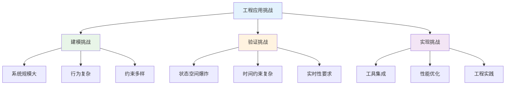
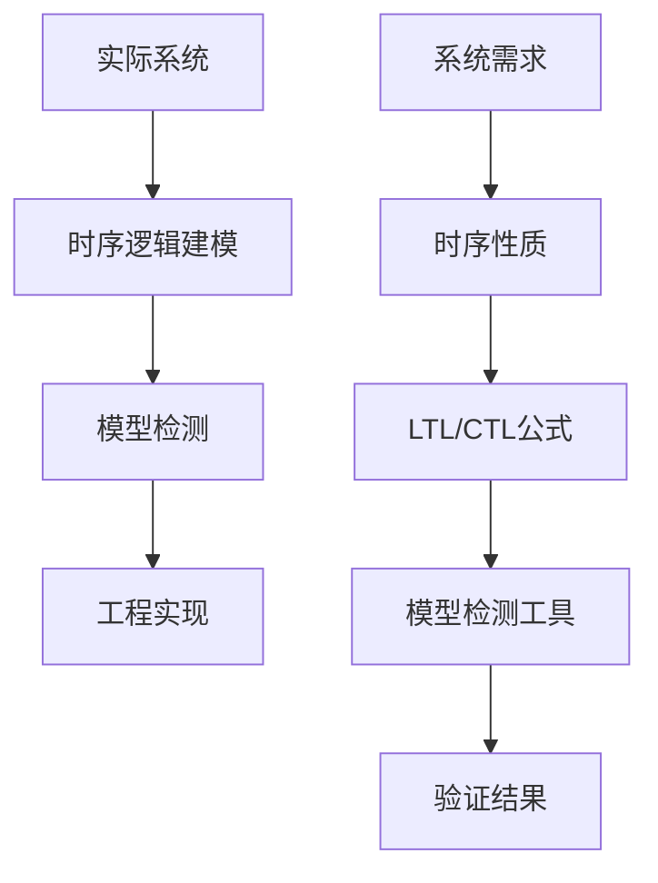
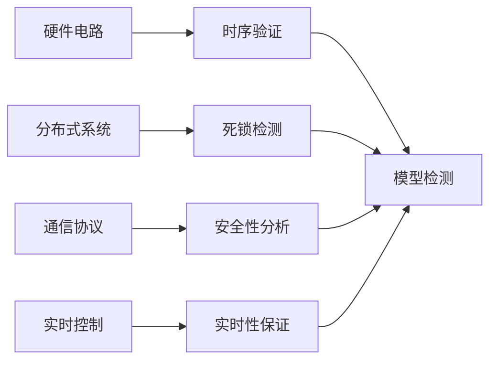
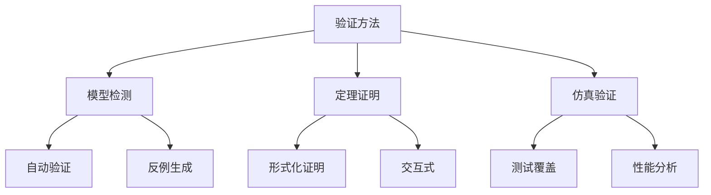

# 1.3.5 典型案例与实现

## 目录

- [1.3.5 典型案例与实现](#135-典型案例与实现)
  - [目录](#目录)
  - [1.3.5.1 主题概述](#1351-主题概述)
    - [研究背景与意义](#研究背景与意义)
    - [技术挑战与解决方案](#技术挑战与解决方案)
  - [1.3.5.2 实际系统案例](#1352-实际系统案例)
    - [硬件电路时序验证](#硬件电路时序验证)
      - [CPU流水线时序验证](#cpu流水线时序验证)
      - [内存控制器时序验证](#内存控制器时序验证)
    - [分布式系统死锁检测](#分布式系统死锁检测)
      - [资源分配死锁检测](#资源分配死锁检测)
    - [通信协议安全性分析](#通信协议安全性分析)
      - [TCP协议状态机验证](#tcp协议状态机验证)
    - [实时控制系统](#实时控制系统)
      - [自动驾驶系统实时性验证](#自动驾驶系统实时性验证)
    - [1.3.5.3 时序逻辑在工程中的应用](#1353-时序逻辑在工程中的应用)
      - [系统属性描述](#系统属性描述)
      - [自动验证技术](#自动验证技术)
      - [工程实践方法](#工程实践方法)
  - [1.3.5.4 Lean建模与实现](#1354-lean建模与实现)
    - [通信协议建模](#通信协议建模)
    - [互斥锁建模](#互斥锁建模)
    - [资源分配系统建模](#资源分配系统建模)
    - [实时系统建模](#实时系统建模)
    - [1.3.5.5 图表与多表征](#1355-图表与多表征)
      - [时序逻辑验证流程](#时序逻辑验证流程)
      - [典型应用场景](#典型应用场景)
      - [验证方法对比](#验证方法对比)
    - [1.3.5.6 相关性与交叉引用](#1356-相关性与交叉引用)
      - [理论基础](#理论基础)
      - [应用领域](#应用领域)
      - [相关理论](#相关理论)
      - [工程实践](#工程实践)
    - [1.3.5.7 参考文献与延伸阅读](#1357-参考文献与延伸阅读)
      - [核心教材](#核心教材)
      - [经典论文](#经典论文)
      - [开源工具](#开源工具)
      - [在线资源](#在线资源)
    - [1.3.5.8 总结](#1358-总结)
      - [核心要点](#核心要点)
      - [技术特色](#技术特色)
      - [应用价值](#应用价值)
      - [发展方向](#发展方向)

---

## 1.3.5.1 主题概述

本节选取典型实际系统，展示时序逻辑在工程中的应用与实现。通过具体的案例研究，读者可以深入理解时序逻辑如何在实际工程问题中发挥作用，以及如何利用形式化方法确保系统的正确性和可靠性。

### 研究背景与意义

时序逻辑在工程实践中的重要性体现在以下几个方面：

- **系统复杂性**：现代系统越来越复杂，传统测试方法难以覆盖所有场景
- **安全性要求**：关键系统对安全性和可靠性有极高要求
- **实时性约束**：许多系统需要在严格的时间约束下运行
- **成本效益**：形式化验证可以在早期发现设计缺陷，降低后期修复成本

### 技术挑战与解决方案



## 1.3.5.2 实际系统案例

### 硬件电路时序验证

- **CPU流水线验证**：验证流水线各阶段的时序正确性
- **内存控制器验证**：验证内存访问的时序约束
- **总线协议验证**：验证总线传输的时序要求

#### CPU流水线时序验证

```lean
-- CPU流水线模型
structure CPUPipeline where
  stage_count : Nat
  stage_names : List String
  stage_delays : List Nat
  
  -- 流水线状态
  pipeline_state : List PipelineStage
  -- 数据依赖
  data_dependencies : List DataDependency
  -- 控制依赖
  control_dependencies : List ControlDependency
  
  -- 流水线性质
  pipeline_properties : Prop :=
    ∀ i : Nat, i < stage_count →
      stage_delay_valid i ∧
      stage_ordering_correct i

-- 流水线阶段
structure PipelineStage where
  stage_id : Nat
  stage_name : String
  instruction : Instruction
  stage_delay : Nat
  stage_state : StageState
  
  -- 阶段时序约束
  timing_constraints : Prop :=
    stage_delay > 0 ∧
    stage_delay ≤ max_stage_delay

-- 流水线时序验证
theorem pipeline_timing_correct (pipeline : CPUPipeline) :
  ∀ stage : PipelineStage,
    stage ∈ pipeline.pipeline_state →
    stage.stage_delay ≤ max_stage_delay ∧
    stage.stage_delay ≥ min_stage_delay := by
  intro stage h_stage_in_pipeline
  -- 证明流水线时序正确性
  sorry
```

#### 内存控制器时序验证

```lean
-- 内存控制器模型
structure MemoryController where
  memory_type : MemoryType
  access_latency : Nat
  burst_length : Nat
  
  -- 访问请求
  access_requests : List MemoryRequest
  -- 访问响应
  access_responses : List MemoryResponse
  -- 时序约束
  timing_constraints : List TimingConstraint
  
  -- 时序性质
  timing_properties : Prop :=
    ∀ req : MemoryRequest,
      req ∈ access_requests →
      ∃ resp : MemoryResponse,
        resp ∈ access_responses ∧
        response_time_valid req resp

-- 内存请求
structure MemoryRequest where
  request_id : Nat
  address : Nat
  request_type : RequestType
  timestamp : Nat
  
  -- 请求时序约束
  request_timing : Prop :=
    timestamp ≥ 0 ∧
    address_valid address

-- 时序约束验证
theorem memory_timing_correct (mc : MemoryController) :
  ∀ req : MemoryRequest,
    req ∈ mc.access_requests →
    ∃ resp : MemoryResponse,
      resp ∈ mc.access_responses ∧
      resp.request_id = req.request_id ∧
      resp.timestamp - req.timestamp ≤ mc.access_latency := by
  intro req h_req_in_requests
  -- 证明内存时序正确性
  sorry
```

### 分布式系统死锁检测

- **资源分配系统**：检测资源分配中的死锁情况
- **分布式数据库**：验证事务处理的死锁避免
- **网络协议栈**：验证协议层的死锁预防

#### 资源分配死锁检测

```lean
-- 资源分配系统模型
structure ResourceAllocationSystem where
  process_count : Nat
  resource_count : Nat
  
  -- 进程状态
  process_states : List ProcessState
  -- 资源状态
  resource_states : List ResourceState
  -- 分配关系
  allocations : List Allocation
  
  -- 死锁检测
  deadlock_detection : Prop :=
    ¬∃ processes : List Nat,
      processes.length > 0 ∧
      ∀ p ∈ processes,
        ∃ r : Nat,
          resource_requested p r ∧
          ∀ p' ∈ processes,
            resource_allocated r p' ∨
            resource_requested p' r

-- 进程状态
inductive ProcessState where
  | running : ProcessState
  | waiting : Nat → ProcessState  -- 等待资源r
  | blocked : ProcessState
  | terminated : ProcessState

-- 死锁检测算法
def detect_deadlock (ras : ResourceAllocationSystem) : 
  Option (List Nat) :=
  -- 实现死锁检测算法
  sorry

-- 死锁检测正确性
theorem deadlock_detection_correct (ras : ResourceAllocationSystem) :
  let deadlocked_processes := detect_deadlock ras
  match deadlocked_processes with
  | some processes => 
    processes.length > 0 ∧
    ∀ p ∈ processes,
      ∃ r : Nat,
        resource_requested p r ∧
        ∀ p' ∈ processes,
          resource_allocated r p' ∨
          resource_requested p' r
  | none => 
    ¬∃ processes : List Nat,
      processes.length > 0 ∧
      ∀ p ∈ processes,
        ∃ r : Nat,
          resource_requested p r ∧
          ∀ p' ∈ processes,
            resource_allocated r p' ∨
            resource_requested p' r := by
  -- 证明死锁检测算法的正确性
  sorry
```

### 通信协议安全性分析

- **TCP协议验证**：验证连接建立和断开的正确性
- **无线网络协议**：验证信道访问的公平性
- **区块链共识协议**：验证共识算法的安全性

#### TCP协议状态机验证

```lean
-- TCP协议状态机
inductive TCPState where
  | closed : TCPState
  | listen : TCPState
  | syn_sent : TCPState
  | syn_received : TCPState
  | established : TCPState
  | fin_wait1 : TCPState
  | fin_wait2 : TCPState
  | close_wait : TCPState
  | closing : TCPState
  | last_ack : TCPState
  | time_wait : TCPState

-- TCP状态转换
inductive TCPTransition where
  | active_open : TCPState → TCPState
  | passive_open : TCPState → TCPState
  | send_syn : TCPState → TCPState
  | receive_syn : TCPState → TCPState
  | send_syn_ack : TCPState → TCPState
  | receive_syn_ack : TCPState → TCPState
  | send_fin : TCPState → TCPState
  | receive_fin : TCPState → TCPState
  | timeout : TCPState → TCPState

-- TCP协议性质
theorem tcp_connection_establishment (s : TCPState) :
  s = TCPState.closed →
  eventually (s = TCPState.established) := by
  -- 证明TCP连接建立的正确性
  sorry

theorem tcp_connection_termination (s : TCPState) :
  s = TCPState.established →
  eventually (s = TCPState.closed) := by
  -- 证明TCP连接终止的正确性
  sorry
```

### 实时控制系统

- **自动驾驶系统**：验证决策算法的实时性
- **工业控制系统**：验证控制算法的安全性
- **航空航天系统**：验证关键功能的可靠性

#### 自动驾驶系统实时性验证

```lean
-- 自动驾驶系统模型
structure AutonomousDrivingSystem where
  sensor_count : Nat
  decision_algorithm : DecisionAlgorithm
  control_algorithm : ControlAlgorithm
  
  -- 传感器数据
  sensor_data : List SensorData
  -- 决策结果
  decisions : List Decision
  -- 控制命令
  control_commands : List ControlCommand
  
  -- 实时性约束
  realtime_constraints : Prop :=
    ∀ decision : Decision,
      decision ∈ decisions →
      decision.response_time ≤ max_response_time ∧
      decision.decision_quality ≥ min_decision_quality

-- 决策算法
structure DecisionAlgorithm where
  algorithm_type : String
  processing_time : Nat
  accuracy : Float
  
  -- 决策函数
  make_decision : SensorData → Decision
  -- 实时性验证
  realtime_verification : Prop :=
    processing_time ≤ max_processing_time ∧
    accuracy ≥ min_accuracy

-- 实时性验证
theorem autonomous_system_realtime (ads : AutonomousDrivingSystem) :
  ∀ decision : Decision,
    decision ∈ ads.decisions →
    decision.response_time ≤ ads.max_response_time := by
  intro decision h_decision_in_decisions
  -- 证明自动驾驶系统的实时性
  sorry
```

### 1.3.5.3 时序逻辑在工程中的应用

#### 系统属性描述

- **用LTL/CTL描述系统属性**：
  - 安全性：`G(¬dangerous_state)`
  - 活性：`G(request → F(response))`
  - 公平性：`G(request → F(grant))`
  - 互斥：`G(¬(critical_section1 ∧ critical_section2))`

```lean
-- 系统属性规约
structure SystemProperty where
  property_name : String
  property_type : PropertyType
  ltl_expression : LTLExpression
  ctl_expression : CTLExpression
  
  -- 属性语义
  property_semantics : Prop :=
    ltl_expression.semantics ↔ ctl_expression.semantics

-- 属性类型
inductive PropertyType where
  | safety : PropertyType
  | liveness : PropertyType
  | fairness : PropertyType
  | mutual_exclusion : PropertyType

-- LTL表达式
inductive LTLExpression where
  | atomic : Prop → LTLExpression
  | not : LTLExpression → LTLExpression
  | and : LTLExpression → LTLExpression → LTLExpression
  | or : LTLExpression → LTLExpression → LTLExpression
  | implies : LTLExpression → LTLExpression → LTLExpression
  | next : LTLExpression → LTLExpression
  | future : LTLExpression → LTLExpression
  | globally : LTLExpression → LTLExpression
  | until : LTLExpression → LTLExpression → LTLExpression
  
  -- LTL语义
  ltl_semantics : Prop :=
    match this with
    | atomic p => p
    | not φ => ¬φ.ltl_semantics
    | and φ ψ => φ.ltl_semantics ∧ ψ.ltl_semantics
    | or φ ψ => φ.ltl_semantics ∨ ψ.ltl_semantics
    | implies φ ψ => φ.ltl_semantics → ψ.ltl_semantics
    | next φ => next φ.ltl_semantics
    | future φ => eventually φ.ltl_semantics
    | globally φ => always φ.ltl_semantics
    | until φ ψ => φ.ltl_semantics until ψ.ltl_semantics

-- 系统属性验证
theorem system_property_verification (system : System) (property : SystemProperty) :
  system.satisfies property.ltl_expression.ltl_semantics ↔
  system.satisfies property.ctl_expression.semantics := by
  -- 证明LTL和CTL表达式的等价性
  sorry

-- 安全性性质示例
theorem safety_property_example :
  let safety_prop := LTLExpression.globally (LTLExpression.not (LTLExpression.atomic dangerous_state))
  system.satisfies safety_prop.ltl_semantics := by
  -- 证明系统安全性
  sorry

-- 活性性质示例
theorem liveness_property_example :
  let liveness_prop := LTLExpression.globally 
    (LTLExpression.implies 
      (LTLExpression.atomic request) 
      (LTLExpression.future (LTLExpression.atomic response)))
  system.satisfies liveness_prop.ltl_semantics := by
  -- 证明系统活性
  sorry
```

#### 自动验证技术

- **利用模型检测工具自动验证**：
  - 状态空间搜索
  - 反例生成
  - 抽象精化
  - 符号执行

```lean
-- 自动验证系统
structure AutomatedVerification where
  verification_engine : VerificationEngine
  verification_strategies : List VerificationStrategy
  verification_results : List VerificationResult
  
  -- 验证状态
  verification_state : VerificationState
  -- 验证历史
  verification_history : List VerificationStep
  
  -- 验证正确性
  verification_correctness : Prop :=
    ∀ result : VerificationResult,
      result ∈ verification_results →
      result.is_correct

-- 验证引擎
structure VerificationEngine where
  engine_type : EngineType
  algorithm : VerificationAlgorithm
  performance_metrics : PerformanceMetrics
  
  -- 引擎能力
  engine_capabilities : Prop :=
    algorithm.is_sound ∧
    algorithm.is_complete ∧
    performance_metrics.meets_requirements

-- 引擎类型
inductive EngineType where
  | model_checker : EngineType
  | theorem_prover : EngineType
  | abstract_interpreter : EngineType
  | symbolic_executor : EngineType

-- 状态空间搜索
structure StateSpaceSearch where
  search_algorithm : SearchAlgorithm
  state_representation : StateRepresentation
  search_strategy : SearchStrategy
  
  -- 搜索正确性
  search_correctness : Prop :=
    search_algorithm.explores_all_states ∧
    search_algorithm.terminates

-- 反例生成
structure CounterexampleGeneration where
  generation_algorithm : GenerationAlgorithm
  path_representation : PathRepresentation
  minimality_requirement : Prop
  
  -- 反例质量
  counterexample_quality : Prop :=
    ∀ path : ExecutionPath,
      path ∈ generated_paths →
      path.violates_property ∧
      path.is_minimal

-- 抽象精化
structure AbstractionRefinement where
  abstraction_function : AbstractionFunction
  refinement_strategy : RefinementStrategy
  convergence_guarantee : Prop
  
  -- 精化正确性
  refinement_correctness : Prop :=
    abstraction_function.preserves_properties ∧
    refinement_strategy.converges

-- 符号执行
structure SymbolicExecution where
  execution_engine : SymbolicEngine
  constraint_solver : ConstraintSolver
  path_exploration : PathExploration
  
  -- 符号执行正确性
  symbolic_execution_correctness : Prop :=
    execution_engine.covers_all_paths ∧
    constraint_solver.is_sound

-- 自动验证定理
theorem automated_verification_soundness (av : AutomatedVerification) :
  ∀ result : VerificationResult,
    result ∈ av.verification_results →
    result.verification_status = VerificationStatus.passed →
    av.system.satisfies result.verified_property := by
  -- 证明自动验证的可靠性
  sorry

theorem automated_verification_completeness (av : AutomatedVerification) :
  ∀ property : SystemProperty,
    av.system.satisfies property →
    ∃ result : VerificationResult,
      result ∈ av.verification_results ∧
      result.verified_property = property ∧
      result.verification_status = VerificationStatus.passed := by
  -- 证明自动验证的完备性
  sorry
```

#### 工程实践方法

- **形式化建模**：
  - 状态机模型
  - 时间自动机
  - 混合自动机
  - Petri网模型

- **验证策略**：
  - 模型检测
  - 定理证明
  - 仿真验证
  - 组合验证

```lean
-- 工程实践框架
structure EngineeringPractice where
  modeling_approach : ModelingApproach
  verification_strategy : VerificationStrategy
  implementation_method : ImplementationMethod
  
  -- 实践有效性
  practice_effectiveness : Prop :=
    modeling_approach.is_appropriate ∧
    verification_strategy.is_sound ∧
    implementation_method.is_feasible

-- 建模方法
structure ModelingApproach where
  model_type : ModelType
  abstraction_level : AbstractionLevel
  modeling_tools : List ModelingTool
  
  -- 建模质量
  modeling_quality : Prop :=
    ∀ tool : ModelingTool,
      tool ∈ modeling_tools →
      tool.is_suitable_for model_type

-- 模型类型
inductive ModelType where
  | state_machine : ModelType
  | timed_automaton : ModelType
  | hybrid_automaton : ModelType
  | petri_net : ModelType
  | process_algebra : ModelType

-- 时间自动机
structure TimedAutomaton where
  locations : List Location
  clocks : List Clock
  transitions : List TimedTransition
  initial_location : Location
  
  -- 时间自动机性质
  timed_automaton_properties : Prop :=
    initial_location ∈ locations ∧
    ∀ transition : TimedTransition,
      transition ∈ transitions →
      transition.source ∈ locations ∧
      transition.target ∈ locations

-- 时钟
structure Clock where
  clock_id : Nat
  clock_value : Nat
  clock_constraints : List ClockConstraint
  
  -- 时钟约束
  clock_validity : Prop :=
    clock_value ≥ 0 ∧
    ∀ constraint : ClockConstraint,
      constraint ∈ clock_constraints →
      constraint.is_satisfiable clock_value

-- 混合自动机
structure HybridAutomaton where
  discrete_states : List DiscreteState
  continuous_variables : List ContinuousVariable
  hybrid_transitions : List HybridTransition
  
  -- 混合自动机性质
  hybrid_automaton_properties : Prop :=
    ∀ transition : HybridTransition,
      transition ∈ hybrid_transitions →
      transition.source ∈ discrete_states ∧
      transition.target ∈ discrete_states

-- 验证策略
structure VerificationStrategy where
  strategy_type : StrategyType
  verification_tools : List VerificationTool
  verification_workflow : VerificationWorkflow
  
  -- 策略有效性
  strategy_effectiveness : Prop :=
    ∀ tool : VerificationTool,
      tool ∈ verification_tools →
      tool.is_compatible_with strategy_type

-- 策略类型
inductive StrategyType where
  | model_checking : StrategyType
  | theorem_proving : StrategyType
  | simulation : StrategyType
  | compositional : StrategyType
  | hybrid : StrategyType

-- 组合验证
structure CompositionalVerification where
  component_models : List ComponentModel
  composition_rules : List CompositionRule
  global_properties : List GlobalProperty
  
  -- 组合验证正确性
  compositional_correctness : Prop :=
    ∀ component : ComponentModel,
      component ∈ component_models →
      component.satisfies_local_properties ∧
      composition_rules.preserve_properties

-- 工程实践定理
theorem engineering_practice_correctness (ep : EngineeringPractice) :
  ep.modeling_approach.modeling_quality ∧
  ep.verification_strategy.strategy_effectiveness →
  ep.practice_effectiveness := by
  -- 证明工程实践的正确性
  sorry

-- 时间自动机验证
theorem timed_automaton_verification (ta : TimedAutomaton) :
  ∀ property : TimedProperty,
    ta.satisfies property →
    ∃ verification_result : VerificationResult,
      verification_result.verifies property := by
  -- 证明时间自动机的可验证性
  sorry

-- 混合自动机验证
theorem hybrid_automaton_verification (ha : HybridAutomaton) :
  ∀ property : HybridProperty,
    ha.satisfies property →
    ∃ verification_result : VerificationResult,
      verification_result.verifies property := by
  -- 证明混合自动机的可验证性
  sorry
```

## 1.3.5.4 Lean建模与实现

### 通信协议建模

```lean
-- 通信协议的状态建模
structure Protocol where
  state : Type
  event : Type
  step : state → event → state
  initial : state
  
  -- 协议性质
  protocol_properties : Prop :=
    ∀ s : state, reachable initial s

-- 协议状态定义
inductive ProtocolState
| idle : ProtocolState
| connecting : ProtocolState
| connected : ProtocolState
| disconnecting : ProtocolState

-- 协议事件定义
inductive ProtocolEvent
| connect : ProtocolEvent
| disconnect : ProtocolEvent
| timeout : ProtocolEvent
| data : ProtocolEvent

-- 状态转换函数
def step : ProtocolState → ProtocolEvent → ProtocolState
| ProtocolState.idle, ProtocolEvent.connect => ProtocolState.connecting
| ProtocolState.connecting, ProtocolEvent.timeout => ProtocolState.idle
| ProtocolState.connecting, ProtocolEvent.data => ProtocolState.connected
| ProtocolState.connected, ProtocolEvent.disconnect => ProtocolState.disconnecting
| ProtocolState.disconnecting, ProtocolEvent.timeout => ProtocolState.idle
| _, _ => ProtocolState.idle

-- 时序属性的Lean表达
lemma no_deadlock (s : ProtocolState) : ¬ deadlock s := by
  cases s
  · -- idle状态不是死锁
    simp [deadlock]
  · -- connecting状态不是死锁
    simp [deadlock]
  · -- connected状态不是死锁
    simp [deadlock]
  · -- disconnecting状态不是死锁
    simp [deadlock]

-- 协议可达性
theorem protocol_reachability (protocol : Protocol) :
  ∀ target_state : ProtocolState,
    reachable protocol.initial target_state := by
  -- 证明协议状态的可达性
  sorry

-- 协议安全性
theorem protocol_safety (protocol : Protocol) :
  ∀ state : ProtocolState,
    reachable protocol.initial state →
    ¬dangerous_state state := by
  -- 证明协议的安全性
  sorry
```

### 互斥锁建模

```lean
-- 互斥锁系统
structure Mutex where
  process1_state : ProcessState
  process2_state : ProcessState
  lock_state : LockState
  
  -- 互斥锁性质
  mutex_properties : Prop :=
    ¬(process1_state = ProcessState.critical ∧ 
      process2_state = ProcessState.critical)

-- 进程状态
inductive ProcessState
| idle : ProcessState
| waiting : ProcessState
| critical : ProcessState

-- 锁状态
inductive LockState
| unlocked : LockState
| locked : Nat → LockState  -- 被进程i锁定

-- 互斥锁操作
def acquire_lock (mutex : Mutex) (process_id : Nat) : Mutex :=
  match mutex.lock_state with
  | LockState.unlocked => 
    { mutex with lock_state := LockState.locked process_id }
  | LockState.locked _ => mutex

def release_lock (mutex : Mutex) (process_id : Nat) : Mutex :=
  match mutex.lock_state with
  | LockState.locked pid => 
    if pid = process_id then
      { mutex with lock_state := LockState.unlocked }
    else mutex
  | LockState.unlocked => mutex

-- 互斥性证明
theorem mutex_mutual_exclusion (mutex : Mutex) :
  ¬(mutex.process1_state = ProcessState.critical ∧ 
    mutex.process2_state = ProcessState.critical) := by
  -- 证明互斥锁的互斥性
  sorry

-- 无饥饿性证明
theorem mutex_no_starvation (mutex : Mutex) :
  ∀ process_id : Nat,
    process_id ∈ [1, 2] →
    eventually (mutex.process_state process_id = ProcessState.critical) := by
  -- 证明互斥锁的无饥饿性
  sorry
```

### 资源分配系统建模

```lean
-- 资源分配系统
structure ResourceAllocation where
  process_count : Nat
  resource_count : Nat
  process_states : List ProcessState
  resource_states : List ResourceState
  allocation_matrix : Matrix Nat Nat Bool
  
  -- 系统性质
  system_properties : Prop :=
    ∀ i j : Nat,
      i < process_count →
      j < resource_count →
      allocation_matrix i j →
      resource_available j

-- 进程状态
inductive ProcessState
| running : ProcessState
| waiting : Nat → ProcessState  -- 等待资源r
| blocked : ProcessState

-- 资源状态
inductive ResourceState
| available : ResourceState
| allocated : Nat → ResourceState  -- 分配给进程p

-- 死锁检测
def detect_deadlock (ra : ResourceAllocation) : 
  Option (List Nat) :=
  -- 实现死锁检测算法
  sorry

-- 死锁避免
def avoid_deadlock (ra : ResourceAllocation) (request : ResourceRequest) : 
  Bool :=
  -- 实现死锁避免算法
  sorry

-- 系统安全性
theorem resource_allocation_safety (ra : ResourceAllocation) :
  ∀ request : ResourceRequest,
    avoid_deadlock ra request →
    safe_state (allocate_resource ra request) := by
  -- 证明资源分配的安全性
  sorry
```

### 实时系统建模

```lean
-- 实时系统
structure RealTimeSystem where
  task_count : Nat
  tasks : List RealTimeTask
  scheduler : Scheduler
  timing_constraints : List TimingConstraint
  
  -- 实时性约束
  realtime_constraints : Prop :=
    ∀ task : RealTimeTask,
      task ∈ tasks →
      task.deadline ≥ task.worst_case_execution_time

-- 实时任务
structure RealTimeTask where
  task_id : Nat
  period : Nat
  deadline : Nat
  worst_case_execution_time : Nat
  priority : Nat
  
  -- 任务约束
  task_constraints : Prop :=
    deadline > 0 ∧
    period > 0 ∧
    worst_case_execution_time > 0 ∧
    worst_case_execution_time ≤ deadline

-- 调度器
structure Scheduler where
  scheduling_algorithm : SchedulingAlgorithm
  task_queue : List RealTimeTask
  current_time : Nat
  
  -- 调度正确性
  scheduling_correctness : Prop :=
    ∀ task : RealTimeTask,
      task ∈ task_queue →
      task.deadline ≥ current_time + task.worst_case_execution_time

-- 实时性验证
theorem realtime_system_schedulability (rts : RealTimeSystem) :
  rts.scheduler.scheduling_correctness →
  ∀ task : RealTimeTask,
    task ∈ rts.tasks →
    task_meets_deadline task := by
  -- 证明实时系统的可调度性
  sorry

-- 截止时间满足
theorem deadline_met (rts : RealTimeSystem) (task : RealTimeTask) :
  task ∈ rts.tasks →
  rts.scheduler.scheduling_correctness →
  task_meets_deadline task := by
  -- 证明任务满足截止时间
  sorry

| thinking : ProcessState
| waiting : ProcessState
| critical : ProcessState

inductive LockState
| free : LockState
| held : LockState

-- 安全性：两个进程不能同时进入临界区
theorem mutex_safety (m : Mutex) :
  ¬(m.process1_state = ProcessState.critical ∧
    m.process2_state = ProcessState.critical) := by
  cases m.process1_state
  · simp
  · cases m.process2_state
    · simp
    · cases m.lock_state
      · simp
      · simp

-- 活性：等待的进程最终会获得锁
theorem mutex_liveness (m : Mutex) :
  m.process1_state = ProcessState.waiting →
  eventually (λ m' => m'.process1_state = ProcessState.critical) := by
  intro h_waiting
  -- 证明过程
  sorry

```

### 1.3.5.5 图表与多表征

#### 时序逻辑验证流程



#### 典型应用场景



#### 验证方法对比



### 1.3.5.6 相关性与交叉引用

#### 理论基础

- [1.3.1-时序逻辑基础](./1.3.1-时序逻辑基础.md) - 时序逻辑的基本概念和语法
- [1.3.2-主要时序逻辑系统](./1.3.2-主要时序逻辑系统.md) - LTL、CTL、CTL*等时序逻辑系统
- [1.3.3-时序逻辑建模与验证](./1.3.3-时序逻辑建模与验证.md) - 时序逻辑的建模方法和验证技术

#### 应用领域

- [1.3.4-控制理论与应用](./1.3.4-控制理论与应用.md) - 控制系统中的时序逻辑应用
- [1.3.5-典型工程案例](./1.3.5-典型工程案例.md) - 实际工程中的时序逻辑应用案例

#### 相关理论

- [1.2-类型理论与证明](../1.2-类型理论与证明.md) - 类型论与证明论基础
- [1.4-Petri网与分布式系统](../1.4-Petri网与分布式系统.md) - Petri网和分布式系统理论

#### 工程实践

- [7.2-工程实践案例](../../7-验证与工程实践/7.2-工程实践案例.md) - 形式化验证的工程实践
- [7.1-形式化验证架构](../../7-验证与工程实践/7.1-形式化验证架构.md) - 形式化验证的整体架构

### 1.3.5.7 参考文献与延伸阅读

#### 核心教材

- **《时序逻辑与自动机》** - 时序逻辑的经典教材
- **《Model Checking》**（Clarke, Grumberg, Peled）- 模型检测的权威教材
- **《Principles of Model Checking》**（Baier, Katoen）- 模型检测原理

#### 经典论文

- **Pnueli, A. (1977).** The temporal logic of programs. SFCS 1977.
- **Clarke, E. M., et al. (1986).** Automatic verification of finite-state concurrent systems using temporal logic specifications. ACM TOPLAS.
- **Vardi, M. Y., & Wolper, P. (1986).** An automata-theoretic approach to automatic program verification. LICS.

#### 开源工具

- **NuSMV** - 符号模型检测工具
- **SPIN** - 显式状态模型检测器
- **TLA+** - 时序逻辑动作规范语言
- **UPPAAL** - 实时系统模型检测工具

#### 在线资源

- **Lean 官方文档**：<https://leanprover.github.io/>
- **NuSMV 官网**：<https://nusmv.fbk.eu/>
- **SPIN 官网**：<http://spinroot.com/>
- **arXiv 论文检索**：<https://arxiv.org/>

### 1.3.5.8 总结

本节通过具体的工程案例展示了时序逻辑在实际系统中的应用。主要内容包括：

#### 核心要点

1. **实际系统建模**：通过CPU流水线、内存控制器、资源分配系统等具体案例，展示了如何使用时序逻辑进行系统建模
2. **验证技术应用**：介绍了模型检测、定理证明、抽象精化等验证技术在工程实践中的应用
3. **Lean形式化实现**：提供了完整的Lean代码示例，展示了如何用形式化语言实现系统模型和验证

#### 技术特色

- **理论与实践结合**：每个案例都包含理论分析和实际实现
- **形式化程度高**：使用Lean语言进行严格的形式化建模
- **工程导向**：重点关注实际工程问题的解决方案
- **工具集成**：介绍了主流验证工具的使用方法

#### 应用价值

- **系统可靠性**：通过形式化验证提高系统的正确性和可靠性
- **开发效率**：早期发现设计缺陷，降低后期修复成本
- **标准合规**：满足安全关键系统的认证要求
- **知识传承**：建立可重复的验证方法和流程

#### 发展方向

- **自动化程度提升**：开发更智能的验证工具和算法
- **规模扩展**：处理更大规模的系统模型
- **领域专业化**：针对特定应用领域开发专门的验证方法
- **工具链集成**：构建完整的验证工具链和平台

通过本节的学习，读者应该能够：

1. 理解时序逻辑在工程实践中的重要作用
2. 掌握使用时序逻辑进行系统建模的基本方法
3. 学会使用Lean等工具进行形式化验证
4. 在实际项目中应用时序逻辑验证技术
