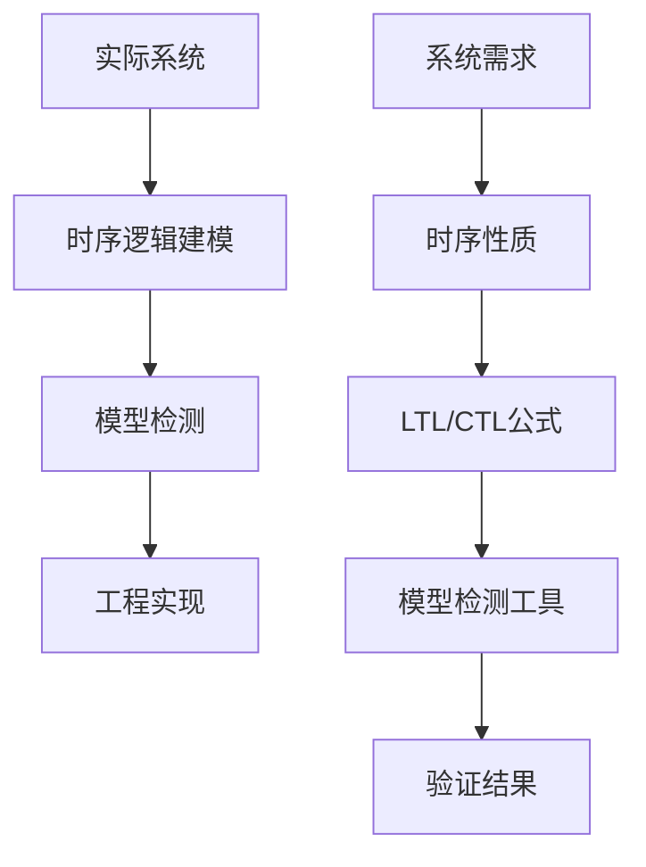
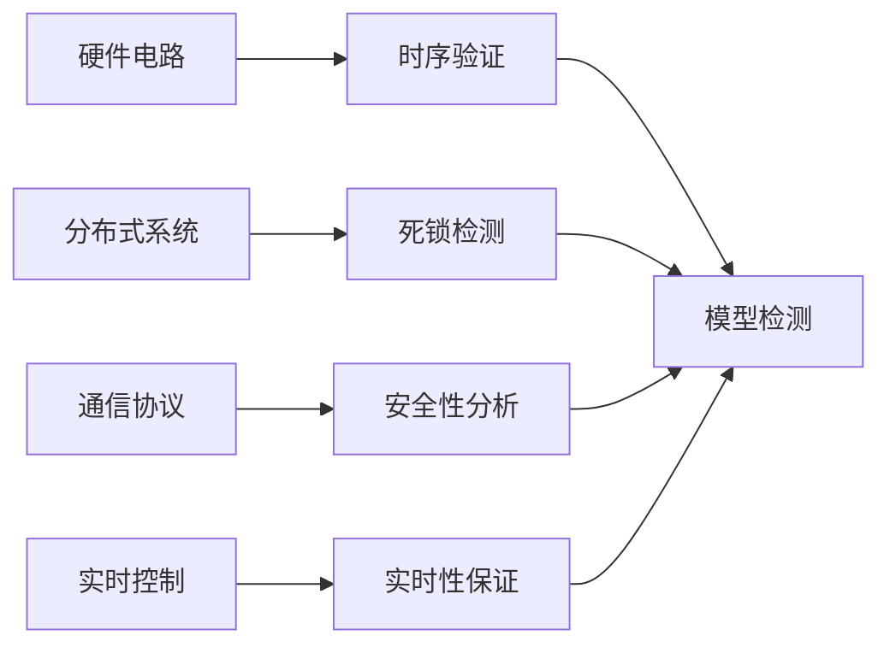
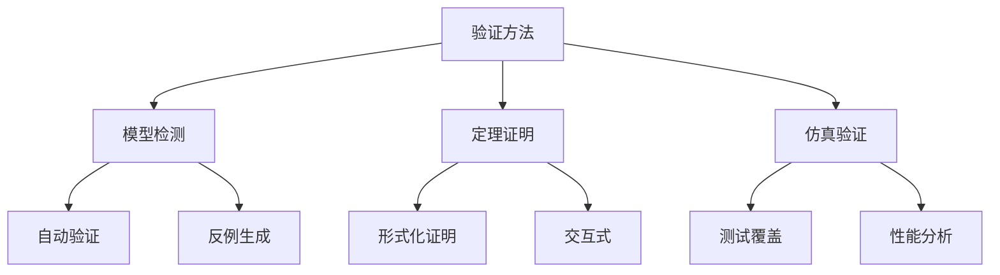

# 1.3.5 典型案例与实现

## 目录

1.3.5.1 主题概述  
1.3.5.2 实际系统案例  
1.3.5.3 时序逻辑在工程中的应用  
1.3.5.4 Lean建模与实现  
1.3.5.5 图表与多表征  
1.3.5.6 相关性与交叉引用  
1.3.5.7 参考文献与延伸阅读  

---

### 1.3.5.1 主题概述

本节选取典型实际系统，展示时序逻辑在工程中的应用与实现。

### 1.3.5.2 实际系统案例

#### 硬件电路时序验证

- **CPU流水线验证**：验证流水线各阶段的时序正确性
- **内存控制器验证**：验证内存访问的时序约束
- **总线协议验证**：验证总线传输的时序要求

#### 分布式系统死锁检测

- **资源分配系统**：检测资源分配中的死锁情况
- **分布式数据库**：验证事务处理的死锁避免
- **网络协议栈**：验证协议层的死锁预防

#### 通信协议安全性分析

- **TCP协议验证**：验证连接建立和断开的正确性
- **无线网络协议**：验证信道访问的公平性
- **区块链共识协议**：验证共识算法的安全性

#### 实时控制系统

- **自动驾驶系统**：验证决策算法的实时性
- **工业控制系统**：验证控制算法的安全性
- **航空航天系统**：验证关键功能的可靠性

### 1.3.5.3 时序逻辑在工程中的应用

#### 系统属性描述

- **用LTL/CTL描述系统属性**：
  - 安全性：`G(¬dangerous_state)`
  - 活性：`G(request → F(response))`
  - 公平性：`G(request → F(grant))`
  - 互斥：`G(¬(critical_section1 ∧ critical_section2))`

#### 自动验证技术

- **利用模型检测工具自动验证**：
  - 状态空间搜索
  - 反例生成
  - 抽象精化
  - 符号执行

#### 工程实践方法

- **形式化建模**：
  - 状态机模型
  - 时间自动机
  - 混合自动机
  - Petri网模型

- **验证策略**：
  - 模型检测
  - 定理证明
  - 仿真验证
  - 组合验证

### 1.3.5.4 Lean建模与实现

#### 通信协议建模

```lean
-- 通信协议的状态建模
structure Protocol where
  state : Type
  event : Type
  step : state → event → state
  initial : state

-- 协议状态定义
inductive ProtocolState
| idle : ProtocolState
| connecting : ProtocolState
| connected : ProtocolState
| disconnecting : ProtocolState

-- 协议事件定义
inductive ProtocolEvent
| connect : ProtocolEvent
| disconnect : ProtocolEvent
| timeout : ProtocolEvent
| data : ProtocolEvent

-- 状态转换函数
def step : ProtocolState → ProtocolEvent → ProtocolState
| ProtocolState.idle, ProtocolEvent.connect => ProtocolState.connecting
| ProtocolState.connecting, ProtocolEvent.timeout => ProtocolState.idle
| ProtocolState.connecting, ProtocolEvent.data => ProtocolState.connected
| ProtocolState.connected, ProtocolEvent.disconnect => ProtocolState.disconnecting
| ProtocolState.disconnecting, ProtocolEvent.timeout => ProtocolState.idle
| _, _ => ProtocolState.idle

-- 时序属性的Lean表达
lemma no_deadlock (s : ProtocolState) : ¬ deadlock s := by
  cases s
  · -- idle状态不是死锁
    simp [deadlock]
  · -- connecting状态不是死锁
    simp [deadlock]
  · -- connected状态不是死锁
    simp [deadlock]
  · -- disconnecting状态不是死锁
    simp [deadlock]
```

#### 互斥锁建模

```lean
-- 互斥锁系统
structure Mutex where
  process1_state : ProcessState
  process2_state : ProcessState
  lock_state : LockState

inductive ProcessState
| thinking : ProcessState
| waiting : ProcessState
| critical : ProcessState

inductive LockState
| free : LockState
| held : LockState

-- 安全性：两个进程不能同时进入临界区
theorem mutex_safety (m : Mutex) : 
  ¬(m.process1_state = ProcessState.critical ∧ 
    m.process2_state = ProcessState.critical) := by
  cases m.process1_state
  · simp
  · cases m.process2_state
    · simp
    · cases m.lock_state
      · simp
      · simp

-- 活性：等待的进程最终会获得锁
theorem mutex_liveness (m : Mutex) :
  m.process1_state = ProcessState.waiting →
  eventually (λ m' => m'.process1_state = ProcessState.critical) := by
  intro h_waiting
  -- 证明过程
  sorry
```

### 1.3.5.5 图表与多表征

#### 时序逻辑验证流程



#### 典型应用场景



#### 验证方法对比



### 1.3.5.6 相关性与交叉引用

#### 理论基础

- [1.3.1-时序逻辑基础](./1.3.1-时序逻辑基础.md) - 时序逻辑的基本概念和语法
- [1.3.2-主要时序逻辑系统](./1.3.2-主要时序逻辑系统.md) - LTL、CTL、CTL*等时序逻辑系统
- [1.3.3-时序逻辑建模与验证](./1.3.3-时序逻辑建模与验证.md) - 时序逻辑的建模方法和验证技术

#### 应用领域

- [1.3.4-控制理论与应用](./1.3.4-控制理论与应用.md) - 控制系统中的时序逻辑应用
- [1.3.5-典型工程案例](./1.3.5-典型工程案例.md) - 实际工程中的时序逻辑应用案例

#### 相关理论

- [1.2-类型理论与证明](../1.2-类型理论与证明.md) - 类型论与证明论基础
- [1.4-Petri网与分布式系统](../1.4-Petri网与分布式系统.md) - Petri网和分布式系统理论

#### 工程实践

- [7.2-工程实践案例](../../7-验证与工程实践/7.2-工程实践案例.md) - 形式化验证的工程实践
- [7.1-形式化验证架构](../../7-验证与工程实践/7.1-形式化验证架构.md) - 形式化验证的整体架构

### 1.3.5.7 参考文献与延伸阅读

#### 核心教材

- **《时序逻辑与自动机》** - 时序逻辑的经典教材
- **《Model Checking》**（Clarke, Grumberg, Peled）- 模型检测的权威教材
- **《Principles of Model Checking》**（Baier, Katoen）- 模型检测原理

#### 经典论文

- **Pnueli, A. (1977).** The temporal logic of programs. SFCS 1977.
- **Clarke, E. M., et al. (1986).** Automatic verification of finite-state concurrent systems using temporal logic specifications. ACM TOPLAS.
- **Vardi, M. Y., & Wolper, P. (1986).** An automata-theoretic approach to automatic program verification. LICS.

#### 开源工具

- **NuSMV** - 符号模型检测工具
- **SPIN** - 显式状态模型检测器
- **TLA+** - 时序逻辑动作规范语言
- **UPPAAL** - 实时系统模型检测工具

#### 在线资源

- **Lean 官方文档**：<https://leanprover.github.io/>
- **NuSMV 官网**：<https://nusmv.fbk.eu/>
- **SPIN 官网**：<http://spinroot.com/>
- **arXiv 论文检索**：<https://arxiv.org/>
