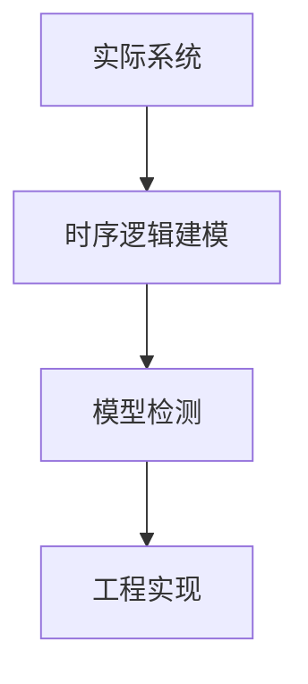

# 1.3.5 典型案例与实现

## 目录

1.3.5.1 主题概述  
1.3.5.2 实际系统案例  
1.3.5.3 时序逻辑在工程中的应用  
1.3.5.4 Lean建模与实现  
1.3.5.5 图表与多表征  
1.3.5.6 相关性与交叉引用  
1.3.5.7 参考文献与延伸阅读  

---

### 1.3.5.1 主题概述

本节选取典型实际系统，展示时序逻辑在工程中的应用与实现。

### 1.3.5.2 实际系统案例

- 硬件电路时序验证
- 分布式系统死锁检测
- 通信协议安全性分析

### 1.3.5.3 时序逻辑在工程中的应用

- 用LTL/CTL描述系统属性
- 利用模型检测工具自动验证

### 1.3.5.4 Lean建模与实现

```lean
-- 通信协议的状态建模（伪代码）
structure Protocol :=
  (state : Type)
  (event : Type)
  (step : state → event → state)

-- 时序属性的Lean表达
lemma no_deadlock (p : Protocol) : ∀ s, ¬ deadlock s :=
begin
  -- 证明过程略
end
```

### 1.3.5.5 图表与多表征



### 1.3.5.6 相关性与交叉引用

- [1.3.3-时序逻辑建模与验证](./1.3.3-时序逻辑建模与验证.md)
- [7.2-工程实践案例](../../7-验证与工程实践/7.2-工程实践案例.md)

### 1.3.5.7 参考文献与延伸阅读

- 《时序逻辑与自动机》
- 相关论文与开源项目
