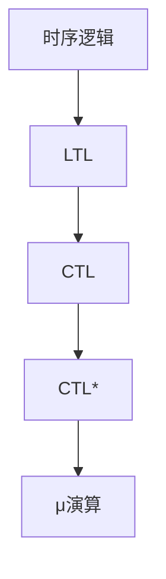
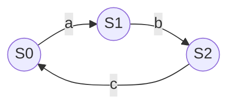
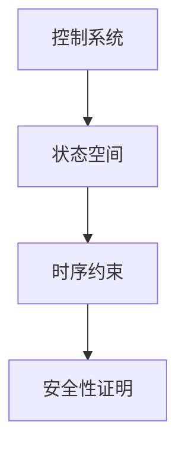

# 1.3.6 图表与多表征

## 目录

1.3.6.1 主题概述  
1.3.6.2 时序逻辑结构图  
1.3.6.3 Kripke结构可视化  
1.3.6.4 控制系统时序约束图  
1.3.6.5 相关性与交叉引用  
1.3.6.6 参考文献与延伸阅读  

---

### 1.3.6.1 主题概述

本节汇总时序逻辑与控制系统相关的图表、可视化与多表征内容，辅助理解复杂结构与流程。

### 1.3.6.2 时序逻辑结构图

### 1.3.6.3 Kripke结构可视化

### 1.3.6.4 控制系统时序约束图

### 1.3.6.5 相关性与交叉引用

- [1.3.1-时序逻辑基础](./1.3.1-时序逻辑基础.md)
- [1.3.3-时序逻辑建模与验证](./1.3.3-时序逻辑建模与验证.md)

### 1.3.6.6 参考文献与延伸阅读

- 《时序逻辑与自动机》
- 相关论文与开源项目
